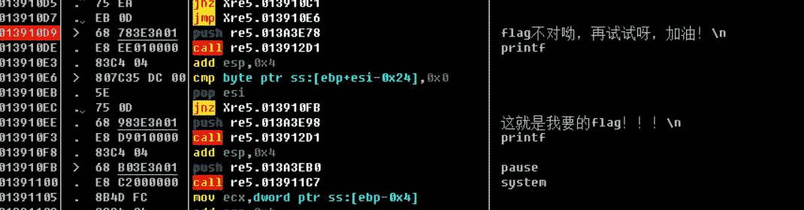

[http://www.shiyanbar.com/ctf/50](http://www.shiyanbar.com/ctf/50)

从FLAG 上来看，应该是DUTCTF 的原题，中等难度。20分也不高。



首先搜索字符串，找到 flag 字样，然后上溯到函数头。之后对这段汇编代码进行分析，等效的伪代码是：

```
char str1[0x32]; //ebp - 0x64
char str2[0x32] = "kow" * 7; //ebp - 0x44
char str3[0x32] = "DVVFXK{Ig45tI(oNs|Hbjdlf}"; //ebp - 0x24

// func + 0xe
scanf("%s", str1);

// func + 0x13
int c = 0;
for(int i = 0; str1[i] != 0; i++) {
    str1[i] += c;
    c ++;
    if(c > 5)
        c = 0;
}

// func + 0x39
//无意义代码
for(int i = 0; str2[i] != 0; i++) {
    str2[i] += 1;
}

// func + 0x4f
// 比较
if(!strcmp(str1, str3)) {
    // func + 0x85
    // 成功
}
else {
    // func + 0x70
    // 失败
}
```

我们要把FLAG还原出来。第一行的字符的ascii值减去第二行得到第三行

```
DVVFXK{Ig45tI(oNs|Hbjdlf}
0123450123450123450123450
DUTCTF{He11oI'mKowHahaha}
```

GETFLAG