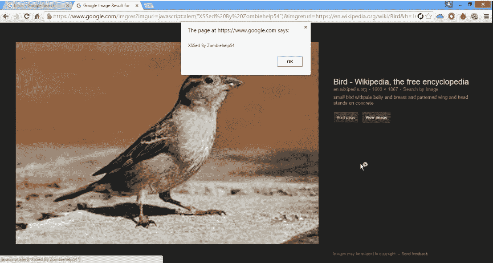

### 4\. 雅虎邮件存储型 XSS

难度：低

URL：Yahoo Mail

报告链接：`https://klikki.fi/adv/yahoo.html`

报告日期：2015.12.26

奖金：$10000

描述：

雅虎邮件编辑器允许人们将图片通过 HTML IMG 标签嵌入到邮件中。这个漏洞在 HTML IMG 标签格式错误或者无效时出现。

多数 HTML 标签接受属性，它是有关 HTML 标签的额外信息。例如，IMG 标签接受`src`属性，指向要渲染的图像的地址。此外一些属性是布尔属性，意思是如果他们存在，他们在 HTML 表现为真值，而当他们被忽略时，他们表现为假值。

对于这个漏洞，Jouko Pynnonen 发现，如果它将布尔属性添加到 HTML 标签中，并带有一个值，雅虎邮件就会移除该值但保留等号。这里是来自`Klikki.fi`的一个例子：

```
<INPUT TYPE="checkbox" CHECKED="hello" NAME="check box">
```

这里，输入标签可能包含`checked`属性，表示复选框是否渲染为选中。根据上面描述的歇息，这会变成：

```
<INPUT TYPE="checkbox" CHECKED= NAME="check box">
```

要注意 HTML 从拥有`checked`值变成了没有值但是仍然包含等号。

这看起来是无害的，但是根据 HTML 规范，浏览器将这个`CHECKED`看做拥有值`NAME=”check`，并且该`input`标签有用第三个属性`box`，它没有值。这是对于没有引号的属性值，因为 HTML 允许零个或多个空格字符在等号周围。

为了利用它，Jouko 提交了下面的 IMG 标签：

```

```

雅虎邮件会把它变成：

```

```

因此，浏览器会渲染 IMG 标签，它占据整个浏览器的窗口，当鼠标移到图片上的时候，会执行 JavaScript。

> 重要结论
> 
> 传递格式错误或损坏的 HTML 是个不错的方法，来测试站点如何解析输入。作为一个黑客，考虑到开发者没有考虑的东西十分重要。例如，使用常规的图片标签，如果你传递两个`src`属性会怎么样？它会如何渲染？

### 5\. Google 图片搜索

难度：中

URL：`images.google.com`

报告链接：`http://zombiehelp54.blogspot.ca/2015/09/how-i-found-xss-vulnerability-in-google.html`

报告日期：2015.9.12

奖金：未知

描述：

2015 年 9 月，Mahmoud Jamal 使用 Google 图像来为它的 HackerOne 资料寻找一个图片。在浏览的时候，它注意到 Google 图片的 URL 中有一些有趣的东西。

```
http://www.google.com/imgres?imgurl=https://lh3.googleuser.com/...
```

注意到实际的 URL 中存在 `imgurl`的引用。在鼠标移到缩略图上的时候，Mahoumd 注意到了锚标签的`href`属性包含了相同的 URL。因此，它尝试将参数改为`javascript:alert(1)`，并且注意到锚标签的`href`也改为了相同值。

它这个时候非常激动，点击了链接，但是没有执行 JavaScript，因为 Google URL 改为了别的东西。结果，Google 的代码在鼠标按下时，通过`onmousedown` JavaScript 回调修改了 URL。

考虑到这个，Mahmoud 决定使用它的键盘，尝试使用 TAB 键在页面上切换。当他来到`View Image`按钮时，触发了 JavaScript，产生了 XSS 漏洞。这里是图片：



Google XSS 漏洞

> 重要结论
> 
> 始终留意这种漏洞。很轻易就能假设，仅仅由于公司太大或者太知名，任何东西都被找到了。但是，公司始终会修改代码。
> 
> 此外，有大量方法来执行 JavaScript，这里在看到 Google 使用`onmousedown`事件处理器修改值之后，很容易就放弃了。这意味着任何时候使用鼠标点击了链接，值都会改变。

### 6\. Google Tagmanager 存储型 XSS

难度：中

URL：`tagmanager.google.com`

报告链接：`https://blog.it-securityguard.com/bugbounty-the-5000-google-xss`

报告日期：2014.10.31

奖金：$5000

描述：

2014 年 10 月，Patrik Fehrehbach 在 Google 上发现了存储型 XSS 漏洞。这个报告的有趣部分是，他如何设法绕过 Google 获取载荷。

Google Tagmanager 是一个 SEO 工具，使营销人员添加和更新站点标签变得容易 – 包含转化追踪、站点分析、重营销、以及更多。为此，它拥有大量的表单，便于用户交互。所以，Patrik 以尝试将 XSS 载荷输入到表单字段中开始，类似于`#>imgsrc=/ onerror=alert(3)>`。如果接受了，这就会闭合现有的 HTML `>`，之后尝试加载不存在的图片，这会执行`onerror` JavaScript，`alert(3)`。

但是，这没有效果。Google 合理处理了输入。Patrik 注意到了一个替代方案 – Google 提供了上传带有多个标签的 JSON 文件的功能。所以，它下载了样例并上传：

```
"data": { 
    "name": "#">", 
    "type": "AUTO_EVENT_VAR", 
    "autoEventVarMacro": { 
        "varType": "HISTORY_NEW_URL_FRAGMENT" 
    } 
}
```

这里，你会注意到，标签的名称就是他的 XSS 载荷。结果，Google 没有处理来自上传文件的输入，并执行了载荷。

> 重要结论
> 
> 这里有两个有趣的事情。首先Patrik 发现了替代方案来提供输入 – 要留意这个东西，并测试目标提供的所有方法来输入数据。其次，Google 处理了输入，但是在渲染时没有转义。假设它转义了 Patrik 的输入，载荷就不会生效，因为 HTML 会被转换成无害的字符。

## 总结

XSS 漏洞对站点开发者展现了真实的风险，并且仍然在站点上流行，通常显而易见。通常简单提交 JavaScript `alert`方法的调用，`alert('test')`，你可以检查输入字段是否存在漏洞。此外，你可以将它与 HTML 注入组合，并提交 ASCII 编码的字符来观察文本是否被渲染和解释。

在搜索 XSS 漏洞时，这里是要记住的一些事情：

1.  测试任何东西

    无论你在浏览什么站点以及什么时候浏览，总是要保持挖掘！不要觉得站点太大或者太复杂，而没有漏洞。机会正在注视着你并请求你的测试，就像`wholesale.shopify.com`那样。Google Tagmanager 存储型 XSS 漏洞就是寻找替代方案来向站点添加标签的结果。

2.  漏洞可能存在于任何表单值

    例如，Shopify 的礼品卡站点上的漏洞，通过利用和上传文件相关的名称字段来时间，并不是实际的文件字段本身。

3.  总是在测试时使用 HTML 代理

    当你尝试提交来自网站自身的恶意值时，当站点的 JavaScript 检查出你的非法值时，你可能会碰到假阳性。不要浪费你的时间。通过浏览器提供合法值，之后使用你的代理修改这些值来执行 JavaScript 并且提交。

    > 译者注：对于所有前端（包括移动和桌面）渗透，都应该这样。就算不存在 XSS，也有可能挖到绕过和越权漏洞。

4.  XSS 漏洞发生在渲染的时候

    由于 XSS 在浏览器渲染文本时发生，要确保复查了站点的所有地方，其中使用了你的输入值。逆天家的 JavaScript 可能不会立即渲染，但是会出现在后续的页面中。这非常麻烦，但是你要留意站点何时过滤输入，以及转义输出。如果是前者，寻找办法来绕过输入过滤器，因为开发者可能会犯懒，并且不会转义渲染的输入。

5.  测试非预期的值

    不要总是提供预期类型的值。当 HTML 雅虎邮件的漏洞被发现时，提供了非预期的 HTML IMG 属性。要跳出思维定式，思考开发者要寻找什么，并且之后尝试提供一些不匹配这些预期的东西。这包含寻找新的方式来执行潜在的 JavaScript，例如绕过 Google 图片的`onmousemove`事件。