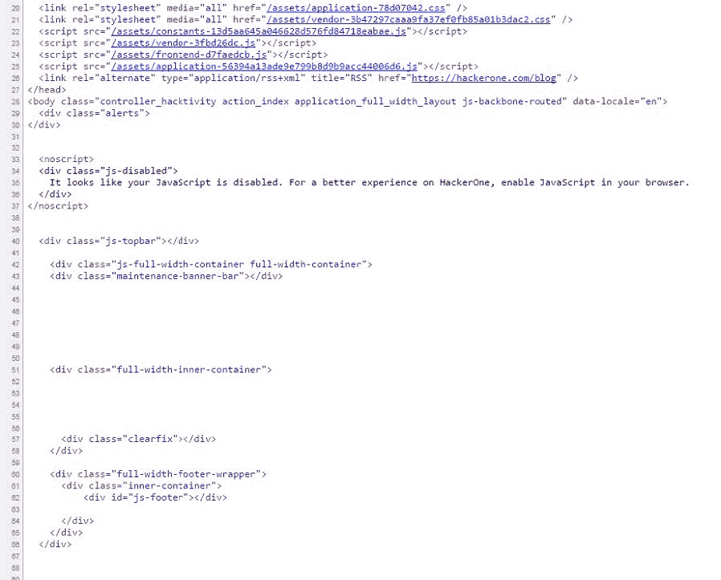

### 7\. 绕过 Gitlab 的双因素认证

难度：中

URL：无

报告链接：`https://hackerone.com/reports/128085`

报告日期：2016.4.3

奖金：无

描述：

4 月 3 日，Jobert Abma（HackerOne 的联合创始人）向 Gitlab 报告称，在双因素认证开启情况下，攻击者能够登录受害者的账户，而不需知道受害者的密码。

对于那些不熟悉的人，双因素认证是两个登录步骤，通常用户输入它们的用户名和面，之后站点会发送验证码，通常通过电子邮件或者 SMS，用户需要输入它来完成登录过程。

这里，Jobert 注意到，在这个过程中，一旦攻击者输入了用户名和密码，会发送一个 Token 来结束登录。在提交这个 Token 时，POST 调用为：

```
POST /users/sign_in HTTP/1.1 
Host: 159.xxx.xxx.xxx ...

----------1881604860 
Content-Disposition: form-data; name="user[otp_attempt]"

212421 
----------1881604860-
```

如果攻击者拦截了它并向调用添加了用户名，例如：

```
POST /users/sign_in HTTP/1.1 
Host: 159.xxx.xxx.xxx ...

----------1881604860 
Content-Disposition: form-data; name="user[otp_attempt]"

212421 
----------1881604860 
Content-Disposition: form-data; name="user[login]"

john
----------1881604860-
```

攻击者就能够登录进 John 的账户，如果`otp_attempt`对 John 可用。换句话说，在两步认证期间，如果攻击者添加了`user[login]`参数，它们就能修改被登录的账户。

现在，唯一的麻烦就是攻击者需要拥有有效的 OTP Token，用于受害者。但是这就是爆破登场的时候了。如果站点管理员没有实现速率限制，Jobert 就可以对服务器执行重复调用来猜测有效的 Token。攻击成功的可能性取决于向服务器发送请求的传输时间，以及 Token 有效时间的长度，但是无论如何，这里的漏洞都很明显。

> 重要结论
> 
> 双因素验证是个机巧的系统，难以正确实现。当你注意到站点使用了它时，你需要完整测试所有功能，包括 Token 的生命周期，尝试的最大次数，复用过期的 Token，猜测 Token 的可能性，以及其他。

### 8\. 雅虎 PHP 信息泄露

难度：中

URL：`http://nc10.n9323.mail.ne1.yahoo.com/phpinfo.php`

报告链接：`https://blog.it-securityguard.com/bugbounty-yahoo-phpinfo-php-disclosure-2/`

报告日期；2014.10.16

奖金：无

描述：

虽然它并没有巨额奖金，像是其他漏洞那样（实际上没有奖金，非常意外），但这是我最喜欢的报告之一，因为它教会了我网络扫描和自动化的重要性。

在 2014 年 10 月，Patrik Fehrenbach（你应该从“Hacking Pro Tips Interview#2”中了解了他，很棒的一个家伙）发现了雅虎的服务器中存在可访问的`phpinfo()`文件。如果你不熟悉`phpinfo()`，这是一个敏感的命令，它不应该在生产环境能够访问，以及公开访问，因为它泄露了所有类型的服务器信息。

现在，你可能想知道 Patrik 如何找到了`http://nc10.n9323.mail.ne1.yahoo.com`，我保证。结果它 PING 了`yahoo.com`，它返回了`98.138.253.109`。之后它将其传给了 WHOIS，并发现雅虎实际上拥有下面这些东西：

```
NetRange: 98.136.0.0 - 98.139.255.255 
CIDR: 98.136.0.0/14 
OriginAS: 
NetName: A-YAHOO-US9 
NetHandle: NET-98-136-0-0-1 
Parent: NET-98-0-0-0-0 
NetType: Direct Allocation 
RegDate: 2007-12-07 
Updated: 2012-03-02 
Ref: http://whois.arin.net/rest/net/NET-98-136-0-0-1
```

要注意第一行，雅虎拥有大量的 IP 地址，从`98.136.0.0`到`98.139.255.255`，或者`98.136.0.0/14`，这是 260000 个独立 IP 地址。这是大量的潜在目标。

Patrik 之后写了个简单的 bash 脚本来寻找可用的`phpinfo`文件：

```
#!/bin/bash 
for ipa in 98.13{6..9}.{0..255}.{0..255}; do 
wget -t 1 -T 5 http://${ipa}/phpinfo.php; done &
```

执行了这个，他在随机的雅虎服务器上发现了它。

> 重要结论
> 
> 在渗透的时候，考虑公司的整个设施，除非他们告诉你这超出范围了。虽然这个报告没有得到一分钱的奖金，我知道 Patrik 使用了相似的技巧来寻找一些重要的漏洞来获得奖金。
> 
> 此外，你会注意到，这里有 260000 个潜在的地址，他们不可能手动扫描。在执行这一类型的测试时，自动化非常重要，并且是应该使用的东西。

### 9\. HackerOne Hacktivity 投票

难度：中

URL：`https://hackerone.com/hacktivity`

报告链接：`https://hackerone.com/reports/137503`

报告日期：2016.5.10

奖金：Swag

描述：

虽然严格来说，这里没有真正的安全漏洞，这个报告是个跳出思维定式的良好示例。

2016 年 4 月到 5 月的一段时间，HackerOne 为黑客开发了一个新功能，来通过 Hacktivity 列表给报告投票。要知道功能是否可用，有个简单的办法，也有个难的办法。通过简单的办法，登录时`/current_user`的 GET 调用会包含`hacktivity_voting_enabled:false`。难的办法有些有趣，其中存在漏洞，并且这就是我包含这篇报告的原因。

如果你访问了 hacktivity 并且查看了页面源码，你会注意到非常稀疏，只是一些`div`，没有真正的内容。



HackerOne Hacktivity 页面源码

现在，如果你不喜欢他们的平台，并且没有安装类似于 wappalyzer 的插件，仅仅看这个页面源码也会告诉你，内容由 JavaScript 渲染。

所以，知道了之后，如果你打开 Chrome 或 Firefox 的开发者工具，你可以检查 JavaScript 源码（在 Chrome 中，你需要访问`source`，左边是`top>hackerone.com->assets->frontend-XXX.js`）。Chrome 的开发者工具自带了花括号美化打印的按钮，这会使最小化的 JavaScript 刻度。你也可以使用 Burp 来查看返回这个 JavaScript 文件的响应。

原因是这样，如果你在 JavaScript 中搜索 POST，你会发现一些 HackerOne 所使用的 路径，它们可能不是那么明显，取决于你的权限，以及内容里有什么东西。其中之一是：


HackerOne 应用的 JavaScript POST 投票

你可以看到，我们有两个用于投票功能的路径。在写这个报告的时候，你实际可以执行这些调用，并给报告投票。

现在，这是发现功能的一种方式 – 在报告中，黑客使用了另一种，通过拦截 HackerOne 的响应（大概是使用类似 Burp 的工具）。它们将返回为假的属性切换为真。这之后暴露了投票元素，在点击时，执行了可用的 POST 或者 DELETE 调用。

我想你展示 JavaScript 的原因时，和 JSON 响应交互可能不会总是暴露新的 HTML 元素。因此，浏览 JavaScript 可能暴露其它“隐藏的”终端来交互。

> 重要结论
> 
> JavaScript 源代码想你提供了来自目标的实际源代码，你可以浏览它们。这非常棒，因为你的测试从完全黑盒，对后端没有任何想法，变成了白盒（虽然也不完全是），其中可以观察代码如何执行。这不意味你需要走查每一行代码，这里的 POST 调用在 20570 行发现，只使用了一个简单的 POST 搜索。

## 10\. Pronhub Mamcache 未授权访问

难度：中

URL：`stage.pornhub.com`

报告链接：`https://hackerone.com/reports/119871`

报告日期：2016.3.1

奖金：$2500

描述：

在它们公开启动之前，Pornhub 在 HackerOne 上开启了一个私有漏洞奖励计划，`*.pornhub.com`域，带有丰富的奖金，这对于多数黑客来说意思是所有 Pronhub 的子域都是一样的。现在的问题是发现他们。

在他的博文中，Andy Gill（@ZephrFish）解释了为什么这个非常好，它使用超过一百万潜在名称的列表，通过测试不同子域名称是否存在，发现了越 90 个可能的漏洞目标。

现在，如果访问所有这些站点来观察什么是可用的，这会花费大量时间，所以它使用 Eyewitness 工具自动化了这个流程（在工具一章中包含），它从有效 HTTP/HTTPS 页面中截了一些截图，并提供了一个不错的报告，其中站点监听 80、443、8080 和 8443 端口（常见 HTTP 和 HTTPS 端口）。

根据他的 WriteUp，Andy 稍微切换了一些另见，并使用 Nmap 工具来深入挖掘`stage.pornhub.com`子域。当我问他原因时，它解释道，以他的经验，`stage`和开发服务器比起生产服务器更可能拥有错误配置的安全权限。所以，一开始，它使用了`nslookup`命令，得到了子域的 IP。

```
nslookup stage.pornhub.com 
Server: 8.8.8.8 
Address: 8.8.8.8#53 
Non-authoritative answer: 
Name: stage.pornhub.com 
Address: 31.192.117.70
```

我也看到，这个可以通过命令`ping`来完成，但是无论哪种方法，它现在拥有了子域的 IP 地址，并使用命令`sudo namp -sSV -p- 31.192.117.70 -oA stage__ph -T4 &`，它得到了：

```
Starting Nmap 6.47 ( http://nmap.org ) at 2016-06-07 14:09 CEST 
Nmap scan report for 31.192.117.70 
Host is up (0.017s latency). 
Not shown: 65532 closed ports 
PORT STATE SERVICE VERSION 
80/tcp open http nginx 
443/tcp open http nginx 
60893/tcp open memcache 
Service detection performed.Please report any incorrect results at http://nmap.org/submit/ . 
Nmap done: 1 IP address (1 host up) scanned in 22.73 seconds
```

将命令拆解一下：

*   标志`-sSV`定义了发送给服务器的封包类型，告诉 Nmap 尝试和判断任何开放端口上的服务。

*   `-p-`告诉服务器要检查所有 65535 个端口（默认只会检查常用的 1000 个端口）。

*   `31.192.117.70`是要扫描的 IP。

*   `-oA stage__ph`告诉 Nmap 一次以三种主要格式输出它的发现，使用文件名称`stage__ph`。

*   `-T4`定义了任务的时间（选项为 0 ~ 5，数字越大就越快）。

对于结果来说，要注意的关键就是端口 60893 是打开的，而且 Nmap 认为它运行 Memcache。对于那些不熟悉的人，Memcache 是一个缓存服务，它使用键值对来储存任意数据。它通常通过更快地服务内容，用于提升网站的速度。类似的服务的 Redis。

发现这本身不是个漏洞，但是是个危险信号（虽然安装指南推荐使其不可能公开访问，作为一个安全措施）。测试之后，意外的是 Pornhub 并没有开启任何安全手段。Andy 能够通过 netcat 连接服务，不需要用户名和密码。连接之后，它执行命令来获取版本，状态，以及其他，为了确认这个和漏洞。

但是，恶意攻击者可以将其用于：

*   造成拒绝服务，通过持续写入和删除缓存，因此使服务器保持繁忙（取决于站点的配置）。

*   通过用垃圾缓存数据填充服务，造成 DOS，同样取决于站点配置。

*   执行跨站脚本攻击，通过注入恶意 JS 载荷作为有效的缓存数据，来提供给用户。

*   可能的话，执行 SQL 注入，如果 memcache 数据在数据库中存储的话。

> 总要结论
> 
> 子域和更宽泛的网络配置代表了用于渗透的极大潜能。如果你注意到程序在域中包含`*.SITE.com`，尝试找到可能存在漏洞的子域，而不要去追求主站上的低悬的果实，因为人人都能搜索到它们。你也的值花费时间来使你自己熟悉一些工具，例如 Nmap、Eyewitness、KnockPy，以及其他。这有助于你获得 Andy 的视角。

## 总结

应用逻辑漏洞不一定总是涉及代码。反之，利用它们通产更需要敏锐的观察力，以及跳出思维定式。始终留意其它站点可能使用的工具和服务，因为它们代表了新的攻击向量。这包括站点所使用的来渲染内容的 JavaScript 库。

发现它们或多或少都需要代理拦截器，在将其发送到你所利用的站点之前，它能让你玩转一些值。尝试修改任何值，只要它们和识别你的账户相关。这可能包含建立两个不同的账户，以便你有两套有效的凭据，这可能有帮助。同时寻找隐藏或不常用的终端，它可以用于利用无意中访问的功能。

任何时候一些类型的事务发生时，你也应该留意。始终有一些机会，其中开发者没有在数据库级别处理竞态条件（特别是 NoSQL）。也就是说，它们的代码可能会阻止你，但是如果你让代码执行够快，比如几乎同时完成，你就能发现静态条件。确保你多次测试了这个领域内的任何东西，因为每次尝试不一定都发生，就像星巴克的案例那样。

最后，要留意新的功能 – 它通常为测试展示了新的区域。并且如果可能的话，自动化你的测试来更好利用你的时间。