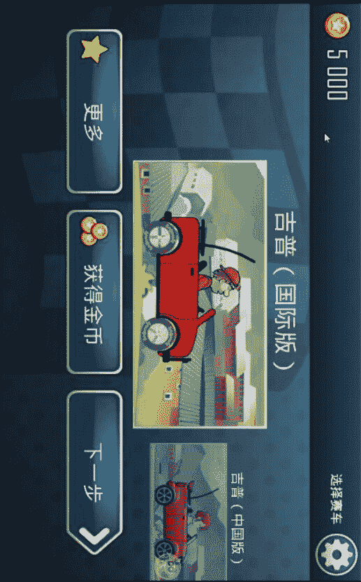
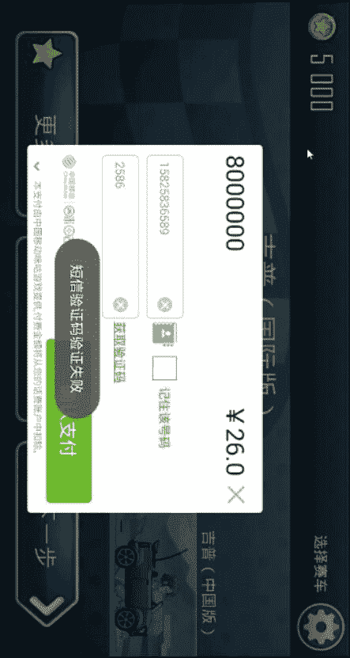
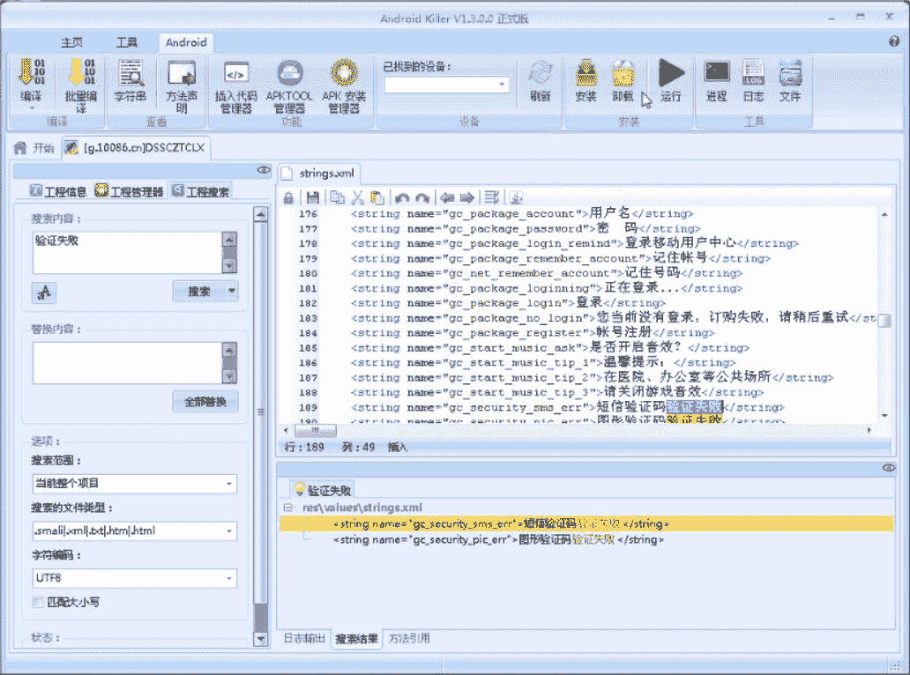
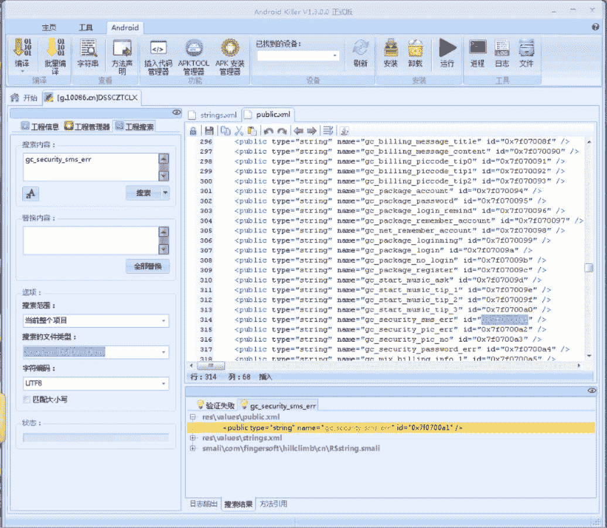
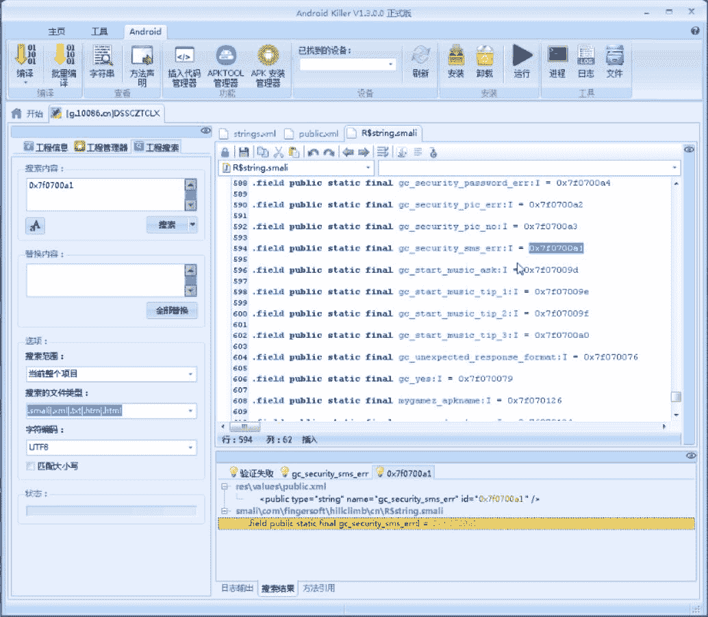
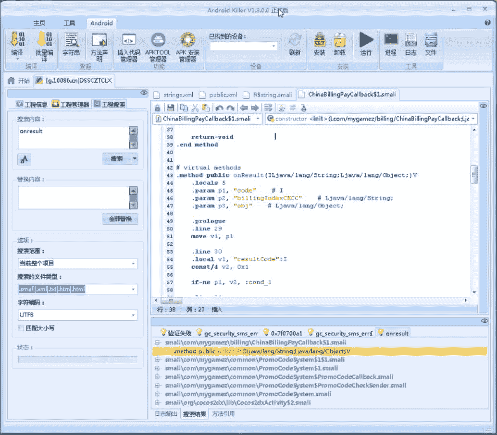
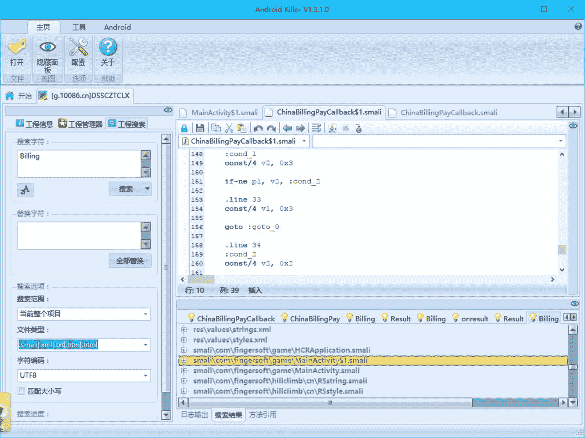

## 4.3 登山赛车内购破解

> 作者：[飞龙](https://github.com/wizardforcel)

首先在这里下载游戏：[http://g.10086.cn/game/760000032287?spm=www.pdindex.android.addjgame.1](http://g.10086.cn/game/760000032287?spm=www.pdindex.android.addjgame.1)

我们要破解的东西是这个，获得金币：



点击之后会有个弹出框，我们随便输入一些东西，然后点击“确认支付”：



出现了“短信验证码验证失败”的`Toast`。

好，信息收集完毕，将程序拉进 Android Killer：


搜索“验证失败”四个字，我们可以找到刚才的内容：



我们发现它在`strings.xml`里面，它的名称是`gc_security_sms_err`。老方法，搜索这个名称：



我们在`public.xml`中发现了它的 ID，`0x7f0700a1`。我们搜索这个值。



然后就没下文了。我们没有找到任何使用这个值的地方。只能从其它方面入手。

我们从前面可以得知，付费用的是移动的接口，我们搜索`onresult`，这是移动支付 API 的关键字（问我怎么知道的，这个 API 是有开发者文档的，大家可以搜索一下）：



一下子就出现了，`ChinaBillingPayCallback$1`。下面就是要好好分析这个类

这个类只有一个`onResult`方法，也就是说只是一个闭包，而且也没有什么特别有用的信息：

```
public void onResult(int paramInt, String paramString, Object paramObject)
{
    int i = paramInt;
    BillingResult localBillingResult = new BillingResult();
    localBillingResult.setResultCode(i);
    localBillingResult.setBillingIndex(this.val$billingIndex);
    localBillingResult.setReturningObject(paramObject);
    localBillingResult.setCode(paramString);
    Log.i("MySDK Billing Java", "CMCC object toString(): " + paramObject.toString());
    Log.i("MySDK Billing Java", "CMCC result: " + localBillingResult.toJSON());
    this.this$0.launchResultReceived(localBillingResult);
}
```

反正我是没看出来。再看一看，这个类所在的包是`com.mygamez.common`，而软件的包是`con.fingersoft.game`，等于说这个类是别人的 API，当然没有业务逻辑。

我们换个方式，搜索`Billing`：



除了底下的两个资源类，有三个游戏包中的类出现了`Billing`。第一个类是一个`Applicaion`，只有如下代码：

```
public void onCreate()
{
    MyBilling.applicationHeater(this);
}
```

再看看`MainActivity$1`，它也是一个闭包，只有`onChinaBillingResult`方法，这就非常重要了。由于它的 java 反编译结果不可读，我们直接看 Smali：

```
invoke-virtual {p1}, Lcom/mygamez/billing/BillingResult;->getResultCode()I

move-result v2

packed-switch v2, :pswitch_data_0

...
```

开头有这么一段代码，我们跳到`:pswitch_data_0`处：

```
:pswitch_data_0
.packed-switch 0x1
    :pswitch_0
    :pswitch_1
.end packed-switch
```

由于判断的是某个 API 的返回代码，按照惯例，`0`是正常，其余是异常。我们可以跳到`:pswitch_1`分支：

```
:pswitch_1
iget-object v2, p0, Lcom/fingersoft/game/MainActivity$1;->this$0:Lcom/fingersoft/game/MainActivity;

invoke-virtual {v2}, Lcom/fingersoft/game/MainActivity;->getApplicationContext()Landroid/content/Context;

move-result-object v2

const-string v3, "\u4ed8\u6b3e\u5931\u8d25"

const/4 v4, 0x1

invoke-static {v2, v3, v4}, Landroid/widget/Toast;->makeText(Landroid/content/Context;Ljava/lang/CharSequence;I)Landroid/widget/Toast;

move-result-object v1

.line 301
.local v1, "toast":Landroid/widget/Toast;
invoke-virtual {v1}, Landroid/widget/Toast;->show()V

goto :goto_0
```

那个字符串是“付款失败”，这么多代码其实就是`Toast.makeText(this.this$0.getApplicationContext(), "付款失败", 1).show()`。这应该就是异常分支了。

至于接下来的修改，这个方法第二行`move-result v2`，改成`const v2, 0x0`，完事。

> 写到这里其实还有一个问题，就是代码中的字符串和实际实现的对不上。这个我也不知道为什么，但是既然有这种情况，就要想别的方法。