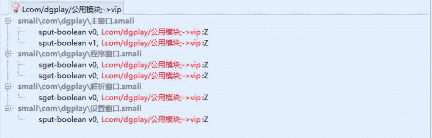

# 4.4 逆向云播 VIP

> 作者：[飞龙](https://github.com/wizardforcel)

这次的软件是刀哥云播，在这里下载：[http://www.xuepojie.com/thread-23860-1-1.html](http://www.xuepojie.com/thread-23860-1-1.html)

我们先分析一下行为：

打开之后的界面是这样，并弹出一行消息：


我们先点击“福利”，弹出这样一行字。


然后我们点击那个“设置”，在设置界面上，我们如果点击“加入会员”，弹出这样一行消息。


然后我们将其拖进 Android Killer，发现它是 e4a 编写的。


我们直接搜索“会员”，没有任何结果。可见 e4a 直接将字符串硬编码进代码里。


我们搜索它的 Unicode 编码，`\u4f1a\u5458`试试看：


一共有四个。`程序窗口`类中有两个，都在`图片列表框1$表项被单击`方法中。内容都是“您目前不是会员…”。设置窗口里的都是“加入会员”，是按钮的标题，和破解没太大关系。

我们点击第一个，文本附近的代码是这样：

```
.line 27
:cond_4
if-nez v0, :cond_1 # return-void

.line 28
const-string v0, "\u60a8\u76ee\u524d\u4e0d\u662f\u4f1a\u5458\u54e6 \n \u4e0d\u80fd\u4f7f\u7528\u4f1a\u5458\u529f\u80fd" # 您目前不是会员

invoke-static {v0}, Lcom/e4a/runtime/应用操作;->弹出提示(Ljava/lang/String;)V

goto :goto_0 # return-void
```

经分析可得，这个是失败分支的代码。然而`:cond_1`不是成功分支，它直接指向`return-void`，所以关键跳应该不在这里。由于安卓程序编译后的 Smali 是打乱的，应该在跳到`:cond_4`的地方。

我们在相同方法中寻找，只找到一处满足要求的地方：

```
# 项目索引
.param p1, "\u9879\u76ee\u7d22\u5f15"    # I

.prologue
const/4 v3, 0x1

.line 11
.line 12
if-nez p1, :cond_2
# p1 为 0 时的操作（随播）
# ...

.line 19
:cond_2
if-ne p1, v3, :cond_5
# p1 为 1 时的操作（短片）

.line 20
sget-boolean v0, Lcom/dgplay/公用模块;->vip:Z

.line 21
# 关键跳
if-ne v0, v3, :cond_4
# 启动短片窗口的代码
# ...
```

要注意这个回调对应图片列表框，就是主界面上的六个按钮（请见图 1）。其中`p1`是被选中项，按照惯例是从 0 开始，从左到右从上到下。我们刚才查看的这段代码是`p1`为 1 情况下的，也就是你点击右上角的按钮之后会触发。

（虽然我们实际上不推荐把六个回调都写到一个函数，因为它们是六个不同的逻辑，但是由于这是别人的代码，只能忍了。）

我们可以看到`p1`为 1 时，首先获取了`com/dgplay/公用模块`的`vip`静态字段，判断它是不是`1`（`v3`），是的话就启动窗口，不是的话就弹出消息。

我们还有另一个提示不是会员的位置，也就是我们之前测试过的“福利”按钮（下标为 4）。我们点过去看看：

```
.line 41
:cond_9
const/4 v0, 0x4

if-ne p1, v0, :cond_c
# p1 为 4 时的代码

.line 42
sget-boolean v0, Lcom/dgplay/公用模块;->vip:Z

.line 43

# 关键判断
if-ne v0, v3, :cond_b
# 启动福利窗口
# ...

.line 48
:cond_b
if-nez v0, :cond_1 # return-void

.line 49
const-string v0, "\u60a8\u76ee\u524d\u4e0d\u662f\u4f1a\u5458\u54e6 \n \u4e0d\u80fd\u4f7f\u7528\u4f1a\u5458\u529f\u80fd"

invoke-static {v0}, Lcom/e4a/runtime/应用操作;->弹出提示(Ljava/lang/String;)V

goto/16 :goto_0 # return-void
```

果然还是根据这个字段。我们猜想这个静态字段是控制当前用户是否是 VIP 的字段。为了减少工作量，以及避免可能的暗桩，我们不要直接改动判断，而是将这个字段赋成 1。

但是，在静态构造器中将这个字段赋成 1 是不行的，因为主界面中可能有将它重新赋成 0 的代码。我们搜索`Lcom/dgplay/公用模块;->vip`，结果如下：



其中只有主窗口和设置窗口有赋值。设置窗口那个不用看了，因为是购买 VIP 的地方，它肯定是将其赋值为 1，那么主窗口中：

```
# 第一处
.line 16
const/4 v0, 0x1
sput-boolean v0, Lcom/dgplay/公用模块;->vip:Z

# 第二处
.line 18
:cond_0
const-string v0, "\u60a8\u76ee\u524d\u8fd8\u4e0d\u662fVIP,\u53ef\u8d5e\u52a9\u4f5c\u8005\u83b7\u5f97VIP"

invoke-static {v0}, Lcom/e4a/runtime/应用操作;->弹出提示(Ljava/lang/String;)V

.line 19
# v1 为 0x0
sput-boolean v1, Lcom/dgplay/公用模块;->vip:Z

goto :goto_0
```

这两处都在`多线程1$取网页源码2完毕`函数中。当然第二处是将其赋为 0 的地方，通过分析逻辑得知，这个是失败分支，而另一个是成功分支。我们向上找到关键跳转：

```
# 关键跳转
if-eqz v0, :cond_0

# ...
# 第一处
# ...
```

把这句去掉，就可以了。重新编译、打包，大功告成。