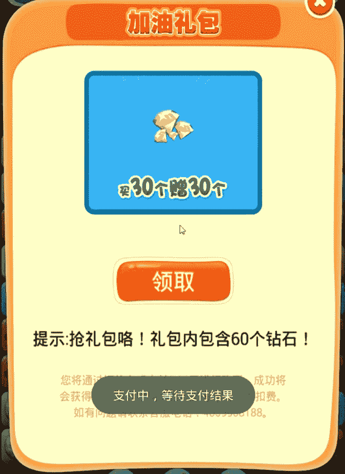
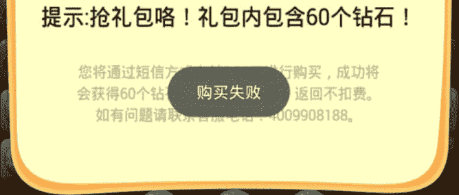
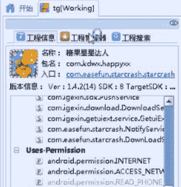
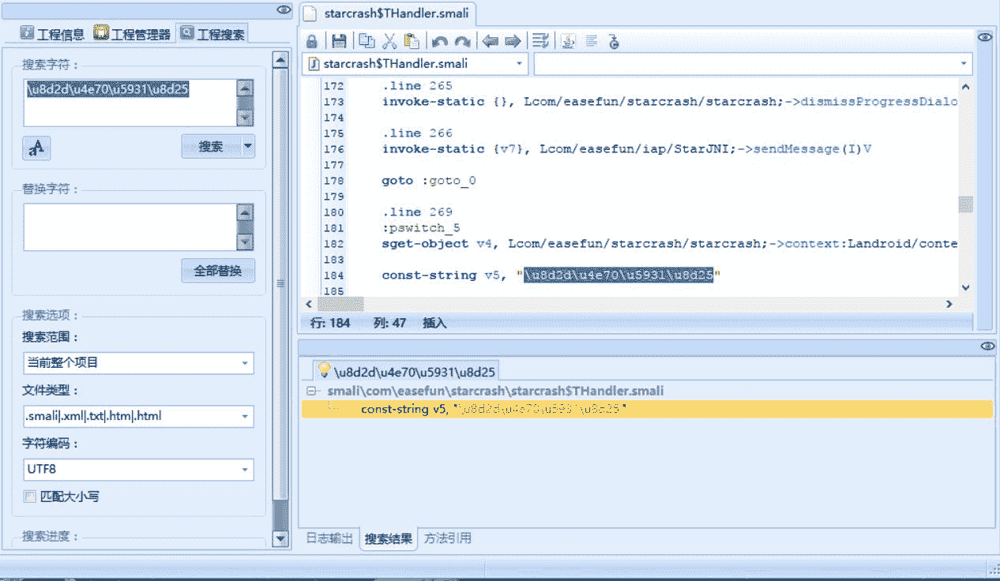
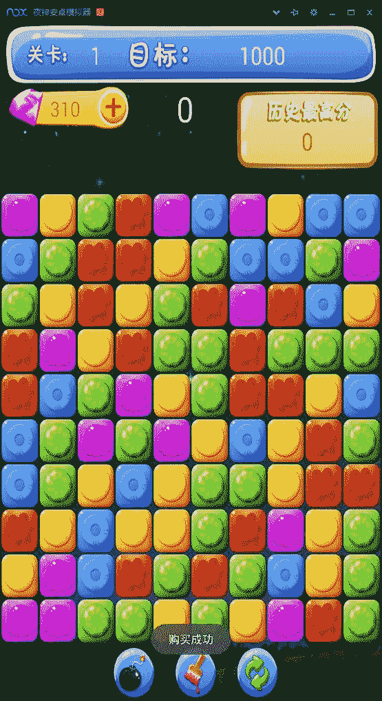

# 4.5 糖果星星达人

> 作者：[飞龙](https://github.com/wizardforcel)

软件在这里下载：[http://www.anzhi.com/soft_2539282.html](http://www.anzhi.com/soft_2539282.html)

第一次进入游戏之后，会弹出来一个“新手礼包”，关掉之后，点击“新游戏”，之后进入“关卡1-1”。我们点击左上角的加号，会出现这个界面：



我们点击“领取”之后，会弹出“支付中，等待支付结果”。如果你是用模拟器玩的，过一会儿会弹出“购买失败”：



信息收集完毕，拖入 Android Killer：



搜索“购买失败”，上下文中应该会有“购买成功”。直接搜索原文本是没有用的，这里我就不演示了，要搜索 Unicode 编码形式`\u8d2d\u4e70\u5931\u8d25`。



在`starcrash$THandler.smali`的`handleMessage`方法中找到了这个文本，这个类是`starcrash`类中的闭包。

```
.line 269
:pswitch_5
sget-object v4, Lcom/easefun/starcrash/starcrash;->context:Landroid/content/Context;

const-string v5, "\u8d2d\u4e70\u5931\u8d25" # 购买失败

invoke-static {v4, v5, v6}, Landroid/widget/Toast;->makeText(Landroid/content/Context;Ljava/lang/CharSequence;I)Landroid/widget/Toast;

move-result-object v4

invoke-virtual {v4}, Landroid/widget/Toast;->show()V

.line 270
invoke-static {}, Lcom/easefun/starcrash/starcrash;->dismissProgressDialog()V

.line 271
invoke-static {v6}, Lcom/easefun/iap/StarJNI;->sendMessage(I)V

goto :goto_0 # return-void
```

可以看出这是`switch`结构的一个分支，我们到跳转表处看看：

```
.line 236
iget v4, p1, Landroid/os/Message;->what:I

packed-switch v4, :pswitch_data_0

# ...

.line 236
:pswitch_data_0
.packed-switch 0x0
    :pswitch_0
    :pswitch_1
    :pswitch_2
    :pswitch_3
    :pswitch_4
    :pswitch_5 # 购买失败
    :pswitch_6
    :pswitch_7
    :pswitch_8
    :pswitch_9
.end packed-switch
```

这个代码是安卓的跨线程消息传递机制，不懂可以直接搜索`Handler`。这个`switch`枚举了`Message`的`what`参数，该参数用于区分消息的不同种类。问题来了，`what`值的含义是开发者自己定制的，而且外部类里面也没有相关常量。

如果不想分析代码，可以把该值改成 0~9，每个都试一遍。但是总归有不这么麻烦的办法，那就是分析代码。有两种方式，第一种是从这几个分支里面找到成功分支，第二种是从外部类的线程入口函数中找到成功的代码。我这里选前者。

我们简单遍历一下各分支的字符串吧（具体代码省略）。

| 分支编号 | 消息 | 行号 |
| --- | --- | --- |
| 2 | 请确认SIM卡已插入 | 124 |
| 3 | 支付需要网络连接 | 144 |
| 4 | 购买成功 | 164 |
| 5 | 购买失败 | 184 |
| 6 | 购买取消 | 204 |
| 8 | 支付中，等待支付结果 | 255 |
| 9 | 已成功领取今日特权礼包中的十个钻石 | 269 |

只有这几个分支是有消息的，而且观察得出，这个`handler`不仅仅处理购买成功和失败消息，还处理了其它无关的消息。这种情况下就不能强行都改成第 5 个分支。我们可以考虑把第 2、3、5、6 都改成第四个分支。

```
.packed-switch 0x0
    :pswitch_0
    :pswitch_1
    :pswitch_4 # 2
    :pswitch_4 # 3
    :pswitch_4
    :pswitch_4 # 5
    :pswitch_4 # 6
    :pswitch_7
    :pswitch_8
    :pswitch_9
.end packed-switch
```

重新编译并打包后，我们试一试：



它这个付费是通过短信实现的，它会直接发送短信，无法自己输入手机号。所以，如果你插着电话卡玩还是会扣费的，这一点可以通过移除`AndroidManifest.xml`中的`SEND_SMS`权限来解决。