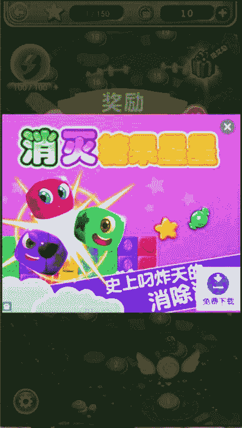
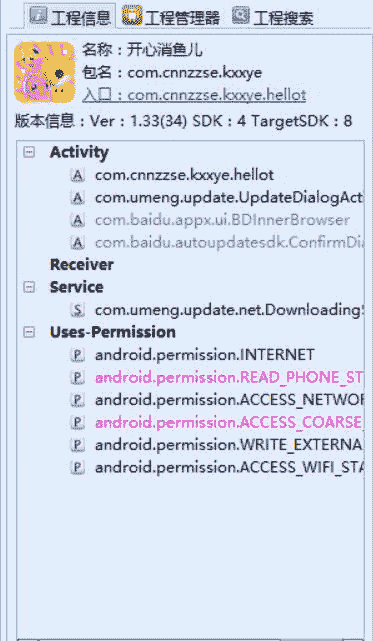
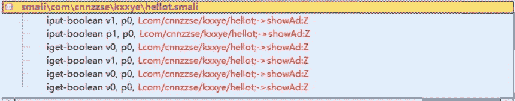

# 4.6 去广告

> 作者：[飞龙](https://github.com/wizardforcel)

软件在这里下载：[http://www.yxdown.com/shouji/376800.html](http://www.yxdown.com/shouji/376800.html)

我们要去掉的是主界面上的广告：



把它拖进 Android Killer，这个项目的包是`com.cnnzzse.kxxye`，通过查询配置文件可得知，主界面是`hellot`。



我们在这个类中搜索`ad`：

```
.field private adView:Lcom/baidu/mobads/AdView;

# ...

.field private interAd:Lcom/baidu/mobads/InterstitialAd;

.field private isInitAd:Z

# ...

.field private showAd:Z

# ...

.method public showAdView()V

# ...

.method public showInterView()V

# ... 
```

可以看到一共有两个广告，`adView`和`interAd`，我们再来看`showAdView`和`showInterView`的方法：

```
# showAdView
.line 283
iget-boolean v1, p0, Lcom/cnnzzse/kxxye/hellot;->showAd:Z

if-nez v1, :cond_1

.line 300
:cond_0
:goto_0
return-void

# showInterView
.line 302
iget-boolean v0, p0, Lcom/cnnzzse/kxxye/hellot;->showAd:Z

if-nez v0, :cond_0

.line 346
:goto_0
return-void
```

它们都通过`showAd`这个字段来判断是否要显示广告。

我们可以想办法把这个字段给赋成`false`。搜索`Lcom/cnnzzse/kxxye/hellot;->showAd:Z`：



发现对其写入的一共两处。第一处是构造器`<init>`中。

```
.prologue
const/4 v1, 0x1

# ...

.line 74
const/4 v0, 0x0

# ...

.line 75
iput-boolean v1, p0, Lcom/cnnzzse/kxxye/hellot;->showAd:Z
```

这里我们把`v1`改成`v0`。

第二处是静态方法`access$0`，这个方法专门用于设置`showAd`

```
.method static synthetic access$0(Lcom/cnnzzse/kxxye/hellot;Z)V
    .locals 0

    .prologue
    .line 75
    iput-boolean p1, p0, Lcom/cnnzzse/kxxye/hellot;->showAd:Z

    return-void
.end method
```

我们加上一句`const/4 p1, 0x0`。

完事。