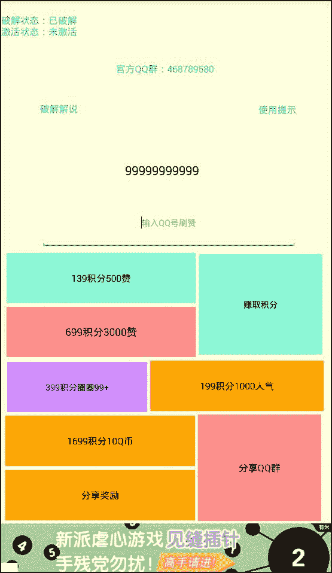

# 4.8 去广告 II

> 作者：[飞龙](https://github.com/wizardforcel)

软件下载：[http://www.xuepojie.com/thread-24545-1-1.html](http://www.xuepojie.com/thread-24545-1-1.html)

事先声明，这个软件没有功能，是个壳子，我们主要研究如何去广告。

软件的主界面是这样的，可以看到最下方的“有米”：



中间是一些按钮，点击每个按钮都会出现广告：


拖入 AK，发现是 e4a 编写的。


我们搜索“有米广告”：


按照 e4a，“主窗口”应该就是主界面，`StartActicity`只是个包装。e4a 的界面都是动态创建的，在`$define`方法中。

我们观察`主窗口$创建完毕`方法：

```
.method public 主窗口$创建完毕()V
    .locals 6

    .prologue
    const/4 v3, 0x1

    .line 12
    iget-object v0, p0, Lcom/azqqd/主窗口;->有米广告1:Lcom/e4a/runtime/components/impl/android/n43/有米广告;

    const-string v1, "80b3665dbe24da6c"

    const-string v2, "b1ec288d42c62f47"

    move v4, v3

    move v5, v3

    invoke-interface/range {v0 .. v5}, Lcom/e4a/runtime/components/impl/android/n43/有米广告;->初始化广告(Ljava/lang/String;Ljava/lang/String;ZZZ)V

    .line 13
    iget-object v0, p0, Lcom/azqqd/主窗口;->有米广告1:Lcom/e4a/runtime/components/impl/android/n43/有米广告;

    invoke-interface {v0}, Lcom/e4a/runtime/components/impl/android/n43/有米广告;->显示插播广告()V

    .line 14
    iget-object v0, p0, Lcom/azqqd/主窗口;->有米广告1:Lcom/e4a/runtime/components/impl/android/n43/有米广告;

    const-string v1, "\u4f17\u8d5e-\u4fee\u6b63\u7248"

    invoke-interface {v0, v1}, Lcom/e4a/runtime/components/impl/android/n43/有米广告;->设置积分墙标题(Ljava/lang/String;)V

    .line 15
    iget-object v0, p0, Lcom/azqqd/主窗口;->有米广告1:Lcom/e4a/runtime/components/impl/android/n43/有米广告;

    invoke-interface {v0}, Lcom/e4a/runtime/components/impl/android/n43/有米广告;->显示插播广告()V

    return-void
.end method
```

直接在这个方法的开头插入`return-void`，就没了。

之后是按钮的广告，由于按钮太多，一共有八个，我这里仅仅演示左上角的按钮（139 那个）。

在当前文件中搜索`139`：

```
iget-object v0, p0, Lcom/azqqd/主窗口;->按钮1:Lcom/e4a/runtime/components/impl/android/n1/按钮;

const-string v1, "139\u79ef\u5206500\u8d5e"

invoke-interface {v0, v1}, Lcom/e4a/runtime/components/impl/android/n1/按钮;->标题(Ljava/lang/String;)V
```

得知它就是按钮 1。

然后找到`按钮1$被单击`方法：

```
.method public 按钮1$被单击()V
    .locals 1

    .prologue
    .line 26
    const-string v0, "\u8bf7\u5148\u5b8c\u6210\u5206\u4eabQQ\u7fa4\u4efb\u52a1"

    invoke-static {v0}, Lcom/e4a/runtime/应用操作;->弹出提示(Ljava/lang/String;)V

    .line 27
    iget-object v0, p0, Lcom/azqqd/主窗口;->有米广告1:Lcom/e4a/runtime/components/impl/android/n43/有米广告;

    invoke-interface {v0}, Lcom/e4a/runtime/components/impl/android/n43/有米广告;->显示插播广告()V

    return-void
.end method
```

可以看到它没有任何实际功能，直接在开头插入`return-void`。我们之后只需要堆其余 7 个按钮执行相同操作就好了。