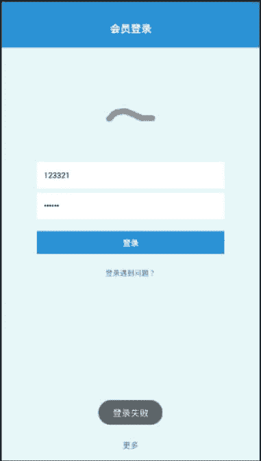
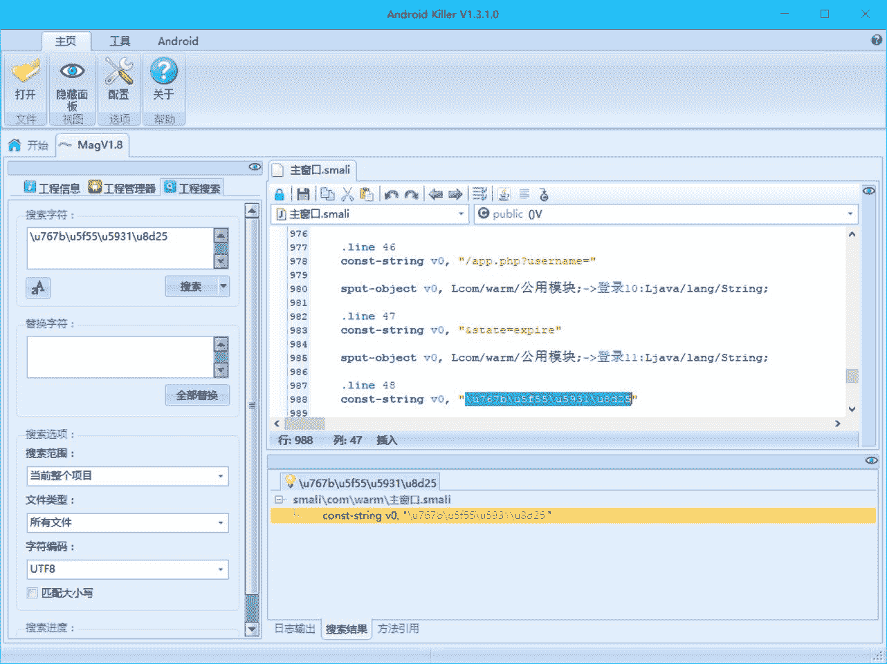
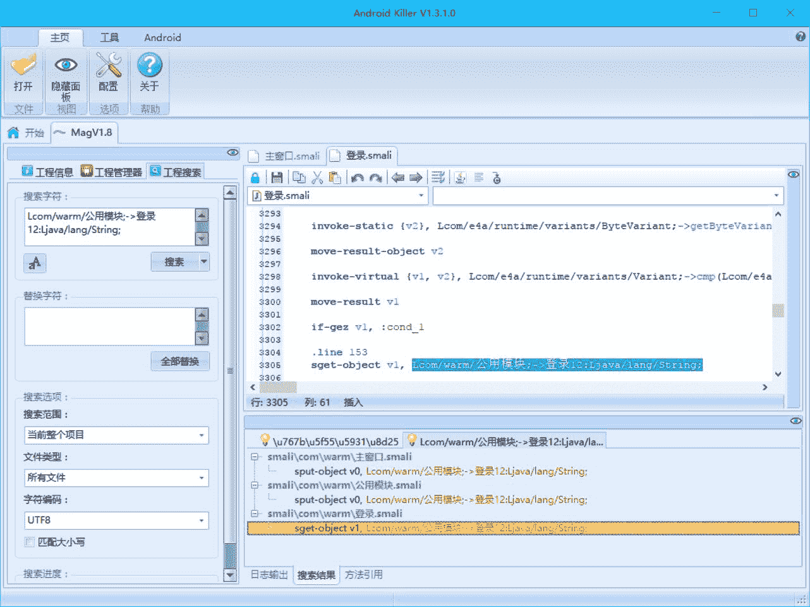
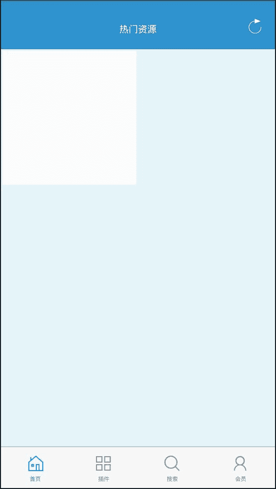

# 4.13 MagSearch 1.8 爆破

> 作者：[飞龙](https://github.com/wizardforcel)

软件下载：[http://www.xuepojie.com/thread-26549-1-1.html](http://www.xuepojie.com/thread-26549-1-1.html)

打开之后是登录界面，随便输入用户名和密码，显示登录失败。



将其载入 AK，搜索“登录失败”，没有反应。搜索它的 Unicode 编码`\u767b\u5f55\u5931\u8d25`：



在主窗口的`时钟1$周期事件`中，出现了：

```
.line 48
const-string v0, "\u767b\u5f55\u5931\u8d25" # 登录失败

sput-object v0, Lcom/warm/公用模块;->登录12:Ljava/lang/String;
```

我们搜索`Lcom/warm/公用模块;->登录12:Ljava/lang/String;`：



根据结果，登录窗口中（`登录.smali`）使用了该字段。

```
if-gez v1, :cond_1

.line 153
sget-object v1, Lcom/warm/公用模块;->登录12:Ljava/lang/String;

invoke-static {v1}, Lcom/e4a/runtime/应用操作;->弹出提示(Ljava/lang/String;)V

:cond_1
return-void
```

我们找到调用该字段的地方，这个应该是失败分支，需要向上找到关键判断。

```
.line 152
:cond_0
# 失败分支

# ...

if-eqz v1, :cond_0

# 成功分支
# ...
```

我们向上找到`:cond_0`，如果不跳到这里，就能走成功各分支。我们接着寻找谁使用了`:cond_0`，然后找到了关键判断。

我们如果想要爆破，一个思路就是把这个关键判断注释掉。但是这样还是要经过这个登录窗口，不够美观。我们现在换一个思路，如果登录窗口不是主窗口，那么我们只需要找到主窗口启动登录窗口的地方，把它改成登录后的那个窗口，就行了。

我们在成功分支中找到：

```
.line 149
# 热门资源
sget-object v1, Lcom/warm/公用模块;->登录9:Ljava/lang/String;

invoke-static {v1}, Lcom/e4a/runtime/应用操作;->读取窗口(Ljava/lang/String;)Lcom/e4a/runtime/components/impl/android/窗口Impl;

move-result-object v1

check-cast v1, Lcom/e4a/runtime/components/窗口;

invoke-static {v1}, Lcom/e4a/runtime/应用操作;->切换窗口(Lcom/e4a/runtime/components/窗口;)V
```

也就是说，登录窗口之后是热门资源。我们回到`时钟1$周期事件`，找到启动登录窗口的代码：

```
.line 70
const-string v0, "\u767b\u5f55" # 登录

invoke-static {v0}, Lcom/e4a/runtime/应用操作;->读取窗口(Ljava/lang/String;)Lcom/e4a/runtime/components/impl/android/窗口Impl;

move-result-object v0

check-cast v0, Lcom/e4a/runtime/components/窗口;

invoke-static {v0}, Lcom/e4a/runtime/应用操作;->切换窗口(Lcom/e4a/runtime/components/窗口;)V
```

把最上面那个字符串改成`\u70ed\u95e8\u8d44\u6e90`（热门资源），编译打包安装之后试试。



成功跳过了登录页面。不过这软件现在已经废了，只能用来练手了。