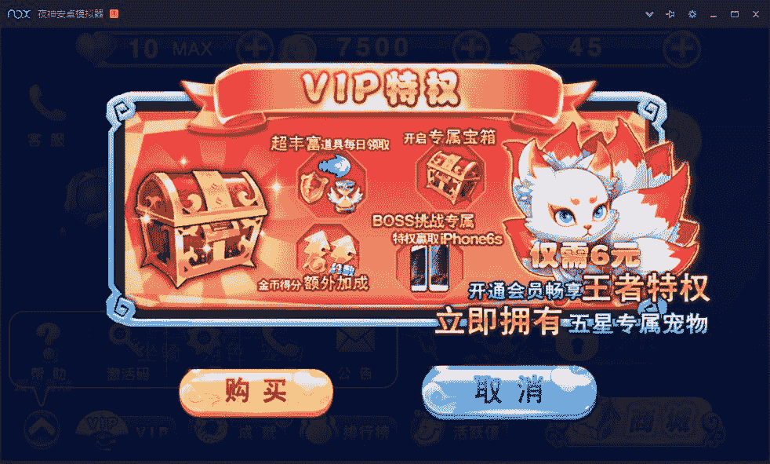

# 4.9 破解内购 II

> 作者：[飞龙](https://github.com/wizardforcel)

这次要破解的游戏是这个：[http://dl.pconline.com.cn/download/544623.html](http://dl.pconline.com.cn/download/544623.html)

打开游戏后，主界面有个 VIP，我们要破解的就是这个东西：



我们切换到“好友代付”，点击“购买”，然后是“确认支付”：


提示“购买道具xxx失败”。好，我们载入 AK：


我们搜索“失败”的 Unicode，在`SDKMessage$1`中找到了失败的文本。

```
.line 203
:pswitch_1
new-instance v1, Ljava/lang/StringBuilder;

# 购买道具：[
const-string v2, "\u8d2d\u4e70\u9053\u5177\uff1a["

invoke-direct {v1, v2}, Ljava/lang/StringBuilder;-><init>(Ljava/lang/String;)V

invoke-virtual {v1, p2}, Ljava/lang/StringBuilder;->append(Ljava/lang/String;)Ljava/lang/StringBuilder;

move-result-object v1

# ] 失败！
const-string v2, "] \u5931\u8d25\uff01"

invoke-virtual {v1, v2}, Ljava/lang/StringBuilder;->append(Ljava/lang/String;)Ljava/lang/StringBuilder;

move-result-object v1

invoke-virtual {v1}, Ljava/lang/StringBuilder;->toString()Ljava/lang/String;

move-result-object v0
```

这是`switch`是一个分支，我们直接往上找：

```
.line 197
.local v0, "result":Ljava/lang/String;
packed-switch p1, :pswitch_data_0

# ...

.line 197
:pswitch_data_0
.packed-switch 0x1
    :pswitch_0
    :pswitch_1
.end packed-switch
```

按照惯例，我们把跳转表都改成`:pswitch_0`，编译，打包，安装。然后随便购买一个东西。虽然 SDK 的对话框提示失败，这个我们改不了，但是游戏的`Toast`提示成功。

