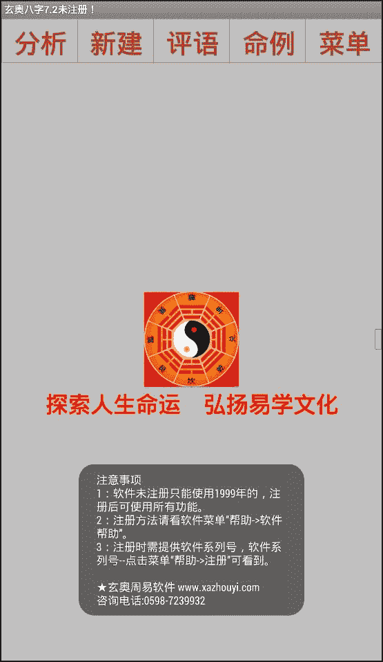
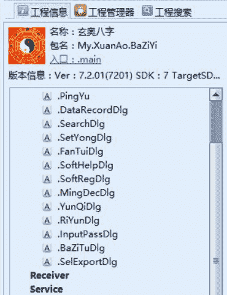
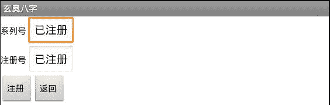

# 4.10 玄奥八字

> 作者：[飞龙](https://github.com/wizardforcel)
> 
> 声明：本人极度厌恶玄学，选取此软件是为了研究逆向技术，并不代表本人赞成其内容。

这次要破解的软件是这个：[http://www.xazhouyi.com/android/soft/bazi.html](http://www.xazhouyi.com/android/soft/bazi.html)

首先分析其行为，打开软件：



按照以往的经验，程序有个字段用于维护注册状态，我们可以通过字符串快速定位到它。我们将其载入 AK：



搜索“软件未注册”，在`string.xml`中找到：

```
<string name="Id_StartInfo">"注意事项
1：软件未注册只能使用1999年的，注册后可使用所有功能。
2：注册方法请看软件菜单“帮助->软件帮助”。
3：注册时需提供软件系列号，软件系列号--点击菜单“帮助->注册”可看到。
...
</string>
```

然后在`public.xml`中找到，字符串的 ID 是`0x7f060003`。之后搜索这个数字。

我们在`main`，也就是入口的`MyInit`函数中找到了这个数值：

```
:cond_b
# 玄奥八字7.2未注册！
const-string v7, "\u7384\u5965\u516b\u5b577.2\u672a\u6ce8\u518c\uff01"

invoke-virtual {p0, v7}, LMy/XuanAo/BaZiYi/main;->setTitle(Ljava/lang/CharSequence;)V

.line 199
invoke-virtual {p0}, LMy/XuanAo/BaZiYi/main;->getResources()Landroid/content/res/Resources;

move-result-object v7

const v8, 0x7f060003

invoke-virtual {v7, v8}, Landroid/content/res/Resources;->getString(I)Ljava/lang/String;

# 刚才的字符串
move-result-object v7

invoke-static {p0, v7, v10}, Landroid/widget/Toast;->makeText(Landroid/content/Context;Ljava/lang/CharSequence;I)Landroid/widget/Toast;

move-result-object v7

invoke-virtual {v7}, Landroid/widget/Toast;->show()V

goto :goto_4 # return-void
```

我们猜想`:cond_b`是失败分支，我们往上找：

```
sget-object v7, LMy/XuanAo/BaZiYi/main;->m_chkSoft:LMy/XuanAo/BaZiYi/CSoftReg;

invoke-virtual {v7}, LMy/XuanAo/BaZiYi/CSoftReg;->ChkNumA()Z

move-result v7

if-eqz v7, :cond_b

sget-object v7, LMy/XuanAo/BaZiYi/main;->m_chkSoft:LMy/XuanAo/BaZiYi/CSoftReg;

invoke-virtual {v7}, LMy/XuanAo/BaZiYi/CSoftReg;->ChkNumB()Z

move-result v7

if-eqz v7, :cond_b

sget-object v7, LMy/XuanAo/BaZiYi/main;->m_chkSoft:LMy/XuanAo/BaZiYi/CSoftReg;

invoke-virtual {v7}, LMy/XuanAo/BaZiYi/CSoftReg;->ChkNumC()Z

move-result v7

if-eqz v7, :cond_b # 关键跳

# 成功分支

.line 195
const-string v7, "\u7384\u5965\u516b\u5b577.2"

invoke-virtual {p0, v7}, LMy/XuanAo/BaZiYi/main;->setTitle(Ljava/lang/CharSequence;)V

.line 196
# const/4 v10, 0x1
sput-boolean v10, LMy/XuanAo/BaZiYi/main;->m_regFlag:Z
```

我们可以得出`ChkNumA/B/C`是三个关键判断。下面的`if-eqz`是关键跳。成功各分支将`m_regFlag`设为 1，说明它是保存注册状态的字段。

我们可以将这三个`if-eqz`都给注释掉，但是我们可以采取另一种方式，在最后一个`if`的下面添加`:goto_100`标签，然后在第一个`if`上面添加`goto :goto_100`。

```
.line 193
:cond_1
goto :goto_100
sget-object v7, LMy/XuanAo/BaZiYi/main;->m_chkSoft:LMy/XuanAo/BaZiYi/CSoftReg;

# ...

if-eqz v7, :cond_b
:goto_100
```

重新打包、安装软件后，打开软件，我们发现不再弹出注册提示了。访问菜单->更多->注册之后，在注册界面中我们可以看到“已注册”。

