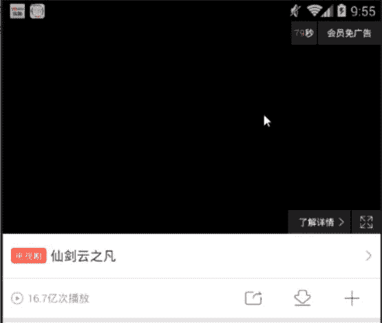
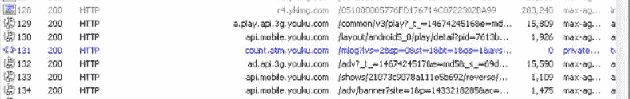
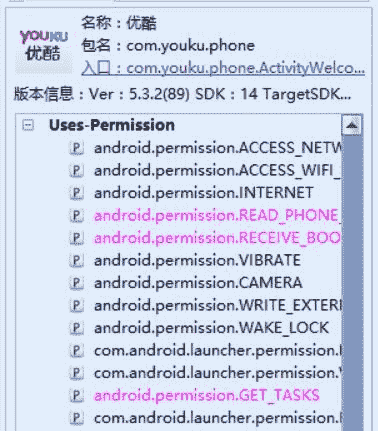
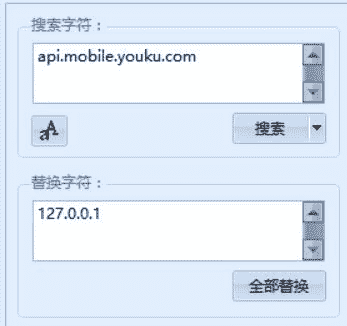

# 4.11 优酷 APK 去广告

> 作者：[飞龙](https://github.com/wizardforcel)

软件下载：[http://app.cnmo.com/android/235159/](http://app.cnmo.com/android/235159/)

这次要破解优酷的 APK，去掉播放视频开头的广告：



我们先抓包，看到了`api.mobile.youku.com`，这个就是广告所在的域名。



我们载入 AK：



将所有`api.mobile.youku.com`都换成`127.0.0.1`即可：



然后，在回编译的时候，会有如下问题。

```
>D:\Wizard破解工具包\Tool\Android\AndroidKiller_v1.3.1\projects\Youku\Project\res\values-v23\styles.xml:6: error: Error retrieving parent for item: No resource found that matches the given name '@android:style/WindowTitleBackground'.
>D:\Wizard破解工具包\Tool\Android\AndroidKiller_v1.3.1\projects\Youku\Project\res\values-v23\styles.xml:6: error: Error retrieving parent for item: No resource found that matches the given name '@android:style/WindowTitleBackground'.
```

我们找到`res/value-v23/styles.xml`，把`resources`下的东西注释掉：

```
<?xml version="1.0" encoding="utf-8"?>
<resources>
    <!--
    ...
    -->
</resources>
```

在找到`res/value/public.xml`，把所有带`Base.V23`的东西（两个）注释掉：

```
<!--
<public type="style" name="Base.V23.Theme.AppCompat" id="0x7f0d00a6" />
<public type="style" name="Base.V23.Theme.AppCompat.Light" id="0x7f0d00a7" />
-->
```

即可成功编译：

```
当前 Apktool 使用版本：Android Killer Default APKTOOL
正在编译 APK，请稍等...
>I: 使用 ShakaApktool 2.0.0-20150914
>I: 编译 smali 到 classes.dex...
>I: 编译 smali_classes2 到 classes2.dex...
>I: 正在编译资源...
>I: 正在拷贝libs目录... (/lib)
>I: 正在编译apk文件...
>I: 复制未知文件/目录...
APK 编译完成!
正在对 APK 进行签名，请稍等...
APK 签名完成!
---------------------------
APK 所有编译工作全部完成!!!
生成路径：
file:D:\Wizard破解工具包\Tool\Android\AndroidKiller_v1.3.1\projects\Youku\Bin\Youku_killer.apk
```