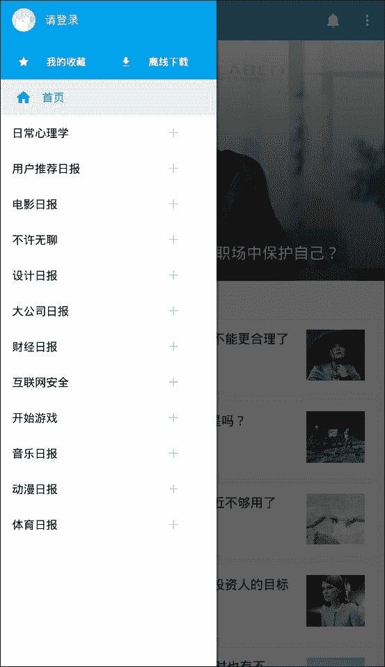

# DrawerLayout

> 作者：[飞龙](https://github.com/wizardforcel)

`DrawerLayout`是`android.support.v4`中提供的控件，用于实现边栏和侧滑效果。大家在各种 APP 中看到的左侧边栏就是这个控件。



## 创建

DrawerLayout 最好是界面的顶级布局，否则可能出现触摸时间被屏蔽的问题。它拥有两个子元素，第一个是主内容，第二个是菜单内容。

```
<android.support.v4.widget.DrawerLayout
    xmlns:android="http://schemas.android.com/apk/res/android"
    android:id="@+id/drawer"
    android:layout_width="match_parent"
    android:layout_height="match_parent">

    <LinearLayout
        android:id="@+id/main_linear"
        android:orientation="vertical"
        android:layout_width="match_parent"
        android:layout_height="match_parent" />

    <ListView
        android:id="@+id/menu_list"
        android:layout_width="360dp"
        android:layout_height="match_parent"
        android:layout_gravity="left"
        android:choiceMode="singleChoice"
        android:divider="@android:color/transparent"
        android:dividerHeight="0dp"
        android:background="#111"/>
</android.support.v4.widget.DrawerLayout>
```

主布局和菜单布局都可以是任何东西。这里主布局是空的`LinearLayout`，菜单布局是`ListView`。为了使菜单布局宽度合适，我将其设置为`360dp`。

主内容区的布局代码必须放在侧滑菜单布局的前面, 因为 XML 元素按 z 序（层叠顺序）排列，并且抽屉式导航栏必须位于内容顶部。

菜单布局必须设置`layout_gravity`属性，它表示侧滑菜单的滑出方向。一共有四个取值：

| 值 | 含义 |
| --- | --- |
| `left` | 左侧滑出 |
| `right` | 右侧滑出 |
| `start` | 如果是从左到右书写的语言，则从左侧滑出，否则从右侧滑出 |
| `end` | 如果是从左到右书写的语言，则从右侧滑出，否则从左侧滑出 |

> 如果要在右边放置另一个菜单，只要再添加一个`ListView`，将`layout_gravity`设置成相反的方向即可。

效果是这样：


## 操作

通过手动侧滑可以打开或关闭边栏，触摸主布局可以关闭边栏。

我们也可以编程来打开关闭边栏：

*   `void openDrawer(int gravity)`：打开边栏
*   `void closeDrawer(int gravity)`：关闭边栏
*   `boolean isDraweropen(int gravity)`：判断边栏是否打开

参数`gravity`必须与 XML 中一致，同样有四种选择：

*   `Gravity.LEFT`
*   `Gravity.RIGHT`
*   `Gravity.START`
*   `Gravity.END`

## 事件

有的时候，我们需要监听边栏是否打开或关闭。我们需要调用`setDrawerListener`方法，实现`DrawerLayout.DrawerListener`作为监听器。我们需要覆盖四个方法。

```
mDrawerLayout.setDrawerListener(new DrawerListener() {
    /**
    * 当抽屉滑动状态改变的时候被调用
    * 状态值是STATE_IDLE（闲置-0），STATE_DRAGGING（拖拽-1），STATE_SETTLING（固定-2）中之一。
    * 抽屉打开的时候，点击抽屉，drawer的状态就会变成STATE_DRAGGING，然后变成STATE_IDLE
    */
    @Override
    public void onDrawerStateChanged(int arg0) {

    }

    /**
    * 当抽屉被滑动的时候调用此方法
    * arg1 表示 滑动的幅度(0-1)
    */
    @Override
    public void onDrawerSlide(View arg0, float arg1) {

    }

    /** 
    * 当一个抽屉被完全打开的时候被调用
    */
    @Override
    public void onDrawerOpened(View arg0) {

    }

    /** 
    * 当一个抽屉完全关闭的时候调用此方法
    */
    @Override
    public void onDrawerClosed(View arg0) {

    }
});
```

但是这样太麻烦了，我们可以继承`SimpleDrawerListener`，只覆盖所需的方法：

```
mDrawerLayout.setDrawerListener(new SimpleDrawerListener() {
    @Override
    public void onDrawerOpened(View arg0) {

    }

    @Override
    public void onDrawerClosed(View arg0) {

    }
});
```