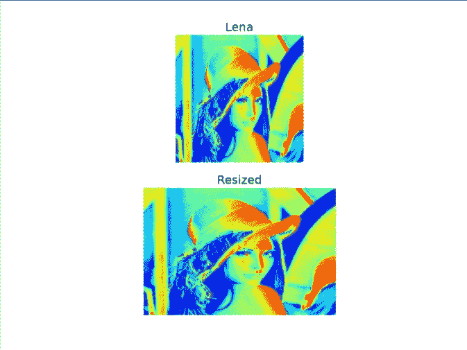
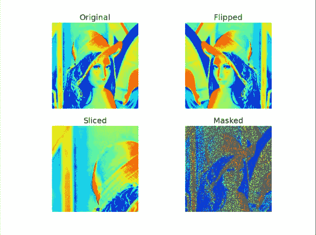
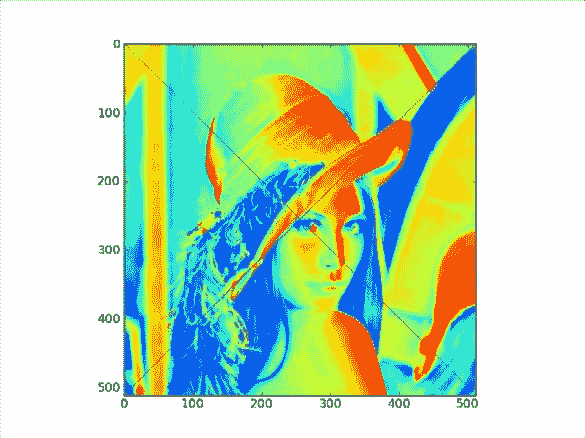
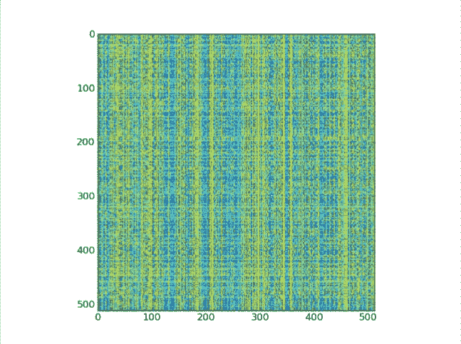
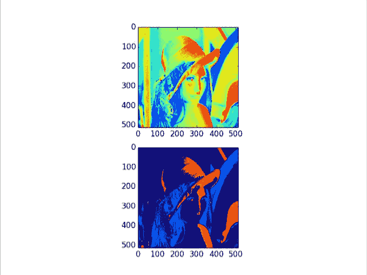
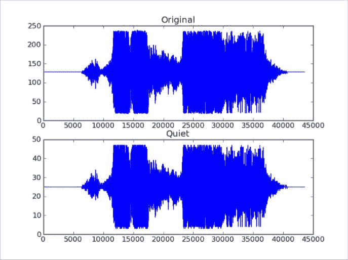

## 调整图像尺寸

```
# 这个代码用于调整图像尺寸
# 来源：NumPy Cookbook 2e Ch2.3

import scipy.misc 
import matplotlib.pyplot as plt 
import numpy as np

# 将 Lena 图像加载到数组中
lena = scipy.misc.lena()

# 图像宽高
LENA_X = 512 
LENA_Y = 512

# 检查图像的宽高
np.testing.assert_equal((LENA_Y, LENA_X), lena.shape)

# 设置调整系数，水平 3，竖直 2
yfactor = 2 
xfactor = 3

# 调整图像尺寸，水平（沿轴 1）拉伸 3 倍，竖直（沿轴 0 ）拉伸两倍
resized = lena.repeat(yfactor, axis=0)
              .repeat(xfactor, axis=1)

# 检查调整后数组
np.testing.assert_equal((yfactor * LENA_Y, xfactor * LENA_Y), resized.shape)

# 绘制原图像（两行一列的第一个位置）
plt.subplot(211) 
plt.title("Lena") 
plt.axis("off") 
plt.imshow(lena)

# 绘制调整后图像（两行一列的第二个位置）
plt.subplot(212) 
plt.title("Resized") 
plt.axis("off") 
plt.imshow(resized) 
plt.show() 
```



## 创建视图及副本

```
# 来源：NumPy Cookbook 2e Ch2.4

import scipy.misc 
import matplotlib.pyplot as plt

# 加载 Lena 图像
lena = scipy.misc.lena() 

# copy 创建副本，Python 对象复制，内部内存复制
acopy = lena.copy() 

# view 创建视图，Python 对象复制，内部内存共享
aview = lena.view()

# 绘制 Lena 图像（左上角）
plt.subplot(221) 
plt.imshow(lena)

# 绘制副本（右上角） 
plt.subplot(222) 
plt.imshow(acopy)

# 绘制视图（左下角）
plt.subplot(223) 
plt.imshow(aview)

# 将副本所有元素清零
# 由于数组的数据保存在内部内存中
# 副本不受影响，视图（以及引用）会跟着变化
aview.flat = 0 

# 绘制修改后的视图（右下角）
plt.subplot(224) 
plt.imshow(aview) 
```


## 翻转图像

```
# 来源：NumPy Cookbook 2e Ch2.5

import scipy.misc 
import matplotlib.pyplot as plt

# 加载 Lena 图像
lena = scipy.misc.lena()

# 绘制 Lena 图像（左上角）
plt.subplot(221) 
plt.title('Original') 
plt.axis('off') 
plt.imshow(lena)

# 绘制翻转后的图像（右上角）
# Python 的 [::-1] 用于翻转序列
# 这里翻转了第二个维度，也就是水平翻转
plt.subplot(222) 
plt.title('Flipped') 
plt.axis('off') 
plt.imshow(lena[:,::-1])

# 绘制切片后的图像（左下角）
# 取图像的左半部分和上半部分
plt.subplot(223)
plt.title('Sliced') 
plt.axis('off') plt.imshow(lena[:lena.shape[0]/2,:lena.shape[1]/2])

# 添加掩码，将偶数元素变为 0 
# 布尔数组可用作索引 
mask = lena % 2 == 0 
masked_lena = lena.copy() 
masked_lena[mask] = 0 

# 绘制添加掩码后的图像（右下角）
plt.subplot(224) 
plt.title('Masked') 
plt.axis('off') 
plt.imshow(masked_lena)
plt.show() 
```



## 花式索引

```
# 这个代码通过将数组对角线上的元素设为 0 ，来展示花式索引
# 花式索引就是使用数组作为索引来索引另一个数组
# 来源：NumPy Cookbook 2e Ch2.6

import scipy.misc 
import matplotlib.pyplot as plt

# 加载 Lena 图像
# Load the Lena array 
lena = scipy.misc.lena() 

# 取图片的宽和高
height = lena.shape[0] 
width = lena.shape[1]

# 使用花式索引将对角线上的元素设为 0
# x 为 0 ~ width - 1 的数组
# y 为 0 ~ height - 1 的数组
lena[range(height), range(width)] = 0

# 将副对角线上元素也设为 0
# x 为 width - 1 ~ 0 的数组
# y 为 0 ~ height - 1 的数组
lena[range(height), range(width - 1, -1, -1)] = 0

# 画出带对角线的 Lena 图像
plt.imshow(lena) 
plt.show() 
```



## 将位置列表用于索引

```
# 这个代码的目的就是把 Lena 图像弄花
# 来源：NumPy Cookbook 2e Ch2.7

import scipy.misc 
import matplotlib.pyplot as plt 
import numpy as np

# 加载 Lena 图像 
lena = scipy.misc.lena() 

# 取图像宽高
height = lena.shape[0] 
width = lena.shape[1]

def shuffle_indices(size):   
    '''   
    生成 0 ~ size - 1 的数组并打乱   
    '''
    arr = np.arange(size)   
    np.random.shuffle(arr)
    return arr

# 生成 x 随机索引和 y 随机索引
xindices = shuffle_indices(width) 
np.testing.assert_equal(len(xindices), width) 
yindices = shuffle_indices(height) np.testing.assert_equal(len(yindices), height)

# 画出打乱后的图像
# ix_ 函数将 yindices 转置，xindices 不变
# 结果是一个 height x 1 的数组和一个 1 x  width 的数组
# 用于索引时，都会扩展为 height x width 的数组
plt.imshow(lena[np.ix_(yindices, xindices)]) 
plt.show() 
```



## 布尔索引

```
# 来源：NumPy Cookbook 2e Ch2.8

import scipy.misc 
import matplotlib.pyplot as plt 
import numpy as np

# 加载 Lena 图像
lena = scipy.misc.lena()

# 取大小为 size 的数组
# 4 的倍数的下标为 True，其余为 False
def get_indices(size):   
    arr = np.arange(size)   
    return arr % 4 == 0

# 绘制 Lena
# 对角线上每四个元素将一个元素清零 
lena1 = lena.copy() 
yindices = get_indices(lena.shape[0]) 
xindices = get_indices(lena.shape[1]) 
lena1[yindices, xindices] = 0 
plt.subplot(211) 
plt.imshow(lena1)

lena2 = lena.copy() 
# 最大值 1/4 ~ 3/4 之间的元素清零
# 这里用到了数组广播
lena2[(lena > lena.max()/4) & (lena < 3 * lena.max()/4)] = 0 
plt.subplot(212) 
plt.imshow(lena2)
plt.show() 
```



## 分离数独的九宫格

```
# 来源：NumPy Cookbook 2e Ch2.9

import numpy as np

# 数独是个 9x9 的二维数组
# 包含 9 个 3x3 的九宫格
sudoku = np.array([   
    [2, 8, 7, 1, 6, 5, 9, 4, 3],
    [9, 5, 4, 7, 3, 2, 1, 6, 8],
    [6, 1, 3, 8, 4, 9, 7, 5, 2],
    [8, 7, 9, 6, 5, 1, 2, 3, 4],
    [4, 2, 1, 3, 9, 8, 6, 7, 5],
    [3, 6, 5, 4, 2, 7, 8, 9, 1],
    [1, 9, 8, 5, 7, 3, 4, 2, 6],
    [5, 4, 2, 9, 1, 6, 3, 8, 7],
    [7, 3, 6, 2, 8, 4, 5, 1, 9]
])

# 要将其变成 3x3x3x3 的四维数组
# 但不能直接 reshape，因为这样会把一行变成一个九宫格
shape = (3, 3, 3, 3)

# 大行之间隔 27 个元素，大列之间隔 3 个元素
# 小行之间隔 9 个元素，小列之间隔 1 个元素
strides = sudoku.itemsize * np.array([27, 3, 9, 1])

squares = np.lib.stride_tricks.as_strided(sudoku, shape=shape, strides=strides) 
print(squares)

'''
[[[[2 8 7]    [9 5 4]    [6 1 3]]
  [[1 6 5]    [7 3 2]    [8 4 9]]
  [[9 4 3]    [1 6 8]    [7 5 2]]]

 [[[8 7 9]    [4 2 1]    [3 6 5]]
  [[6 5 1]    [3 9 8]    [4 2 7]]
  [[2 3 4]    [6 7 5]    [8 9 1]]]

 [[[1 9 8]    [5 4 2]    [7 3 6]]
  [[5 7 3]    [9 1 6]    [2 8 4]]
  [[4 2 6]    [3 8 7]    [5 1 9]]]]
''' 
```

## 数组广播

```
# 来源：NumPy Cookbook 2e Ch2.10

import scipy.io.wavfile 
import matplotlib.pyplot as plt 
import urllib2 
import numpy as np

# 下载音频文件
response = urllib2.urlopen('http://www.thesoundarchive.com/austinpowers/smashingbaby.wav') 
print(response.info())

# 将文件写到磁盘
WAV_FILE = 'smashingbaby.wav' 
filehandle = open(WAV_FILE, 'w') 
filehandle.write(response.read()) 
filehandle.close() 

# 使用 SciPy 读取音频文件
sample_rate, data = scipy.io.wavfile.read(WAV_FILE)
print("Data type", data.dtype, "Shape", data.shape)
# ('Data type', dtype('uint8'), 'Shape', (43584L,))

# 绘制原始音频文件（上方）
# y 值是数据，x 值是数据的下标
plt.subplot(2, 1, 1) 
plt.title("Original") 
plt.plot(data)

# 使音频更安静
# 数组广播的意思是，两个数组进行运算时
# 较小尺寸的数组会扩展自身，与较大数组对齐
# 如果数组与标量运算，那么将标量与数组的每个元素运算
# 所以这里数组的每个元素都 x 0.2
# 具体规则请见官方文档
newdata = data * 0.2 
newdata = newdata.astype(np.uint8) 
print("Data type", newdata.dtype, "Shape", newdata.shape)
# ('Data type', dtype('uint8'), 'Shape', (43584L,))

# 保存更安静的音频
scipy.io.wavfile.write("quiet.wav", sample_rate, newdata)

# 绘制更安静的音频文件（下方）
plt.subplot(2, 1, 2) 
plt.title("Quiet") 
plt.plot(newdata)
plt.show() 
```

