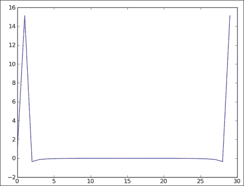
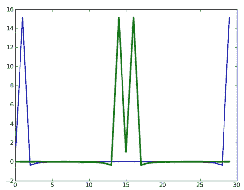
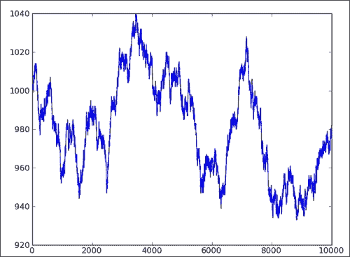
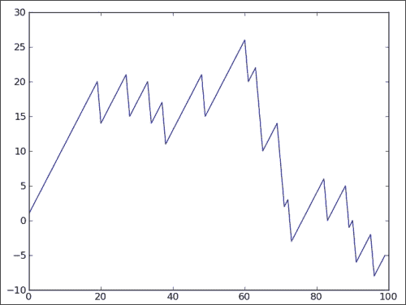
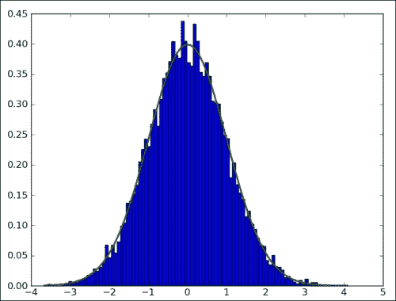
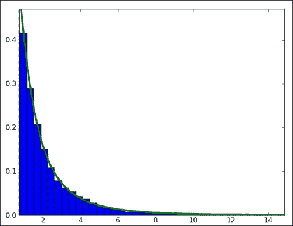

```
# 来源：NumPy Biginner's Guide 2e ch6 
```

## 矩阵的逆

```
import numpy as np

A = np.mat("0 1 2;1 0 3;4 -3 8")
print "A\n", A
'''
A
[[ 0  1  2]
 [ 1  0  3]
 [ 4 -3  8]]
'''

# 求解矩阵的逆，不可逆会报错
inverse = np.linalg.inv(A)
print "inverse of A\n", inverse
'''
inverse of A
[[-4.5  7\.  -1.5]
 [-2\.   4\.  -1\. ]
 [ 1.5 -2\.   0.5]]
'''

print "Check\n", A * inverse
'''
Check
[[ 1\.  0\.  0.]
 [ 0\.  1\.  0.]
 [ 0\.  0\.  1.]]
''' 
```

## 求解线性方程组

```
import numpy as np

A = np.mat("1 -2 1;0 2 -8;-4 5 9")
print "A\n", A
'''
A
[[ 1 -2  1]
 [ 0  2 -8]
 [-4  5  9]]
'''

b = np.array([0, 8, -9])
print "b\n", b
'''
b
[ 0  8 -9]
'''

# solve 求出向量 x，使 Ax = b
# 内部使用 np.dot(A.I, b) 来计算
# 所以 A 不可逆时报错
x = np.linalg.solve(A, b)
print "Solution", x
'''
Solution [ 29\.  16\.   3.]
'''

print "Check\n", np.dot(A , x)
'''
Check
[[ 0\.  8\. -9.]]
''' 
```

## 特征值和特征向量

```
 # 如果 Ax = λx，并且 x 非零
# 则 λ 是 A 的特征值，x 是 A 关于 λ 的特征向量
import numpy as np

A = np.mat("3 -2;1 0")
print "A\n", A
'''
A
[[ 3 -2]
 [ 1  0]]
'''

# eigvals 仅仅求解特征值
print "Eigenvalues", np.linalg.eigvals(A)
# Eigenvalues [ 2\.  1.]

# eig 求解特征值和特征向量
# 特征向量是数组的列
eigenvalues, eigenvectors = np.linalg.eig(A)
print "First tuple of eig", eigenvalues
print "Second tuple of eig\n", eigenvectors
'''
First tuple of eig [ 2\.  1.]
Second tuple of eig
[[ 0.89442719  0.70710678]
 [ 0.4472136   0.70710678]]
'''

for i in range(len(eigenvalues)):
    print "Left", np.dot(A, eigenvectors[:,i])
    print "Right", eigenvalues[i] * eigenvectors[:,i]
    print
'''
Left [[ 1.78885438]
 [ 0.89442719]]
Right [[ 1.78885438]
 [ 0.89442719]]
Left [[ 0.70710678]
 [ 0.70710678]]
Right [[ 0.70710678]
 [ 0.70710678]]
''' 
```

## 奇异值分解

```
# 奇异值是 A * A.T 特征值的算术平方根
# 若 A 是 mxn 阶矩阵
# 奇异值分解将 A 分解成 USV
# U 是 mxm 阶。S 是 mxm 阶对角矩阵，由奇异值构成
# V 是 mxn 阶

import numpy as np

A = np.mat("4 11 14;8 7 -2")
print "A\n", A
'''
A
[[ 4 11 14]
 [ 8  7 -2]]
'''

# linalg.svd 求解奇异值
U, Sigma, V = np.linalg.svd(A, full_matrices=False)

print "U"
print U
'''
U
[[-0.9486833  -0.31622777]
 [-0.31622777  0.9486833 ]]
'''

print "Sigma"
print Sigma
'''
Sigma
[ 18.97366596   9.48683298]
'''

print "V"
print V
'''
V
[[-0.33333333 -0.66666667 -0.66666667]
 [ 0.66666667  0.33333333 -0.66666667]]
'''

print "Product\n", U * np.diag(Sigma) * V
'''
Product
[[  4\.  11\.  14.]
 [  8\.   7\.  -2.]]
'''

print np.linalg.eigvals(A * A.T) ** 0.5
'''
[ 18.97366596   9.48683298]
''' 
```

## 广义逆矩阵

```
# 若存在唯一矩阵 M，满足
# AMA = A，MAM = M，AM 和 MA 均为对称矩阵
# 则 M 是 A 的广义逆矩阵

import numpy as np

A = np.mat("4 11 14;8 7 -2")
print "A\n", A
'''
A
[[ 4 11 14]
 [ 8  7 -2]]
'''

# linalg.pinv 求解广义逆
pseudoinv = np.linalg.pinv(A)
print "Pseudo inverse\n", pseudoinv
'''
Pseudo inverse
[[-0.00555556  0.07222222]
 [ 0.02222222  0.04444444]
 [ 0.05555556 -0.05555556]]
'''

print "Check", A * pseudoinv
'''
Check [[  1.00000000e+00   0.00000000e+00]
 [  8.32667268e-17   1.00000000e+00]]
''' 
```

## 计算矩阵行列式

```
import numpy as np

A = np.mat("3 4;5 6")
print "A\n", A
'''
A
[[ 3\.  4.]
 [ 5\.  6.]]
'''

# linalg.det 求解行列式
# 对于二阶矩阵
# det(A) = A[0][0] * A[1][1] - A[0][1] * A[1][0]
print "Determinant", np.linalg.det(A)
# Determinant -2.0 
```

## 快速傅里叶变换（FFT）

```
import numpy as np
from matplotlib.pyplot import plot, show

# 创建 30 个点的余弦波
x =  np.linspace(0, 2 * np.pi, 30)
wave = np.cos(x)

# 使用 fft 函数变换余弦波
transformed = np.fft.fft(wave)

# 验证是否能够还原数据
print np.all(np.abs(np.fft.ifft(transformed) - wave) < 10 ** -9)
# True

# 绘制变换后的信号
plot(transformed)
show() 
```



## 调整频率

```
import numpy as np
from matplotlib.pyplot import plot, show

# 创建 30 个点的余弦波
x =  np.linspace(0, 2 * np.pi, 30)
wave = np.cos(x)

# 使用 fft 函数变换余弦波
transformed = np.fft.fft(wave)

# 使用 fftshift  函数调整信号
shifted = np.fft.fftshift(transformed)

# 检查是否可以还原
print np.all(np.abs(np.fft.ifftshift(shifted) - transformed) < 10 ** -9)

# 绘制信号
plot(transformed, lw=2)
plot(shifted, lw=3)
show() 
```



## 随机游走

```
import numpy as np
from matplotlib.pyplot import plot, show

# 创建大小为 10000 的余额数组
# 初始余额为 1000
cash = np.zeros(10000)
cash[0] = 1000

# 生成随机数，其概率满足二项分布 B(n = 9, p = 0.5)
# P(x = k) = C(n, k) * p ** k * (1 - p) ** (n - k)
# x: 0 ~ 9
outcome = np.random.binomial(9, 0.5, size=len(cash))

for i in range(1, len(cash)):

    # 如果随机数小于 5，余额减一，否则加一
    # p = 0.5 时，二项分布是对称的
    # 所以小于 5 的概率应该是 0.5
    if outcome[i] < 5:
      cash[i] = cash[i - 1] - 1
    elif outcome[i] < 10:
      cash[i] = cash[i - 1] + 1
    else:
      raise AssertionError("Unexpected outcome " + outcome)

print outcome.min(), outcome.max()
# 0 9

# 绘制余额变化情况
plot(np.arange(len(cash)), cash)
show() 
```



## 模拟游戏节目

```
# 游戏节目中有一个桶，里面有 25 个正常球
# 和一个倒霉球
# 选手正确回答问题后都需要取出三个球
# 如果三个都是普通球，分数加一
# 否则分数减六

import numpy as np
from matplotlib.pyplot import plot, show

# 创建分数数组
points = np.zeros(100)

# hypergeometric 函数生成的随机数满足超几何分布
# 超几何分布描述了，袋子里有两类球，从袋子里取出几个球，取到 k 个一类球的概率。
# 参数分别为：普通球的个数，倒霉球的个数，取出的个数
# 随机数模拟了取出的球中普通球的个数
outcomes = np.random.hypergeometric(25, 1, 3, size=len(points))

for i in range(len(points)):
   if outcomes[i] == 3:
      # 如果三个都是普通球，分数加一
      points[i] = points[i - 1] + 1
   elif outcomes[i] == 2:
      # 如果存在倒霉球，分数减六
      points[i] = points[i - 1] - 6
   else:
      print outcomes[i]

# 绘制分数变化情况
plot(np.arange(len(points)), points)
show() 
```



## 绘制正态分布


```
import numpy as np
import matplotlib.pyplot as plt

N=10000

# 生成随机数，其概率满足正态分布 N(mu = 0, sigma = 1)
normal_values = np.random.normal(size=N)

# 绘制直方图，横轴是分组，纵轴是出现频率
# 第二个参数表示 100 个组（默认 10 个）
# bins 是组中值
dummy, bins, dummy = plt.hist(normal_values, np.sqrt(N), normed=True, lw=1)

# 绘制正态分布概率密度函数
sigma = 1
mu = 0
plt.plot(bins, 1/(sigma * np.sqrt(2 * np.pi)) * np.exp( - (bins - mu)**2 / (2 * sigma**2) ),lw=2)
plt.show() 
```



## 绘制对数正态分布


```
# 和上一段代码基本一样

import numpy as np
import matplotlib.pyplot as plt

N=10000

# 将这里改成 lognormal 来生成对数正态分布的随机数
lognormal_values = np.random.lognormal(size=N)

dummy, bins, dummy = plt.hist(lognormal_values, np.sqrt(N), normed=True, lw=1)

sigma = 1
mu = 0
x = np.linspace(min(bins), max(bins), len(bins))
# 修改这里的公式
pdf = np.exp(-(np.log(x) - mu)**2 / (2 * sigma**2))/ (x * sigma * np.sqrt(2 * np.pi))
plt.plot(x, pdf,lw=3)
plt.show() 
```

