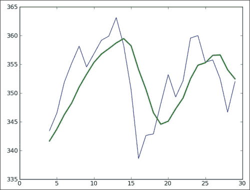

```
# 来源：NumPy Biginner's Guide 2e ch3 
```

## 读写文件

```
import numpy as np

# eye 用于创建单位矩阵
i2 = np.eye(2)
print i2
'''
[[ 1\.  0.]
[ 0\.  1.]]
'''

# 将数组以纯文本保存到 eye.txt 中
np.savetxt("eye.txt", i2)
'''
eye.txt:
1.000000000000000000e+00 0.000000000000000000e+00
0.000000000000000000e+00 1.000000000000000000e+00
'''

# 还可以读进来
print np.loadtxt('eye.txt')
[[ 1.  0.]
 [ 0.  1.]] 
```

## 读取 CSV

```
'''
data.csv:
AAPL,28-01-2011, ,344.17,344.4,333.53,336.1,21144800
分别为：
名称，日期，空，开盘，最高，最低，收盘，成交量
'''

# delimiter 是分隔符，设置为 ','
# usecols 设置需要取的列，这里只选择了收盘和成交量
# unpack 设置为 True，返回的数组是以列为主
# 可以分别将收盘和成交量赋给 c 和 v
c, v = np.loadtxt('data.csv', delimiter=',', usecols=(6,7), unpack=True) 
```

## 均值

```
import numpy as np

c, v = np.loadtxt('data.csv', delimiter=',', usecols=(6,7), unpack=True)

# 计算成交量加权均价
# average 用于计算均值
# weights 参数指定权重
vwap = np.average(c, weights=v)
print "VWAP =", vwap
# VWAP = 350.589549353

# mean 函数也能用于计算均值
print "mean =", np.mean(c)
# mean =  351.037666667

# 计算时间时间加权均价
t = np.arange(len(c))
print "twap =", np.average(c, weights=t)
# twap = 352.428321839 
```

## 最大最小值

```
import numpy as np

# 这次读入了最高价和最低价
h, l = np.loadtxt('data.csv', delimiter=',', usecols=(4,5), unpack=True)

# 计算历史最高价和最低价
print "highest =", np.max(h)
# highest = 364.9
print "lowest =", np.min(l)
# lowest = 333.53

# ptp 函数用于计算极差
print "Spread high price", np.ptp(h)
# Spread high price 24.86
print "Spread low price", np.ptp(l)
# Spread low price 26.97 
```

## 简单统计

```
import numpy as np

# 读入收盘价
c = np.loadtxt('data.csv', delimiter=',', usecols=(6,), unpack=True)

# 计算中位数
print "median =", np.median(c)
# median = 352.055

# 手动计算中位数
# 首先排个序
sorted_close = np.msort(c)
print "sorted =", sorted_close
# 然后取中间元素
N = len(c)
print "middle =", sorted[(N - 1)/2]
# middle = 351.99
# 由于我们的数组长度是偶数
# 中位数应该是中间两个数的均值
# print "average middle =", (sorted[N /2] + sorted[(N - 1) / 2]) / 2
# average middle = 352.055

# 方差
print "variance =", np.var(c)
# variance = 50.1265178889

# 手动计算方差
print "variance from definition =", np.mean((c - c.mean())**2)
# variance from definition = 50.1265178889 
```

## 股票收益

```
import numpy as np

# 简单收益
# 当天收盘价减去前一天收盘价，再除以前一天收盘价
# returns = np.diff( arr ) / arr[ : -1]

# 我们计算一下标准差（方差的平方根）
print "Standard deviation =", np.std(returns)
# Standard deviation = 0.0129221344368

# 对数收益
# 当天收盘价的对数前前一天收盘价的对数
logreturns = np.diff( np.log(c) )

# 计算收益为正的下标
# where 将布尔索引变成位置索引
posretindices = np.where(returns > 0)
print "Indices with positive returns", posretindices
# Indices with positive returns (array([ 0,  1,  4,  5,  6,  7,  9, 10, 11, 12, 16, 17, 18, 19, 21, 22, 23, 25, 28]),)

# 年化波动
annual_volatility = np.std(logreturns)/np.mean(logreturns)
annual_volatility = annual_volatility / np.sqrt(1./252.) 
print annual_volatility

# 月化波动
print "Monthly volatility", annual_volatility * np.sqrt(1./12.) 
```

## 处理日期

```
import numpy as np
from datetime import datetime

# 将日期映射为星期
# Monday 0
# Tuesday 1
# Wednesday 2
# Thursday 3
# Friday 4
# Saturday 5
# Sunday 6
def datestr2num(s):
    return datetime.strptime(s, "%d-%m-%Y").date().weekday()

# 读取星期和收盘价，converters 将日期映射成星期
dates, close = np.loadtxt('data.csv', delimiter=',', usecols=(1,6), converters={1: datestr2num}, unpack=True)
print "Dates =", dates
# Dates = [ 4\.  0\.  1\.  2\.  3\.  4\.  0\.  1\.  2\.  3\.  4\.  0\.  1\.  2\.  3\.  4\.  1\.  2\.  4\.  0\.  1\.  2\.  3\.  4\.  0\.  1\.  2\.  3\.  4.]

# 计算一周中每一天的均值
averages = np.zeros(5)

for i in range(5):
    indices = np.where(dates == i) 
    prices = np.take(close, indices)
    avg = np.mean(prices)
    print "Day", i, "prices", prices, "Average", avg
    averages[i] = avg
'''
Day 0 prices [[ 339.32  351.88  359.18  353.21  355.36]] Average 351.79
Day 1 prices [[ 345.03  355.2   359.9   338.61  349.31  355.76]] Average 350.635
Day 2 prices [[ 344.32  358.16  363.13  342.62  352.12  352.47]] Average 352.136666667
Day 3 prices [[ 343.44  354.54  358.3   342.88  359.56  346.67]] Average 350.898333333
Day 4 prices [[ 336.1   346.5   356.85  350.56  348.16  360\.    351.99]] Average 350.022857143
'''

# 计算星期几最高，星期几最低
top = np.max(averages)
print "Highest average", top
# Highest average 352.136666667
print "Top day of the week", np.argmax(averages)
# Top day of the week 2

bottom = np.min(averages)
print "Lowest average", bottom
# Lowest average 350.022857143
print "Bottom day of the week", np.argmin(averages
# Bottom day of the week 4 
```

## 真实波动幅度均值（ATR）

```
 # 真实波动幅度（TR）定义为以下三个度量的最大值
# 1\. 当天最高价减当天最低价
# 2\. 当天最高价减前一天的收盘价的绝对值
# 3\. 前一天收盘价减当天最低价的绝对值

import numpy as np
import sys

# 读入最高价、最低价、收盘价
h, l, c = np.loadtxt('data.csv', delimiter=',', usecols=(4, 5, 6), unpack=True)

# 读入数据数量
N = int(sys.argv[1])
# 获取最近 N 天的最高价和最低价
h = h[-N:]
l = l[-N:]

print "len(h)", len(h), "len(l)", len(l)
print "Close", c

# 由于需要前一天的收盘价，所以往天移动一天
previousclose = c[-N -1: -1]

print "len(previousclose)", len(previousclose)
print "Previous close", previousclose
# maximum 逐元素获得最大值
truerange = np.maximum(h - l, h - previousclose, previousclose - l) 

print "True range", truerange

# 计算 ATR
atr = np.zeros(N)

# 第一个 ATR 通过均值来计算
atr[0] = np.mean(truerange)

# 计算之后每一个 ATR
# atr[i] = ((N - 1) * atr[i - 1] + tr[i]) / N
for i in range(1, N):
   atr[i] = (N - 1) * atr[i - 1] + truerange[i]
   atr[i] /= N

print "ATR", atr 
```

## 简单滑动均值

```
# 每一天的简单滑动均值
# 就是当天与前 (N - 1) 天的均值
# 其中 N 是窗口大小
import numpy as np
import sys
from matplotlib.pyplot import plot
from matplotlib.pyplot import show

N = int(sys.argv[1])

# 使用 ones 函数创建大小为 N 的数组
# 并除以 N 来创建权重
weights = np.ones(N) / N
print "Weights", weights
# 假设 N 为 5：
# Weights [ 0.2  0.2  0.2  0.2  0.2]

# 读入收盘价
c = np.loadtxt('data.csv', delimiter=',', usecols=(6,), unpack=True)

# 调用 convolve 函数来计算滑动平均
sma = np.convolve(weights, c)[N-1:-N+1]

# 绘制函数图像
# 要注意横轴从 (N - 1) 开始
t = np.arange(N - 1, len(c))
plot(t, c[N-1:], lw=1.0)
plot(t, sma, lw=2.0)
show() 
```



注：

`np.convolve`计算离散卷积，定义为：


离散卷积其实就是系数数组的多项式乘法。例如计算`[1, 2, 0, 3]`和`[1, -2, 5]`的卷积：


结果为`[1, 1, 13, -6, 15]`。

## 指数滑动均值

```
import numpy as np
import sys
from matplotlib.pyplot import plot
from matplotlib.pyplot import show

x = np.arange(5)
# exp 计算 e 的 x 次方
print "Exp", np.exp(x)
# Exp [  1\.           2.71828183   7.3890561   20.08553692  54.59815003]
# linspace 使用起始值、终止值和数量，返回等间隔的数组
print "Linspace", np.linspace(-1, 0, 5)
# Linspace [-1\.   -0.75 -0.5  -0.25  0\.  ]

N = int(sys.argv[1])

# 计算权重
weights = np.exp(np.linspace(-1., 0., N))
weights /= weights.sum()
print "Weights", weights
# 假设 N 为 5：
# Weights [ 0.11405072  0.14644403  0.18803785  0.24144538  0.31002201]

# 读入收盘价
c = np.loadtxt('data.csv', delimiter=',', usecols=(6,), unpack=True)
# 使用 convolve 计算指数滑动均值
ema = np.convolve(weights, c)[N-1:-N+1]

# 绘制函数图像
t = np.arange(N - 1, len(c))
plot(t, c[N-1:], lw=1.0)
plot(t, ema, lw=2.0)
show() 
```

## 布林带

```
import numpy as np
import sys
from matplotlib.pyplot import plot
from matplotlib.pyplot import show

# 读取窗口大小
N = int(sys.argv[1])

# 这是简单滑动平均的权重
weights = np.ones(N) / N
print "Weights", weights

# 读取收盘价
c = np.loadtxt('data.csv', delimiter=',', usecols=(6,), unpack=True)
# 计算简单滑动平均
sma = np.convolve(weights, c)[N-1:-N+1]

# 手动计算滑动标准差
deviation = []
C = len(c)

for i in range(N - 1, C):
    # 对于每一天
    # 滑动标准差是当天与前 (N - 1) 天的标准差
    # 和滑动均值类似，原书这里有误
    dev = c[i - (N - 1): i + 1]

    averages = np.zeros(N)
    # 这里的 fill 将数组元素全部变为指定值
    # 相当于 averages.flat = sma[i - (N - 1)]
    # 但是比它快
    averages.fill(sma[i - (N - 1)])
    # 也可以直接写 dev -= sma[i - (N - 1)]
    dev = dev - averages 
    dev = dev ** 2
    dev = np.sqrt(np.mean(dev))
    deviation.append(dev)

deviation = 2 * np.array(deviation)
print len(deviation), len(sma)
# 上布林带是简单滑动均值加上两倍滑动标准差
# 下布林带是简单滑动均值减去两倍滑动标准差
upperBB = sma + deviation
lowerBB = sma - deviation

c_slice = c[N-1:]
between_bands = np.where((c_slice < upperBB) & (c_slice > lowerBB))

print lowerBB[between_bands]
print c[between_bands]
print upperBB[between_bands]
between_bands = len(np.ravel(between_bands))
print "Ratio between bands", float(between_bands)/len(c_slice)

# 绘制收盘价、简单滑动均值
# 上布林带和下布林带的图像
# 要注意横轴从 N - 1 开始
t = np.arange(N - 1, C)
plot(t, c_slice, lw=1.0)
plot(t, sma, lw=2.0)
plot(t, upperBB, lw=3.0)
plot(t, lowerBB, lw=4.0)
show() 
```

## 使用线性模型预测收盘价

```
import numpy as np
import sys

N = int(sys.argv[1])

# 读入收盘价
c = np.loadtxt('data.csv', delimiter=',', usecols=(6,), unpack=True)

# 取后 N 天的收盘价，并倒序
b = c[-N:]
bbx = b[::-1]
print "bbx", bbx
# bbx [ 351.99  346.67  352.47  355.76  355.36]

# 构建 NxN 的二维数组
A = np.zeros((N, N), float)
print "Zeros N by N", A
'''
A = np.zeros((N, N), float)
print "Zeros N by N", A
Zeros N by N [[ 0\.  0\.  0\.  0\.  0.]
 [ 0\.  0\.  0\.  0\.  0.]
 [ 0\.  0\.  0\.  0\.  0.]
 [ 0\.  0\.  0\.  0\.  0.]
 [ 0\.  0\.  0\.  0\.  0.]]
'''

# A[i] 是倒数第 i 天的前 N 天的收盘价
for i in range(N):
   A[i, ] = c[-N - 1 - i: - 1 - i]

print "A", A
'''
A [[ 360\.    355.36  355.76  352.47  346.67]
 [ 359.56  360\.    355.36  355.76  352.47]
 [ 352.12  359.56  360\.    355.36  355.76]
 [ 349.31  352.12  359.56  360\.    355.36]
 [ 353.21  349.31  352.12  359.56  360\.  ]]
'''

# 根据每一天前 N 天收盘价来预测当天收盘价
# np.linalg.lstsq 是最小二乘法的多元线性回归
# A 是输入属性的数据集，行是记录，列是属性
# b 是输出属性的数组
# x 是系数数组，x = (A^T A)^(-1) A^T b
(x, residuals, rank, s) = np.linalg.lstsq(A, b)

print x, residuals, rank, s
# [ 0.78111069 -1.44411737  1.63563225 -0.89905126  0.92009049] [] 5 [  1.77736601e+03   1.49622969e+01   8.75528492e+00   5.15099261e+00   1.75199608e+00]

# 通过后 N 天收盘价来预测下一天的收盘价
print np.dot(b, x)
# 357.939161015 
```

## 剪切和压缩数组

```
import numpy as np

a = np.arange(5)
print "a =", a
# a = [0 1 2 3 4]

# clip 用于剪切数组
# 小于最小值的元素会替换成最小值
# 大于最大值的元素会替换成最大值
print "Clipped", a.clip(1, 2)
# Clipped [1 1 2 2 2]

a = np.arange(4)
print a
# [0 1 2 3]

# compress 用于过滤元素
# 等价于 a[a > 2]
print "Compressed", a.compress(a > 2)
# Compressed [3] 
```

## 计算阶乘

```
import numpy as np

b = np.arange(1, 9)
print "b =", b
# b = [1 2 3 4 5 6 7 8]

# prod 用于求出各元素乘积
print "Factorial", b.prod()
# Factorial 40320

# cumprod 求出累积连乘
# P[i] = a[0] * ... * a[i]
print "Factorials", b.cumprod()
# Factorials [    1     2     6    24   120   720  5040 40320] 
```