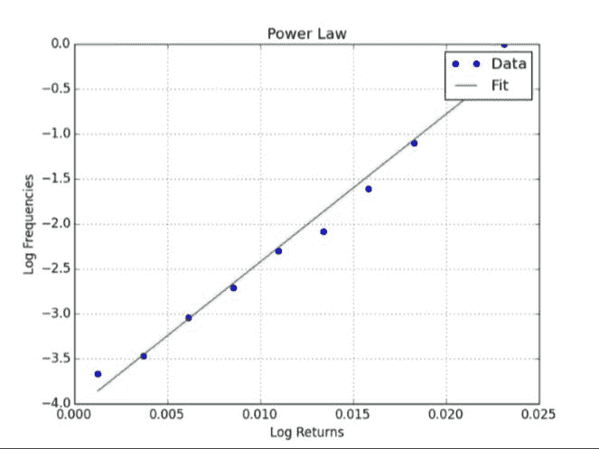
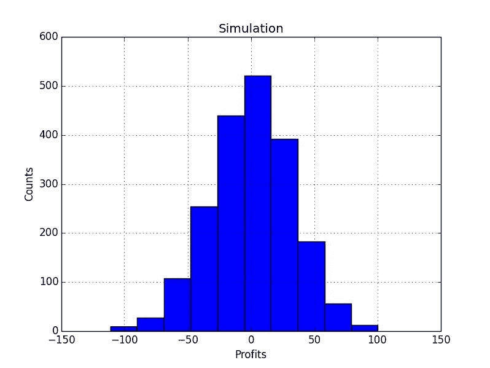

## 斐波那契数的第 n 项

```
# 来源：NumPy Cookbook 2e Ch3.1

import numpy as np

# 斐波那契数列的每个新项都由之前的两项相加而成
# 以 1 和 2 开始，前 10 项为：
# 1, 2, 3, 5, 8, 13, 21, 34, 55, 89, ...

# 斐波那契数列的通项公式为：
# fn = (phi ** n - (-phi) ** (-n)) / 5 ** 0.5
# 其中 phi 是黄金比例，phi = (1 + 5 ** 0.5) / 2

# 考虑一个斐波那契数列，每一项的值不超过四百万
# 求出值为偶数的项的和

# 1\. 计算 phi
phi = (1 + np.sqrt(5))/2 
print("Phi", phi)
# Phi 1.61803398875

# 2\. 寻找小于四百万的项的索引
n = np.log(4 * 10 ** 6 * np.sqrt(5) + 0.5)/np.log(phi) 
print(n)
# 33.2629480359

# 3\. 创建 1 ~ n 的数组
n = np.arange(1, n) 
print(n)

# 4\. 计算斐波那契数
fib = (phi**n - (-1/phi)**n)/np.sqrt(5) 
print("First 9 Fibonacci Numbers", fib[:9])
# First 9 Fibonacci Numbers [  1\.   1\.   2\.   3\.   5\.   8\.  13\.  21\.  34.] 

# 5\. 转换为整数（可选）
fib = fib.astype(int) 
print("Integers", fib)
'''
Integers [      1       1       2       3       5       8      13      21      34
  ... snip ... snip ...
  317811  514229  832040 1346269 2178309 3524578] 
'''

# 6\. 选择值为偶数的项
eventerms = fib[fib % 2 == 0] 
print(eventerms)
# [      2       8      34     144     610    2584   10946   46368  196418  832040 3524578]

# 7\. 求和
print(eventerms.sum())
# 4613732 
```

## 寻找质因数

```
# 来源：NumPy Cookbook 2e Ch3.2

from __future__ import print_function 
import numpy as np

# 13195 的质因数是 5, 7, 13 和 29
# 600851475143 的最大质因数是多少呢？

N = 600851475143 
LIM = 10 ** 6

def factor(n): 
    # 1\. 创建搜索范围的数组
    # a 是 sqrtn ~ sqrtn + lim - 1 的数组
    # 其中 sqrtn 是 n 平方根向上取整
    # lim 是 sqrtn 和 10e6 的较小值
    a = np.ceil(np.sqrt(n))   
    lim = min(n, LIM)   
    a = np.arange(a, a + lim)   
    b2 = a ** 2 - n

    # 2\. 检查 b 是否是平方数
    # modf 用于取小数部分
    fractions = np.modf(np.sqrt(b2))[0]

    # 3\. 寻找没有小数部分的地方
    # 这里的 b 为平方数
    # where 用于把布尔索引变成位置索引
    # 但是效果是一样的
    indices = np.where(fractions == 0)

    # 4\. 寻找 b 为平方数时，a 的值，并取出第一个
    a = np.ravel(np.take(a, indices))[0]
    # 或者 a = a[indices][0]

    # 求出 c 和 d
    a = int(a)   
    b = np.sqrt(a ** 2 - n)    
    b = int(b)   
    c = a + b   
    d = a - b

    # 到达终止条件则返回
    if c == 1 or d == 1:      
        return

    # 打印当前 c 和 d 并递归
    print(c, d)   
    factor(c)   
    factor(d)

factor(N)
'''
1234169 486847 
1471 839 
6857 71
''' 
```

## 寻找回文数

```
# 来源：NumPy Cookbook 2e Ch3.3

# 回文数正着读还是反着读都一样
# 由两个两位数的乘积构成的最大回文数是 9009 = 91 x 99
# 寻找两个三位数乘积构成的最大回文数

# 1\. 创建三位数的数组
a = np.arange(100, 1000) 
np.testing.assert_equal(100, a[0]) np.testing.assert_equal(999, a[-1])

# 2\. 创建两个数组中元素的乘积
# outer 计算数组的外积，也就是 a[i] x a[j] 的矩阵
# ravel 将其展开之后，就是每个元素乘积的数组了
numbers = np.outer(a, a) 
numbers = np.ravel(numbers) 
numbers.sort() 
np.testing.assert_equal(810000, len(numbers)) 
np.testing.assert_equal(10000, numbers[0]) 
np.testing.assert_equal(998001, numbers[-1])

#3\. 寻找最大的回文数
for number in numbers[::-1]:   
    s = str(numbers[i])
    if s == s[::-1]:
        print(s)     
        break 
```

## 稳态向量

```
# 来源：NumPy Cookbook 2e Ch3.4
# 稳态向量：状态转移矩阵中
# 特征值 1 对应的向量，满足 Ax = x

from __future__ import print_function 
from matplotlib.finance import quotes_historical_yahoo 
from datetime import date 
import numpy as np

# 获取 'AAPL' 股票近一年的收盘价
# quotes 是元组的列表，元组是每天的数据
# 结构为 [日期, 开盘价, 最高价, 最低价, 收盘价, 成交量]
today = date.today()
start = (today.year - 1, today.month, today.day)
quotes = quotes_historical_yahoo('AAPL', start, today) 
close =  [q[4] for q in quotes]

# 计算收盘价的状态，和前一天相比，上涨、下跌还是持平
# diff 求出相邻两项的差
# sign 取每个元素的符号
states = np.sign(np.diff(close))

# 创建状态转移矩阵
# SM[i, j] 表示 signs[i] 向 signs[j] 转移的概率
NDIM = 3 
SM = np.zeros((NDIM, NDIM))

# 状态列表为 [下跌, 持平, 上涨]
signs = [-1, 0, 1] 
k = 1

for i, signi in enumerate(signs):
    # 对于每一个 signi
    # 获取起始状态为 signi 的位置
    start_indices = np.where(states[:-1] == signi)[0] 

    # 求出 signi 的出现次数
    # 并加上一个常数用于去掉 0
    N = len(start_indices) + k * NDIM

    # 跳过出现次数为 0 的情况
    if N == 0:
        continue

    # 获取对应的结束状态
    end_values = states[start_indices + 1]

    for j, signj in enumerate(signs):
        # 对于每一个 signj
        # 获取起始状态为 signi 时，结束状态为 signj 的数量
        occurrences = len(end_values[end_values == signj])
        # 除以 signi 的出现次数就是概率
        SM[i][j] = (occurrences + k)/float(N)

print(SM)
'''
[[ 0.5047619   0.00952381  0.48571429] 
 [ 0.33333333  0.33333333  0.33333333] 
 [ 0.33774834  0.00662252  0.65562914]] 
'''

# 计算 SM 的特征值和特征向量
eig_out = np.linalg.eig(SM) 
print(eig_out)
'''
(array([ 1\.        ,  0.16709381,  0.32663057]), 
 array([[  5.77350269e-01,   7.31108409e-01,   7.90138877e-04],       
        [  5.77350269e-01,  -4.65117036e-01,  -9.99813147e-01],       
        [  5.77350269e-01,  -4.99145907e-01,   1.93144030e-02]])) 
'''

# 计算特征值 1 的下标
idx_vec = np.where(np.abs(eig_out[0] - 1) < 0.1) 
print("Index eigenvalue 1", idx_vec)
# Index eigenvalue 1 (array([0]),) 

# 特征值 1 对应的特征向量
x = eig_out[1][:,idx_vec].flatten()
print("Steady state vector", x) 
# Steady state vector [ 0.57735027  0.57735027  0.57735027]
print("Check", np.dot(SM, x))
# Check [ 0.57735027  0.57735027  0.57735027] 
```

## 探索幂率

```
# 来源：NumPy Cookbook 2e Ch3.5
# 幂律就是 y = c * x ** k 的函数关系

from matplotlib.finance import quotes_historical_yahoo 
from datetime import date 
import numpy as np 
import matplotlib.pyplot as plt

# 1\. 获取收盘价
today = date.today() 
start = (today.year - 1, today.month, today.day)
quotes = quotes_historical_yahoo('IBM', start, today) 
close =  np.array([q[4] for q in quotes])

# 2\. 获取正的对数收益 
logreturns = np.diff(np.log(close)) 
pos = logreturns[logreturns > 0]

# 3\. 获取收益频率
# histogram 默认将输入数据分为 10 个组
# 返回一个元组，第一项是每个组的频数
# 第二项是每个组的范围
counts, rets = np.histogram(pos) 
# 取每个组的中间值
rets = rets[:-1] + (rets[1] - rets[0])/2 

# 计算频数非 0 的位置
indices0 = np.where(counts != 0) 
# 过滤掉频数为 0 的数据点
counts = np.take(counts, indices0)[0] 
rets = np.take(rets, indices0)[0] 
# 计算对数周期
freqs = 1.0/counts 
freqs =  np.log(freqs)

# 4\. 将周期和收益拟合为直线
p = np.polyfit(rets,freqs, 1)

# 5\. 绘制结果
plt.title('Power Law') 
plt.plot(rets, freqs, 'o', label='Data') 
plt.plot(rets, p[0] * rets + p[1], label='Fit') 
plt.xlabel('Log Returns') 
plt.ylabel('Log Frequencies') 
plt.legend() 
plt.grid() 
plt.show()

# log(T) = k * log(R) + c
# T = exp(c) * R ** k
# 满足幂率关系 
```



## 收益的分布

```
# 来源：NumPy Cookbook 2e Ch3.6
from __future__ import print_function 
from matplotlib.finance 
import quotes_historical_yahoo 
from datetime import date 
import numpy as np 
import scipy.stats 
import matplotlib.pyplot as plt

#1\. 获取 AAPL 一年内的收盘价
today = date.today() 
start = (today.year - 1, today.month, today.day)

quotes = quotes_historical_yahoo('AAPL', start, today) 
close =  np.array([q[4] for q in quotes])

#2\. 计算对数收益
logreturns = np.diff(np.log(close))

#3\. 计算 breakout 和 pullback
# 我们每 50 天交易一次，所以频率是 0.02
# 我们的策略是低于一定百分比时买入
# 高于一定百分比时卖出
# scoreatpercentile 寻找百分位点
freq = 0.02 
breakout = scipy.stats.scoreatpercentile(logreturns, 100 * (1 - freq) ) 
pullback = scipy.stats.scoreatpercentile(logreturns, 100 * freq)

#4\. 生成买入和卖出
# compress(idx, arr) 相当于 arr[idx]
buys = np.compress(logreturns < pullback, close) 
sells = np.compress(logreturns > breakout, close) 
print(buys) 
# [  77.76375466   76.69249773  102.72        101.2          98.57      ] 
print(sells) 
# [ 74.95502967  76.55980292  74.13759123  80.93512599  98.22      ] 
print(len(buys), len(sells)) 
# 5 5 
print(sells.sum() - buys.sum())
# -52.1387025726 

#5\. 绘制对数收益的直方图
# 直接传入数据调用 hist 就可以
# 横轴是收益值，纵轴是频数
plt.title('Periodic Trading') 
plt.hist(logreturns) 
plt.grid() 
plt.xlabel('Log Returns') 
plt.ylabel('Counts') 
plt.show() 
```


## 模拟随机交易

```
# 来源：NumPy Cookbook 2e Ch3.7
from __future__ import print_function 
from matplotlib.finance import quotes_historical_yahoo 
from datetime import date 
import numpy as np 
import matplotlib.pyplot as plt

def get_indices(high, size):
    #2\. 获取 size 个 0 ~ high 之间的随机整数
    return np.random.randint(0, high, size)

#1\. 获取 AAPL 一年的收盘价
today = date.today() 
start = (today.year - 1, today.month, today.day)
quotes = quotes_historical_yahoo('AAPL', start, today) 
close =  np.array([q[4] for q in quotes])

# 模拟 2000 次
# 每次模拟中，买入 5 次，卖出 5 次
nbuys = 5 
N = 2000 
profits = np.zeros(N)

for i in xrange(N):   
    #3\. 模拟交易
    # np.take(arr, idx) 相当于 arr[idx]
    buys = np.take(close, get_indices(len(close), nbuys))   
    sells = np.take(close, get_indices(len(close), nbuys))   
    profits[i] = sells.sum() - buys.sum()

print("Mean", profits.mean()) 
print("Std", profits.std())

#4\. 绘制利润的直方图 
plt.title('Simulation') 
plt.hist(profits) 
plt.xlabel('Profits') 
plt.ylabel('Counts') 
plt.grid() 
plt.show() 
```



## 埃拉托色尼筛选法

```
# 来源：NumPy Cookbook 2e Ch3.8
# 埃拉托色尼筛选法是筛选质数的算法
# 它迭代地判断倍数来寻找质数
# 根据定义，倍数不是质数，可以忽略
from __future__ import print_function 
import numpy as np

LIM = 10 ** 6 
N = 10 ** 9 
P = 10001 
primes = [] 
p = 2

# 前六个质数为 2, 3, 5, 7, 11, 13，第六个是 13
# 那么第 10001 个呢？
def sieve_primes(a, p):
    #2\. 过滤掉 p 的倍数 
    a = a[a % p != 0]
    return a

#1\. 原理是创建以 3 开始的连续奇数数组
# （因为除了 2 的偶数都是合数）
# 每次取第一个元素，并过滤掉它的倍数
# 就能够得到质数数组
for i in xrange(3, N, LIM):
    a = np.arange(i, i + LIM, 2)

    while len(primes) < P:  
        a = sieve_primes(a, p)
        primes.append(p)
        p = a[0]

print(len(primes), primes[P-1]) 
```