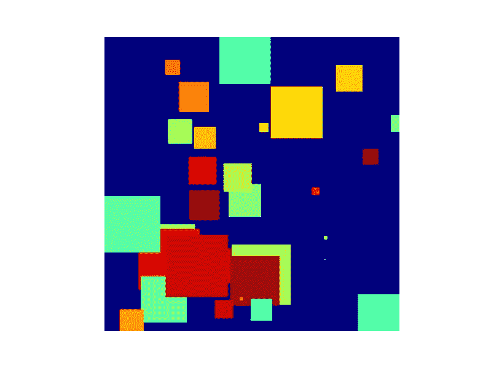
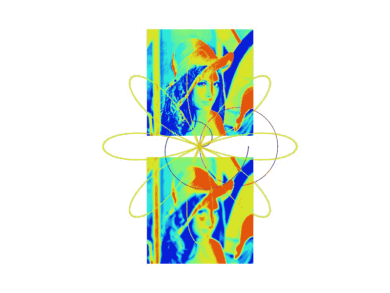
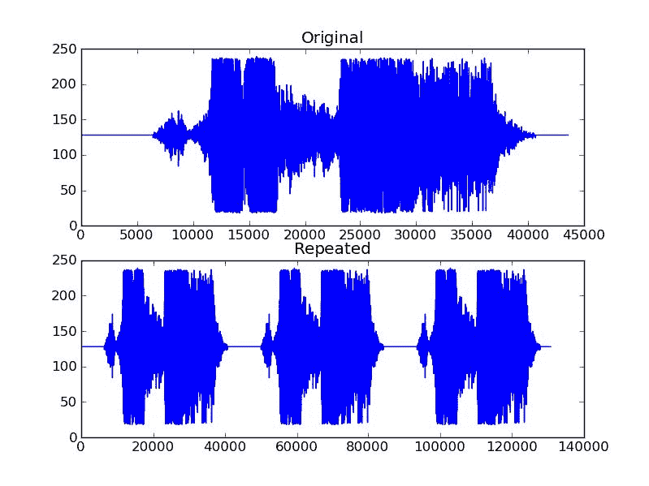
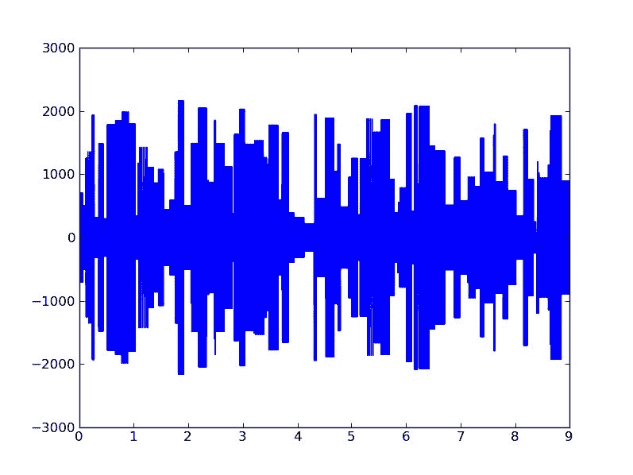
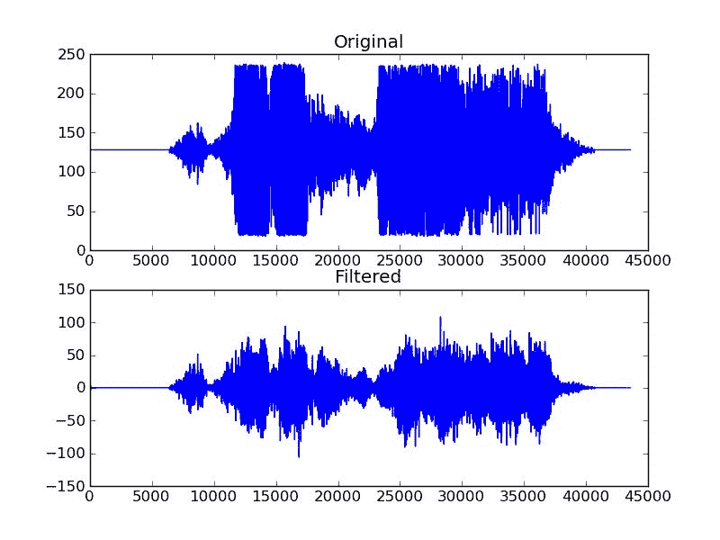

```
# 来源：NumPy Cookbook 2e Ch5 
```

## 将图像加载进内存

```
import numpy as np 
import matplotlib.pyplot as plt

# 首先生成一个 512x512 的图像
# 在里面画 30 个正方形
N = 512 
NSQUARES = 30

# 初始化
img = np.zeros((N, N), np.uint8) 
# 正方形的中心是 0 ~ N 的随机数
centers = np.random.random_integers(0, N, size=(NSQUARES, 2))
# 正方形的边长是 0 ~ N/9 的随机数
radii = np.random.randint(0, N/9, size=NSQUARES) 
# 颜色是 100 ~ 255 的随机数
colors = np.random.randint(100, 255, size=NSQUARES)

# 生成正方形
for i in xrange(NSQUARES):
    # 为每个正方形生成 x 和 y 坐标
    xindices = range(centers[i][0] - radii[i], centers[i][0]  + radii[i])   
    xindices = np.clip(xindices, 0, N - 1)   
    yindices = range(centers[i][1] - radii[i], centers[i][1]  + radii[i])   

    # clip 过滤范围之外的值
    # 相当于 yindices = yindices[(0 < yindices) & (yindices < N - 1)]
    yindices = np.clip(yindices, 0, N - 1)
    if len(xindices) == 0 or len(yindices) == 0:
        continue
    # 将 x 和 y 坐标转换成网格
    # 如果不转换成网格，只会给对角线着色
    coordinates = np.meshgrid(xindices, yindices)     
    img[coordinates] = colors[i]

# tofile 以二进制保存数组的内容，没有形状和类型信息 
img.tofile('random_squares.raw') 
# np.memmap 以二进制加载数组，如果类型不是 uint8，则需要执行
# 如果数组不是一维，还需要指定形状
img_memmap = np.memmap('random_squares.raw', shape=img.shape)

# 显示图像（会自动将灰度图映射为伪彩色）
plt.imshow(img_memmap) 
plt.axis('off') 
plt.show() 
```



## 组合图像

```
import numpy as np import 
matplotlib.pyplot as plt 
from scipy.misc import lena

ITERATIONS = 10 
lena = lena() 
SIZE = lena.shape[0] 
MAX_COLOR = 255. 
x_min, x_max = -2.5, 1 
y_min, y_max = -1, 1

# 数组初始化
x, y = np.meshgrid(np.linspace(x_min, x_max, SIZE),
                   np.linspace(y_min, y_max, SIZE)) 
c = x + 1j * y 
z = c.copy() 
fractal = np.zeros(z.shape, dtype=np.uint8) + MAX_COLOR 

# 生成 mandelbrot 图像 
for n in range(ITERATIONS):
    mask = np.abs(z) <= 4
    z[mask] = z[mask] ** 2 +  c[mask]
    fractal[(fractal == MAX_COLOR) & (-mask)] = (MAX_COLOR - 1) * n / ITERATIONS

# 绘制 mandelbrot 图像 
plt.subplot(211) 
plt.imshow(fractal) 
plt.title('Mandelbrot') 
plt.axis('off')

# 将 mandelbrot 和 lena 组合起来
plt.subplot(212) 
# choose 的作用是，如果 fractal 的元素小于 lena 的对应元素
# 就选择 fractal，否则选择 lena
# 相当于 np.fmin(fractal, lena)
plt.imshow(np.choose(fractal < lena, [fractal, lena])) 
plt.axis('off') 
plt.title('Mandelbrot + Lena')
plt.show() 
```


## 使图像变模糊

```
import numpy as np 
import matplotlib.pyplot as plt 
from random import choice 
import scipy 
import scipy.ndimage

# Initialization 
NFIGURES = 5 
k = np.random.random_integers(1, 5, NFIGURES) 
a = np.random.random_integers(1, 5, NFIGURES)
colors = ['b', 'g', 'r', 'c', 'm', 'y', 'k']

# 绘制原始 的 lena 图像
lena = scipy.misc.lena() 
plt.subplot(211) 
plt.imshow(lena) 
plt.axis('off')

# 绘制模糊的 lena 图像
plt.subplot(212) 
# 使用 sigma=4 的高斯过滤器
blurred = scipy.ndimage.gaussian_filter(lena, sigma=4)
plt.imshow(blurred) 
plt.axis('off')

# 在极坐标中绘图
# 极坐标无视 subplot
theta = np.linspace(0, k[0] * np.pi, 200) 
plt.polar(theta, np.sqrt(theta), choice(colors))

for i in xrange(1, NFIGURES):
    theta = np.linspace(0, k[i] * np.pi, 200)   
    plt.polar(theta, a[i] * np.cos(k[i] * theta), choice(colors))
plt.axis('off')
plt.show() 
```



## 重复声音片段

```
import scipy.io.wavfile 
import matplotlib.pyplot as plt 
import urllib2 
import numpy as np

# 下载音频文件
response = urllib2.urlopen('http://www.thesoundarchive.com/ austinpowers/smashingbaby.wav') 
print(response.info()) 

# 将文件写到磁盘
WAV_FILE = 'smashingbaby.wav' 
filehandle = open(WAV_FILE, 'w') 
filehandle.write(response.read()) 
filehandle.close() 

# 使用 SciPy 读取音频文件
sample_rate, data = scipy.io.wavfile.read(WAV_FILE) 
print("Data type", data.dtype, "Shape", data.shape)
# ('Data type', dtype('uint8'), 'Shape', (43584L,))

# 绘制原始音频文件
plt.subplot(2, 1, 1)
plt.title("Original") 
plt.plot(data)

# 绘制重复后的音频文件
plt.subplot(2, 1, 2)
# tile 用于重复数组
repeated = np.tile(data, 3)
plt.title("Repeated") 
plt.plot(repeated) 

# 保存重复后的音频文件
scipy.io.wavfile.write("repeated_yababy.wav", sample_rate, repeated)
plt.show() 
```



## 生成声音

```
# 声音可以表示为某个振幅、频率和初相的正弦波
# 如果我们把钢琴上的键编为 1 ~ 88，
# 那么它的频率就是 440 * 2 ** ((n - 49) / 12)
# 其中 n 是键的编号

import scipy.io.wavfile 
import numpy as np
import matplotlib.pyplot as plt

RATE = 44100 
DTYPE = np.int16

# 生成正弦波 
def generate(freq, amp, duration, phi): 
    t = np.linspace(0, duration, duration * RATE) 
    data = np.sin(2 * np.pi * freq * t + phi) * amp

    return data.astype(DTYPE)

# 初始化
# 弹奏 89 个音符
NTONES = 89 
# 振幅是 200 ~ 2000
amps = 2000. * np.random.random((NTONES,)) + 200. 
# 时长是 0.01 ~ 0.2
durations = 0.19 * np.random.random((NTONES,)) + 0.01 
# 键从 88 个中任取
keys = np.random.random_integers(1, 88, NTONES) 
# 频率使用上面的公式生成
freqs = 440.0 * 2 ** ((keys - 49.)/12.) 
# 初相是 0 ~ 2 * pi
phi = 2 * np.pi * np.random.random((NTONES,))

tone = np.array([], dtype=DTYPE)

for i in xrange(NTONES):   
    # 对于每个音符生成正弦波
    newtone = generate(freqs[i], amp=amps[i],  duration=durations[i], phi=phi[i])   
    # 附加到音频后面
    tone = np.concatenate((tone, newtone))

# 保存文件
scipy.io.wavfile.write('generated_tone.wav', RATE, tone)

# 绘制音频数据
plt.plot(np.linspace(0, len(tone)/RATE, len(tone)), tone) 
plt.show() 
```



## 设计音频滤波器

```
import scipy.io.wavfile 
import matplotlib.pyplot as plt 
import urllib2 
import numpy as np

# 下载音频文件
response = urllib2.urlopen('http://www.thesoundarchive.com/ austinpowers/smashingbaby.wav') 
print(response.info()) 

# 将文件写到磁盘
WAV_FILE = 'smashingbaby.wav' 
filehandle = open(WAV_FILE, 'w') 
filehandle.write(response.read()) 
filehandle.close() 

# 使用 SciPy 读取音频文件
sample_rate, data = scipy.io.wavfile.read(WAV_FILE) 
print("Data type", data.dtype, "Shape", data.shape)
# ('Data type', dtype('uint8'), 'Shape', (43584L,))

# 绘制原始音频文件
plt.subplot(2, 1, 1)
plt.title("Original") 
plt.plot(data)

# 设计滤波器，iirdesign 设计无限脉冲响应滤波器
# 参数依次是 0 ~ 1 的正则化频率、
# 最大损失、最低衰减和滤波类型
b,a = scipy.signal.iirdesign(wp=0.2, ws=0.1, gstop=60, gpass=1, ftype='butter')

# 传入刚才的返回值，使用 lfilter 函数来调用滤波器
filtered = scipy.signal.lfilter(b, a, data)

# 绘制滤波后的音频
plt.subplot(2, 1, 2) 
plt.title("Filtered") 
plt.plot(filtered)

# 保存滤波后的音频
scipy.io.wavfile.write('filtered.wav', sample_rate, filtered. astype(data.dtype))
plt.show() 
```



## Sobel 过滤器的边界检测

```
# Sobel 过滤器用于提取图像的边界
# 也就是将图像转换成线框图风格
import scipy 
import scipy.ndimage 
import matplotlib.pyplot as plt

# 导入 Lena
lena = scipy.misc.lena()

# 绘制 Lena（左上方）
plt.subplot(221) 
plt.imshow(lena) 
plt.title('Original') 
plt.axis('off')

# Sobel X 过滤器过滤后的图像（右上方）
sobelx = scipy.ndimage.sobel(lena, axis=0, mode='constant')
plt.subplot(222) 
plt.imshow(sobelx) 
plt.title('Sobel X') 
plt.axis('off')

# Sobel Y 过滤器过滤的图像（左下方） 
sobely = scipy.ndimage.sobel(lena, axis=1, mode='constant')
plt.subplot(223) 
plt.imshow(sobely) 
plt.title('Sobel Y') 
plt.axis('off')

# 默认的 Sobel 过滤器（右下方）
default = scipy.ndimage.sobel(lena)
plt.subplot(224) 
plt.imshow(default) 
plt.title('Default Filter') 
plt.axis('off')
plt.show() 
```

