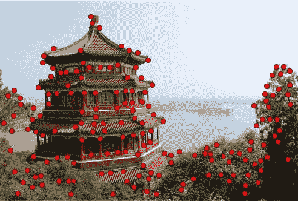
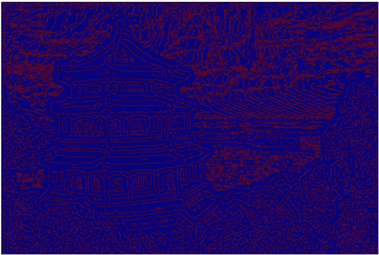

```
# 来源：NumPy Cookbook 2e Ch10 
```

## 加载示例数据集

```
from __future__ import print_function 
from sklearn import datasets

# datasets.load_? 用于加载不同的数据集
print filter(lambda s: s.startswith('load_'), dir(datasets))
'''
['load_boston', 'load_breast_cancer', 'load_diabetes', 'load_digits', 'load_files', 'load_iris', 'load_lfw_pairs', 'load_lfw_people', 'load_linnerud', 'load_mlcomp', 'load_sample_image', 'load_sample_images', 'load_svmlight_file', 'load_svmlight_files']
'''

# 这里加载波士顿房价数据集
# 波士顿房价数据集是连续模型
boston_prices = datasets.load_boston() 

# 对于离散型数据集来说，data 是属性，target 是标签
# 对于连续型数据集来说，data 是自变量，target 是因变量
# data 是二维数组，行为记录，列为属性/自变量
print("Data shape", boston_prices.data.shape) 
# Data shape (506, 13) 

print("Data max=%s min=%s" % (boston_prices.data.max(), boston_prices. data.min())) 
# Data max=711.0 min=0.0 

# target 是标签/因变量的一维数组
print("Target shape", boston_prices.target.shape) 
# Target shape (506,)

print("Target max=%s min=%s" % (boston_prices.target.max(), boston_ prices.target.min())) 
# Target max=50.0 min=5.0 
```

## 道琼斯股票聚类

```
# 2011 到 2012 
start = datetime.datetime(2011, 01, 01) 
end = datetime.datetime(2012, 01, 01)

# 这里是股票代码
symbols = ["AA", "AXP", "BA", "BAC", "CAT",
    "CSCO", "CVX", "DD", "DIS", "GE", "HD",
    "HPQ", "IBM", "INTC", "JNJ", "JPM",
    "KO", "MCD", "MMM", "MRK", "MSFT", "PFE",
    "PG", "T", "TRV", "UTX", "VZ", "WMT", "XOM"]

# 下载每只股票 2011 ~ 2012 的所有数据
quotes = []
for symbol in symbols:
    try:
        quotes.append(finance.quotes_historical_yahoo(symbol, start, end, asobject=True))
    except urllib2.HTTPError as e:
        print(symbol, e)

# 每只股票只取收盘价
close = np.array([q.close for q in quotes]).astype(np.float) 
print(close.shape) 
# (29, 252)

# 计算每只股票的对数收益
logreturns = np.diff(np.log(close)) 
print(logreturns.shape)
# (29, 251)

# 计算对数收益的平方和
logreturns_norms = np.sum(logreturns ** 2, axis=1)
# np.dot(logreturns, logreturns.T) 的矩阵
# 每项是 logret[i] · logret[j]
# logreturns_norms[:, np.newaxis]
# 每项是 sqsum[i]
# logreturns_norms[np. newaxis, :]
# 每项是 sqsum[j]
# S 的每一项就是 logret[i] 和 logret[j] 的欧氏距离
S = - logreturns_norms[:, np.newaxis] - logreturns_norms[np. newaxis, :] + 2 * np.dot(logreturns, logreturns.T)

# 使用 AP 算法进行聚类
# AffinityPropagation 用于创建聚类器
# 向 fit 传入距离矩阵可以对其聚类
# 用于聚类的属性是每个向量到其它向量的距离
aff_pro = sklearn.cluster.AffinityPropagation().fit(S)
# labels_ 获取聚类结果
labels = aff_pro.labels_
# 打印每只股票的类别
for symbol, label in zip(symbols, labels):
    print('%s in Cluster %d' % (symbol, label)) 
'''
AA in Cluster 0 
AXP in Cluster 6 
BA in Cluster 6 
BAC in Cluster 1 
CAT in Cluster 6 
CSCO in Cluster 2 
CVX in Cluster 7 
DD in Cluster 6 
DIS in Cluster 6 
GE in Cluster 6 
HD in Cluster 5 
HPQ in Cluster 3 
IBM in Cluster 5 
INTC in Cluster 6 
JNJ in Cluster 5 
JPM in Cluster 4 
KO in Cluster 5 
MCD in Cluster 5 
MMM in Cluster 6
MRK in Cluster 5 
MSFT in Cluster 5 
PFE in Cluster 7 
PG in Cluster 5 
T in Cluster 5 
TRV in Cluster 5 
UTX in Cluster 6 
VZ in Cluster 5 
WMT in Cluster 5 
XOM in Cluster 7 
```

# 使用 statsmodels 执行正态性测试

```
from __future__ import print_function 
import datetime 
import numpy as np 
from matplotlib import finance 
from statsmodels.stats.adnorm import normal_ad

# 下载 2011 到 2012 的收盘价数据
start = datetime.datetime(2011, 01, 01) 
end = datetime.datetime(2012, 01, 01)
quotes = finance.quotes_historical_yahoo('AAPL', start, end, asobject=True)
close = np.array(quotes.close).astype(np.float) 
print(close.shape)
# (252,) 

# 对对数收益执行正态性测试
# 也就是是否满足正态分布
# normal_ad 使用 Anderson-Darling 测试
# 请见 http://en.wikipedia.org/wiki/Anderson%E2%80%93Darling_test
print(normal_ad(np.diff(np.log(close))))
# (0.57103805516803163, 0.13725944999430437)
# p-value，也就是概率为 0.13 
```

## 角点检测

```
 from skimage.feature import corner_peaks 
from skimage.color import rgb2gray

# 加载示例图片（亭子那张）
dataset = load_sample_images() 
img = dataset.images[0] 

# 将 RGB 图像转成灰度
gray_img = rgb2gray(img) 

# 使用 Harris 角点检测器
# http://en.wikipedia.org/wiki/Corner_detection
harris_coords = corner_peaks(corner_harris(gray_img))
# harris_coords 第一列是 y，第二列是 x
y, x = np.transpose(harris_coords) 
plt.axis('off') 
# 绘制图像和角点
plt.imshow(img) 
plt.plot(x, y, 'ro') 
plt.show() 
```



## 边界检测

```
from sklearn.datasets import load_sample_images 
import matplotlib.pyplot as plt 
import skimage.feature

# 加载示例图片（亭子那张）
dataset = load_sample_images() 
img = dataset.images[0] 

# 使用 Canny 过滤器检测边界
# 基于高斯分布的标准差
# http://en.wikipedia.org/wiki/Edge_detection
edges = skimage.feature.canny(img[..., 0]) 

# 绘制图像
plt.axis('off') 
plt.imshow(edges) 
plt.show() 
```

