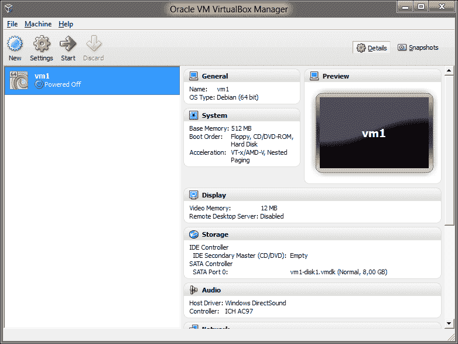

# 练习 0：起步

> 原文：[Exercise 0\. The Setup](https://archive.fo/ZfhWN)
> 
> 译者：[飞龙](https://github.com/wizardforcel)
> 
> 协议：[CC BY-NC-SA 4.0](http://creativecommons.org/licenses/by-nc-sa/4.0/)
> 
> 自豪地采用[谷歌翻译](https://translate.google.cn/)

## Windows，手动安装

[非常长的指南](https://archive.fo/p1ZHn)

## Windows，VirtualBox 虚拟机（`.ova`格式的预配置映像）

### 你需要什么

*   VitualBox，虚拟机播放器。
*   putty，终端模拟器。
*   预配置的 VirtualBox Debian 映像。

## 这样做

*   下载并安装 [VirtualBox](http://download.virtualbox.org/virtualbox/4.1.18/VirtualBox-4.1.18-78361-Win.exe)

*   下载并安装 [Putty](http://the.earth.li/~sgtatham/putty/latest/x86/putty-0.62-installer.exe)。

*   下载此文件：[https://docs.google.com/open?id=0Bw1iG1X4Li39ZlhkQmgtM1BhV2s](https://docs.google.com/open?id=0Bw1iG1X4Li39ZlhkQmgtM1BhV2s)

    另一个链接：[http://thepiratebay.se/search/vm1.ova/0/99/0](http://thepiratebay.se/search/vm1.ova/0/99/0)

    或另一个链接：[http://www.fileconvoy.com/dfl.php?id=g280b501145101ce4999185763996254d441643a34](http://www.fileconvoy.com/dfl.php?id=g280b501145101ce4999185763996254d441643a34)

    ```
    md5: 7ac8a6059460f7f3e39aee7c4ee2c230 
    sha256: 18d8f31d0894c89865d5306b0cb3284d8889e15d155c7435fc7888f3dbafa3ec
    ```

*   打开文件

    

*   点击`Import`

    

*   选择`vm1`并点击`Start`

    

*   等待`vm1`启动

    

*   启动`putty`，在`Host Name`或者`IP Address`中输入`localhost`。之后点击`Open`

    

*   输入`user1`, `<ENTER>`, `123qwe`, `<ENTER>`。

    

*   恭喜，你现在登入了`vm1`。

    

## Linux

你已经使用 Linux 了，你还需要什么嘛？开个玩笑。你可以严格遵循我的指南，或者随意在你的系统上做实验。

## Mac OS

以后我会在这里把步骤补上。

# 练习 1：文本编辑器，vim

> 原文：[Exercise 1\. Text Editor, The: vim](https://archive.fo/5vf0X)
> 
> 译者：[飞龙](https://github.com/wizardforcel)
> 
> 协议：[CC BY-NC-SA 4.0](http://creativecommons.org/licenses/by-nc-sa/4.0/)
> 
> 自豪地采用[谷歌翻译](https://translate.google.cn/)

在 Linux 中，就像任何类 Unix 操作系统，一切都只是文件。而 Unix 哲学指出，配置文件必须是人类可读和可编辑的。在几乎所有的情况下，它们只是纯文本。所以，首先，你必须学习如何编辑文本文件。

为此，我强烈建议你学习 vim 的基础知识，这是在 Linux 中处理文本的最强大的工具之一。Vim 是由 Bill Joy 于 1976 年编写的，[vi](http://en.wikipedia.org/wiki/Vi) 的重新实现。vi 实现了一个非常成功的概念，甚至 Microsoft Visual Studio 2012 有一个[插件](http://visualstudiogallery.msdn.microsoft.com/59ca71b3-a4a3-46ca-8fe1-0e90e3f79329/)，它提供了一个模式，与这个超过 35 岁的编辑器兼容。你可以在这里玩转它（[这是在浏览器中运行的真正的 Linux](https://bellard.org/jslinux/vm.html?url=https://bellard.org/jslinux/buildroot-x86.cfg)）。完成之后，最后获取我的虚拟机。

如果我还没成功说服你，你可以了解 [nano](http://www.howtogeek.com/howto/42980/the-beginners-guide-to-nano-the-linux-command-line-text-editor/)来代替。但至少要试试。

现在，登入`vm1`，之后键入：

```
vim hello.txt
```

你应该看到：

```
Hello, brave adventurer!
~
~
~
~
~
~
~
~
~
~
~
~
~
"hello.txt" [New File]      0,0-1         All
```

有一个笑话说，vim有两种模式 - “反复哔哔”和“破坏一切”。那么，如果你不知道如何使用 vim，这是非常真实的，因为 vim 是模态的文本编辑器。模式是：

*   普通模式：移动光标并执行删除，复制和粘贴等文本操作。
*   插入模式：输入文本。

> 译者注：还有一个命令模式，用于生成真 · 随机字符串（笑）。

这十分使新手头疼，因为他们试图尽可能地避免普通模式。那么这是错误的，所以现在我将给你正确的大纲来使用 vim ：

```
start vim
while editing is not finished, repeat
    navigate to desired position in NORMAL mode
    enter INSERT mode by pressing i
        type text
    exit INSERT mode by pressing <ESCAPE>
when editing is finished, type :wq
```

最重要的是，几乎任何时候都呆在普通模式，短时间内进入插入模式，然后立即退出。以这种方式，vim 只有一种模式，而这种模式是普通模式。

现在让我们试试吧。记住，按`i`进入插入模式，以及`<ESCAPE>` 返回到普通模式。键入以下内容（在每行末尾按`<ENTER>`）：

```
iRoses are red
Linux is scary
<ESCAPE>
```

这是你应该看到的：

```
Roses are red
Linux is scary
~
~
~
~
~
~
~
~
~
~
~
~
~
                            4,17          All
```

现在我给你命令列表，在普通模式下移动光标：

*   `h` - 向左移动
*   `j` - 向下移动
*   `k` - 向上移动
*   `l` - 右移
*   `i` - 进入插入模式
*   `o` - 在光标下插入一行并进入插入模式
*   `<ESCAPE>` - 退出插入模式
*   `x` - 删除光标下的符号
*   `dd` - 删除一行
*   `:wq` - 将更改写入文件并退出。是的，没错，这是一个冒号，后面跟着`wq`和`<ENTER>`。
*   `:q!` - 不要对文件进行更改并退出。

那就够了。现在，将光标放在第一行并输入：

```
oViolets are blue<ESCAPE>
```

之后，将光标放在`Linux is scary`那一行，并输入：

```
oBut I'm scary too<ESCAPE>
```

你应该看到：

```
Roses are red
Violets are blue
Linux is scary
But I'm scary too
~
~
~
~
~
~
~
~
~
~
~
                            4,17          All
```

现在键入`:wq`保存文件，并退出。你应该看到：

```
Violets are blue
Linux is scary
But I'm scary too
~
~
~
~
~
~
~
~
~
~
~
"hello.txt" 4L, 64C written
user1@vm1:~$
```

好的。你做到它了。你刚刚在 vim 中编辑了文本文件，很好很强大！

## 附加题

*   通过键入键入`vim hello.txt`再次启动 vim，并尝试我给你的一些命令。
*   玩这个游戏，它会让你更熟悉 vim：[http://vim-adventures.com/](http://vim-adventures.com/)

# 练习 2：文本浏览器，少即是多

> 原文：[Exercise 2\. Text Viewer, The: less is More](https://archive.fo/nFH4J)
> 
> 译者：[飞龙](https://github.com/wizardforcel)
> 
> 协议：[CC BY-NC-SA 4.0](http://creativecommons.org/licenses/by-nc-sa/4.0/)
> 
> 自豪地采用[谷歌翻译](https://translate.google.cn/)

现在你可以编辑文本文件，这很好。但是如果你只想查看一个文本文件呢？当然，你可以使用 vim，但很多时候它是过度的。还有两件事要考虑：

*   如果你想查看非常大的文件，你将需要在尽可能快的程序中查看它。
*   通常你不想意外地改变文件中的某些东西。

所以，我向你介绍强大的`less`，少即是多。“比什么多呢？”你可能会问。嗯…有一次，有一个被称为`more`的浏览器。它很简单，只是向你显示你要求它显示的文本文件。它是如此简单，只能以一个方向显示文本文件，也就是向前。 马克·恩德尔曼（Mark Nudelman）发现它并不那么令人满意 ，1983 年至 1985 年，他编写了`less`。从那以后，它拥有了许多先进的功能。因为它比`more`更先进，一句话就诞生了：“少即是多，多即是少”。

好吧，让我们试试吧。

输入：

```
less .bashrc
```

你应该看到：

```
user1@vm1:~$ less .bashrc
# ~/.bashrc: executed by bash(1) for non-login shells.
# see /usr/share/doc/bash/examples/startup-files (in the package bash-doc)
# for examples

# If not running interactively, don't do anything
[ -z "$PS1" ] && return

# don't put duplicate lines in the history. See bash(1) for more options
# don't overwrite GNU Midnight Commander's setting of `ignorespace'.
HISTCONTROL=$HISTCONTROL${HISTCONTROL+:}ignoredups
.bashrc
```

如果你的终端不是足够宽，文本将看起来像一团糟，因为它放不下整行。要修复它，请键入`- -ch<ENTER><ENTER>`。是的，`dash-dash-ch-ENTER-ENTER`。这将开启水平滚动。

为了向上向下文浏览文字，使用已经熟悉的`j`和`k`。退出按`q`。

现在我将向你展示`less`的高级功能，这样你只能看到所需的那些行。键入`&enable<ENTER>`。你应该看到这个：

```
# enable color support of ls and also add hand
# enable programmable completion features (you
# this, if it's already enabled in /etc/bash.b
~
~
~
~
~
~
~
~
~
~
~
~
& (END)
```

注意看！为了移除过滤器，只需键入`&<ENTER>`。同样，要记住的命令：

*   `j` - 向上移动
*   `k` - 向下移动
*   `q` - 退出`less`。
*   `- -chop-long-lines或`- -ch` - 开启水平滚动。
*   `/` - 搜索。
*   `&something` - 只显示文件中包含某些内容的行。

## 附加题

*   Linux 具有在线手册，通过键入`man`来调用。默认情况下，在我们的系统中，本手册将使用`less`来查看。 键入`man man`并阅读，然后退出。
*   就是这样，没有更多的附加题了。

# 练习 3：Bash：Shell、`.profile`、`.bashrc`、`.bash_history`。

> 原文：[Exercise 3\. Bash: The shell, .profile, .bashrc, .bash_history](https://archive.fo/DKP67)
> 
> 译者：[飞龙](https://github.com/wizardforcel)
> 
> 协议：[CC BY-NC-SA 4.0](http://creativecommons.org/licenses/by-nc-sa/4.0/)
> 
> 自豪地采用[谷歌翻译](https://translate.google.cn/)

当使用 CLI（命令行界面）来使用 Linux 时，你正在与一个名为 shell 的程序进行交互。所有你输入的都传递给 shell，它解释你输入的内容，执行参数扩展（这有点类似于代数中的花括号扩展），并为你执行程序。我们将使用的 Shell 称为 Bash，它代表 Bourne Again Shell，而 Bourne Again Shell 又是一个双关语。现在我将使用纯中文，向大家介绍一下 bash 的工作方式：

*   你

    *   登入 Linux 虚拟机
    *   你的身份由用户名（`user1`）和密码（`123qwe`）确定。
    *   Bash 执行了。
*   Bash

    *   从你的配置中读取并执行首个命令，它定义了：

        *   命令提示符是什么样子
        *   使用 Linux 时，你会看到什么颜色
        *   你的编辑器是什么
        *   你的浏览器是什么
        *   …
    *   读取首个命令后，Bash 进入循环

        *   没有通过输入`exit`或者按下`<CTRL+D>`，来要求退出的时候：

            *   读取一行
            *   解析这一行，扩展花括号
            *   使用扩展参数执行命令

我重复一下，你输入的任何命令都不会直接执行，而是首先扩展，然后执行。例如，当你输入`ls *`时，星号`*`将扩展为当前目录中所有文件的列表。

现在你将学习如何修改你的配置，以及如何编写和查看你的历史记录。

## 这样做

```
 1: ls -al
 2: cat .profile
 3: echo Hello, $LOGNAME!
 4: cp -v .profile .profile.bak
 5: echo 'echo Hello, $LOGNAME!' >> .profile
 6: tail -n 5 .profile
 7: history -w
 8: ls -altr
 9: cat .bash_history
10: exit
```

## 你会看到什么

```
user1@vm1's password:
Linux vm1 2.6.32-5-amd64 #1 SMP Sun May 6 04:00:17 UTC 2012 x86_64

The programs included with the Debian GNU/Linux system are free software;
the exact distribution terms for each program are described in the
individual files in /usr/share/doc/*/copyright.

Debian GNU/Linux comes with ABSOLUTELY NO WARRANTY, to the extent
permitted by applicable law.
Last login: Thu Jun  7 12:03:29 2012 from sis.site
Hello, user1!
user1@vm1:~$ ls -al
total 20
drwxr-xr-x 2 user1 user1 4096 Jun  7 12:18 .
drwxr-xr-x 3 root  root  4096 Jun  6 21:49 ..
-rw-r--r-- 1 user1 user1  220 Jun  6 21:48 .bash_logout
-rw-r--r-- 1 user1 user1 3184 Jun  6 21:48 .bashrc
-rw-r--r-- 1 user1 user1  697 Jun  7 12:04 .profile
user1@vm1:~$ cat .profile
# ~/.profile: executed by the command interpreter for login shells.
# This file is not read by bash(1), if ~/.bash_profile or ~/.bash_login
# exists.
# see /usr/share/doc/bash/examples/startup-files for examples.
# the files are located in the bash-doc package.

# the default umask is set in /etc/profile; for setting the umask
# for ssh logins, install and configure the libpam-umask package.
#umask 022

# if running bash
if [ -n "$BASH_VERSION" ]; then
    # include .bashrc if it exists
    if [ -f "$HOME/.bashrc" ]; then
        . "$HOME/.bashrc"
    fi
fi

# set PATH so it includes user's private bin if it exists
if [ -d "$HOME/bin" ] ; then
    PATH="$HOME/bin:$PATH"
fi
echo Hello, $LOGNAME!
user1@vm1:~$ echo Hello, $LOGNAME!
Hello, user1!
user1@vm1:~$ cp -v .profile .profile.bak
`.profile' -> `.profile.bak'
user1@vm1:~$ echo 'echo Hello, $LOGNAME!' >> .profile
user1@vm1:~$ tail -n 5 .profile
# set PATH so it includes user's private bin if it exists
if [ -d "$HOME/bin" ] ; then
    PATH="$HOME/bin:$PATH"
fi
echo Hello, $LOGNAME!
user1@vm1:~$ history -w
user1@vm1:~$ ls -altr
total 28
-rw-r--r-- 1 user1 user1 3184 Jun  6 21:48 .bashrc
-rw-r--r-- 1 user1 user1  220 Jun  6 21:48 .bash_logout
drwxr-xr-x 3 root  root  4096 Jun  6 21:49 ..
-rw-r--r-- 1 user1 user1  741 Jun  7 12:19 .profile.bak
-rw------- 1 user1 user1  308 Jun  7 12:21 .bash_history
-rw-r--r-- 1 user1 user1  697 Jun  7 12:25 .profile
drwxr-xr-x 2 user1 user1 4096 Jun  7 12:25 .
user1@vm1:~$ cat .bash_history
ls -al
cat .profile
echo Hello, $LOGNAME!
cp -v .profile .profile.bak
echo 'echo Hello, $LOGNAME!' >> .profile
tail -n 5 .profile
history -w
ls -altr
user1@vm1:~$ exit
logout
```

不要害怕，所有命令都会解释。行号对应“现在输入它”的部分。

## 解释

1.  打印当前目录中的所有文件，包括隐藏的文件。选项`-al`告诉`ls` 以`long`格式打印文件列表，并包括所有文件，包括隐藏文件。`.profile`和`.bash_rc`是隐藏文件，因为它们以点`.`开头。以点开头的每个文件都是隐藏的，这很简单。这两个特殊文件是 shell 脚本，它们包含登录时执行的指令。

2.  打印出你的`.profile`文件。只是这样。

3.  告诉你的 shell，你这里是 bash，输出一个字符串`Hello, $LOGNAME!`，用环境变量``$LOGNAME`替换$LOGNAME`，它包含你的登录名。

4.  将`.profile`文件复制到`.profile.bak`。选项`-v`让`cp`详细输出，这意味着它会打印所有的操作。记住这个选项，它通常用于让命令给你提供比默认更多的信息。

5.  在`.bash_rc`配置文件中添加一行。从现在开始，每次登录到`vm1`时， 都将执行该命令。注意，`>>`代表向文件添加了一些东西，但`>`意味着使用一些东西来替换文件。如果你不小心替换了`.profile`而不是向它添加，则命令

    ```
    cp -v .profile.bak .profile
    ```

    会向你返回旧的`.profile`文件。

6.  从`.profile`文件中精确打印出最后 5 行。

7.  将所有命令历史写入`.bash_history`文件。通常这是在会话结束时完成的，当你通过键入`exit`或按`<CTRL> + D`关闭它。

8.  打印当前目录中的文件。选项`-tr`表示文件列表按时间反向排序。这意味着最近创建和修改的文件最后打印。注意你现在有两个新的文件。

9.  打印出保存命令历史记录的文件。注意你所有的输入都在这里。

10.  关闭会话

## 附加题

*   在线搜索为什么`ls -al`告诉你“总共 20”，但是只有 5 个文件存在。 这是什么意思？ 请注意，`.`和`..`是特殊文件条目，分别对应于当前目录和父目录的。

*   登录`vm1`并键入`man -K /etc/profile`，现在使用光标键滚动到`INVOCATION`部分并阅读它。 要退出`man`，请键入`q`。 键入`man man`来找出`man -K`选项的含义。

*   在命令之前键入`uname`与空格。 现在，键入`history`。 看到了吗？如果你将空格放到命令前面，则不会将其保存在历史记录中！提示：当你需要在命令行上指定密码时，很实用。

*   找到 bash 的 wiki 页面，并尝试阅读它。不用担心，如果它吓到你，只需要省略可怕的部分。