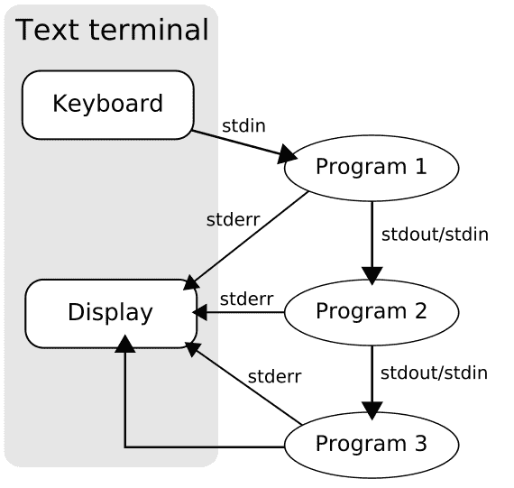

# 练习 8：更多的重定向和过滤：`head`，`tail`，`awk`，`grep`，`sed`

> 原文：[Exercise 8\. Bash: more on redirection and filtering: head, tail, awk, grep, sed](https://archive.fo/JH46V)
> 
> 译者：[飞龙](https://github.com/wizardforcel)
> 
> 协议：[CC BY-NC-SA 4.0](http://creativecommons.org/licenses/by-nc-sa/4.0/)
> 
> 自豪地采用[谷歌翻译](https://translate.google.cn/)

现在你试过了 Linux，我会介绍一下 Unix 的方式。注意看。

> 这就是 Unix 的哲学：写一些程序，只做一件事，并且把它做好。编写程序，使其一起工作。编写程序来处理文本流，因为这是一个通用接口。

实际上这意味着为了熟练使用 Linux，你需要知道如何从一个程序中获取输出，并将其提供给另一个程序，通常会在此过程中修改它。通常，你可以通过使用管道，将多个程序合并在一起，它允许将一个程序的输出连接到另一个程序。像这样：



这里发生的事情真的很简单。几乎每个 Linux 程序在启动时打开这三个文件：

`stdin` - 标准输入。这是程序读取东西的地方。
`stdout` - 标准输出。这是程序写出东西的地方。
`stderr` - 标准错误。这是程序报错的地方。

这就是它的读取方式：

```
启动程序 1 
    开始从键盘读取数据
    开始向显示器写出错误
    启动程序 2 
        开始从程序 1 读取输入
        开始向显示器写出错误
        启动程序 3 
            开始从程序 2 读取输入
            开始向显示器写出错误
            开始向显示器写出数据
```

还有另一种方式来描绘发生的事情，如果你喜欢 South Park 风格的幽默，但要小心：看到的是不会是不可见的！[警告！你无法忽略它](http://osxdaily.com/wp-content/uploads/2011/04/south-park-human-centipad.jpg)。

让我们考虑以下管道，它接受`ls -al`的输出，仅打印文件名和文件修改时间：

```
ls -al | tr -s ' ' | cut -d ' ' -f 8,9
```

这是所发生事情的概述：

```
启动 ls -al
    获取当前目录中的文件列表
    向显示器写出错误
    向管道写出输出
    启动 tr -s ' '
        通过管道从 ls -al 读取输入
        两个字段之间只保留一个空格
        向显示器写出错误
        向管道写出输出
        启动 cut -d ' ' -f 8,9
            通过管道从 tr -s ' ' 读取输入
            只保留字段 8 和 9，扔掉其它东西
            向显示器写出错误
            向显示器写出输出
```

更详细地说，这是每一步发生的事情：

第一步：`ls -al`，我们获取了目录列表，每一列都叫做字段。

```
user1@vm1:~$ ls -al
total 52
drwxr-xr-x 2 user1 user1 4096 Jun 18 14:16 .
drwxr-xr-x 3 root  root  4096 Jun  6 21:49 ..
-rw------- 1 user1 user1 4865 Jun 15 19:34 .bash_history
-rw-r--r-- 1 user1 user1  220 Jun  6 21:48 .bash_logout
-rw-r--r-- 1 user1 user1 3184 Jun 14 12:24 .bashrc
-rw-r--r-- 1 user1 user1   64 Jun 18 14:16 hello.txt
-rw------- 1 user1 user1   89 Jun 18 16:26 .lesshst
-rw-r--r-- 1 user1 user1  634 Jun 15 20:03 ls.out
-rw-r--r-- 1 user1 user1  697 Jun  7 12:25 .profile
-rw-r--r-- 1 user1 user1  741 Jun  7 12:19 .profile.bak
-rw-r--r-- 1 user1 user1  741 Jun  7 13:12 .profile.bak1
-rw------- 1 user1 user1  666 Jun 18 14:16 .viminfo
```

第二步：`ls -al | tr -s ' '`，我们在两个字段之间只保留，因为`cut`不能将多个空格理解为一种方式，来分离多个字段。

```
user1@vm1:~$ ls -al | tr -s ' '
total 52
drwxr-xr-x 2 user1 user1 4096 Jun 18 14:16 .
drwxr-xr-x 3 root root 4096 Jun 6 21:49 ..
-rw------- 1 user1 user1 4865 Jun 15 19:34 .bash_history
-rw-r--r-- 1 user1 user1 220 Jun 6 21:48 .bash_logout
-rw-r--r-- 1 user1 user1 3184 Jun 14 12:24 .bashrc
-rw-r--r-- 1 user1 user1 64 Jun 18 14:16 hello.txt
-rw------- 1 user1 user1 89 Jun 18 16:26 .lesshst
-rw-r--r-- 1 user1 user1 634 Jun 15 20:03 ls.out
-rw-r--r-- 1 user1 user1 697 Jun 7 12:25 .profile
-rw-r--r-- 1 user1 user1 741 Jun 7 12:19 .profile.bak
-rw-r--r-- 1 user1 user1 741 Jun 7 13:12 .profile.bak1
-rw------- 1 user1 user1 666 Jun 18 14:16 .viminfo
```

第三步：我们只保留字段 8 和 9，它们是我们想要的。

```
user1@vm1:~$ ls -al | tr -s ' ' | cut -d ' ' -f 8,9

14:16 .
21:49 ..
19:34 .bash_history
21:48 .bash_logout
12:24 .bashrc
14:16 hello.txt
16:26 .lesshst
20:03 ls.out
12:25 .profile
12:19 .profile.bak
13:12 .profile.bak1
14:16 .viminfo
```

现在你学到了，如何从一个程序获取输入，并将其传给另一个程序，并且如何转换它。

## 这样做

```
 1: ls -al | head -n 5
 2: ls -al | tail -n 5
 3: ls -al | awk '{print $8, $9}'
 4: ls -al | awk '{print $9, $8}'
 5: ls -al | awk '{printf "%-20.20s %s\n",$9, $8}'
 6: ls -al | grep bash
 7: ls -al > ls.out
 8: cat ls.out
 9: cat ls.out | sed  's/bash/I replace this!!!/g'
```

### 你会看到什么

```
user1@vm1:~$ ls -al | head -n 5
total 52
drwxr-xr-x 2 user1 user1 4096 Jun 18 14:16 .
drwxr-xr-x 3 root  root  4096 Jun  6 21:49 ..
-rw------- 1 user1 user1 4865 Jun 15 19:34 .bash_history
-rw-r--r-- 1 user1 user1  220 Jun  6 21:48 .bash_logout
user1@vm1:~$ ls -al | tail -n 5
-rw-r--r-- 1 user1 user1  636 Jun 18 17:52 ls.out
-rw-r--r-- 1 user1 user1  697 Jun  7 12:25 .profile
-rw-r--r-- 1 user1 user1  741 Jun  7 12:19 .profile.bak
-rw-r--r-- 1 user1 user1  741 Jun  7 13:12 .profile.bak1
-rw------- 1 user1 user1  666 Jun 18 14:16 .viminfo
user1@vm1:~$ ls -al | awk '{print $8, $9}'

14:16 .
21:49 ..
19:34 .bash_history
21:48 .bash_logout
12:24 .bashrc
14:16 hello.txt
16:26 .lesshst
17:52 ls.out
12:25 .profile
12:19 .profile.bak
13:12 .profile.bak1
14:16 .viminfo
user1@vm1:~$ ls -al | awk '{print $9, $8}'

. 14:16
.. 21:49
.bash_history 19:34
.bash_logout 21:48
.bashrc 12:24
hello.txt 14:16
.lesshst 16:26
ls.out 17:52
.profile 12:25
.profile.bak 12:19
.profile.bak1 13:12
.viminfo 14:16

user1@vm1:~$ ls -al | awk '{printf "%-20.20s %s\n",$9, $8}'

.                    14:16
..                   21:49
.bash_history        19:34
.bash_logout         21:48
.bashrc              12:24
hello.txt            14:16
.lesshst             16:26
ls.out               17:52
.profile             12:25
.profile.bak         12:19
.profile.bak1        13:12
.viminfo             14:16
user1@vm1:~$ ls -al | grep bash
-rw------- 1 user1 user1 4865 Jun 15 19:34 .bash_history
-rw-r--r-- 1 user1 user1  220 Jun  6 21:48 .bash_logout
-rw-r--r-- 1 user1 user1 3184 Jun 14 12:24 .bashrc
user1@vm1:~$ ls -al > ls.out
user1@vm1:~$ cat ls.out
total 48
drwxr-xr-x 2 user1 user1 4096 Jun 18 14:16 .
drwxr-xr-x 3 root  root  4096 Jun  6 21:49 ..
-rw------- 1 user1 user1 4865 Jun 15 19:34 .bash_history
-rw-r--r-- 1 user1 user1  220 Jun  6 21:48 .bash_logout
-rw-r--r-- 1 user1 user1 3184 Jun 14 12:24 .bashrc
-rw-r--r-- 1 user1 user1   64 Jun 18 14:16 hello.txt
-rw------- 1 user1 user1   89 Jun 18 16:26 .lesshst
-rw-r--r-- 1 user1 user1    0 Jun 18 17:53 ls.out
-rw-r--r-- 1 user1 user1  697 Jun  7 12:25 .profile
-rw-r--r-- 1 user1 user1  741 Jun  7 12:19 .profile.bak
-rw-r--r-- 1 user1 user1  741 Jun  7 13:12 .profile.bak1
-rw------- 1 user1 user1  666 Jun 18 14:16 .viminfo
user1@vm1:~$ cat ls.out | sed  's/bash/I replace this!!!/g'
total 48
drwxr-xr-x 2 user1 user1 4096 Jun 18 14:16 .
drwxr-xr-x 3 root  root  4096 Jun  6 21:49 ..
-rw------- 1 user1 user1 4865 Jun 15 19:34 .I replace this!!!_history
-rw-r--r-- 1 user1 user1  220 Jun  6 21:48 .I replace this!!!_logout
-rw-r--r-- 1 user1 user1 3184 Jun 14 12:24 .I replace this!!!rc
-rw-r--r-- 1 user1 user1   64 Jun 18 14:16 hello.txt
-rw------- 1 user1 user1   89 Jun 18 16:26 .lesshst
-rw-r--r-- 1 user1 user1    0 Jun 18 17:53 ls.out
-rw-r--r-- 1 user1 user1  697 Jun  7 12:25 .profile
-rw-r--r-- 1 user1 user1  741 Jun  7 12:19 .profile.bak
-rw-r--r-- 1 user1 user1  741 Jun  7 13:12 .profile.bak1
-rw------- 1 user1 user1  666 Jun 18 14:16 .viminfo
```

## 解释

*   只打印目录列表中的前 5 个条目。
*   只打印目录列表中的后 5 个条目。
*   只打印修改时间和文件名。注意我如何使用`awk`，这比`cut`更聪明。这里的区别就是，`cut`只能将单个符号（我们这里是空格）理解为一种方式，来分离字段（字段分隔符），`awk`将任意数量的空格和 TAB 看做文件分隔符，所以没有必要使用`tr`来消除不必要的空格。
*   按此顺序打印文件名和修改时间。这又是`cat`不能做的事情。
*   工整地打印文件名和修改时间。注意现在输出如何变得更清晰。
*   仅打印目录列表中包含`bash`的行。
*   将目录列表的输出写入文件`ls.out`。
*   打印出`ls.out`。`cat`是最简单的可用程序，允许你打印出一个文件，没有更多了。尽管如此简单，但在构建复杂管道时非常有用。
*   打印出`ls.out`，将所有的`bash`条目替换为`I replace this!!!`。`sed`是一个强大的流编辑器，它非常非常非常有用。

## 附加题

*   打开`head`，`tail`，`awk`， `grep`和`sed`的手册页。不要害怕，只要记住手册页面总是在那里。有了一些实践，你将能够实际了解他们。
*   查找`grep`选项，能够打印它找到的那行之前，或之后的一行。
*   使用 Google 搜索`awk printf`命令，尝试了解它如何工作。
*   阅读 [The Useless Use of Cat Award](https://archive.fo/9Zcyu)。尝试那里的一些例子。

# 练习 9：Bash：任务控制，`jobs`，`fg`

> 原文：[Exercise 9\. Bash: job control, jobs, fg](https://archive.fo/z1oWk)
> 
> 译者：[飞龙](https://github.com/wizardforcel)
> 
> 协议：[CC BY-NC-SA 4.0](http://creativecommons.org/licenses/by-nc-sa/4.0/)
> 
> 自豪地采用[谷歌翻译](https://translate.google.cn/)

Linux是一个[多任务](http://en.wikipedia.org/wiki/Computer_multitasking)操作系统。这意味着有许多程序同时运行。从用户的角度来看，这意味着你可以同时运行几个程序，而且 bash 肯定有工具，为你控制多个任务的执行。为了能够使用此功能，你需要学习以下命令：

*   `<CTRL> + z` - 将当前运行的程序放在后台。
*   `jobs` - 列出所有后台程序。
*   `fg` - 把程序带到前台。`fg`接受一个数字作为参数，它可以从`jobs`中获取数，或者如果无参数调用，则将最后一个挂起的程序带到前台。
*   `ctrl + c` - 一次性停止执行当前运行的程序。虽然我不会在这个练习中使用它，但我必须说，这可能是非常有用的。

现在，你将学习如何使用 bash 内置的工具来控制程序的执行。

## 这样做

```
 1: less -S .profile
 2: <CTRL+z>
 3: less -S .bashrc
 4: <CTRL+z>
 5: less -S .bash_history
 6: <CTRL+z>
 7: jobs
 8: fg
 9: q
10: fg
11: q
12: fg
13: q
14: fg
15: jobs
```

## 你会看到什么

```
user1@vm1:~$ less -S .profile
# exists.
# see /usr/share/doc/bash/examples/startup-files for
# the files are located in the bash-doc package.

# the default umask is set in /etc/profile; for setti
# for ssh logins, install and configure the libpam-um
#umask 022

# if running bash
if [ -n "$BASH_VERSION" ]; then
    # include .bashrc if it exists
    if [ -f "$HOME/.bashrc" ]; then
        . "$HOME/.bashrc"

[1]+  Stopped                 less -S .profile
user1@vm1:~$ less -S .bashrc
# for examples

# If not running interactively, don't do anything
[ -z "$PS1" ] && return

# don't put duplicate lines in the history. See bash(
# don't overwrite GNU Midnight Commander's setting of
HISTCONTROL=$HISTCONTROL${HISTCONTROL+:}ignoredups
# ... or force ignoredups and ignorespace
HISTCONTROL=ignoreboth

# append to the history file, don't overwrite it
shopt -s histappend

[2]+  Stopped                 less -S .bashrc
user1@vm1:~$ less -S .bash_history
echo Hello, $LOGNAME!
echo 'echo Hello, $LOGNAME!' >> .profile
cp .profile .profile.bak
tail .profile
ls -altr
history -w
ls -al
cat .profile
echo Hello, $LOGNAME!
echo 'echo Hello, $LOGNAME!' >> .profile
cp .profile .profile.bak
tail .profile
ls -altr

[3]+  Stopped                 less -S .bash_history
user1@vm1:~$ jobs
[1]   Stopped                 less -S .profile
[2]-  Stopped                 less -S .bashrc
[3]+  Stopped                 less -S .bash_history
user1@vm1:~$ fg
user1@vm1:~$ fg
user1@vm1:~$ fg
user1@vm1:~$ fg
-bash: fg: current: no such job
user1@vm1:~$ jobs
user1@vm1:~$
```

## 解释

1.  打开`.profile`来查看。注意我如何使用`-S`参数，让`less`开启`-chop-long-lines`选项来启动。
2.  挂起`less`。
3.  打开`.bashrc`来查看。
4.  挂起`less`。
5.  打开`.bash_history`来查看。
6.  挂起`less`。
7.  打印挂起程序的列表。
8.  切换到`less`。
9.  退出它。
10.  切换到第二个`less`。
11.  退出它。
12.  切换到第一个`less`。
13.  退出它。
14.  尝试切换到最后一个程序。没有任何程序，但你这样做是为了确保确实没有。
15.  打印挂起程序的列表。这是为了确保没有后台任务，通过看到`jobs`打印出空的输出。

## 附加题

打开`man bash`，搜索 JOB CONTROL，输入`/, JOB CONTROL, <ENTER>`，并阅读它。

# 练习 10：Bash：程序退出代码（返回状态）

> 原文：[Exercise 10\. Bash: program exit code (return status)](https://archive.fo/ygzso)
> 
> 译者：[飞龙](https://github.com/wizardforcel)
> 
> 协议：[CC BY-NC-SA 4.0](http://creativecommons.org/licenses/by-nc-sa/4.0/)
> 
> 自豪地采用[谷歌翻译](https://translate.google.cn/)

让我们假设你要复制一个目录。你可以通过键入`cp -vR /old/dir/path /new/dir/path`来执行此操作。发出此命令后，你可能想知道如何进行。目录是否被复制？还是出现了一些错误，因为目标目录空间不足，或其他出现错误的东西？

为了理解它是如何工作的，你必须了解两个程序如何通信。我们先这样说，bash 只是另一个程序，所以一般来说，当你发出上述的`cp`命令时，一个程序（bash，它是父进程）调用了另一个程序（`cp`，它是子进程）。

在 Linux 中，有一个标准机制，用于获取从子进程到父进程的信息，这个机制称为[退出状态或返回代码](http://en.wikipedia.org/wiki/Exit_status)。通过使用这种机制，当子进程完成其工作时，一个小的数字从子进程（或被调用者，这里是`cp`）传递给父进程（或调用者，这里是 bash）。当程序在执行期间没遇到错误时，它返回`0`，如果发生某些错误，则此代码不为零。就是这么简单。Bash 中的这个退出代码保存到`?`环境变量，你现在知道了，可以使用`$?`来访问。

让我再次重复一下我现在所说的话：

```
Bash 等待你的输入
Bash 解析你的输入
Bash 为你启动程序，并等待这个程序退出
    程序启动
    程序做你让他做的事情
    程序生成了退出代码
    程序退出并且将退出代码返回给 Bash
Bash 将这个退出代码赋给变量 ?
```

现在你学到了如何打印出你的程序的退出状态。

## 这样做

```
1: ls
2: echo $?
3: ls /no/such/dir
4: echo $?
```

## 你会看到什么

```
user1@vm1:~$ ls
hello.txt  ls.out
user1@vm1:~$ echo $?
0
user1@vm1:~$ ls /no/such/dir
ls: cannot access /no/such/dir: No such file or directory
user1@vm1:~$ echo $?
2
user1@vm1:~$
```

## 解释

*   打印出一个目录，成功。
*   打印出`ls`的退出代码，它是`0`，这意味着`ls`没有遇到任何错误。
*   尝试打印出不存在的目录，当然失败。
*   打印`ls /no/such/dir`的退出代码，它确实是非零。

## 附加题

阅读`man ls`的退出代码部分。

# 练习 11：总结

> 原文：[Exercise 11\. Bash: wrapping up](https://archive.fo/PfSHQ)
> 
> 译者：[飞龙](https://github.com/wizardforcel)
> 
> 协议：[CC BY-NC-SA 4.0](http://creativecommons.org/licenses/by-nc-sa/4.0/)
> 
> 自豪地采用[谷歌翻译](https://translate.google.cn/)

现在你已经尝试过，如何在 Linux 中使用 CLI 的感觉，下一步是打开你喜欢的文本编辑器，并为自己制作下表。搜索那些你不知道的命令和符号的意思。警告！为了有效，你必须手动输入此表。搜索这些新的术语和命令。

现在你将学习如何研究某些东西。并记住，不要复制粘贴！

## 术语

| 术语 | 含义 |
| --- | --- |
| vim 正常模式 |  |
| vim 命令模式 |  |
| CLI |  |
| SHell |  |
| 配置 |  |
| 文件 |  |
| 文件描述符 |  |
| 进程 |  |
| 程序 |  |
| 环境 |  |
| 环境变量 |  |
| 重定向 |  |
| 管道 |  |
| 文本流 |  |
| 标准输入 |  |
| 标准输出 |  |
| 标准错误 |  |
| EOF |  |
| 过滤 |  |
| 任务 |  |
| 前台任务 |  |
| 后台任务 |  |
| 退出代码 |  |

## `vim`

| 命令 | 含义 |
| --- | --- |
| `vim` |  |
| `h` |  |
| `j` |  |
| `k` |  |
| `l` |  |
| `i` |  |
| `o` |  |
| `<ESCAPE>` |  |
| `x` |  |
| `dd` |  |
| `:wq` |  |
| `:q!` |  |
| `/` |  |

## `less`

| 命令 | 含义 |
| --- | --- |
| `less` |  |
| `j` |  |
| `k` |  |
| `q` |  |
| `--ch` |  |
| `/` |  |
| `&` |  |

## Bash 和 Bash 内建命令

| 命令 | 含义 |
| --- | --- |
| `echo` |  |
| `history` |  |
| `exit` |  |
| `pwd` |  |
| `=` |  |
| `$` |  |
| `?` |  |
| `set` |  |
| `env` |  |
| `export` |  |
| `$LANG` |  |
| `read` |  |
| `<CTRL>+z` |  |
| `<CTRL>+c` |  |
| `jobs` |  |
| `fg` |  |

## 重定向

| 命令 | 含义 |
| --- | --- |
| `>` |  |
| `<` |  |
| `>>` |  |
| ` | ` |
| `/dev/stdin` |  |
| `/dev/stdout` |  |
| `/dev/stderr` |  |

## 其它你学到的程序

| 命令 | 含义 |
| --- | --- |
| `man` |  |
| `ls` |  |
| `cat` |  |
| `dpkg-reconfigure` |  |
| `head` |  |
| `tail` |  |
| `grep` |  |
| `awk` |  |
| `sed` |  |
| `tee` |  |
| `dd` |  |
| `pv` |  |
| `locale` |  |
| `sudo` |  |
| `cp` |  |
| `mv` |  |
| `rm` |  |
| `touch` |  |
| `wc` |  |

填写表格后，在后面为每个命令编写注解，然后重复一次，然后再睡一个礼拜。是的，我的意思是，从那些笔和纸上抖掉灰尘，然后这样做。

## 附加题

没有附加题。只需学习这些命令，直到你熟记于心。