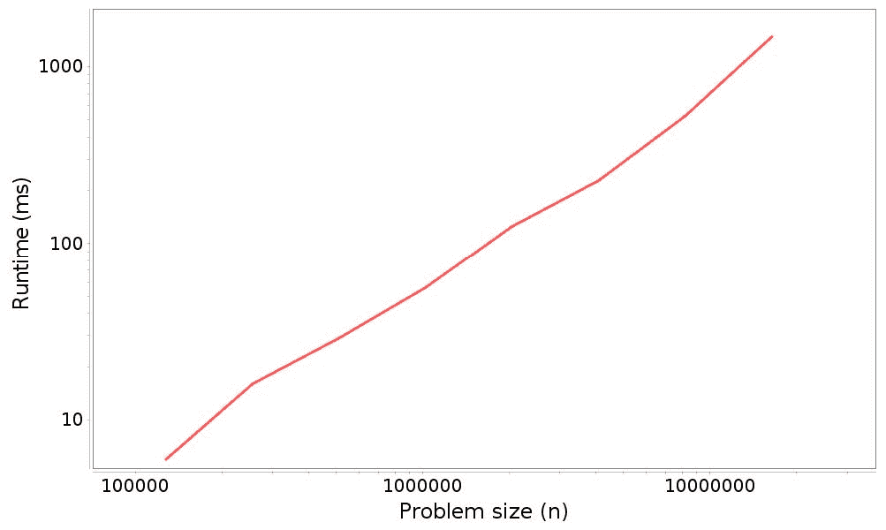

# 第四章 `LinkedList`

> 原文：[Chapter 4 LinkedList](http://greenteapress.com/thinkdast/html/thinkdast005.html)
> 
> 译者：[飞龙](https://github.com/wizardforcel)
> 
> 协议：[CC BY-NC-SA 4.0](http://creativecommons.org/licenses/by-nc-sa/4.0/)
> 
> 自豪地采用[谷歌翻译](https://translate.google.cn/)

这一章展示了上一个练习的解法，并继续讨论算法分析。

## 4.1 `MyLinkedList`方法的划分

我的`indexOf`实现在下面。在阅读说明之前，请阅读它，看看你是否可以确定其增长级别。

```
public int indexOf(Object target) {
    Node node = head;
    for (int i=0; i<size; i++) {
        if (equals(target, node.data)) {
            return i;
        }
        node = node.next;
    }
    return -1;
}
```

最初`node`为`head`的副本，所以他们都指向相同的`Node`。循环变量`i`从`0`计数到`size-1`。每次在循环中，我们都用`equals`来看看我们是否找到了目标。如果是这样，我们立即返回`i`。否则我们移动到列表中的下一个`Node`。

通常我们会检查以确保下一个`Node`不是`null`，但在这里，它是安全的，因为当我们到达列表的末尾时循环结束（假设与列表中`size`与实际节点数量一致）。

如果我们走完了循环而没有找到目标，我们返回`-1`。

那么这种方法的增长级别是什么？

*   每次在循环中，我们调用了`equals`，这是一个常数时间（它可能取决于`target`或`data`大小，但不取决于列表的大小）。循环中的其他操作也是常数时间。
*   循环可能运行`n`次，因为在更糟的情况下，我们可能必须遍历整个列表。

所以这个方法的运行时间与列表的长度成正比。

接下来，这里是我的双参数`add`方法的实现。同样，你应该尝试对其进行划分，然后再阅读说明。

```
public void add(int index, E element) {
    if (index == 0) {
        head = new Node(element, head);
    } else {
        Node node = getNode(index-1);
        node.next = new Node(element, node.next);
    }
    size++;
}
```

如果`index==0`，我们在开始添加新的`Node`，所以我们把它当作特殊情况。否则，我们必须遍历列表来查找`index-1`处的元素。我们使用辅助方法`getNode`：

```
private Node getNode(int index) {
    if (index < 0 || index >= size) {
        throw new IndexOutOfBoundsException();
    }
    Node node = head;
    for (int i=0; i<index; i++) {
        node = node.next;
    }
    return node;
}
```

`getNode`检查`index`是否超出范围；如果是这样，它会抛出异常。否则，它遍历列表并返回所请求的节点。

我们回到`add`，一旦我们找到合适的`Node`，我创建新的`Node`，并把它插到`node`和`node.next`之间。你可能会发现，绘制此操作的图表有助于确保你了解此操作。

那么，`add`的增长级别什么呢？

*   `getNode`类似`indexOf`，出于同样的原因也是线性的。
*   在`add`中，`getNode`前后的一切都是常数时间。

所以放在一起，`add`是线性的。

最后，我们来看看`remove`：

```
public E remove(int index) {
    E element = get(index);
    if (index == 0) {
        head = head.next;
    } else {
        Node node = getNode(index-1);
        node.next = node.next.next;
    }
    size--;
    return element;
}
```

`remove`使用了`get`查找和存储`index`处的元素。然后它删除包含它的`Node`。

如果`index==0`，我们再次处理这个特殊情况。否则我们找到节点`index-1`并进行修改，来跳过`node.next`并直接链接到`node.next.next`。这有效地从列表中删除`node.next`，它可以被垃圾回收。

最后，我们减少`size`并返回我们在开始时检索的元素。

那么，`remove`的增长级别是什么呢？`remove`中的一切是常数时间，除了`get`和`getNode`，它们是线性的。因此，`remove`是线性的。

当人们看到两个线性操作时，他们有时会认为结果是平方的，但是只有一个操作嵌套在另一个操作中才适用。如果你在一个操作之后调用另一个，运行时间会相加。如果它们都是`O(n)`的，则总和也是`O(n)`的。

## 4.2 `MyArrayList`和`MyLinkedList`的对比

下表总结了`MyArrayList`和`MyLinkedList`之间的差异，其中`1`表示`O(1)`或常数时间，和`n`表示`O(n)`或线性。

| `MyArrayList` | `MyLinkedList` |
| --- | --- |
| `add`（末尾） | 1 |
| `add`（开头） | n |
| `add`（一般） | n |
| `get` / `set` | 1 |
| `indexOf` / `lastIndexOf` | n |
| `isEmpty` / `size` | 1 |
| `remove`（末尾） | 1 |
| `remove`（开头） | n |
| `remove`（一般） | n |

+ `MyArrayList`的优势操作是，插入末尾，移除末尾，获取和设置。
+ `MyLinkedList`的优势操作是，插入开头，以及移动开头。

对于其他操作，这两个实现方式的增长级别相同。

哪个实现更好？这取决于你最有可能使用哪些操作。这就是为什么 Java 提供了多个实现，因为它取决于你。

## 4.3 性能分析

对于下一个练习，我提供了一个`Profiler`类，它包含代码，使用一系列问题规模运行方法，测量运行时间和绘制结果。

你将使用`Profiler`，为 Java 的实现`ArrayList`和`LinkedList`，划分`add`方法的性能。

以下是一个示例，展示了如何使用分析器：

```
public static void profileArrayListAddEnd() {
    Timeable timeable = new Timeable() {
        List<String> list;

        public void setup(int n) {
            list = new ArrayList<String>();
        }

        public void timeMe(int n) {
            for (int i=0; i<n; i++) {
                list.add("a string");
            }
        }
    };

    String title = "ArrayList add end";
    Profiler profiler = new Profiler(title, timeable);

    int startN = 4000;
    int endMillis = 1000;
    XYSeries series = profiler.timingLoop(startN, endMillis);
    profiler.plotResults(series);
}
```

此方法测量在`ArrayList`上运行`add`所需的时间，它向末尾添加新元素。我将解释代码，然后展示结果。

为了使用`Profiler`，我们需要创建一个`Timeable`，它提供两个方法：`setup`和`timeMe`。`setup`方法执行在启动计时之前所需的任何工作；这里它会创建一个空列表。然后`timeMe`执行我们试图测量的任何操作；这里它将`n`个元素添加到列表中。

创建`timeable`的代码是一个匿名类，用于定义`Timeable`接口的新实现，并同时创建新类的实例。如果你不熟悉匿名类，你可以阅读这里：[http://thinkdast.com/anonclass](http://thinkdast.com/anonclass)。

但是下一次练习不需要太多的知识；即使你不喜欢匿名类，也可以复制和修改示例代码。

下一步是创建`Profiler`对象，传递`Timeable`对象和标题作为参数。

`Profiler`提供了`timingLoop`，它使用存储为实例变量的`Timeable`。它多次调用`Timeable`对象上的`timeMe`方法，使用一系列的`n`值。`timingLoop`接受两个参数：

*   `startN`是`n`的值，计时循环应该从它开始。
*   `endMillis`是以毫秒为单位的阈值。随着 `timingLoop`增加问题规模，运行时间增加；当运行时间超过此阈值时，`timingLoop`停止。

当你运行实验时，你可能需要调整这些参数。如果`startN`太低，运行时间可能太短，无法准确测量。如果`endMillis`太低，你可能无法获得足够的数据，来查看问题规模和运行时间之间的明确关系。

这段代码位于`ProfileListAdd.java`，你将在下一个练习中运行它。当我运行它时，我得到这个输出：

```
4000, 3
8000, 0
16000, 1
32000, 2
64000, 3
128000, 6
256000, 18
512000, 30
1024000, 88
2048000, 185
4096000, 242
8192000, 544
16384000, 1325
```

第一列是问题规模，`n`；第二列是以毫秒为单位的运行时间。前几个测量非常嘈杂；最好将`startN`设置在`64000`左右。

`timingLoop`的结果是包含此数据的`XYSeries`。如果你将这个序列传给`plotResults`，它会产生一个如图 4.1 所示的图形。



图 4.1 分析结果：将`n`个元素添加到`ArrayList`末尾的运行时间与问题规模。

下一节解释了如何解释它。

## 4.4 解释结果

基于我们对`ArrayList`工作方式的理解，我们期望，在添加元素到最后时，`add`方法需要常数时间。所以添加`n`个元素的总时间应该是线性的。

为了测试这个理论，我们可以绘制总运行时间和问题规模，我们应该看到一条直线，至少对于大到足以准确测量的问题规模。在数学上，我们可以为这条直线编写一个函数：

```
runtime = a + b * n 
```

其中`a`是线的截距，`b`是斜率。

另一方面，如果`add`是线性的，则`n`次添加的总时间将是平方。如果我们绘制运行时间与问题规模，我们预计会看到抛物线。或者在数学上，像：

```
runtime = a + b * n + c * n ** 2 
```

有了完美的数据，我们可能能够分辨直线和抛物线之间的区别，但如果测量结果很嘈杂，可能很难辨别。解释嘈杂的测量值的更好方法是，在重对数刻度上绘制的运行时间和问题规模。

为什么？我们假设运行时间与`n ** k`成正比，但是我们不知道指数`k`是什么。我们可以将关系写成这样：

```
runtime = a + b * n + … + c * n ** k 
```

对于`n`的较大值，最大指数项是最重要的，因此：

```
runtime ≈ c * n ** k 
```

其中`≈`意思是“大致相等”。现在，如果我们对这个方程的两边取对数：

```
log(runtime) ≈ log(c) + k * log(n) 
```

这个方程式意味着，如果我们在重对数合度上绘制运行时间与`n`，我们预计看到一条直线，截距为`log(c)`，斜率为`k`。我们不太在意截距，但斜率表示增长级别：如果`k = 1`，算法是线性的；如果`k = 2`，则为平方的。

看上一节中的数字，你可以通过眼睛来估计斜率。但是当你调用`plotResults`它时，会计算数据的最小二乘拟合并打印估计的斜率。在这个例子中：

```
Estimated slope = 1.06194352346708
```

它接近`1`；并且这表明`n`次添加的总时间是线性的，所以每个添加是常数时间，像预期的那样。

其中重要的一点：如果你在图形看到这样的直线，这并不意味着该算法是线性的。如果对于任何指数`k`，运行时间与`n ** k`成正比，我们预计看到斜率为`k`的直线。如果斜率接近`1`，则表明算法是线性的。如果接近`2`，它可能是平方的。

## 4.5 练习 4

在本书的仓库中，你将找到此练习所需的源文件：

*   `Profiler.java`包含上述`Profiler`类的实现。你会使用这个类，但你不必知道它如何工作。但可以随时阅读源码。
*   `ProfileListAdd.java`包含此练习的起始代码，包括上面的示例，它测量了`ArrayList.add`。你将修改此文件来测量其他一些方法。

此外，在`code`目录中，你将找到 Ant 构建文件`build.xml`。

运行`ant ProfileListAdd`来运行`ProfileListAdd.java`。你应该得到类似图 4.1 的结果，但是你可能需要调整`startN`或`endMillis`。估计的斜率应该接近`1`，表明执行`n`个添加操作的所需时间与`n`成正比；也就是说，它是`O(n)`的。

在`ProfileListAdd.java`中，你会发现一个空的方法`profileArrayListAddBeginning`。用测试`ArrayList.add`的代码填充这个方法的主体，总是把新元素放在开头。如果你以`profileArrayListAddEnd`的副本开始，你只需要进行一些更改。在`main`中添加一行来调用这个方法。

再次运行`ant ProfileListAdd`并解释结果。基于我们对`ArrayList`工作方式的理解，我们期望，每个添加操作是线性的，所以`n`次添加的总时间应该是平方的。如果是这样，在重对数刻度中，直线的估计斜率应该接近`2`。是吗？

现在我们来将其与`LinkedList`比较。当我们把新元素放在开头，填充`profileLinkedListAddBeginning`并使用它划分`LinkedList.add`。你期望什么性能？结果是否符合你的期望？

最后，填充`profileLinkedListAddEnd`的主体，使用它来划分`LinkedList.add`。你期望什么性能？结果是否符合你的期望？

我将在下一章中展示结果并回答这些问题。