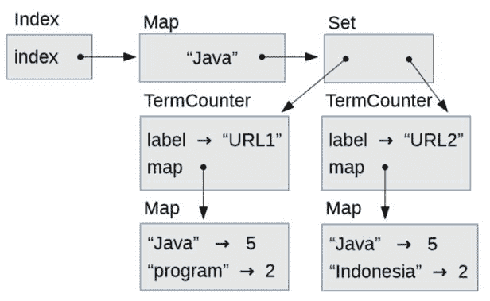

# 第八章 索引器

> 原文：[Chapter 8 Indexer](http://greenteapress.com/thinkdast/html/thinkdast009.html)
> 
> 译者：[飞龙](https://github.com/wizardforcel)
> 
> 协议：[CC BY-NC-SA 4.0](http://creativecommons.org/licenses/by-nc-sa/4.0/)
> 
> 自豪地采用[谷歌翻译](https://translate.google.cn/)

目前，我们构建了一个基本的 Web 爬虫；我们下一步将是索引。在网页搜索的上下文中，索引是一种数据结构，可以查找检索词并找到该词出现的页面。此外，我们想知道每个页面上显示检索词的次数，这将有助于确定与该词最相关的页面。

例如，如果用户提交检索词“Java”和“编程”，我们将查找两个检索词并获得两组页面。带有“Java”的页面将包括 Java 岛屿，咖啡昵称以及编程语言的网页。具有“编程”一词的页面将包括不同编程语言的页面，以及该单词的其他用途。通过选择具有两个检索词的页面，我们希望消除不相关的页面，并找到 Java 编程的页面。

现在我们了解索引是什么，它执行什么操作，我们可以设计一个数据结构来表示它。

## 8.1 数据结构选取

索引的基本操作是查找；具体来说，我们需要能够查找检索词并找到包含它的所有页面。最简单的实现将是页面的集合。给定一个检索词，我们可以遍历页面的内容，并选择包含检索词的内容。但运行时间与所有页面上的总字数成正比，这太慢了。

一个更好的选择是一个映射（字典），它是一个数据结构，表示键值对的集合，并提供了一种方法，快速查找键以及相应值。例如，我们将要构建的第一个映射是`TermCounter`，它将每个检索词映射为页面中出现的次数。键是检索词，值是计数（也称为“频率”）。

Java 提供了`Map`的调用接口，它指定映射应该提供的方法；最重要的是：

*   `get(key)`：此方法查找一个键并返回相应的值。
*   `put(key, value)`：该方法向`Map`添加一个新的键值对，或者如果该键已经在映射中，它将替换与`key`关联的值。

Java 提供了几个`Map`实现，包括我们将关注的两个，`HashMap`以及`TreeMap`。在即将到来的章节中，我们将介绍这些实现并分析其性能。

除了检索词到计数的映射`TermCounter`之外，我们将定义一个被称为`Index`的类，它将检索词映射为出现的页面的集合。而这又引发了下一个问题，即如何表示页面集合。同样，如果我们考虑我们想要执行的操作，它们就指导了我们的决定。

在这种情况下，我们需要组合两个或多个集合，并找到所有这些集合中显示的页面。你可以将此操作看做集合的交集：两个集合的交集是出现在两者中的一组元素。

你可能猜到了，Java 提供了一个`Set`接口，来定义集合应该执行的操作。它实际上并不提供设置交集，但它提供了方法，使我们能够有​​效地实现交集和其他结合操作。核心的`Set`方法是：

*   `add(element)`：该方法将一个元素添加到集合中；如果元素已经在集合中，则它不起作用。
*   `contains(element)`：该方法检查给定元素是否在集合中。

Java 提供了几个`Set`实现，包括`HashSet`和`TreeSet`。

现在我们自顶向下设计了我们的数据结构，我们将从内到外实现它们，从`TermCounter`开始。

## 8.2 `TermCounter`

`TermCounter`是一个类，表示检索词到页面中出现次数的映射。这是类定义的第一部分：

```
public class TermCounter {

    private Map<String, Integer> map;
    private String label;

    public TermCounter(String label) {
        this.label = label;
        this.map = new HashMap<String, Integer>();
    }
}
```

实例变量`map`包含检索词到计数的映射，并且`label`标识检索词的来源文档；我们将使用它来存储 URL。

为了实现映射，我选择了`HashMap`，它是最常用的`Map`。在几章中，你将看到它是如何工作的，以及为什么它是一个常见的选择。

`TermCounter`提供`put`和`get`，定义如下：

```
 public void put(String term, int count) {
        map.put(term, count);
    }

    public Integer get(String term) {
        Integer count = map.get(term);
        return count == null ? 0 : count;
    }
```

`put`只是一个包装方法；当你调用`TermCounter`的`put`时，它会调用内嵌映射的`put`。

另一方面，`get`做了一些实际工作。当你调用`TermCounter`的`get`时，它会在映射上调用`get`，然后检查结果。如果该检索词没有出现在映射中，则`TermCount.get`返回`0`。`get`的这种定义方式使`incrementTermCount`的写入更容易，它需要一个检索词，并增加关联该检索词的计数器。

```
 public void incrementTermCount(String term) {
        put(term, get(term) + 1);
    }
```

如果这个检索词未见过，则`get`返回`0`；我们设为`1`，然后使用`put`向映射添加一个新的键值对。如果该检索词已经在映射中，我们得到旧的计数，增加`1`，然后存储新的计数，替换旧的值。

此外，`TermCounter`还提供了这些其他方法，来帮助索引网页：

```
 public void processElements(Elements paragraphs) {
        for (Node node: paragraphs) {
            processTree(node);
        }
    }

    public void processTree(Node root) {
        for (Node node: new WikiNodeIterable(root)) {
            if (node instanceof TextNode) {
                processText(((TextNode) node).text());
            }
        }
    }

    public void processText(String text) {
        String[] array = text.replaceAll("\\pP", " ").
                              toLowerCase().
                              split("\\s+");

        for (int i=0; i<array.length; i++) {
            String term = array[i];
            incrementTermCount(term);
        }
    }
```

最后，这里是一个例子，展示了如何使用`TermCounter`：

```
 String url = "http://en.wikipedia.org/wiki/Java_(programming_language)";
    WikiFetcher wf = new WikiFetcher();
    Elements paragraphs = wf.fetchWikipedia(url);

    TermCounter counter = new TermCounter(url);
    counter.processElements(paragraphs);
    counter.printCounts();
```

这个示例使用了`WikiFetcher`从维基百科下载页面，并解析正文。之后它创建了`TermCounter`并使用它来计数页面上的单词。

下一节中，你会拥有一个挑战，来运行这个代码，并通过填充缺失的方法来测试你的理解。

## 8.3 练习 6

在本书的存储库中，你将找到此练习的源文件：

*   `TermCounter.java`包含上一节中的代码。
*   `TermCounterTest.java`包含测试代码`TermCounter.java`。
*   `Index.java`包含本练习下一部分的类定义。
*   `WikiFetcher.java`包含我们在上一个练习中使用的，用于下载和解析网页的类。
*   `WikiNodeIterable.java`包含我们用于遍历 DOM 树中的节点的类。

你还会发现 Ant 构建文件`build.xml`。

运行`ant build`来编译源文件。然后运行`ant TermCounter`；它应该运行上一节中的代码，并打印一个检索词列表及其计数。输出应该是这样的：

```
genericservlet, 2
configurations, 1
claimed, 1
servletresponse, 2
occur, 2
Total of all counts = -1
```

运行它时，检索词的顺序可能不同。

最后一行应该打印检索词计数的总和，但是由于方法`size`不完整而返回`-1`。填充此方法并`ant TermCounter`重新运行。结果应该是`4798`。

运行`ant TermCounterTest`来确认这部分练习是否完整和正确。

对于练习的第二部分，我将介绍`Index`对象的实现，你将填充一个缺失的方法。这是类定义的开始：

```
public class Index {

    private Map<String, Set<TermCounter>> index = 
        new HashMap<String, Set<TermCounter>>();

    public void add(String term, TermCounter tc) {
        Set<TermCounter> set = get(term);

        // if we're seeing a term for the first time, make a new Set
        if (set == null) {
            set = new HashSet<TermCounter>();
            index.put(term, set);
        }
        // otherwise we can modify an existing Set
        set.add(tc);
    }

    public Set<TermCounter> get(String term) {
        return index.get(term);
    }
```

实例变量`index`是每个检索词到一组`TermCounter`对象的映射。每个`TermCounter`表示检索词出现的页面。

`add`方法向集合添加新的`TermCounter`，它与检索词关联。当我们索引一个尚未出现的检索词时，我们必须创建一个新的集合。否则我们可以添加一个新的元素到一个现有的集合。在这种情况下，`set.add`修改位于`index`里面的集合，但不会修改`index`本身。我们唯一修改`index`的时候是添加一个新的检索词。

最后，`get`方法接受检索词并返回相应的`TermCounter`对象集。

这种数据结构比较复杂。回顾一下，`Index`包含`Map`，将每个检索词映射到`TermCounter`对象的`Set`，每个`TermCounter`包含一个`Map`，将检索词映射到计数。



图 8.1 `Index`的对象图

图 8.1 是展示这些对象的对象图。`Index`对象具有一个名为`index` 的`Map`实例变量。在这个例子中，`Map`只包含一个字符串，`"Java"`，它映射到一个`Set`，包含两个`TermCounter`对象的，代表每个出现单词“Java”的页面。

每个`TermCounter`包含`label`，它是页面的 URL，以及`map`，它是`Map`，包含页面上的单词和每个单词出现的次数。

`printIndex`方法展示了如何解压缩此数据结构：

```
 public void printIndex() {
        // loop through the search terms
        for (String term: keySet()) {
            System.out.println(term);

            // for each term, print pages where it appears and frequencies
            Set<TermCounter> tcs = get(term);
            for (TermCounter tc: tcs) {
                Integer count = tc.get(term);
                System.out.println("    " + tc.getLabel() + " " + count);
            }
        }
    }
```

外层循环遍历检索词。内层循环迭代`TermCounter`对象。

运行`ant build`来确保你的源代码已编译，然后运行`ant Index`。它下载两个维基百科页面，对它们进行索引，并打印结果；但是当你运行它时，你将看不到任何输出，因为我们已经将其中一个方法留空。

你的工作是填写`indexPage`，它需要一个 URL（一个`String`）和一个`Elements`对象，并更新索引。下面的注释描述了应该做什么：

```
public void indexPage(String url, Elements paragraphs) {
    // 生成一个 TermCounter 并统计段落中的检索词

    // 对于 TermCounter 中的每个检索词，将 TermCounter 添加到索引
}
```

它能工作之后，再次运行`ant Index`，你应该看到如下输出：

```
...
configurations
    http://en.wikipedia.org/wiki/Programming_language 1
    http://en.wikipedia.org/wiki/Java_(programming_language) 1
claimed
    http://en.wikipedia.org/wiki/Java_(programming_language) 1
servletresponse
    http://en.wikipedia.org/wiki/Java_(programming_language) 2
occur
    http://en.wikipedia.org/wiki/Java_(programming_language) 2
```

当你运行的时候，检索词的顺序可能有所不同。

同样，运行`ant TestIndex`来确定完成了这部分练习。