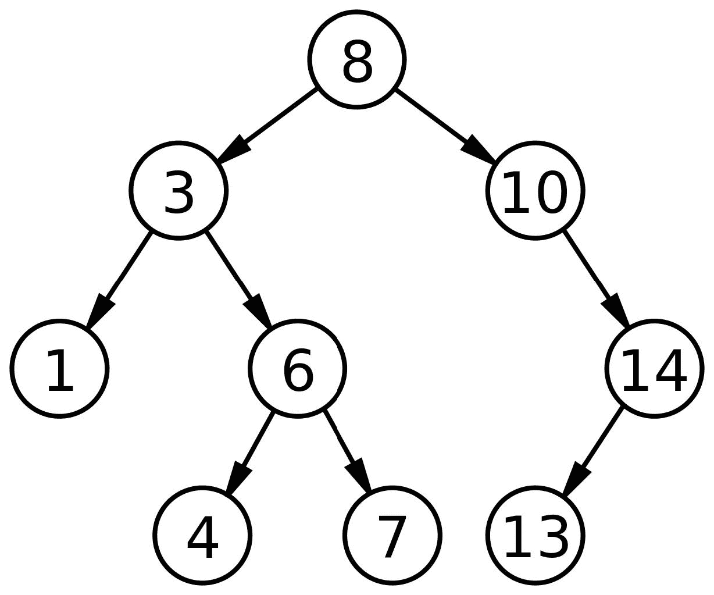

# 第十二章 `TreeMap`

> 原文：[Chapter 12 TreeMap](http://greenteapress.com/thinkdast/html/thinkdast013.html)
> 
> 译者：[飞龙](https://github.com/wizardforcel)
> 
> 协议：[CC BY-NC-SA 4.0](http://creativecommons.org/licenses/by-nc-sa/4.0/)
> 
> 自豪地采用[谷歌翻译](https://translate.google.cn/)

这一章展示了二叉搜索树，它是个`Map`接口的高效实现。如果我们想让元素有序，它非常实用。

## 12.1 哈希哪里不对？

此时，你应该熟悉 Java 提供的`Map`接口和`HashMap`实现。通过使用哈希表来制作你自己的`Map`，你应该了解`HashMap`的工作原理，以及为什么我们预计其核心方法是常数时间的。

由于这种表现，`HashMap`被广泛使用，但并不是唯一的`Map`实现。有几个原因可能需要另一个实现：

哈希可能很慢，所以即使`HashMap`操作是常数时间，“常数”可能很大。
如果哈希函数将键均匀分配给子映射，效果很好。但设计良好的散列函数并不容易，如果太多的键在相同的子映射上，那么`HashMap`的性能可能会很差。
哈希表中的键不以任何特定顺序存储；实际上，当表增长并且键被重新排列时，顺序可能会改变。对于某些应用程序，必须或至少保持键的顺序，这很有用。

很难同时解决所有这些问题，但是 Java 提供了一个称为`TreeMap`的实现：

*   它不使用哈希函数，所以它避免了哈希的开销和选择哈希函数的困难。
*   在`TreeMap`之中，键被存储在二叉搜索树中，这使我们可以以线性时间顺序遍历键。
*   核心方法的运行时间与`log(n)`成正比，并不像常数时间那样好，但仍然非常好。

在下一节中，我将解释二进制搜索树如何工作，然后你将使用它来实现`Map`。另外，使用树实现时，我们将分析映射的核心方法的性能。

## 12.2 二叉搜索树

二叉搜索树（BST）是一个树，其中每个`node`（节点）包含一个键，并且每个都具有“BST 属性”：

*   如果`node`有一个左子树，左子树中的所有键都必须小于`node`的键。
*   如果`node`有一个右子树，右子树中的所有键都必须大于`node`的键。



图 12.1：二叉搜索树示例

图 12.1 展示了一个具有此属性的整数的树。这个图片来自二叉搜索树的维基百科页面，位于 [http://thinkdast.com/bst](http://thinkdast.com/bst)，当你做这个练习时，你会发现它很实用。

根节点中的键为`8`，你可以确认根节点左边的所有键小于`8`，右边的所有键都更大。你还可以检查其他节点是否具有此属性。

在二叉搜索树中查找一个键是很快的，因为我们不必搜索整个树。从根节点开始，我们可以使用以下算法：

*   将你要查找的键`target`，与当前节点的键进行比较。如果他们相等，你就完成了。
*   如果`target`小于当前键，搜索左子树。如果没有，`target`不在树上。
*   如果`target`大于当前键，搜索右子树。如果没有，`target`不在树上。

在树的每一层，你只需要搜索一个子树。例如，如果你在上图中查找`target = 4`，则从根节点开始，它包含键`8`。因为`target`小于`8`，你走了左边。因为`target`大于`3`，你走了右边。因为`target`小于`6`，你走了左边。然后你找到你要找的键。

在这个例子中，即使树包含九个键，它需要四次比较来找到目标。一般来说，比较的数量与树的高度成正比，而不是树中的键的数量。

因此，我们可以计算树的高度`h`和节点个数`n`的关系。从小的数值开始，逐渐增加：

如果`h=1`，树只包含一个节点，那么`n=1`。
如果`h=2`，我们可以添加两个节点，总共`n=3`。
如果`h=3`，我们可以添加多达四个节点，总共`n=7`。
如果`h=4`，我们可以添加多达八个节点，总共`n=15`。

现在你可能会看到这个规律。如果我们将树的层数从`1`数到`n`，第`i`层可以拥有多达`2^(n-1)`个节点。`h`层的树共有`2^h-1`个节点。如果我们有：

```
n = 2^h - 1
```

我们可以对两边取以`2`为底的对数：

```
log2(n) ≈ h
```

意思是树的高度正比于`logn`，如果它是满的。也就是说，如果每一层包含最大数量的节点。

所以我们预计，我们可以以正比于`logn`的时间，在二叉搜索树中查找节点。如果树是慢的，即使是部分满的，这是对的。但是并不总是对的，我们将会看到。

时间正比于`logn`的算法是对数时间的，并且属于`O(logn)`的增长级别。

## 12.3 练习 10

对于这个练习，你将要使用二叉搜索树编写`Map`接口的一个实现。

这里是实现的开头，叫做`MyTreeMap`：

```
public class MyTreeMap<K, V> implements Map<K, V> {

    private int size = 0;
    private Node root = null;
```

实例变量是`size`，它跟踪了键的数量，以及`root`，它是树中根节点的引用。树为空的时候，`root`是`null`，`size`是`0`。

这里是`Node`的定义，它在`MyTreeMap`之中定义。

```
 protected class Node {
        public K key;
        public V value;
        public Node left = null;
        public Node right = null;

        public Node(K key, V value) {
            this.key = key;
            this.value = value;
        }
    }
```

每个节点包含一个键值对，以及两个子节点的引用，`left`和`right`。任意子节点都可以为`null`。

一些`Map`方法易于实现，比如`size`和`clear`：

```
 public int size() {
        return size;
    }

    public void clear() {
        size = 0;
        root = null;
    }
```

`size`显然是常数时间的。

`clear`也是常数时间的，但是考虑这个：当`root`赋为`null`时，垃圾收集器回收了树中的节点，这是线性时间的。这个工作是否应该由垃圾收集器的计数来完成呢？我认为是的。

下一节中，你会填充一些其它方法，包括最重要的`get`和`set`。

## 12.4 实现`TreeMap`

这本书的仓库中，你将找到这些源文件：

*   `MyTreeMap.java`包含上一节的代码，其中包含缺失方法的大纲。
*   `MyTreeMapTest.java`包含单元`MyTreeMap`的测试。

运行`ant build`来编译源文件。然后运行`ant MyTreeMapTest`。几个测试应该失败，因为你有一些工作要做！

我已经提供了`get`和`containsKey`的大纲。他们都使用`findNode`，这是我定义的私有方法；它不是`Map`接口的一部分。以下是它的起始：

```
 private Node findNode(Object target) {
        if (target == null) {
            throw new IllegalArgumentException();
        }

        @SuppressWarnings("unchecked")
        Comparable<? super K> k = (Comparable<? super K>) target;

        // TODO: FILL THIS IN!
        return null;
    }
```

参数`target`是我们要查找的键。如果`target`是`null`，`findNode`抛出异常。一些`Map`实现可以将`null`处理为一个键，但是在二叉搜索树中，我们需要能够比较键，所以处理`null`是有问题的。为了保持简单，这个实现不将`null`视为键。

下一行显示如何将`target`与树中的键进行比较。按照`get`和`containsKey`的签名（名称和参数），编译器认为`target`是一个`Object`。但是，我们需要能够对键进行比较，所以我们将`target`强制转换为`Comparable<? super K>`，这意味着它可以与类型`K`（或任何超类）的示例比较。如果你不熟悉“类型通配符”的用法，可以在 [http://thinkdast.com/gentut](http://thinkdast.com/gentut) 上阅读更多内容。

幸运的是，Java 的类型系统的处理不是这个练习的重点。你的工作是填写剩下的`findNode`。如果它发现一个包含`target`键的节点，它应该返回该节点。否则应该返回`null`。当你使其工作，`get`和`containsKey`的测试应该通过。

请注意，你的解决方案应该只搜索通过树的一条路径，因此它应该与树的高度成正比。你不应该搜索整棵树！

你的下一个任务是填充`containsValue`。为了让你起步，我提供了一个辅助方法`equals`，比较`target`和给定的键。请注意，树中的值（与键相反）不一定是可比较的，所以我们不能使用`compareTo`；我们必须在`target`上调用`equals`。

不像你以前的`findNode`解决方案，你的`containsValue`解决方案应该搜索整个树，所以它的运行时间正比于键的数量`n`，而不是树的高度`h`。

> 译者注：这里你可能想使用之前讲过的 DFS 迭代器。

你应该填充的下一个方法是`put`。我提供了处理简单情况的起始代码：

```
 public V put(K key, V value) {
        if (key == null) {
            throw new IllegalArgumentException();
        }
        if (root == null) {
            root = new Node(key, value);
            size++;
            return null;
        }
        return putHelper(root, key, value);
    }

    private V putHelper(Node node, K key, V value) {
        // TODO: Fill this in.
    }
```

如果你尝试将`null`作为关键字，`put`则会抛出异常。

如果树为空，则`put`创建一个新节点并初始化实例变量`root`。

否则，它调用`putHelper`，这是我定义的私有方法；它不是`Map`接口的一部分。

填写`putHelper`，让它搜索树，以及：

*   如果`key`已经在树中，它将使用新值替换旧值，并返回旧值。
*   如果`key`不在树中，它将创建一个新节点，找到正确的添加位置，并返回`null`。

你的`put`实现的是时间应该与树的高度`h`成正比，而不是元素的数量`n`。理想情况下，你只需搜索一次树，但如果你发现两次更容易搜索，可以这样做：它会慢一些，但不会改变增长级别。

最后，你应该填充`keySet`。根据 [http://thinkdast.com/mapkeyset](http://thinkdast.com/mapkeyset) 的文档，该方法应该返回一个`Set`，可以按顺序迭代键；也就是说，按照`compareTo`方法，升序迭代。我们在 8.3 节中使用的`HashSet`实现不会维护键的顺序，但`LinkedHashSet`实现可以。你可以阅读 [http://thinkdast.com/linkedhashset](http://thinkdast.com/linkedhashset)。

我提供了一个`keySet`的大纲，创建并返回`LinkedHashSet`：

```
 public Set<K> keySet() {
        Set<K> set = new LinkedHashSet<K>();
        return set;
    }
```

你应该完成此方法，使其以升序向`set`添加树中的键。提示：你可能想编写一个辅助程序；你可能想让它递归；你也可能想要阅读 [http://thinkdast.com/inorder](http://thinkdast.com/inorder) 上的树的中序遍历。

当你完成时，所有测试都应该通过。下一章中，我会讲解我的解法，并测试核心方法的性能。