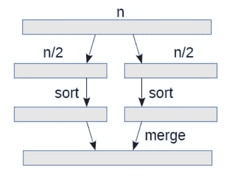
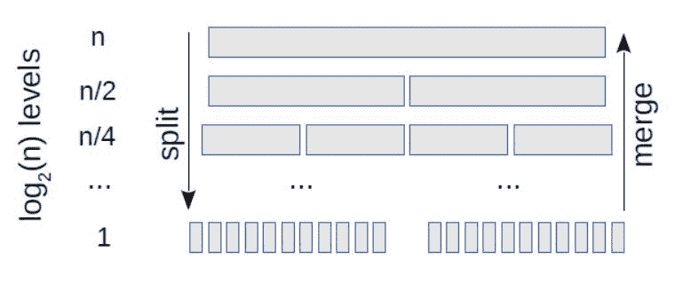
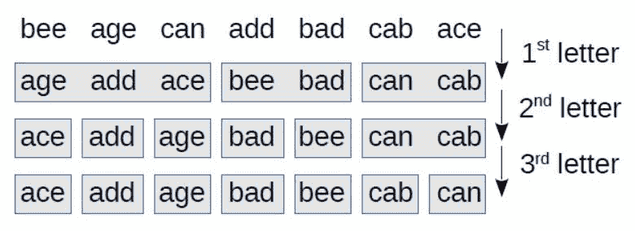

# 第十七章 排序

> 原文：[Chapter 17 Sorting](http://greenteapress.com/thinkdast/html/thinkdast018.html)
> 
> 译者：[飞龙](https://github.com/wizardforcel)
> 
> 协议：[CC BY-NC-SA 4.0](http://creativecommons.org/licenses/by-nc-sa/4.0/)
> 
> 自豪地采用[谷歌翻译](https://translate.google.cn/)

计算机科学领域过度痴迷于排序算法。根据 CS 学生在这个主题上花费的时间，你会认为排序算法的选择是现代软件工程的基石。当然，现实是，软件开发人员可以在很多年中，或者整个职业生涯中，不必考虑排序如何工作。对于几乎所有的应用程序，它们都使用它们使用的语言或库提供的通用算法。通常这样就行了。

所以如果你跳过这一章，不了解排序算法，你仍然是一个优秀的开发人员。但是有一些原因你可能想要这样：

*   尽管有绝大多数应用程序都可以使用通用算法，但你可能需要了解两种专用算法：基数排序和有界堆排序。
*   一种排序算法，归并排序，是一个很好的教学示例，因为它演示了一个重要和实用的算法设计策略，称为“分治”。此外，当我们分析其表现时，你将了解到我们以前没有看到的增长级别，即线性对数。最后，一些最广泛使用的算法是包含归并排序的混合体。
*   了解排序算法的另一个原因是，技术面试官喜欢询问它们。如果你想要工作，如果你能展示 CS 文化素养，就有帮助。

因此，在本章中我们将分析插入排序，你将实现归并排序，我将给你讲解基数排序，你将编写有界堆排序的简单版本。

## 17.1 插入排序

我们将从插入排序开始，主要是因为它的描述和实现很简单。它不是很有效，但它有一些补救的特性，我们将看到它。

我们不在这里解释算法，建议你阅读 [http://thinkdast.com/insertsort](http://thinkdast.com/insertsort) 中的插入排序的维基百科页面 ，其中包括伪代码和动画示例。当你理解了它的思路再回来。

这是 Java 中插入排序的实现：

```
public class ListSorter<T> {

    public void insertionSort(List<T> list, Comparator<T> comparator) {

        for (int i=1; i < list.size(); i++) {
            T elt_i = list.get(i);
            int j = i;
            while (j > 0) {
                T elt_j = list.get(j-1);
                if (comparator.compare(elt_i, elt_j) >= 0) {
                    break;
                }
                list.set(j, elt_j);
                j--;
            }
            list.set(j, elt_i);
        }
    }
}
```

我定义了一个类，`ListSorter`作为排序算法的容器。通过使用类型参数`T`，我们可以编写一个方法，它在包含任何对象类型的列表上工作。

`insertionSort`需要两个参数，一个是任何类型的`List`，一个是`Comparator`，它知道如何比较类型`T`的对象。它对列表“原地”排序，这意味着它修改现有列表，不必分配任何新空间。

下面的示例演示了，如何使用`Integer`的`List`对象，调用此方法：

```
 List<Integer> list = new ArrayList<Integer>(
            Arrays.asList(3, 5, 1, 4, 2));

        Comparator<Integer> comparator = new Comparator<Integer>() {
            @Override
            public int compare(Integer elt1, Integer elt2) {
                return elt1.compareTo(elt2);
            }
        };

        ListSorter<Integer> sorter = new ListSorter<Integer>();
        sorter.insertionSort(list, comparator);
        System.out.println(list);
```

`insertionSort`有两个嵌套循环，所以你可能会猜到，它的运行时间是二次的。在这种情况下，一般是正确的，但你做出这个结论之前，你必须检查，每个循环的运行次数与`n`，数组的大小成正比。

外部循环从`1`迭代到`list.size()`，因此对于列表的大小`n`是线性的。内循环从`i`迭代到`0`，所以在`n`中也是线性的。因此，两个循环运行的总次数是二次的。

如果你不确定，这里是证明：

第一次循环中，`i = 1`，内循环最多运行一次。
第二次，`i = 2`，内循环最多运行两次。
最后一次，`i = n - 1`，内循环最多运行`n`次。

因此，内循环运行的总次数是序列`1, 2, ..., n - 1`的和，即`n(n - 1)/2`。该表达式的主项（拥有最高指数）为`n^2`。

在最坏的情况下，插入排序是二次的。然而：

*   如果这些元素已经有序，或者几乎这样，插入排序是线性的。具体来说，如果每个元素距离它的有序位置不超过`k`个元素，则内部循环不会运行超过`k`次，并且总运行时间是`O(kn)`。
*   由于实现简单，开销较低；也就是，尽管运行时间是`an^2`，主项的系数`a`，也可能是小的。

所以如果我们知道数组几乎是有序的，或者不是很大，插入排序可能是一个不错的选择。但是对于大数组，我们可以做得更好。其实要好很多。

## 17.2 练习 14

归并排序是运行时间优于二次的几种算法之一。同样，不在这里解释算法，我建议你阅读维基百科 [http://thinkdast.com/mergesort](http://thinkdast.com/mergesort)。一旦你有了想法，反回来，你可以通过写一个实现来测试你的理解。

在本书的仓库中，你将找到此练习的源文件：

*   `ListSorter.java`
*   `ListSorterTest.java`

运行`ant build`来编译源文件，然后运行`ant ListSorterTest`。像往常一样，它应该失败，因为你有工作要做。

在`ListSorter.java`中，我提供了两个方法的大纲，`mergeSortInPlace`以及`mergeSort`：

```
 public void mergeSortInPlace(List<T> list, Comparator<T> comparator) {
        List<T> sorted = mergeSortHelper(list, comparator);
        list.clear();
        list.addAll(sorted);
    }

    private List<T> mergeSort(List<T> list, Comparator<T> comparator) {
       // TODO: fill this in!
       return null;
    }
```

这两种方法做同样的事情，但提供不同的接口。`mergeSort`获取一个列表，并返回一个新列表，具有升序排列的相同元素。`mergeSortInPlace`是修改现有列表的`void`方法。

你的工作是填充`mergeSort`。在编写完全递归版本的合并排序之前，首先要这样：

*   将列表分成两半。
*   使用`Collections.sort`或`insertionSort`来排序这两部分。
*   将有序的两部分合并为一个完整的有序列表中。

这将给你一个机会来调试用于合并的代码，而无需处理递归方法的复杂性。

接下来，添加一个边界情况（请参阅 < [http://thinkdast.com/basecase](http://thinkdast.com/basecase)> ）。如果你只提供一个列表，仅包含一个元素，则可以立即返回，因为它已经有序。或者如果列表的长度低于某个阈值，则可以使用`Collections.sort`或`insertionSort`。在进行前测试边界情况。

最后，修改你的解决方案，使其进行两次递归调用来排序数组的两个部分。当你使其正常工作，`testMergeSort`和`testMergeSortInPlace`应该通过。

## 17.3 归并排序的分析

为了对归并排序的运行时间进行划分，对递归层级和每个层级上完成多少工作方面进行思考，是很有帮助的。假设我们从包含`n`个元素的列表开始。以下是算法的步骤：

*   生成两个新数组，并将一半元素复制到每个数组中。
*   排序两个数组。
*   合并两个数组。

图 17.1 显示了这些步骤。



图 17.1：归并排序的展示，它展示了递归的一个层级。

第一步复制每个元素一次，因此它是线性的。第三步也复制每个元素一次，因此它也是线性的。现在我们需要弄清楚步骤`2`的复杂性。为了做到这一点，查看不同的计算图片会有帮助，它展示了递归的层数，如图 17.2 所示。



图 17.2：归并排序的展示，它展示了递归的所有层级。

在顶层，我们有`1`个列表，其中包含`n`个元素。为了简单起见，我们假设`n`是`2`的幂。在下一层，有`2`个列表包含`n/2`个元素。然后是`4`个列表与`n/4`元素，以此类推，直到我们得到`n`个列表与`1`元素。

在每一层，我们共有`n`个元素。在下降的过程中，我们必须将数组分成两半，这在每一层上都需要与`n`成正比的时间。在回来的路上，我们必须合并`n`个元素，这也是线性的。

如果层数为`h`，算法的总工作量为`O(nh)`。那么有多少层呢？有两种方法可以考虑：

*   我们用多少步，可以将`n`减半直到`1`？
*   或者，我们用多少步，可以将`1`加倍直到`n`？

第二个问题的另一种形式是“`2`的多少次方是`n`”？

```
2^h = n
```

对两边取以`2`为底的对数：

```
h = log2(n)
```

所以总时间是`O(nlogn)`。我没有纠结于对数的底，因为底不同的对数差别在于一个常数，所以所有的对数都是相同的增长级别。

`O(nlogn)`中的算法有时被称为“线性对数”的，但大多数人只是说`n log n`。

事实证明，`O(nlogn)`是通过元素比较的排序算法的理论下限。这意味着没有任何“比较排序”的增长级别比`n log n`好。请参见 [http://thinkdast.com/compsort](http://thinkdast.com/compsort)。

但是我们将在下一节中看到，存在线性时间的非比较排序！

## 基数排序

在 2008 年美国总统竞选期间，候选人巴拉克·奥巴马在访问 Google 时，被要求进行即兴算法分析。首席执行长埃里克·施密特开玩笑地问他，“排序一百万个 32 位整数的最有效的方法”。显然有人暗中告诉了奥巴马，因为他很快就回答说：“我认为冒泡排序是错误的。”你可以在 [http://thinkdast.com/obama](http://thinkdast.com/obama) 观看视频。

奥巴马是对的：冒泡排序在概念上是简单的，但其运行时间是二次的; 即使在二次排序算法中，其性能也不是很好。见 [http://thinkdast.com/bubble](http://thinkdast.com/bubble)。

施密特想要的答案可能是“基数排序”，这是一种非比较排序算法，如果元素的大小是有界的，例如 32 位整数或 20 个字符的字符串，它就可以工作。

为了看看它是如何工作的，想象你有一堆索引卡，每张卡片包含三个字母的单词。以下是一个方法，可以对卡进行排序：

*   根据第一个字母，将卡片放入桶中。所以以`a`开头的单词应该在一个桶中，其次是以`b`开头的单词，以此类推
*   根据第二个字母再次将卡片放入每个桶。所以以`aa`开头的应该在一起，其次是以`ab`开头的，以此类推当然，并不是所有的桶都是满的，但是没关系。
*   根据第三个字母再次将卡片放入每个桶。

此时，每个桶包含一个元素，桶按升序排列。图 17.3 展示了三个字母的例子。



图 17.3：三个字母的基数排序的例子

最上面那行显示未排序的单词。第二行显示第一次遍历后的桶的样子。每个桶中的单词都以相同的字母开头。

第二遍之后，每个桶中的单词以相同的两个字母开头。在第三遍之后，每个桶中只能有一个单词，并且桶是有序的。

在每次遍历期间，我们遍历元素并将它们添加到桶中。只要桶允许在恒定时间内添加元素，每次遍历是线性的。

遍历数量，我会称之为`w`，取决于单词的“宽度”，但不取决于单词的数量，`n`。所以增长级别是`O(wn)`，对于`n`是线性的。

基数排序有许多变体，并有许多方法来实现每一个。你可以在 [http://thinkdast.com/radix](http://thinkdast.com/radix) 上阅读他们的更多信息。作为一个可选的练习，请考虑编写基数排序的一个版本。

## 17.5 堆排序

基数排序适用于大小有界的东西，除了他之外，还有一种你可能遇到的其它专用排序算法：有界堆排序。如果你在处理非常大的数据集，你想要得到前 10 个或者前`k`个元素，其中`k`远小于`n`，它是很有用的。

例如，假设你正在监视一 个Web 服务，它每天处理十亿次事务。在每一天结束时，你要汇报最大的`k`个事务（或最慢的，或者其它最 xx 的）。一个选项是存储所有事务，在一天结束时对它们进行排序，然后选择最大的`k`个。需要的时间与`nlogn`成正比，这非常慢，因为我们可能无法将十亿次交易记录在单个程序的内存中。我们必须使用“外部”排序算法。你可以在 [http://thinkdast.com/extsort](http://thinkdast.com/extsort) 上了解外部排序。

使用有界堆，我们可以做得更好！以下是我们的实现方式：

*   我会解释（无界）堆排序。
*   你会实现它
*   我将解释有界堆排序并进行分析。

要了解堆排序，你必须了解堆，这是一个类似于二叉搜索树（BST）的数据结构。有一些区别：

*   在 BST 中，每个节点`x`都有“BST 特性”：`x`左子树中的所有节点都小于`x`，右子树中的所有节点都大于`x`。
*   在堆中，每个节点`x`都有“堆特性”：两个子树中的所有节点都大于`x`。
*   堆就像平衡的 BST；当你添加或删除元素时，他们会做一些额外的工作来重新使树平衡。因此，可以使用元素的数组来有效地实现它们。

> 译者注：这里先讨论最小堆。如果子树中所有节点都小于`x`，那么就是最大堆。

堆中最小的元素总是在根节点，所以我们可以在常数时间内找到它。在堆中添加和删除元素需要的时间与树的高度`h`成正比。而且由于堆总是平衡的，所以`h`与`log n`成正比。你可以在 [http://thinkdast.com/heap](http://thinkdast.com/heap) 上阅读更多堆的信息。

Java`PriorityQueue`使用堆实现。`PriorityQueue`提供`Queue`接口中指定的方法，包括`offer`和`poll`：

*   `offer`：将一个元素添加到队列中，更新堆，使每个节点都具有“堆特性”。需要`logn`的时间。
*   `poll`：从根节点中删除队列中的最小元素，并更新堆。需要`logn`的时间。

给定一个`PriorityQueue`，你可以像这样轻松地排序的`n`个元素的集合 ：

*   使用`offer`，将集合的所有元素添加到`PriorityQueue`。
*   使用`poll`从队列中删除元素并将其添加到`List`。

因为`poll`返回队列中剩余的最小元素，所以元素按升序添加到`List`。这种排序方式称为堆排序 （请参阅 [http://thinkdast.com/heapsort](http://thinkdast.com/heapsort)）。

向队列中添加`n`个元素需要`nlogn`的时间。删除`n`个元素也是如此。所以堆排序的运行时间是`O(n logn)`。

在本书的仓库中，你可以在`ListSorter.java`中找到`heapSort`方法的大纲。填充它，然后运行`ant ListSorterTest`来确认它可以工作。

## 17.6 有界堆排序

有界堆是一个限制为最多包含`k`个元素的堆。如果你有`n`个元素，你可以跟踪这个最大的`k`个元素：

最初堆是空的。对于每个元素`x`：

*   分支 1：如果堆不满，请添加`x`到堆中。
*   分支 2：如果堆满了，请与堆中`x`的最小元素进行比较。如果`x`较小，它不能是最大的`k`个元素之一，所以你可以丢弃它。
*   分支 3：如果堆满了，并且`x`大于堆中的最小元素，请从堆中删除最小的元素并添加`x`。

使用顶部为最小元素的堆，我们可以跟踪最大的`k`个元素。我们来分析这个算法的性能。对于每个元素，我们执行以下操作之一：

*   分支 1：将元素添加到堆是`O(log k)`。
*   分支 2：找到堆中最小的元素是`O(1)`。
*   分支 3：删除最小元素是`O(log k)`。添加`x`也是`O(log k)`。

在最坏的情况下，如果元素按升序出现，我们总是执行分支 3。在这种情况下，处理`n`个元素的总时间是`O(n log k)`，对于`n`是线性的。

在`ListSorter.java`中，你会发现一个叫做`topK`的方法的大纲，它接受一个`List`、`Comparator`和一个整数`k`。它应该按升序返回`List`的`k`个最大的元素 。填充它，然后运行`ant ListSorterTest`来确认它可以工作。

## 17.7 空间复杂性

到目前为止，我们已经谈到了很多运行时间的分析，但是对于许多算法，我们也关心空间。例如，归并排序的一个缺点是它会复制数据。在我们的实现中，它分配的空间总量是`O(n log n)`。通过更机智的实现，你可以将空间要求降至`O(n)`。

相比之下，插入排序不会复制数据，因为它会原地排序元素。它使用临时变量来一次性比较两个元素，并使用一些其它局部变量。但它的空间使用不取决于`n`。

我们的堆排序实现创建了新`PriorityQueue`，来存储元素，所以空间是`O(n)`; 但是如果你能够原地对列表排序，则可以使用`O(1)`的空间执行堆排序 。

刚刚实现的有界堆栈算法的一个好处是，它只需要与`k`成正比的空间（我们要保留的元素的数量），而`k`通常比`n`小得多 。

软件开发人员往往比空间更加注重运行时间，对于许多应用程序来说，这是适当的。但是对于大型数据集，空间可能同等或更加重要。例如：

*   如果一个数据集不能放入一个程序的内存，那么运行时间通常会大大增加，或者根本不能运行。如果你选择一个需要较少空间的算法，并且这样可以将计算放入内存中，则可能会运行得更快。同样，使用较少空间的程序，可能会更好地利用 CPU 缓存并运行速度更快（请参阅 [http://thinkdast.com/cache](http://thinkdast.com/cache)）。
*   在同时运行多个程序的服务器上，如果可以减少每个程序所需的空间，则可以在同一台服务器上运行更多程序，从而降低硬件和能源成本。

所以这些是一些原因，你应该至少了解一些算法的空间需求。