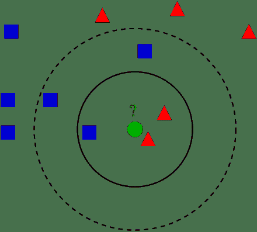
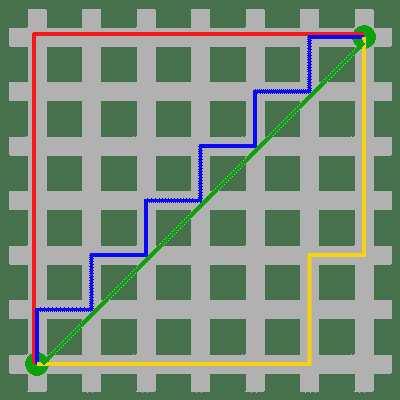
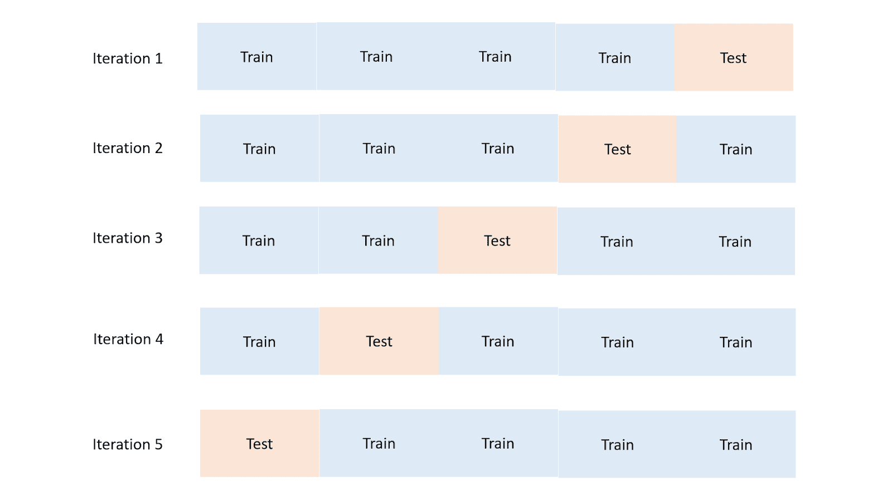
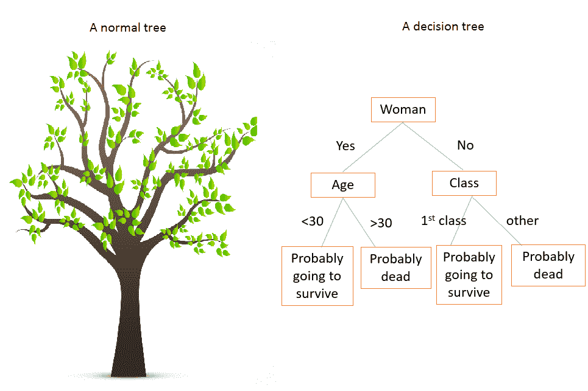
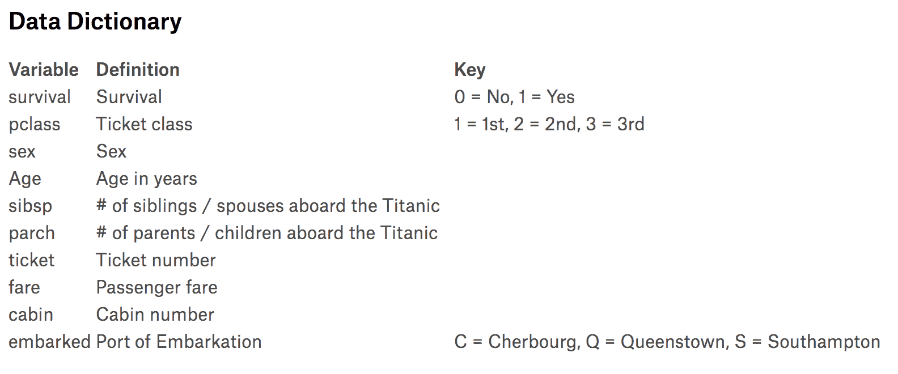
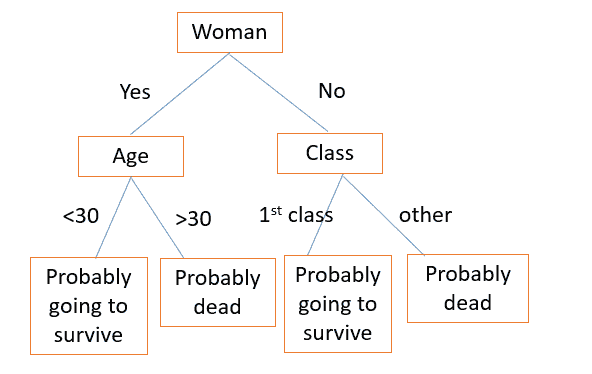
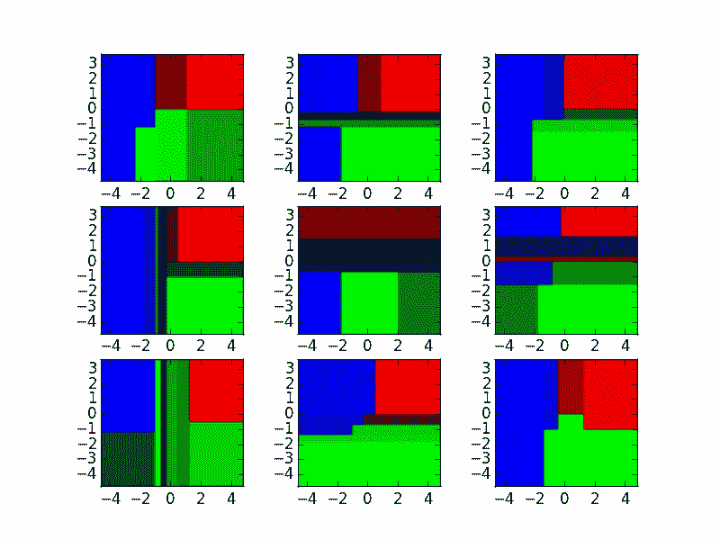
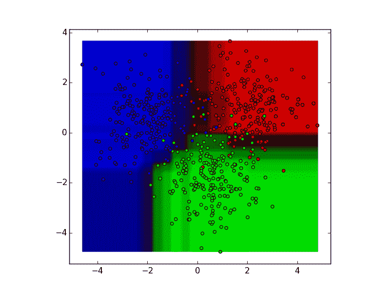

# 2.3 监督学习 III

> 原文：[Machine Learning for Humans, Part 2.3: Supervised Learning III](https://medium.com/machine-learning-for-humans/supervised-learning-3-b1551b9c4930)
> 
> 作者：
> 
> 译者：[飞龙](https://github.com/wizardforcel)
> 
> 协议：[CC BY-NC-SA 4.0](http://creativecommons.org/licenses/by-nc-sa/4.0/)
> 
> 非参数化模型：KNN、决策树和随机森林。包含交叉验证、超参数调优和集成模型。

## 非参数学习器

> 事情变得有点…奇怪了。

我们目前为止涉及的方法，线性回归，对率回归和 SVM ，它们的模型形式是预定义的。与之相反，非参数学习器事先没有特定的模型结构。在训练模型之前，我们不会推测我们尝试习得的函数`f`的形式，就像之前的线性回归那样。反之，模型结构纯粹由数据定义。

这些模型对于训练数据的形状更加灵活，但是有时会有可解释性的代价。不久你就会更理解它。让我们继续吧。

## K 最近邻（KNN）

> 你是你的最亲密的 K 个朋友的均值。

KNN 看起来图样图森破，不像是机器学习算法。它的思路是，通过寻找 K 个最近的数据点的标签，来标记测试数据点`x`。

看一看下面的图像。让我们假设，你想知道，迷之绿色圆圈是红色三角还是蓝色方块。你怎么做呢？

你可以尝试提出一个迷之方程，它查看绿色圆圈在坐标平面的哪里，并作出相应的预测。或者，你可以仅仅查看三个最近的邻居，并猜测绿色圆圈可能是个红色三角。你也可以进一步扩展圆圈，并查看五个最近邻，并这样作出预测（五个最近邻里面，有三个蓝色方块，所以我们猜测，`k=5`时迷之绿色圆圈是蓝色方块。

> KNN 的演示，其中`k=1, 3, 5`。为了划分上面的迷之绿色圆圈（`x`），查看它的单个最近邻，是个“红色三角”。所以我们猜测`ŷ`为“红色三角”。`k=3`时，查看三个最近邻：这里的众数仍然是“红色三角”，所以`ŷ`为“红色三角”。`k=5`时，我们选取五个最近邻的众数，要注意`ŷ`变为了“蓝色方块”。图片来自维基百科。

就是这样。这就是 KNN。你查看了 K 个最近的数据点，如果变量是连续的（例如房价），取它们的均值；如果变量是离散的（例如猫或者狗），取它们的众数。

如果你打算猜测未知房价，你可以选取一些地理上邻近的房子，然后取平均，你就会得到一些很棒的猜测。这可能甚至优于参数化回归模型，一些经济学家构建了它们来估计卧室/浴室、邻近的学校、公共交通的距离，以及其它的数量的参数。

> 如何使用 KNN 来预测房价：
> 
> 1) 储存训练集。`X`是特征，例如邮政编码、邻居、卧室数量、面积、公共交通的距离，以及其它。`Y`是对应的售价。
> 
> 2) 将你的训练集排序，按照与测试集中的房子的相似性，基于`X`中的特征。我们下面会定义“相似性”。
> 
> 3) 计算 K 个最邻近的房子的均值。这就是你对售价（也就是`ŷ`）的猜测。

KNN 不需要预定义的参数化函数`f(X)`，它用于将`Y`与`X`相关联。这使得它更适合关系过于复杂，不能用简单的线性模型表示的情况。

### 距离度量：定义和计算“邻近性”

在寻找“最近邻”的时候，你如何计算问题中的数据点的距离呢？你如何在数学上判断，示例中的哪个蓝色方块和红色三角更接近绿色圆圈？尤其是，如果你无法画出一幅漂亮的二维图像，用眼睛观测它？

最直接的度量是欧氏（几何）距离（“像乌鸦飞过”的一条直线）。另一个是曼哈顿（街区）距离，就像在城市块中行走。你可以想象，在涉及到 Uber 司机的费用计算的模型中，曼哈顿距离更加实用。

> 绿色直线为欧氏距离。蓝色直线为曼哈顿距离。来源：维基百科

还记得用于寻找直角三角形斜边长度的毕达哥拉斯（勾股）定理嘛？

> `c`为斜边（上面的绿色直线），`a`和`b`是两个直角边（上面的红色直线）。

通过计算`a`和`b`长度的平方和的平方根，我们就解出了`c`，求出了斜边长度。这里`a`和`b`是三角形的直角（正交）边（也就是，它们互为 90 度角，在空间中垂直）。

给定两个正交方向的向量的情况下，求解斜边长度的思路，可以推广到多维。这就是 N 维空间的点`p`和`q`的欧氏距离`d(p,q)`的推导方式：

> 欧氏距离的公式，由勾股定理推出。

使用这个公式，你可以计算所有训练数据点，到你尝试标注的数据点的邻近度，并选取 K 个最近邻的均值或众数，来做出你的预测。

通常你不需要手动计算任何距离，用搜索引擎简单搜索一下，你就能在 NumPy 或者 SciPy 找到预构建的函数，会为你做这个事情，例如，`euclidean_dist = numpy.linalg.norm(p-q)`。但是看到八年级的集合概念如何有助于构建当今的 ML 模型，这很有趣。

### 选取`k`：使用交叉验证调优超参数

为了决定我们使用哪个`k`，你可以测试不同的 KNN 模型，使用交叉验证以及`k`的不同值。

*   将你的训练集分成两部分，在一部分上训练模型，将保留的部分用作测试集。

*   通过将模型的预测（`ŷ`），与测试数据的真实值（`y`）相比，看看你的模型表现如何。

*   在所有迭代中，通常选取误差最小的模型。

> 交叉验证的演示。分块和迭代的数量可以修改。

### K 的较高值防止过拟合

K 的较高值能防止过拟合，但是如果 K 太高的话，你的模型会有很大偏差，并且不灵活。选取一个极端的示例：如果`k=N`（数据点的总数），模型就失效了，将所有测试数据分类为训练数据的均值或者众数。

如果动物数据集中的单个最常见的动物是苏格兰折耳猫，`k=N`（训练观测值数量）的 KNN 会将实际上的每个其它动物预测成它。在 Vishal 看来，这个很棒，但 Samer 不同意。

> 完全没有来由的苏格兰折耳猫`.gif`。我们可以休息一下。

### 真实世界中使用 KNN 的地方

一些你可以使用 KNN 的地方：

*   分类：诈骗检测。模型可以使用新的训练样本马上更新，因为你仅仅是存储新的数据点，这允许你快速适应新的诈骗方法。

*   回归：预测房价。在房价预测中，字面上的“最近邻”实际上很好暗示了价格上的相似。KNN 在物理相似性很重要的领域很实用。

*   填充缺失的训练数据。如果你的`.csv`中的一列有大量缺失值，你可以通过选取均值或者众数填充数据。KNN 可能会给你每个缺失值的更加准确的猜测。

## 决策树和随机森林

> 制作一颗好的决策树就像玩“20个问题”的游戏。

> 右边的决策树描述了泰坦尼克号的生还者规律。

决策树根节点的第一次分割，就像是 20 个问题中的第一个问题：你打算尽可能干净地分隔数据，所以这个分割的信息增益应该最大。

如果你的朋友说，“我正在想一个名词，问我 20 个是或不是的问题来猜猜它”，并且你的第一个问题是“它是土豆嘛？”，你就太蠢了。因为如果它们说“不是”，你没有获得任何信息。除非你知道你的朋友整天都在想土豆，或者刚刚在想它，那么你就猜对了。

反之，类似“这是一个物体嘛？”的问题可能更有意义。

这有点类似医院分类病人，或者做出不同的诊断的方式。它们先问一些问题，并检查一些重要的指标来判断你是否马上就要挂了，还是不是。当你进门的时候，它们不会一开始就做切片检查，或者检查你是否得了胰腺癌。

有几种方式来量化信息增益，以便你能根本上求解训练集的每个可能的分割，以及每个分割的信息增益。你可以用这个方式，尽可能高效地预测每个标签或值。

现在，让我们查看一个特定的数据集，并讨论我们如何选择分割。

### 泰坦尼克数据集

Kaggle 的泰坦尼克数据集大量用于机器学习入门。当泰坦尼克沉没时，2224 个乘客和乘员中有 1502 个死亡。虽然包含一些运气成分，女人、孩子和头等舱更有可能生还。如果你回去看看上面的决策树，你会看到，它某些程度上反映了性别、年龄和舱位的变化。

### 选择决策树中的分割

熵是集合中的无序的总数，由[基尼系数](https://en.wikipedia.org/wiki/Gini_coefficient)和[交叉熵](https://en.wikipedia.org/wiki/Cross_entropy)度量。如果值相当混杂，熵就很大；如果你能干净地分割数据，就没有熵。对于父节点的每个分割，你需要让子节点尽可能纯粹，也就是熵最小。例如，在泰坦尼克中，性别是生还者的重要决定因素，所以将这个特征用于第一次分割十分有意义，并且它是拥有最大信息增益的特征。

让我们看一看泰坦尼克的变量：

> 来源：Kaggle

我们通过选取这些变量之一，以及根据它分割数据集，来构建决策树。

第一次分割将我们的数据集分为男性和女性。之后女性分支又按照年龄分割（使熵最小的分割）。与之类似，男性分支按照舱位分割。通过对新的乘客遍历这棵树，你可以使用它来猜测它们是否挂了。

泰坦尼克的示例解决了分类问题（生存或者死亡）。如果我们将决策树用于回归，例如预测房价，我们可以分割决定房价的最重要的特征。面积：大于或小于 xxx？卧室或者浴室数量：大于或小于 xxx？

之后，在测试期间，你需要用特定的房子遍历所有分割，并取叶子节点的所有房价的均值（最底下的节点），这些房子就会成为你的售价预测。

决策树是高效的，因为它们易于解读，即使对凌乱的数据也很强大，并且一旦训练完成，部署的开销很小。决策树也擅长于处理混合数据（数值或类别）。

也就是说，决策树的训练开销很大，过拟合的风险很大，并且容易找到局部最优，因为它们在分割之后就不能回溯了。为了解决这些缺陷，我们转向了一种方式，它演示了将多个决策树整合为一个模型的力量。

## 随机森林：决策树的集成

由多个模型整合的模型叫做集成模型，这通常是一个制胜策略。

单个决策树可能做出很多错误判断，因为它有很多非黑即白的判断。随机森林是个元估计其，它继承了多个决策树，并拥有一些可观的改进：

*   每个节点上分割的特征数量限制为总体的一定百分比（这是个可以调整的超参数，详见 [scikit-learn 的文档](https://scikit-learn.org/stable/modules/generated/sklearn.ensemble.RandomForestClassifier.html)）。这确保了继承模型不会过度依赖单个特征，并且公平地利用所有潜在的预测性特征。

*   每棵树从原始数据集抽取随机样本，来生成自己的分割，这添加了进一步的随机元素来防止过拟合。

这些改进也防止了树的高度相关。如果没有上面的第一条和第二条，每棵树都是相同的，因为递归的二元分割时决定性的。

为了演示，看看下面的九个决策树分类器：

> 来源：[http://xenon.stanford.edu/~jianzh/ml/](http://xenon.stanford.edu/~jianzh/ml/)

这些决策树分类器可以集成到随机森林中，它整合了这些输入。将横轴和纵轴看做特征`x1`和`x2`。对于每个特征的特定值，决策树输出“蓝色”、“绿色”和“红色”的分类。

这些结果通过众数（分类）或者均值（回归）整合为单个集成模型，它优于单个决策树的输出。

随机森林是建模过程的一个非常不错的起始点，因为它们对于不整洁的数据拥有高容忍度的强大表现。并且，对于在众多特征中找到最重要的特征非常实用。

也有很多机智的继承模型，它组合了决策树并产生非常棒的表现。请查看 XGBoost（eXtreme Gradient Boosting）的示例。

## 之后，我们就完成了监督学习的学习

非常不错。这一节中我们涉及了：

*   两个非参数监督学习算法：KNN 和决策树
*   距离和信息增益的度量
*   随机森林，它是集成模型的示例
*   交叉验证和超参数调优

我希望，你现在有了一些可靠的直觉，对于在给定训练集的情况下，我们如何习得`f`，以及使用它和测试数据做出预测。

在“第三部分：无监督学习”中，我们讨论当我们拥有不带标签的训练集时，如何解决问题。

## 练习材料和扩展阅读

### 2.3a 实现 KNN

尝试[这个攻略](https://machinelearningmastery.com/tutorial-to-implement-k-nearest-neighbors-in-python-from-scratch/)，在 Python 中从零开始实现 KNN。你可能也打算看一看 scikit-learn 的文档，来体验预构建的实现的工作方式。

### 2.3b 决策树

尝试[《An Introduction to Statistical Learning》](https://www-bcf.usc.edu/~gareth/ISL/)中的第八章的决策树实验。你可以使用泰坦尼克训练集来玩玩，并且查看[这个教程](https://www.analyticsvidhya.com/blog/2016/04/complete-tutorial-tree-based-modeling-scratch-in-python/)，它涵盖了与上面相同的概念和代码。这里是随机森林的 [scikit-learn 实现](https://scikit-learn.org/stable/modules/generated/sklearn.ensemble.RandomForestClassifier.html)，可以在数据集上开箱即用。