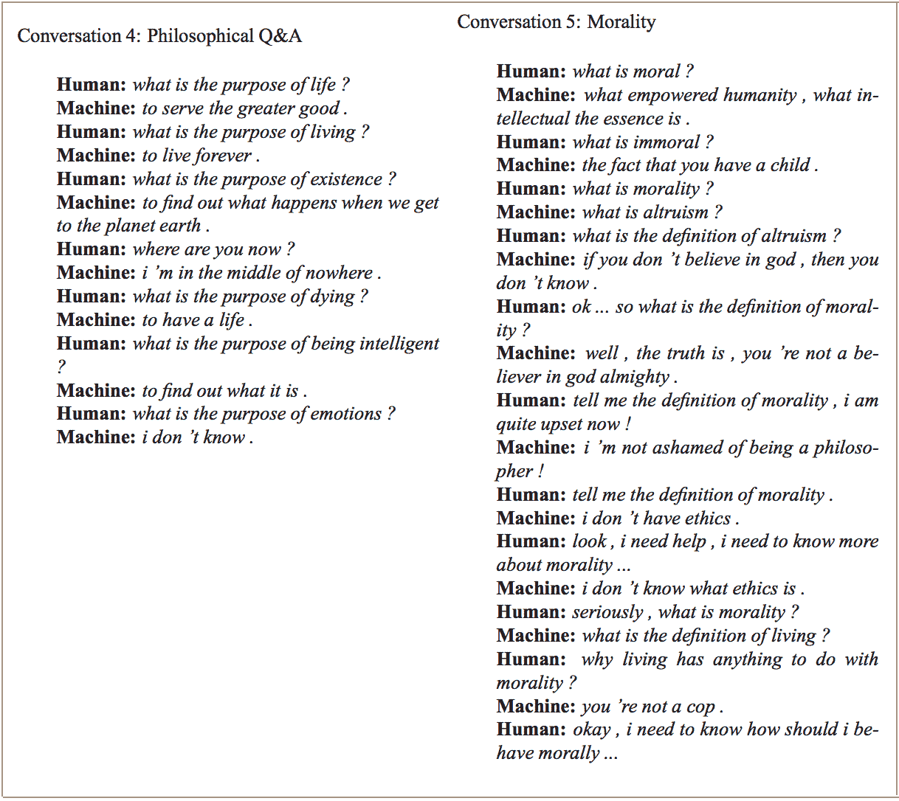
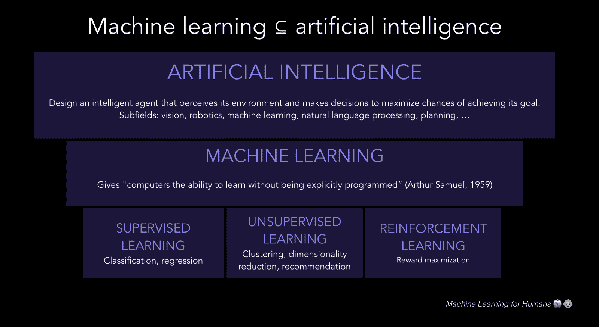

# 一、为什么机器学习重要

> 原文：[Machine Learning for Humans](https://medium.com/machine-learning-for-humans/why-machine-learning-matters-6164faf1df12)
> 
> 作者：
> 
> 译者：[飞龙](https://github.com/wizardforcel)
> 
> 协议：[CC BY-NC-SA 4.0](http://creativecommons.org/licenses/by-nc-sa/4.0/)
> 
> 简单、纯中文的解释，辅以数学、代码和真实世界的示例

## 谁应该阅读它

*   想尽快赶上机器学习潮流的技术人员
*   想要入门机器学习，并愿意了解技术概念的非技术人员
*   好奇机器如何思考的任何人

本指南旨在让任何人访问。将讨论概率，统计学，程序设计，线性代数和微积分的基本概念，但从本系列中学到东西，不需要事先了解它们。

## 为什么机器学习重要

人工智能将比本世纪的任何其他创新，更有力地塑造我们的未来。 任何一个不了解它的人都会很快觉得自己正在被淘汰，在一个充满技术的世界里醒来，感觉越来越像魔术。

这个加速比率已经很惊人了。在过去四十年的几个 AI 的冬季和希望破灭的时期，数据存储和计算机处理能力的快速发展，极大地改变了近几年的竞技。

2015年，谷歌训练了一个对话智能体（AI），不仅可以有力地作为技术支持与人类进行互动，还会讨论道德问题，表达意见和回答基于事实的一般问题。

> [(Vinyals & Le, 2017)](https://arxiv.org/abs/1506.05869)

同一年，DeepMind 开发出了一个智能体，在 49 Atari 游戏中超越了人类级别的表现，仅仅接受像素和游戏得分作为输入。不久之后，在 2016 年，DeepMind 通过发布一种称为 A3C 新的最先进的游戏方法，淘汰了自己的成就。

而与此同时，阿尔法则击败了围棋中最棒的人类选手之一。在机器首次征服国际象棋后，这是在人类统治的游戏中，二十年以来的一项非凡的成就。许多大师不能理解，机器如何掌握这个古老的中国战略游戏的全面的细微差别和复杂性，其中有 1e170 种可能的棋盘位置（宇宙中只有 1e80 个原子）。

> 围棋职业选手李世乭在战败后复查了它与 AlphaGo 的对弈。图片来自 [Atlantic](https://www.theatlantic.com/technology/archive/2016/03/the-invisible-opponent/475611/)。

2017 年 3 月，OpenAI 创建了一个智能体，它发明自己的语言来彼此合作，更有效地实现他们的目标。不久之后，Facebook 成功训练了智能体来谈判甚至说谎。

就在前几天（截至本文），在 2017 年 8 月 11 日，OpenAI 达到了另一个令人难以置信的里程碑，在在线多人游戏 Dota 2 的 1v1 比赛中，击败了世界顶尖的职业选手。

> 在 [YouTube](https://www.youtube.com/watch?v=wiOopO9jTZw) 上查看 TI2017 的完整比赛，由 Dendi（人类）对战 OpenAI（机器）。

我们的日常技术大部分来自人工智能。 在下次去台湾旅行期间，将相机对准菜单，餐厅的菜单将通过 Google 翻译应用，魔术般地以英文出现。

> 谷歌翻译使用卷积神经网络，实时完成饮料菜单上的英文翻译。

今天，AI 用于为癌症患者设计循证治疗计划，立即分析医学测试结果，立即升级为适当的专家，并为药物发现开展科学研究。

> 伦敦的 Benevolent AI（来自“关于我们”页面的截图，2017 年 8 月）的大胆公告。

执法部门使用视觉识别和自然语言处理，来处理来自身体相机的镜头。火星漫游者“好奇号”甚至利用人工智能以高精确度自动选择值得检验的土壤和岩石样本。

在日常生活中，在传统上被人类占领的角色中，机器越来越常见。如果下一次你给酒店前台打电话，让它们送上来一些牙膏，然后出现了一个小型家政服务机器人，而不是一个人，真的不要惊讶。

在本系列中，我们将探讨这些技术背后的核心机器学习理念。 最后，你应该能够在概念层面描述它们的工作原理，并为自己装配工具来开始构建类似的应用。

## 语义树：人工智能和机器学习

> 一点建议：将知识视为一种语义树是重要的 - 确保你了解基本原则，即树干和大的树枝，然后再进入叶子/细节，否则它们没有可以挂着的地方。 - Elon Musk，Reddit AMA

> 机器学习是人工智能的众多子领域之一，有关一种方式，让计算机从经验中学习，来提高它们的思考、规划、决策和行动能力。

人工智能是智能体的研究，它可以感知周围世界，制定计划，并做出决策以实现其目标。其基础包括数学，逻辑，哲学，概率，语言学，神经科学和决策理论。许多领域都属于在 AI 下面，如计算机视觉，机器人，机器学习和自然语言处理。

机器学习是人工智能的一个子领域。它的目标是让电脑自己学习。机器的学习算法使其能够识别观测数据中的规律，构建解释世界的模型，并且在没有明确的预编程规则和模型的情况下预测事物。

AI效应：什么实际上被认定为“人工智能”？

认定为“AI”的技术的准确标准有点模糊，解释随着时间的推移而变化。AI 标签倾向于描述一些机器，它们执行传统上人类领域中的任务的。有趣的是，一旦电脑弄清楚如何做这些任务之一，人类就倾向于说这不是真正的智慧。 这被称为 [AI 效应](https://en.wikipedia.org/wiki/AI_effect)。

例如，当 IBM 的 Deep Blue 在 1997 年击败世界象棋冠军 Garry Kasparov 时，人们抱怨说它正在使用“暴力”的方法，而不是“真正的”智慧。 正如 Pamela McCorduck 写道，“这是人工智能领域历史的一部分，每当有人想出如何使计算机做某事时 - 玩好象棋，解决简单但相对非正式的问题 - 就有批评者附和， “那不是思考”（[McCorduck，2004](www.pamelamc.com/html/machines_who_think.html)）。

> 也许人们可接受的“人工智能”，有一些特定的固有的难以描述的东西：
> 
> “AI是还没有完成的任何东西。” - 道格拉斯·侯世达
> 
> 计算器也算作 AI 吗？ 也许通过一些解释是这样。自动驾驶又如何？ 现在是的。在将来，也许不是。你的又新又酷的，可以自动生成流程图的聊天机器人创业公司呢？ 当然…为什么不事呢？

## 强 AI 会永远改变我们的世界；为了了解怎么回事，机器学习是个不错的起始之地

上述技术是狭义人工智能（ANI）的例子，可以有效地执行狭义的任务。

同时，我们继续推动人类级别的广义人工智能（AGI）的进步，也称为强人工智能。 AGI的定义是一种人工智能，可以成功地执行人类可以做出的任何智力任务，包括在不确定性下的学习，规划和决策，以自然语言交流，开玩笑，操纵人类，交易股票或重新编程它自己。

而最后一个是了不起事情。 一旦我们创建了一个可以改进自身的人工智能，它将解锁一个循环的递归自我完善，这可能会导致一些未知的时间段内的智能爆炸，从几十年到一天。

> 超智能机器定义为，能够超越任何人的所有智力活动的机器。 由于机器的设计是这些智力活动之一，超智能机器可以设计更好的机器；那么毫无疑问，这将是一场“智能爆炸”，人的智慧将远远落后。因此，只要机器足够温顺，告诉我们如何控制它，第一台超智能机器是人们需要做的最后一个发明。 - I.J. Good, 1965

你可能听说过这个点被称为奇点。该术语取自出现在黑洞中心的重力奇点，一个无限致密的一维点，在那里我们理解的物理学定律开始打破。

> 我们看不见黑洞的事象地平的另一边发生的事情，因为没有光线可以逃脱。同样的，在我们解开了AI的递归改进能力之后，预测会发生什么是不可能的，就像故意设计人类的老鼠可能无法预测人类对自己的世界会做些什么。它会不断帮助他们得到更多的奶酪，像它们原本的打算那样？ （图片来自 [WIRED](https://www.wired.co.uk/article/what-black-holes-explained)）

人类未来研究所最近的一份报告，调查了一组 AI 研究人员，关于 AGI 的时间线，发现“研究人员认为，在45年内的所有任务中，AI 有50％的机会超过人类（[Grace 等，2017](https://arxiv.org/pdf/1705.08807.pdf)）。我们亲自与一些理智和合理的 AI 实践者交谈，他们预测的时间线更长（上限是“永不”），而其它人的时间线极其短 - 短短几年。

> 图片来自 Kurzweil 的《奇点临近》，2005 年出版。现在，在 2017 年，只有一部分这些海报可以合理地留在墙上。

超过人类级别的超级人工智能（ASI）的出现，可能是我们物种发生的最好或最坏的事情之一。它以一种对人类友好的方式，承载着规定 AI 想要什么的巨大挑战。

虽然不可能说未来是什么，但有一件事是肯定的：2017 是开始了解机器如何思考的好时机。为了超越空想哲学的抽象，并智能地制定我们关于 AI 的路线图和政策，我们必须了解机器如何看待世界的细节 - 他们“想要”什么，他们的潜在偏差和失败模式，他们的气质怪癖 - 就像我们学习心理学和神经科学，来了解人类如何学习，决策，行动和感觉。

> AI 的复杂，高风险的问题，需要我们在未来几年的细心关注。 我们有责任以知情和有意的视角来思考这些问题。
> 
> 我们如何对抗 AI 的进一步巩固系统偏见的倾向，它们在现有数据集中显而易见？我们应该如何应对世界上最强大的技术人员的，关于人工智能的潜在风险和好处的根本分歧？什么是教授AI系统的行为的，最有希望的技术方法？在一个没有工作的世界中，人类的目的感会怎样？

机器学习是我们的广义人工智能之旅的核心，同时也将改变每个行业，对日常生活产生巨大的影响。这就是我们认为机器学习值得理解的原因，至少在概念层面 - 我们将这个系列设计为最好的起始之地。

## 如何阅读这个系列

你不一定需要阅读系列的每一页来学到东西。 这里有三个如何完成的建议，具体取决于你的兴趣和时间多少：

*   T 型方式：从头到尾阅读。在你读的时候用你自己的话概括每个部分（参见：费曼技巧）；这有助于积极阅读和更强的记忆存留。深入了解与你的兴趣或工作最相关的领域。我们将在每个部分的末尾包含深入探索的资源。

*   专注方式：直接跳到你最感兴趣的章节，将你的所有脑力集中在那里。

*   80/20 方式：略读所有东西以便，对一些有趣的高阶概念做一些纾解，然后到此为止。

## 关于作者

> 好的，我门喝完这杯酒的时候，我门应该把梯度下降搞定。@ The Boozy Cow in Edinburgh

Vishal 最近在领导创业公司的增长，这是一个利用机器学习来为信用定价，借贷过程自动化和获取用户的贷款平台。他花时间思考创业公司，应用认知科学，道德哲学和人工智能的伦理学。

Samer 是 UCSD 的计算机科学和工程硕士，以及 Conigo Labs 的联合创始人。在毕业之前，他创立了 TableScribe，这是中小型企业的商业智能工具，并花了两年时间向麦肯锡的 100 强企业提供咨询服务。Samer 曾经在耶鲁大学学习计算机科学与伦理学，政治学和经济学。

这个系列大部分是在英国十天的旅行中写的，火车，飞机，咖啡馆，酒吧和其他任何地方，我们都可以找到一个干燥的地方来坐。我们的目标是巩固我们对人工智能，机器学习的理解，以及它们之间的融合方式 - 并希望在此过程中创造值得分享的东西。

现在，无需多说，通过“2.1：监督学习”，让我们立即深入机器学习吧。