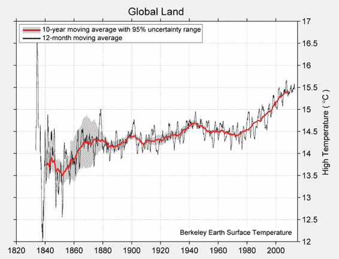
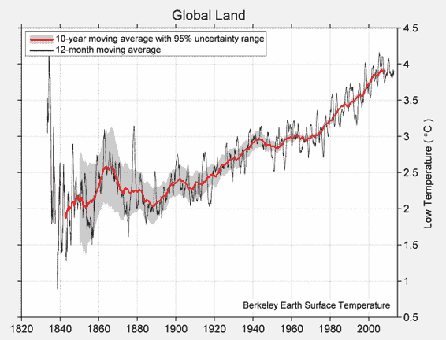

# 四、数据类型

> 原文：[Data Types](https://github.com/data-8/textbook/tree/gh-pages/chapters/04)
> 
> 译者：[飞龙](https://github.com/wizardforcel)
> 
> 协议：[CC BY-NC-SA 4.0](http://creativecommons.org/licenses/by-nc-sa/4.0/)
> 
> 自豪地采用[谷歌翻译](https://translate.google.cn/)

每个值都有一个类型，内建的`type`函数返回任何表达式的结果的类型：

```
type(3)
int
type(3/1)
float
```

表达式的`type`是其最终值的类型。 所以，`type`函数永远不会表明，表达式的类型是一个名称，因为名称总是求值为它们被赋予的值。

```
x = 3
type(x) # The type of x is an int, not a name
int
```

我们已经遇到的另一种类型是内置函数。 Python 表明这个类型是一个`builtin_function_or_method`；函数和方法之间的区别在这个阶段并不重要。

```
type(abs)
builtin_function_or_method
```

这一章会探索其他实用的数据类型。

## 字符串

世界上大部分的数据都是文本，计算机中表示的文本被称为字符串。 字符串可以代表一个单词，一个句子，甚至是图书馆中每本书的内容。 由于文本可以包含数字（如`5`）或布尔值（`True`），字符串也可以描述这些东西。

表达式的含义取决于其结构和正在组合的值的类型。 因此，例如，将两个字符串加在一起会产生另一个字符串。 这个表达式仍然是一个加法表达式，但是它组合了一个不同类型的值。

```
"data" + "science"
'datascience'
```

加法完全是字面的；它将这两个字符串组合在一起而不考虑其内容。 它不增加空间，因为这些是不同的词；它取决于程序员（你）来指定。

```
"data" + " " + "science"
'data science'
```

单引号和双引号都可以用来创建字符串：`'hi'`和`"hi"`是相同的表达式。 双引号通常是首选，因为它们允许在字符串中包含单引号。

```
"This won't work with a single-quoted string!"
"This won't work with a single-quoted string!"
```

为什么不能？ 试试看。

`str`函数返回任何值的字符串表示形式。 使用此函数，可以构建具有嵌入值的字符串。

```
"That's " + str(1 + 1) + ' ' + str(True)
"That's 2 True"
```

## 字符串方法

可以使用字符串方法，从现有的字符串中构造相关的字符串，这些方法是操作字符串的函数。 这些方法通过在字符串后面放置一个点，然后调用该函数来调用。

例如，以下方法生成一个字符串的大写版本。

```
"loud".upper()
'LOUD'
```

也许最重要的方法是`replace`，它替换字符串中的所有子字符串的实例。 `replace`方法有两个参数，即被替换的文本和替代值。

```
'hitchhiker'.replace('hi', 'ma')
'matchmaker'
```

字符串方法也可以使用变量名称进行调用，只要这些名称绑定到字符串。 因此，例如，通过首先创建`"ingrain"`然后进行第二次替换，以下两个步骤的过程从`"train"`生成`"degrade"`一词。

```
s = "train"
t = s.replace('t', 'ing')
u = t.replace('in', 'de')
u
'degrade'
```

注意`t = s.replace('t', 'ing')`的一行，不改变字符串`s`，它仍然是`"train"`。 方法调用`s.replace('t', 'ing')`只有一个值，即字符串`"ingrain"`。

```
s
'train'
```

这是我们第一次看到方法，但是方法并不是字符串仅有的。 我们将很快看到，其他类型的对象可以拥有它们。

## 比较

布尔值通常来自比较运算符。 Python 包含了各种比较值的运算符。 例如，`3 > 1 + 1`。

```
3 > 1 + 1
True
```

值`True`表明这个比较是有效的；Python 已经证实了`3`和`1 + 1`之间关系的这个简单的事实。下面列出了一整套通用的比较运算符。

| 比较 | 运算符 | True 示例 | False 示例 |
| --- | --- | --- | --- |
| 小于 | `<` | `2 < 3` | `2 < 2` |
| 大于 | `>` | `3 > 2` | `3 > 3` |
| 小于等于 | `<=` | `2 <= 2` | `3 <= 2` |
| 大于等于 | `>=` | `3 >= 3` | `2 >= 3` |
| 等于 | `==` | `3 == 3` | `3 == 2` |
| 不等于 | `!=` | `3 != 2` | `2 != 2` |

一个表达式可以包含多个比较，并且为了使整个表达式为真，它们都必须有效。 例如，我们可以用下面的表达式表示`1 + 1`在`1`和`3`之间。

```
1 < 1 + 1 < 3
True
```

两个数字的平均值总是在较小的数字和较大的数字之间。 我们用下面的数字`x`和`y`来表示这种关系。 你可以尝试不同的`x`和`y`值来确认这种关系。

```
x = 12
y = 5
min(x, y) <= (x+y)/2 <= max(x, y)
True
```

字符串也可以比较，他们的顺序是字典序。 较短的字符串小于以较短的字符串开头的较长的字符串。

```
"Dog" > "Catastrophe" > "Cat"
True
```

## 序列

值可以分组到集合中，这允许程序员组织这些值，并使用单个名称引用它们中的所有值。 通过将值分组在一起，我们可以编写代码，一次执行许多数据计算。

在几个值上调用`make_array`函数，将它们放到一个数组中，这是一种顺序集合。 下面，我们将四个不同的温度收集到一个名为`temps`的数组中。 这些分别是 1850 年，1900 年，1950 年和 2000 年的几十年间，地球上所有陆地的估计日平均绝对高温（摄氏度），表示为 1951 年至 1980 年间平均绝对高温的偏差，为 14.48 度。

集合允许我们使用单个名称，将多个值传递给一个函数。 例如，`sum`函数计算集合中所有值的和，`len`函数计算其长度。 （这是我们放入的值的数量。）一起使用它们，我们可以计算一个集合的平均值。

```
sum(highs)/len(highs)
14.434000000000001
```

日高温和低温的完整图表在下面。

### 日高温均值



### 日低温均值



## 数组

Python 中有很多种类的集合，我们在这门课中主要使用数组。 我们已经看到，`make_array`函数可以用来创建数值的数组。

数组也可以包含字符串或其他类型的值，但是单个数组只能包含单一类型的数据。 （无论如何，把不相似的数据组合在一起，通常都没有意义）。例如：

```
english_parts_of_speech = make_array("noun", "pronoun", "verb", "adverb", "adjective", "conjunction", "preposition", "interjection")
english_parts_of_speech
array(['noun', 'pronoun', 'verb', 'adverb', 'adjective', 'conjunction',
       'preposition', 'interjection'], 
      dtype='<U12')
```

> 译者注：
> 
> ```
> import numpy as np
> make_array = lambda *args: np.asarray(args)
> ```

返回到温度数据，我们创建 1850 年，1900 年，1950 年和 2000 年的几十年间，[日平均高温](http://berkeleyearth.lbl.gov/auto/Regional/TMAX/Text/global-land-TMAX-Trend.txt)的数组。

```
baseline_high = 14.48
highs = make_array(baseline_high - 0.880, 
                   baseline_high - 0.093,
                   baseline_high + 0.105, 
                   baseline_high + 0.684)
highs
array([ 13.6  ,  14.387,  14.585,  15.164])
```

数组可以用在算术表达式中来计算其内容。 当数组与单个数组合时，该数与数组的每个元素组合。 因此，我们可以通过编写熟悉的转换公式，将所有这些温度转换成华氏温度。

```
(9/5) * highs + 32
array([ 56.48  ,  57.8966,  58.253 ,  59.2952])
```


数组也有方法，这些方法是操作数组值的函数。 数值集合的均值是其总和除以长度。 以下示例中的每对括号都是调用表达式的一部分；它调用一个无参函数来对数组`highs`进行计算。

```
highs.size
4
highs.sum()
57.736000000000004
highs.mean()
14.434000000000001
```

### 数组上的函数

`numpy`包，在程序中缩写为`np`，为 Python 程序员提供了创建和操作数组的，方便而强大的函数。

```
import numpy as np
```

例如，`diff`函数计算数组中每两个相邻元素之间的差。 差数组的第一个元素是原数组的第二个元素减去第一个元素。

```
np.diff(highs)
array([ 0.787,  0.198,  0.579])
```

[完整的 Numpy 参考](http://docs.scipy.org/doc/numpy/reference/)详细列出了这些功能，但一个小的子集通常用于数据处理应用。 它们分组到了`np`中不同的包中。 学习这些词汇是学习 Python 语言的重要组成部分，因此在你处理示例和问题时，请经常回顾这个列表。

但是，你不需要记住这些，只需要将它用作参考。

每个这些函数接受数组作为参数，并返回单个值。

| 函数 | 描述 |
| --- | --- |
| `np.prod` | 将所有元素相乘 |
| `np.sum` | 将所有元素相加 |
| `np.all` | 测试是否所有元素是真值 （非零数值是真值） |
| `np.any` | 测试是否任意元素是真值（非零数值是真值） |
| `np.count_nonzero` | 计算非零元素的数量 |

每个这些函数接受字符串数组作为参数，并返回数组。

| 函数 | 描述 |
| --- | --- |
| `np.char.lower` | 将每个元素变成小写 |
| `np.char.upper` | 将每个元素变成大写 |
| `np.char.strip` | 移除每个元素开头或末尾的空格 |
| `np.char.isalpha` | 每个元素是否只含有字母（没有数字或者符号） |
| `np.char.isnumeric` | 每个元素是否只含有数字（没有字母） |

每个这些函数接受字符串数组和一个搜索字符串。

| 函数 | 描述 |
| --- | --- |
| np.char.count | 在数组的元素中，计算搜索字符串的出现次数 |
| np.char.find | 在每个元素中，搜索字符串的首次出现位置 |
| np.char.rfind | 在每个元素中，搜索字符串的最后一次出现位置 |
| np.char.startswith | 每个字符串是否以搜索字符串起始 |

## 范围

范围是一个数组，按照递增或递减的顺序排列，每个元素按照一定的间隔分开。 范围在很多情况下非常有用，所以值得了解它们。

范围使用`np.arange`函数来定义，该函数接受一个，两个或三个参数：起始值，终止值和“步长”。

如果将一个参数传递给`np.arange`，那么它将成为终止值，其中`start = 0`，`step = 1`。 两个参数提供了起始值和终止值，`step = 1`。 三个参数明确地提供了起始值，终止值和步长。

范围始终包含其`start`值，但不包括其`end`值。 它按照`step`计数，并在到达`end`之前停止。

```
np.arange(end): An array starting with 0 of increasing consecutive integers, stopping before end.
np.arange(5)
array([0, 1, 2, 3, 4])
```

要注意，数值从`0`起始，并仅仅增加到`4`，并不是`5`。

```
np.arange(start, end): An array of consecutive increasing integers from start, stopping before end.
np.arange(3, 9)
array([3, 4, 5, 6, 7, 8])
np.arange(start, end, step): A range with a difference of step between each pair of consecutive values, starting from start and stopping before end.
np.arange(3, 30, 5)
array([ 3,  8, 13, 18, 23, 28])
```

这个数组从`3`起始，增加了步长`5`变成`8`，然后增加步长`5`变成`13`，以此类推。

当你指定步长时，起始值、终止值和步长可正可负，可以是整数也可以是分数。

```
np.arange(1.5, -2, -0.5)
array([ 1.5,  1. ,  0.5,  0. , -0.5, -1. , -1.5])
```

### 示例：莱布尼茨的 π 公式

伟大的德国数学家和哲学家戈特弗里德·威廉·莱布尼茨（Gottfried Wilhelm Leibniz，1646 ~ 1716年）发现了一个简单分数的无穷和。 公式是：


虽然需要一些数学来确定它，但我们可以用数组来说服我们自己，公式是有效的。 让我们计算莱布尼茨的无穷和的前 5000 个项，看它是否接近 π。


我们将计算这个有限的总和，首先加上所有的正项，然后减去所有负项的和 [1]：


> [1] 令人惊讶的是，当我们将无限多个分数相加时，顺序可能很重要。但是我们对 π 的近似只使用了大量的数量有限的分数，所以可以按照任何方便的顺序，将这些项相加。

和中的正项的分母是`1, 5, 9`，以此类推。数组`by_four_to_20`包含`17`之前的这些数。

```
by_four_to_20 = np.arange(1, 20, 4)
by_four_to_20
array([ 1,  5,  9, 13, 17])
```

为了获得 π 的准确近似，我们使用更长的数组`positive_term_denominators`。

```
positive_term_denominators = np.arange(1, 10000, 4)
positive_term_denominators
array([   1,    5,    9, ..., 9989, 9993, 9997])
```

我们实际打算加起来的正项，就是一除以这些分母。

```
positive_terms = 1 / positive_term_denominators
```

负向的分母是`3, 7, 11`，以此类推。这个数组就是`positive_term_denominators`加二。

```
negative_terms = 1 / (positive_term_denominators + 2)
```

整体的和是：

```
4 * ( sum(positive_terms) - sum(negative_terms) )
3.1413926535917955
```

这非常接近于`π = 3.14159...`。莱布尼茨公式看起来不错。