# 十四、回归的推断

> 原文：[Inference for Regression](https://github.com/data-8/textbook/tree/gh-pages/chapters/14)
> 
> 译者：[飞龙](https://github.com/wizardforcel)
> 
> 协议：[CC BY-NC-SA 4.0](http://creativecommons.org/licenses/by-nc-sa/4.0/)
> 
> 自豪地采用[谷歌翻译](https://translate.google.cn/)

到目前为止，我们对变量之间关系的分析纯粹是描述性的。我们知道如何找到穿过散点图的最佳直线来绘制。在所有直线中它的估计的均方误差最小，从这个角度来看，这条线是最好的。

但是，如果我们的数据是更大总体的样本呢？如果我们在样本中发现了两个变量之间的线性关系，那么对于总体也是如此嘛？它会是完全一样的线性关系吗？我们可以预测一个不在我们样本中的新的个体的响应变量吗？

如果我们认为，散点图反映了被绘制的两个变量之间的基本关系，但是并没有完全规定这种关系，那么就会出现这样的推理和预测问题。例如，出生体重与孕期的散点图，显示了我们样本中两个变量之间的精确关系；但是我们可能想知道，对于抽样总体中的所有新生儿或实际中的一般新生儿，这样的关系是否是真实的，或者说几乎是正确的。

一如既往，推断思维起始于仔细检查数据的假设。一组假设被称为模型。大致线性的散点图中的一组随机性的假设称为回归模型。

## 回归模型

简而言之，这样的模型认为，两个变量之间的底层关系是完全线性的；这条直线是我们想要识别的信号。但是，我们无法清楚地看到这条线。我们看到的是分散在这条线上的点。在每一点上，信号都被随机噪声污染。因此，我们的推断目标是将信号从噪声中分离出来。

更详细地说，回归模型规定了，散点图中的点是随机生成的，如下所示。

*   `x`和`y`之间的关系是完全线性的。我们看不到这个“真实直线”，但它是存在的。
*   散点图通过将线上的点垂直移动，或上或下来创建，如下所示：
*   对于每个`x`，找到真实直线上的相应点（即信号），然后生成噪声或误差。
*   误差从误差总体中带放回随机抽取，总体是均值为 0 的正态分布。
*   创建一个点，横坐标为`x`，纵坐标为“`x`处的真实高度加上误差”。
*   最后，从散点图中删除真正的线，只显示创建的点。

基于这个散点图，我们应该如何估计真实直线？ 我们可以使其穿过散点图的最佳直线是回归线。 所以回归线是真实直线的自然估计。

下面的模拟显示了回归直线与真实直线的距离。 第一个面板显示如何从真实直线生成散点图。 第二个显示我们看到的散点图。 第三个显示穿过散点图的回归线。 第四个显示回归线和真实直线。

为了运行模拟，请使用三个参数调用`draw_and_compare`函数：真实直线的斜率，真实直线的截距以及样本量。

运行模拟几次，用不同的斜率和截距，以及不同的样本量。 因为所有的点都是根据模型生成的，所以如果样本量适中，你会看到回归线是真实直线的一个良好估计。

```
# The true line,
# the points created,
# and our estimate of the true line.
# Arguments: true slope, true intercept, number of points

draw_and_compare(4, -5, 10)
```

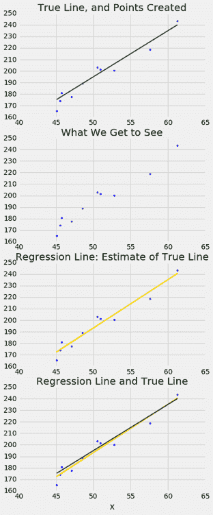

实际上，我们当然不会看到真实直线。 模拟结果表明，如果回归模型看起来合理，并且如果我们拥有大型样本，那么回归线就是真实直线的一个良好近似。

## 真实斜率的推断

我们的模拟表明，如果回归模型成立，并且样本量很大，则回归线很可能接近真实直线。 这使我们能够估计真实直线的斜率。

我们将使用我们熟悉的母亲和她们的新生儿的样本，来开发估计真实直线的斜率的方法。 首先，我们来看看我们是否相信，回归模型是一系列适当假设，用于描述出生体重和孕期之间的关系。

```
correlation(baby, 'Gestational Days', 'Birth Weight')
0.40754279338885108
```

总的来说，散点图看起来相当均匀地分布在这条线上，尽管一些点分布在主云形的周围。 相关系数为 0.4，回归线斜率为正。

这是否反映真实直线斜率为正的事实？ 为了回答这个问题，让我们看看我们能否估计真实斜率。 我们当然有了一个估计：我们的回归线斜率。 这大约是 0.47 盎司每天。

```
slope(baby, 'Gestational Days', 'Birth Weight')
0.46655687694921522
```

但是如果散点图出现的方式不同，回归线会有所不同，可能会有不同的斜率。 我们如何计算，斜率可能有多么不同？

我们需要点的另一个样本，以便我们可以绘制回归线穿过新的散点图，并找出其斜率。 但另一个样本从哪里得到呢？

你猜对了 - 我们将自举我们的原始样本。 这会给我们自举的散点图，通过它我们可以绘制回归线。

### 自举散点图

我们可以通过对原始样本带放回地随机抽样，来模拟新样本，它的次数与原始样本量相同。 这些新样本中的每一个都会给我们一个散点图。 我们将这个称为自举散点图，简而言之，我们将调用整个过程来自举散点图。

这里是来自样本的原始散点图，以及自举重采样过程的四个复制品。 请注意，重采样散点图通常比原始图稀疏一点。 这是因为一些原始的点没有在样本中被选中。

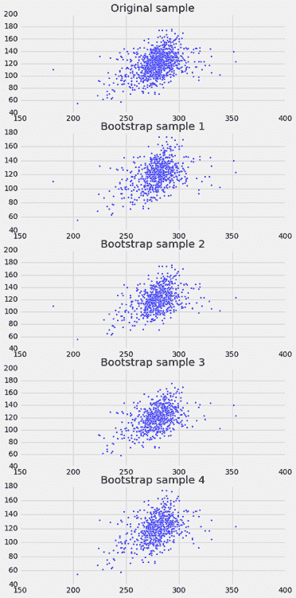

### 估计真实斜率

我们可以多次自举散点图，并绘制穿过每个自举图的回归线。 每条线都有一个斜率。 我们可以简单收集所有的斜率并绘制经验直方图。 回想一下，在默认情况下，`sample`方法带放回地随机抽取，次数与表中的行数相同。 也就是说，`sample`默认生成一个自举样本。

```
slopes = make_array()
for i in np.arange(5000):
    bootstrap_sample = baby.sample()
    bootstrap_slope = slope(bootstrap_sample, 'Gestational Days', 'Birth Weight')
    slopes = np.append(slopes, bootstrap_slope)
Table().with_column('Bootstrap Slopes', slopes).hist(bins=20)
```

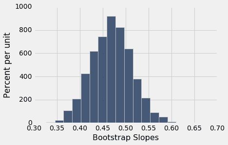

然后，我们可以使用`percentile`方法，为真实直线的斜率构建约 95% 置信区间。 置信区间从 5000 个自举斜率的第 2.5 百分位数，延伸到第 97.5 百分位数。

```
left = percentile(2.5, slopes)
right = percentile(97.5, slopes)
left, right
(0.38209399211893086, 0.56014757838023777)
```

### 用于自举斜率的函数

让我们收集我们估计斜率的方法的所有步骤，并定义函数`bootstrap_slope`来执行它们。 它的参数是表的名称，预测变量和响应变量的标签，以及自举复制品的所需数量。 在每个复制品中，该函数自举原始散点图并计算所得回归线的斜率。 然后绘制所有生成的斜率的直方图，并打印由斜率的“中间 95%”组成的区间。

```
def bootstrap_slope(table, x, y, repetitions):

    # For each repetition:
    # Bootstrap the scatter, get the slope of the regression line,
    # augment the list of generated slopes
    slopes = make_array()
    for i in np.arange(repetitions):
        bootstrap_sample = table.sample()
        bootstrap_slope = slope(bootstrap_sample, x, y)
        slopes = np.append(slopes, bootstrap_slope)

    # Find the endpoints of the 95% confidence interval for the true slope
    left = percentile(2.5, slopes)
    right = percentile(97.5, slopes)

    # Slope of the regression line from the original sample
    observed_slope = slope(table, x, y)

    # Display results
    Table().with_column('Bootstrap Slopes', slopes).hist(bins=20)
    plots.plot(make_array(left, right), make_array(0, 0), color='yellow', lw=8);
    print('Slope of regression line:', observed_slope)
    print('Approximate 95%-confidence interval for the true slope:')
    print(left, right)
```

当响应变量为出生体重，预测变量为孕期时，我们调用`bootstrap_slope`来找到真实斜率的置信区间，我们得到了一个区间，非常接近我们之前获得的东西：大约 0.38 到 0.56 盎司每天。

```
bootstrap_slope(baby, 'Gestational Days', 'Birth Weight', 5000)
Slope of regression line: 0.466556876949
Approximate 95%-confidence interval for the true slope:
0.378663152966 0.555005146304
```

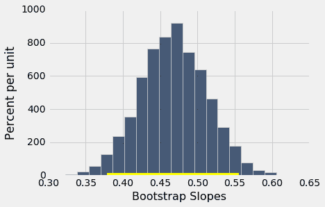

现在我们有一个函数，可以自动完成估计在回归模型中展示斜率的过程，我们也可以在其他变量上使用它。

例如，我们来看看出生体重与母亲身高的关系。 更高的女性往往有更重的婴儿吗？

回归模型似乎是合理的，基于散点图，但相关性不高。 这只有大约 0.2。

```
scatter_fit(baby, 'Maternal Height', 'Birth Weight')
```

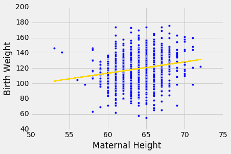

```
correlation(baby, 'Maternal Height', 'Birth Weight')
0.20370417718968034
```

像之前一样，我们使用`bootstrap_slope`来估计回归模型中真实直线的斜率。

```
bootstrap_slope(baby, 'Maternal Height', 'Birth Weight', 5000)
Slope of regression line: 1.47801935193
Approximate 95%-confidence interval for the true slope:
1.0403083964 1.91576886223
```


真实斜率的 95% 置信区间，从约 1 延伸到约 1.9 盎司每英寸。

### 真实斜率可能为 0 嘛？

假设我们相信我们的数据遵循回归模型，并且我们拟合回归线来估计真实直线。 如果回归线不完全是平的，几乎总是如此，我们将观察到散点图中的一些线性关联。

但是，如果这种观察是假的呢？ 换句话说，如果真实直线是平的 - 也就是说，这两个变量之间没有线性关系 - 我们观察到的联系，只是由于从样本中产生点的随机性。

这是一个模拟，说明了为什么会出现这个问题。 我们将再次调用`draw_and_compare`函数，这次要求真实斜率为 0。我们的目标是，观察我们的回归线是否显示不为 0 的斜率。

请记住函数`draw_and_compare`的参数是真实直线的斜率和截距，以及要生成的点的数量。

```
draw_and_compare(0, 10, 25)
```

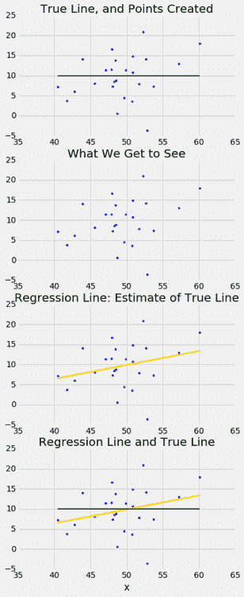

运行模拟几次，每次保持真实直线的斜率为 0 。你会注意到，虽然真实直线的斜率为 0，但回归线的斜率通常不为 0。回归线有时会向上倾斜，有时会向下倾斜，每次都给我们错误的印象，即这两个变量是相关的。

为了确定我们所看到的斜率是否真实，我们想测试以下假设：

原假设。真实直线的斜率是 0。

备选假设。真实直线的斜率不是 0。

我们很有条件来实现它。由于我们可以为真实斜率构建一个 95% 的置信区间，我们所要做的就是看区间是否包含 0。

如果没有，那么我们可以拒绝原假设（P 值为 5% 的截断值）。

如果真实斜率的置信区间确实包含 0，那么我们没有足够的证据来拒绝原假设。也许我们看到的斜率是假的。

我们在一个例子中使用这个方法。假设我们试图根据母亲的年龄来估计新生儿的出生体重。根据样本，根据母亲年龄估计出生体重的回归线的斜率为正，约为 0.08 盎司每年。

```
slope(baby, 'Maternal Age', 'Birth Weight')
0.085007669415825132
```

虽然斜率为正，但是很小。 回归线非常接近平的，这就产生了一个问题，真实直线是否是平的。

```
scatter_fit(baby, 'Maternal Age', 'Birth Weight')
```

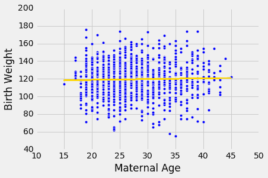

我们可以使用`bootstrap_slope`来估计真实直线的斜率。 计算表明，真实斜率的约 95% 的自举置信区间左端为负，右端为正 - 换句话说，区间包含 0。

```
bootstrap_slope(baby, 'Maternal Age', 'Birth Weight', 5000)
Slope of regression line: 0.0850076694158
Approximate 95%-confidence interval for the true slope:
-0.104335243815 0.272791852339
```

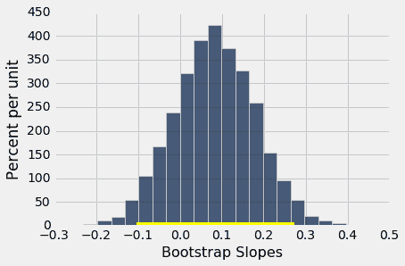

因为区间包含 0，所以我们不能拒绝原假设，母亲年龄与新生儿出生体重之间的真实线性关系的斜率为 0。基于此分析，使用母亲年龄作为预测变量，基于回归模型预测出生体重是不明智的。

## 预测区间

回归的主要用途之一是对新个体进行预测，这个个体不是我们原始样本的一部分，但是与样本个体相似。在模型的语言中，我们想要估计新值`x`的`y`。

我们的估计是真实直线在`x`处的高度。当然，我们不知道真实直线。我们使用我们的样本点的回归线来代替。

给定值`x`的拟合值，是基于`x`值的`y`的回归估计。换句话说，给定值`x`的拟合值就是回归线在`x`处的高度。

假设我们试图根据孕期天数来预测新生儿的出生体重。我们在前面的章节中看到，这些数据非常适合回归模型，真实直线的斜率的 95% 置信区间不包含 0。因此，我们的预测似乎是合理的。

下图显示了预测位于回归线上的位置。红线是`x = 300`。

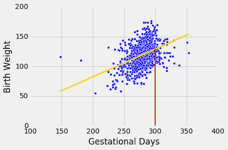

红线与回归线的相交点的高度是孕期天数 300 的拟合值。

函数`fitted_value`计算这个高度。像函数的相关性，斜率和截距一样，它的参数是表的名称和`x`和`y`的列标签。但是它也需要第四个参数，即`x`的值，在这个值上进行估算。

```
def fitted_value(table, x, y, given_x):
    a = slope(table, x, y)
    b = intercept(table, x, y)
    return a * given_x  + b
```

孕期天数 300 的拟合值约为 129.2 盎司。 换句话说，对于孕期为 300 天的孕妇，我们估计的新生儿体重约为 129.2 盎司。

```
fit_300 = fitted_value(baby, 'Gestational Days', 'Birth Weight', 300)
fit_300
129.2129241703143
```

### 预测的可变性

我们已经开发了一种方法，使用我们样本中的数据，根据孕期天数预测新生儿的体重。 但作为数据科学家，我们知道样本可能有所不同。 如果样本不同，回归线也会不一样，我们的预测也是。 为了看看我们的预测有多好，我们必须了解预测的可变性。

为此，我们必须生成新的样本。 我们可以像上一节那样，通过自举散点图来实现。 然后，我们为每个散点图的复制品拟合回归线，并根据每一行进行预测。 下图显示了 10 条这样的线，以及孕期天数 300 对应的出生体重预测。

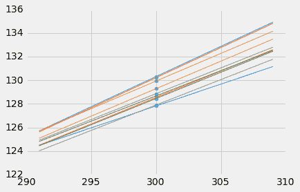

```
lines
```

| slope | intercept | prediction at x=300 |
| --- | --- | --- |
| 0.503931 | -21.6998 | 129.479 |
| 0.53227 | -29.5647 | 130.116 |
| 0.518771 | -25.363 | 130.268 |
| 0.430556 | -1.06812 | 128.099 |
| 0.470229 | -11.7611 | 129.308 |
| 0.48713 | -16.5314 | 129.608 |
| 0.51241 | -23.2954 | 130.428 |
| 0.52473 | -27.2053 | 130.214 |
| 0.409943 | 5.22652 | 128.21 |
| 0.468065 | -11.6967 | 128.723 |

每一行的预测都不相同。 下表显示了 10 条线的斜率、截距以及预测。

### 自举预测区间

如果我们增加重采样过程的重复次数，我们可以生成预测的经验直方图。这将允许我们创建预测区间，使用为斜率创建自举置信区间时的相同的百分比方法。

让我们定义一个名为`bootstrap_prediction`的函数来实现。该函数有五个参数：

*   表的名称
*   预测变量和响应变量的列标签
*   用于预测的`x`的值
*   所需的自举重复次数

在每次重复中，函数将自举原始散点图，并基于`x`的指定值查找`y`的预测值。具体来说，它调用我们在本节前面定义的函数`fitted_value`，来寻找指定`x`处的拟合值。

最后，绘制所有预测值的经验直方图，并打印由预测值的“中间 95%”组成的区间。它还打印基于穿过原始散点图的回归线的预测值。

```
# Bootstrap prediction of variable y at new_x
# Data contained in table; prediction by regression of y based on x
# repetitions = number of bootstrap replications of the original scatter plot

def bootstrap_prediction(table, x, y, new_x, repetitions):

    # For each repetition:
    # Bootstrap the scatter; 
    # get the regression prediction at new_x; 
    # augment the predictions list
    predictions = make_array()
    for i in np.arange(repetitions):
        bootstrap_sample = table.sample()
        bootstrap_prediction = fitted_value(bootstrap_sample, x, y, new_x)
        predictions = np.append(predictions, bootstrap_prediction)

    # Find the ends of the approximate 95% prediction interval
    left = percentile(2.5, predictions)
    right = percentile(97.5, predictions)

    # Prediction based on original sample
    original = fitted_value(table, x, y, new_x)

    # Display results
    Table().with_column('Prediction', predictions).hist(bins=20)
    plots.xlabel('predictions at x='+str(new_x))
    plots.plot(make_array(left, right), make_array(0, 0), color='yellow', lw=8);
    print('Height of regression line at x='+str(new_x)+':', original)
    print('Approximate 95%-confidence interval:')
    print(left, right)
bootstrap_prediction(baby, 'Gestational Days', 'Birth Weight', 300, 5000)
Height of regression line at x=300: 129.21292417
Approximate 95%-confidence interval:
127.300774171 131.361729528
```

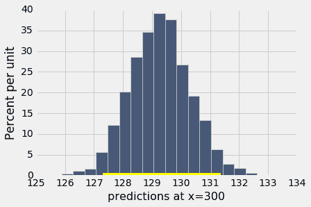

上图显示了基于 5000 次重复的自举过程，孕期天数 300 的预测出生体重的自举经验直方图。经验分布大致是正泰的。

我们已经通过预测的“中间 95%”，即预测的第 2.5 百分位数到第 97.5 百分位数的区间，构建了分数的约 95% 的预测区间。 区间范围从大约 127 到大约 131。基于原始样本的预测是大约 129，接近区间的中心。

### 改变预测变量的值的效果

下图显示了孕期天数 285 的 5,000 次自举预测的直方图。 基于原始样本的预测是约 122 盎司，区间范围从约 121 盎司到约 123 盎司。

```
bootstrap_prediction(baby, 'Gestational Days', 'Birth Weight', 285, 5000)
Height of regression line at x=285: 122.214571016
Approximate 95%-confidence interval:
121.177089926 123.291373304
```

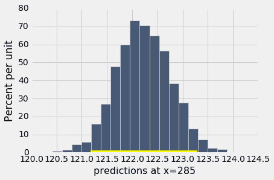

请注意，这个区间比孕妇天数 300 的预测区间更窄。 让我们来调查其原因。

孕妇天数均值约为 279 天：

```
np.mean(baby.column('Gestational Days'))
279.10136286201021
```

所以 285 比 300 更接近分布的中心。 通常，基于自举样本的回归线，在预测变量的分布中心附近彼此更接近。 因此，所有的预测值也更接近。 这解释了预测区间的宽度更窄。

你可以在下面的图中看到这一点，它显示了 10 个自举复制品中每一个的`x = 285`和`x = 300`的预测值。 通常情况下，直线在`x = 300`处比`x = 285`处相距更远，因此`x = 300`的预测更加可变。

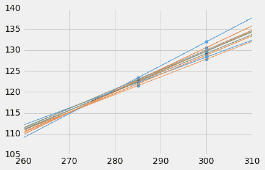

### 注意事项

我们在本章中进行的所有预测和测试，都假设回归模型是成立的。 具体来说，这些方法假设，散点图中的点由直线上的点产生，然后通过添加随机正态噪声将它们推离直线。

如果散点图看起来不像那样，那么模型可能不适用于数据。 如果模型不成立，那么假设模型为真的计算是无效的。

因此，在开始基于模型进行预测，或者对模型参数进行假设检验之前，我们首先要确定回归模型是否适用于我们的数据。 一个简单的方法就是，按照我们在本节所做的操作，即绘制两个变量的散点图，看看它看起来是否大致线性，并均匀分布在一条线上。 我们还应该使用残差图，执行我们在前一节中开发的诊断。