# 十六、比较两个样本

> 原文：[Comparing Two Samples](https://github.com/data-8/textbook/tree/gh-pages/chapters/16)
> 
> 译者：[飞龙](https://github.com/wizardforcel)
> 
> 协议：[CC BY-NC-SA 4.0](http://creativecommons.org/licenses/by-nc-sa/4.0/)
> 
> 自豪地采用[谷歌翻译](https://translate.google.cn/)

最近邻分类方法的动机是这样的，个体可能像最近的邻居。 从另一个角度来看，我们可以说一个类别的个体不像另一个类别中的个体。 机器学习为我们提供了一种有力的方法来发现这种相似性的缺乏，并将其用于分类。 它揭示了一种模式，通过一次检查一两个属性，我们不一定能发现它。

但是，我们可以从属性中学到很多东西。 为了了解它，我们将比较两个类中的属性分布。

让我们来看看 Brittany Wenger 的乳腺癌数据，看看是否只用一个属性，就有希望生成一个合理的分类器。 和以前一样，我们将在随机选择的训练集上进行探索，然后在剩余的保留集上测试我们的分类器。

```
patients = Table.read_table('breast-cancer.csv').drop('ID')
shuffled_patients = patients.sample(with_replacement=False) 
training_set = shuffled_patients.take(np.arange(341))
test_set  = shuffled_patients.take(np.arange(341, 683))
training_set
```

| Clump Thickness | Uniformity of Cell Size | Uniformity of Cell Shape | Marginal Adhesion | Single Epithelial Cell Size | Bare Nuclei | Bland Chromatin | Normal Nucleoli | Mitoses | Class |
| --- | --- | --- | --- | --- | --- | --- | --- | --- | --- |
| 5 | 1 | 1 | 1 | 2 | 1 | 2 | 1 | 1 | 0 |
| 5 | 1 | 1 | 1 | 1 | 1 | 1 | 1 | 1 | 0 |
| 4 | 1 | 1 | 1 | 2 | 1 | 1 | 1 | 1 | 0 |
| 5 | 1 | 2 | 1 | 2 | 1 | 3 | 1 | 1 | 0 |
| 4 | 10 | 8 | 5 | 4 | 1 | 10 | 1 | 1 | 1 |
| 7 | 2 | 4 | 1 | 3 | 4 | 3 | 3 | 1 | 1 |
| 9 | 4 | 5 | 10 | 6 | 10 | 4 | 8 | 1 | 1 |
| 3 | 1 | 1 | 1 | 2 | 2 | 3 | 1 | 1 | 0 |
| 3 | 2 | 1 | 1 | 2 | 1 | 2 | 2 | 1 | 0 |
| 6 | 3 | 3 | 5 | 3 | 10 | 3 | 5 | 3 | 0 |

（省略了 331 行）

让我们看看第二个属性`Uniformity of Cell Size`，能告诉我们患者分类的什么事情。

```
training_cellsize = training_set.select('Class', 'Uniformity of Cell Size').relabel(1, 'Uniformity')
training_cellsize
```

| Class | Uniformity |
| --- | --- |
| 0 | 1 |
| 0 | 1 |
| 0 | 1 |
| 0 | 1 |
| 1 | 10 |
| 1 | 2 |
| 1 | 4 |
| 0 | 1 |
| 0 | 2 |
| 0 | 3 |

（省略了 331 行）

`Class`和`Uniformity`列显示为数字，但他们真的都是类别值。 这些类别是“癌症”（1）和“非癌症”（0）。 `Uniformity`为 1-10，但是这些标签是由人确定的，他们也可能有十个标签，如“非常一致”，“不一致”等等。 （一致性的 2 不一定是 1 的两倍。）所以我们比较两个类别分布，每个分类一个。

对于每个类别和每个一致评分，我们都需要训练集的患者数量。`pivot`方法将为我们计数。

```
training_counts = training_cellsize.pivot('Class', 'Uniformity')
training_counts
```

| Uniformity | 0 | 1 |
| --- | --- | --- |
| 1 | 181 | 3 |
| 2 | 21 | 2 |
| 3 | 16 | 15 |
| 4 | 4 | 18 |
| 5 | 0 | 17 |
| 6 | 0 | 8 |
| 7 | 0 | 8 |
| 8 | 1 | 13 |
| 9 | 1 | 4 |
| 10 | 0 | 29 |

我们现在有了一些东西，类似于每个类别的一致评分的分布。 而这两者看起来相当不同。 但是，我们要小心 - 这两个类别的患者总数是 341（训练集的大小），超过一半的人在类别 0 里面。

```
np.sum(training_counts.column('0'))
224
```

所以为了比较两个分布，我们应该把计数转换成比例然后可视化。

```
def proportions(array):
    return array/np.sum(array)
training_dists = training_counts.select(0).with_columns(
   '0', proportions(training_counts.column('0')),
    '1', proportions(training_counts.column('1'))
)
training_dists.barh('Uniformity')
```

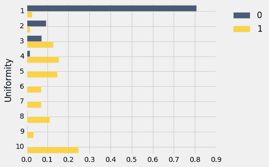

这两个分布看起来不一样！ 事实上，它们看起来相当不同，我们应该能够基于对这种差异的直截了当的观察来构建一个非常合理的分类器。 一个简单的分类规则是：“如果一致性大于 3，类别就是 1，也就是说这个单元格就有癌症的，否则类别就是 0。

这么粗糙的东西有什么好处吗？ 让我们试试看。 对于测试集中的任何个体，我们所要做的就是，查看一致评分是否大于 3。例如，对于前 4 名患者，我们将得到一组四个布尔值：

```
test_set.take(np.arange(4)).column('Uniformity of Cell Size') > 3
array([ True, False, False, False], dtype=bool)
```

请记住，`True`等于`1`，如果一致性大于 3，那么这是我们要划分的分类。因此，为了测量粗分类器的准确性，我们所要做的就是，求得测试集患者的比例， 其中分类与患者已知的分类相同。 我们将使用上一节中写的`count_equal`函数。

```
classification = test_set.column('Uniformity of Cell Size') > 3

count_equal(classification, test_set.column('Class'))/test_set.num_rows
0.935672514619883
```

这相当准确，即使我们只使用单个属性单行代码的分类器！

这是否意味着上一章中最近邻的方法是不必要的？ 不，因为那些更准确，并且对于癌症诊断，任何患者都想要尽可能精确的方法。 但是看到简单的方法并不坏，这是令人欣慰的。

## 两个类别分布

为了查看两个数值变量如何相关，可以使用相关系数来衡量线性关联。 但是，我们应该如何确定两个分类变量是否相关？ 例如，我们如何决定一个属性是否与个体的类别有关？ 这是一个很重要的问题，因为如果不相关的话，你可以把它从你的分类器中删除。

在乳腺癌数据中，我们来看看有丝分裂活动是否与这个类别有关。 我们已经标记了“癌症”和“非癌症”的类别，以便以后参考。

```
classes = Table().with_columns(
    'Class', make_array(0, 1),
    'Class Label', make_array('Not Cancer', 'Cancer')
)
patients = Table.read_table('breast-cancer.csv').drop('ID').join('Class', classes)
patients = patients.drop('Class').relabel('Class Label', 'Class')
mitoses = patients.select('Class', 'Mitoses')
mitoses
```

| Class | Mitoses |
| --- | --- |
| Not Cancer | 1 |
| Not Cancer | 1 |
| Not Cancer | 1 |
| Not Cancer | 1 |
| Not Cancer | 1 |
| Not Cancer | 1 |
| Not Cancer | 1 |
| Not Cancer | 5 |
| Not Cancer | 1 |
| Not Cancer | 1 |

（省略了 673 行）

我们可以使用`pivot`和`proportions`（在前面的章节中定义）来显示两类中`Mitoses`的分布。

```
counts = mitoses.pivot('Class', 'Mitoses')
counts
```

| Mitoses | Cancer | Not Cancer |
| --- | --- | --- |
| 1 | 132 | 431 |
| 2 | 27 | 8 |
| 3 | 31 | 2 |
| 4 | 12 | 0 |
| 5 | 5 | 1 |
| 6 | 3 | 0 |
| 7 | 8 | 1 |
| 8 | 7 | 1 |
| 10 | 14 | 0 |

```
dists = counts.select(0).with_columns(
    'Cancer', proportions(counts.column(1)),
    'Not Cancer', proportions(counts.column(2))

)
dists.barh(0)
```


与“非癌症”类别的分布相比，“癌症”类别的`Mitoses`都集中于最低评分。

所以看起来类别和有丝分裂活动是相关的。 但是，这可能只是由于偶然嘛？

为了了解偶然来自哪里，请记住，数据就像是来自更大总体的随机样本 - 总体包含我们可能要分类的新个体。 可能在总体中，类别和有丝分裂是相互独立的，只是由于偶然与样本相关。

### 假设

我们试着通过对以下假设进行测试来回答这个问题。

原假设。 在总体中，类别和有丝分裂评分是相互独立的；换句话说，这两个类别的有丝分裂的分布是一样的。 由于偶然性，样本分布是不同的。

备选假说。 在总体中，类别和有丝分裂评分是相关的。

为了了解如何测试它，我们再看一下数据。

```
mitoses
```

| Class | Mitoses |
| --- | --- |
| Not Cancer | 1 |
| Not Cancer | 1 |
| Not Cancer | 1 |
| Not Cancer | 1 |
| Not Cancer | 1 |
| Not Cancer | 1 |
| Not Cancer | 1 |
| Not Cancer | 5 |
| Not Cancer | 1 |
| Not Cancer | 1 |

（省略了 673 行）

### 随机排列

如果类别和有丝分裂评分是不相关的，那么`Mitoses`值出现的顺序并不重要，因为它们与类别的值无关，所有的重新排列应该是等可能的。 这与我们在分析足球`Deflategate`数据时采用的方法相同。

所以让我们将所有的`Mitoses`值整理到一个名为`shuffled_mitoses`的数组中。 你可以看到下面的第一项，但它包含 683 个项目，因为它是整个`Mitoses`列的排列（即重新排列）。

```
shuffled_mitoses = mitoses.select('Mitoses').sample(with_replacement=False).column(0)
shuffled_mitoses.item(0)
1
```

让我们扩展`mitoses`表，添加一列乱序的值。

```
mitoses = mitoses.with_column('Shuffled Mitoses', shuffled_mitoses)
mitoses
```

| Class | Mitoses | Shuffled Mitoses |
| --- | --- | --- |
| Not Cancer | 1 | 1 |
| Not Cancer | 1 | 1 |
| Not Cancer | 1 | 1 |
| Not Cancer | 1 | 1 |
| Not Cancer | 1 | 7 |
| Not Cancer | 1 | 1 |
| Not Cancer | 1 | 1 |
| Not Cancer | 5 | 3 |
| Not Cancer | 1 | 1 |
| Not Cancer | 1 | 2 |

（省略了 673 行）

让我们看看乱序数据的有丝分裂的分布，使用与原始数据相同的过程。

```
shuffled = mitoses.select('Class', 'Shuffled Mitoses')

shuffled_counts = shuffled.pivot('Class', 'Shuffled Mitoses')

shuffled_counts
```

| Shuffled Mitoses | Cancer | Not Cancer |
| --- | --- | --- |
| 1 | 199 | 364 |
| 2 | 12 | 23 |
| 3 | 12 | 21 |
| 4 | 5 | 7 |
| 5 | 2 | 4 |
| 6 | 0 | 3 |
| 7 | 3 | 6 |
| 8 | 3 | 5 |
| 10 | 3 | 11 |

这两个类中的乱序数据的分布可以展示为条形图，就像原始数据一样。

```
shuffled_dists = shuffled_counts.select(0).with_columns(
    'Cancer', proportions(shuffled_counts.column(1)),
    'Not Cancer', proportions(shuffled_counts.column(2))
)
shuffled_dists.barh(0)
```

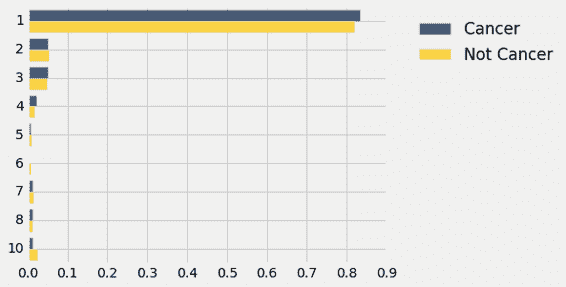

这与原始条形图看起来有点不同，为方便起见，再次展示如下。

```
dists.barh(0)
```

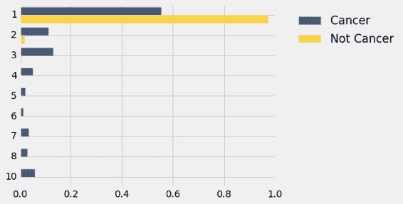

### 检验统计量：总变异距离

我们需要一个测试统计量来衡量蓝色和金色分布之间的差异。 回想一下，总变异距离可以用来量化两个类别分布的差异。

```
def tvd(dist1, dist2):
    return 0.5*(np.sum(np.abs(dist1 - dist2)))
```

在原始样本中，两个类别的有丝分裂的分布的 TVD 约为 0.4：

```
observed_tvd = tvd(dists.column(1), dists.column(2))
observed_tvd
0.41841946549059517
```

但是在乱序的样本中，它比较小：

```
tvd(shuffled_dists.column(1), shuffled_dists.column(2))
0.022173847487655045
```

随机排列的有丝分裂评分和原始评分似乎表现不一样。 但是如果我们再次运行，随机打乱可能会有所不同。 让我们重新打乱并重新计算总变异距离。

```
shuffled_mitoses = mitoses.select('Mitoses').sample(with_replacement=False).column(0)

shuffled = mitoses.select('Class').with_column('Shuffled Mitoses', shuffled_mitoses)

shuffled_counts = shuffled.pivot('Class', 'Shuffled Mitoses')

tvd(proportions(shuffled_counts.column(1)), proportions(shuffled_counts.column(2)))
0.039937426966715643
```

总变异距离仍然比我们从原始数据得到的 0.42 小很多。 为了看看它变化了多少，我们不得不重复多次随机打乱过程，在它现在已经变得很熟悉了。

### 原假设下 TVD 的经验分布

如果原假设是真的，则有丝分裂评分的所有排列都是等可能的。 有很多可能的排列；让我们做 5000 次，看看我们的检验统计量的变化。 代码与上面的代码完全一样，只是现在我们将收集所有 5000 个距离并绘制经验直方图。

```
repetitions = 5000
tvds = make_array()
for i in np.arange(repetitions):
    shuffled_mitoses = mitoses.select('Mitoses').sample(with_replacement=False).column(0)
    shuffled = mitoses.select('Class').with_column('Shuffled Mitoses', shuffled_mitoses)
    shuffled_counts = shuffled.pivot('Class', 'Shuffled Mitoses')
    new_tvd = tvd(proportions(shuffled_counts.column(1)), proportions(shuffled_counts.column(2)))
    tvds = np.append(tvds, new_tvd)

Table().with_column('TVD', tvds).hist(bins=20)
plots.title('Empirical Distribution Under the Null')
print('Observed TVD:', observed_tvd)
Observed TVD: 0.418419465491
```

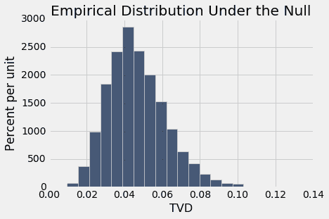

观察到的总变异距离 0.42 根本不接近于假设零假设为真所产生的分布。 数据支持备选假设：有丝分裂评分与类别有关。

### 两个类别分布的相等性的排列检验

我们上面所做的检验被称为原假设的排列检验，即两个样本是从相同的底层分布中抽取的。

为了定义一个执行检验的函数，我们可以复制前一个单元格的代码，并更改表和列的名称。函数`permutation_test_tvd`接受数据表的名称，包含类别变量的列标签，它的分布要检验，包含二元类别变量的列标签，以及要运行的随机排列的数量。

在我们上面的例子中，我们没有计算 P 值，因为观测值远离原假设下统计量的分布。但是，一般来说，我们应该计算 P 值，因为在其他例子中统计量可能不是那么极端。 P 值是“假设原假设为真，所得距离大于等于观测距离”的几率，因为备选假设比原假设预测了更大的距离。

```
def permutation_test_tvd(table, variable, classes, repetitions):

    """Test whether a categorical variable is independent of classes:
    table: name of table containing the sample
    variable: label of column containing categorical variable whose distribution is of interest
    classes: label of column containing binary class data
    repetitions: number of random permutations"""

    # Find the tvd between the distributions of variable in the two classes
    counts = table.select(classes, variable).pivot(classes, variable)
    observed_tvd = tvd(proportions(counts.column(1)), proportions(counts.column(2)))

    # Assuming the null is true, randomly permute the variable and collect all the new tvd's
    tvds = make_array()
    for i in np.arange(repetitions):
        shuffled_var = table.select(variable).sample(with_replacement=False).column(0)
        shuffled = table.select(classes).with_column('Shuffled Variable', shuffled_var)
        shuffled_counts = shuffled.pivot(classes, 'Shuffled Variable')
        new_tvd =tvd(proportions(shuffled_counts.column(1)), proportions(shuffled_counts.column(2)))
        tvds = np.append(tvds, new_tvd)

    # Find the empirical P-value:
    emp_p = np.count_nonzero(tvds >= observed_tvd)/repetitions

    # Draw the empirical histogram of the tvd's generated under the null, 
    # and compare with the value observed in the original sample
    Table().with_column('TVD', tvds).hist(bins=20)
    plots.title('Empirical Distribution Under the Null')
    print('Observed TVD:', observed_tvd)
    print('Empirical P-value:', emp_p)
permutation_test_tvd(patients, 'Clump Thickness', 'Class', 5000)
Observed TVD: 0.638310905047
Empirical P-value: 0.0
```

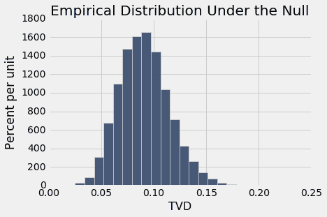

同样，观测距离 0.64 离原假设预测的分布很远。 经验 P 值为 0，所以准确的 P 值将接近于零。 因此，如果类别和有丝分裂评分是不相关的，那么观测的数据是极不可能的。

所以得出的结论是，有丝分裂评分与类别有关，不仅在样本中，而且在总体中。

我们使用排列检验来帮助我们确定，类别属性的分布是否与类别相关。 一般来说，排列检验可以这样使用来确定，两个类别分布是否从相同的基本分布随机抽样。

## A/B 测试

我们使用随机排列来查看，两个样本是否从相同的基本分类分布抽取。 如果样本是数值的，则可以使用相同的方法；检验统计量的选择通常比较简单。 在我们使用`Deflategate`数据的例子中，我们使用了不同的方法来测试爱国者队和小马队用球是否来自相同的基本分布。

在现代数据分析中，决定两个数值样本是否来自相同的基本分布称为 A/B 测试。 名称是指两个样本 A 和 B 的标签。

### 吸烟者和不吸烟者

我们对随机抽样的母亲及其新生儿进行了许多不同的分析，但是我们还没有查看母亲是否吸烟的数据。 研究的目的之一，是看母亲吸烟是否与出生体重有关。

```
baby = Table.read_table('baby.csv')
baby
```

| Birth Weight | Gestational Days | Maternal Age | Maternal Height | Maternal Pregnancy Weight | Maternal Smoker |
| --- | --- | --- | --- | --- | --- |
| 120 | 284 | 27 | 62 | 100 | False |
| 113 | 282 | 33 | 64 | 135 | False |
| 128 | 279 | 28 | 64 | 115 | True |
| 108 | 282 | 23 | 67 | 125 | True |
| 136 | 286 | 25 | 62 | 93 | False |
| 138 | 244 | 33 | 62 | 178 | False |
| 132 | 245 | 23 | 65 | 140 | False |
| 120 | 289 | 25 | 62 | 125 | False |
| 143 | 299 | 30 | 66 | 136 | True |
| 140 | 351 | 27 | 68 | 120 | False |

（省略了 1164 行）

我们首先选择`Birth Weight`和`Maternal Smoker`。 样本中有 715 名非吸烟者，459 名吸烟者。

```
weight_smoke = baby.select('Birth Weight', 'Maternal Smoker')
weight_smoke.group('Maternal Smoker')
```

| Maternal Smoker | count |
| --- | --- |
| False | 715 |
| True | 459 |

下面的第一个直方图显示了样本中非吸烟者的婴儿出生体重的分布。 第二个显示了吸烟者的婴儿出生体重。

```
nonsmokers = baby.where('Maternal Smoker', are.equal_to(False))
nonsmokers.hist('Birth Weight', bins=np.arange(40, 181, 5), unit='ounce')
```

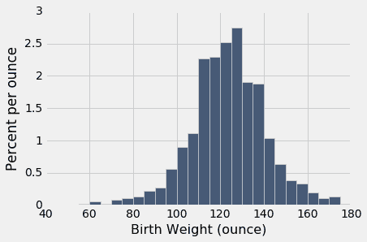

```
smokers = baby.where('Maternal Smoker', are.equal_to(True))
smokers.hist('Birth Weight', bins=np.arange(40, 181, 5), unit='ounce')
```


两种分布都大致是钟形，中心在 120 盎司附近。 当然，这些分布并不相同，这就产生了这样一个问题，即差异是否仅仅反映了机会变异，还是反映了总体分布的差异。

这个问题可以通过假设检验来回答。

原假设：在总体中，不吸烟的母亲的婴儿出生体重的分布和吸烟的母亲相同。 样本中的差异是偶然的。

备选假设：两种分布在总体中是不同的。

检验统计量：出生体重是一个定量变量，所以用均值的绝对差作为检验统计量是合理的。

检验统计量的观测值约为 9.27 盎司。

```
means_table = weight_smoke.group('Maternal Smoker', np.mean)
means_table
```

| Maternal Smoker | Birth Weight mean |
| --- | --- |
| False | 123.085 |
| True | 113.819 |

```
nonsmokers_mean = means_table.column(1).item(0)
smokers_mean = means_table.column(1).item(1)
nonsmokers_mean - smokers_mean
9.266142572024918
```

## 排列检验

为了看看原假设下是否有可能出现这种差异，我们将使用排列检验，就像我们在前一节中所做的那样。 我们必须为检验统计量改变代码。 为此，我们将像上面那样计算平均值的差，然后取绝对值。

请记住，在原假设下，出生体重的所有排列与`Maternal Smoker`列等可能出现。 所以，就像以前一样，每次重复都是打乱正在比较的变量。

```
def permutation_test_means(table, variable, classes, repetitions):

    """Test whether two numerical samples 
    come from the same underlying distribution, 
    using the absolute difference between the means.
    table: name of table containing the sample
    variable: label of column containing the numerical variable 
    classes: label of column containing names of the two samples
    repetitions: number of random permutations"""

    t = table.select(variable, classes)

    # Find the observed test statistic
    means_table = t.group(classes, np.mean) 
    obs_stat = abs(means_table.column(1).item(0) - means_table.column(1).item(1))

    # Assuming the null is true, randomly permute the variable 
    # and collect all the generated test statistics
    stats = make_array()
    for i in np.arange(repetitions):
        shuffled_var = t.select(variable).sample(with_replacement=False).column(0)
        shuffled = t.select(classes).with_column('Shuffled Variable', shuffled_var)
        m_tbl = shuffled.group(classes, np.mean)
        new_stat = abs(m_tbl.column(1).item(0) - m_tbl.column(1).item(1))
        stats = np.append(stats, new_stat)

    # Find the empirical P-value:
    emp_p = np.count_nonzero(stats >= obs_stat)/repetitions

    # Draw the empirical histogram of the tvd's generated under the null, 
    # and compare with the value observed in the original sample
    Table().with_column('Test Statistic', stats).hist(bins=20)
    plots.title('Empirical Distribution Under the Null')
    print('Observed statistic:', obs_stat)
    print('Empirical P-value:', emp_p)
permutation_test_means(baby, 'Birth Weight', 'Maternal Smoker', 5000)
Observed statistic: 9.266142572024918
Empirical P-value: 0.0
```


原始样本中的观测差异约为 9.27 盎司，与此分布不一致：经验 P 值为 0，这意味着确切的 P 值确实非常小。 因此，测试的结论是，在总体中，不吸烟者和吸烟者的婴儿出生体重的分布是不同的。

## 差值的自举置信区间

我们的 A/B 测试得出结论，这两个分布是不同的，但有点不尽人意。他们有多么不同？哪一个均值更大？这些自然是测试无法回答的问题。

回想一下，我们之前已经讨论过这个问题了：不仅仅是问“两个分布是否不同”的是与否的问题，我们可以通过不作任何假设，并简单地估计均值之间的差异，来学到更多。

观测差异（不吸烟者减去吸烟者）约为 9.27 盎司；这个正面迹象表明，不吸烟的母亲通常有更大的婴儿。但由于随机性，样本可能会有所不同。为了了解有多么不同，我们必须生成更多的样本；为了生成更多的样本，我们将使用`bootstrap`，就像我们以前做过的那样。自举过程不会假设这两个分布是否相同。它只是复制原始随机样本并计算统计量的新值。

函数`bootstrap_ci_means`返回总体中两组均值之间差异的自举置信区间。在我们的例子中，置信区间将估计总体中吸烟和不吸烟的母亲的婴儿的平均出生体重之间的差异。

*   表名称，它包含原始样本中的数据
*   列标签，它包含数值变量
*   列标签，它包含两个样本的名称
*   自举的重复次数

该函数使用自举百分比方法，返回两个均值之间的差异的约 95% 置信区间。

```
def bootstrap_ci_means(table, variable, classes, repetitions):

    """Bootstrap approximate 95% confidence interval
    for the difference between the means of the two classes
    in the population"""

    t = table.select(variable, classes)

    mean_diffs = make_array()
    for i in np.arange(repetitions):
        bootstrap_sample = t.sample()
        m_tbl = bootstrap_sample.group(classes, np.mean)
        new_stat = m_tbl.column(1).item(0) - m_tbl.column(1).item(1)
        mean_diffs = np.append(mean_diffs, new_stat)

    left = percentile(2.5, mean_diffs)
    right = percentile(97.5, mean_diffs)

    # Find the observed test statistic
    means_table = t.group(classes, np.mean) 
    obs_stat = means_table.column(1).item(0) - means_table.column(1).item(1)

    Table().with_column('Difference Between Means', mean_diffs).hist(bins=20)
    plots.plot(make_array(left, right), make_array(0, 0), color='yellow', lw=8)
    print('Observed difference between means:', obs_stat)
    print('Approximate 95% CI for the difference between means:')
    print(left, 'to', right)
bootstrap_ci_means(baby, 'Birth Weight', 'Maternal Smoker', 5000)
Observed difference between means: 9.266142572024918
Approximate 95% CI for the difference between means:
7.23940878698 to 11.3907887554 
```

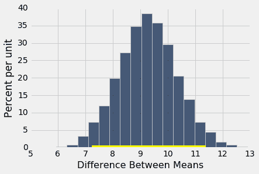

不吸烟的母亲的婴儿比吸烟的母亲的婴儿平均重 7.2 盎司到 11.4 盎司。 这比“两个分布不同”更有用。 由于置信区间不包含 0，它也告诉我们这两个分布是不同的。 所以置信区间估计了我们的均值之间的差异，也让我们决定两个基本分布是否相同。

不吸烟的母亲比吸烟的母亲平均年龄稍大。

```
bootstrap_ci_means(baby, 'Maternal Age', 'Maternal Smoker', 5000)
Observed difference between means: 0.8076725017901509
Approximate 95% CI for the difference between means:
0.154278698588 to 1.4701157656
```

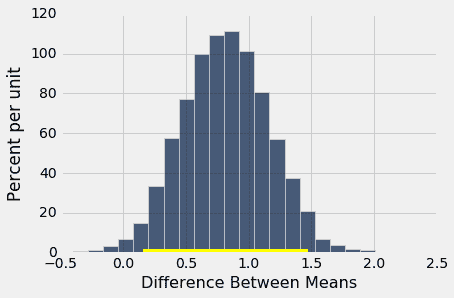

但毫不奇怪，证据并没有指出，他们的平均身高与不吸烟的母亲不同。 零在均值之间差异的置信区间中。

```
bootstrap_ci_means(baby, 'Maternal Height', 'Maternal Smoker', 5000)
Observed difference between means: 0.09058914941267915
Approximate 95% CI for the difference between means:
-0.390841928035 to 0.204388297872
```

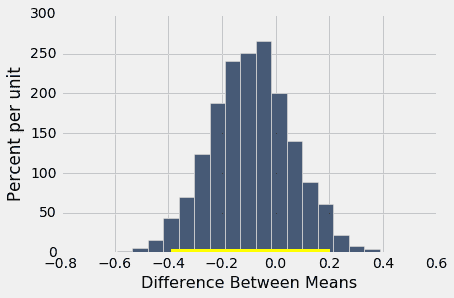

总之：

如果你想知道两个基本分布是否相同，则可以使用带有适当检验统计量的排列检验。 当分布是类别时，我们使用总变异距离，而分布是数值时，我们使用均值之间的绝对差。

为了比较两个数值分布，将假设检验替换为估计，通常更富有信息。 只需估计一个差异，比如两组均值之间的差异。 这可以通过构建自举置信区间来完成。 如果零不在这个区间内，你可以得出这样的结论：这两个分布是不同的，你也可以估计均值有多么不同。

## 因果

我们用于比较两个样本的方法在随机对照实验的分析中具有强大的用途。由于在这些实验中，实验组和对照组被随机分配，因此如果实验完全没有效果，结果中的任何差异，可以与仅仅由于分配中的随机性而发生的情况进行比较。如果观察到的差异比我们预测的，纯粹由于偶然的差异更为显着，我们就会有因果关系的证据。由于个体无偏分配到实验组和对照组，两组结果中的差异可归因于实验。

随机对照实验分析的关键是，了解偶然因素如何出现。这有助于我们设定明确的原假设和备选假设。一旦完成，我们可以简单地使用前一节的方法来完成分析。

让我们看看如何在一个例子中实现。

### 治疗慢性背痛：RCT

成年人的背痛可能非常顽固，难以治疗。常见的方法从皮质类固醇到针灸。随机对照试验（RCT）检验了使用肉毒毒素 A 来治疗的效果。肉毒杆菌毒素是一种神经毒蛋白，会导致肉毒中毒的疾病；维基百科说肉毒杆菌是“已知最致命的毒素”。有七种类型的肉毒杆菌毒素。肉毒杆菌毒素 A 是可导致人类疾病的类型之一，但也被用于治疗涉及肌肉的各种疾病。福斯特（Foster），克拉普（Clapp）和贾巴里（Jabbari）在 2001 年分析的随机对照试验（RCT）将其用作一种治疗背痛的方法。

将 31 名背痛患者随机分为实验组和对照组，实验组 15 例，对照组 16 例。对照组给予生理盐水，试验是双盲的，医生和病人都不知道他们在哪个组。

研究开始 8 周后，实验组 15 名中的 9 名和对照组 16 名中的 2 名缓解了疼痛（由研究人员精确定义）。这些数据在`bta`表中，似乎表明实验有明显的益处。

```
bta = Table.read_table('bta.csv')
bta
```

| Group | Result |
| --- | --- |
| Control | 1 |
| Control | 1 |
| Control | 0 |
| Control | 0 |
| Control | 0 |
| Control | 0 |
| Control | 0 |
| Control | 0 |
| Control | 0 |
| Control | 0 |

（省略了 21 行）

```
bta.group('Group', np.mean)
```

| Group | Result mean |
| --- | --- |
| Control | 0.125 |
| Treatment | 0.6 |

在实验组中，60% 的患者缓解了疼痛，而对照组只有 12.5%。没有一个患者有任何副作用。

因此，这表示是 A 型肉毒毒素比盐水更好。但结论还没确定。病人随机分配到两组，所以也许差异可能由于偶然？

为了理解这意味着什么，我们必须考虑这样的可能性，即在研究中的 31 个人中，有些人可能比其他人恢复得更好，即使没有任何治疗的帮助。如果他们中的大部分不正常地分配到实验组，只是偶然呢？即使实验组仅仅给予对照组的生理盐水，实验组的结果可能会好于对照组。

为了解释这种可能性，我们首先仔细建立机会模型。

### 潜在的结果

在患者随机分为两组之前，我们的大脑本能地想象出每个患者的两种可能的结果：患者分配到实验组的结果，以及分配给对照组的结果。这被称为患者的两个潜在的结果。

因此有 31 个潜在的实验结果和 31 个潜在的对照结果。问题关于 31 个结果的这两组的分布。他们是一样的，还是不一样？

我们还不能回答这个问题，因为我们没有看到每个组中的所有 31 个值。我们只能看到随机选择的 16 个潜在的对照结果，以及其余 15 个患者的实验结果。

这是一个展示设定的好方法。每个病人都有一张双面票：

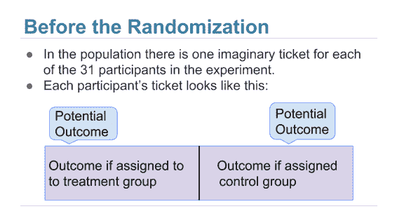

随机化之后，我们可以看到随机选择的一组票的右半部分，以及剩余分组的左半部分。

`observed_outcomes`表收集每个患者潜在结果的信息，每张“票”的未观察的一半留空。 （这只是考虑`bta`表的另一种方式，它载有的信息相同。）

```
observed_outcomes = Table.read_table("observed_outcomes.csv")
observed_outcomes.show()
```

| Group | Outcome if assigned treatment | Outcome if assigned control |
| --- | --- | --- |
| Control | Unknown | 1 |
| Control | Unknown | 1 |
| Control | Unknown | 0 |
| Control | Unknown | 0 |
| Control | Unknown | 0 |
| Control | Unknown | 0 |
| Control | Unknown | 0 |
| Control | Unknown | 0 |
| Control | Unknown | 0 |
| Control | Unknown | 0 |
| Control | Unknown | 0 |
| Control | Unknown | 0 |
| Control | Unknown | 0 |
| Control | Unknown | 0 |
| Control | Unknown | 0 |
| Control | Unknown | 0 |
| Treatment | 1 | Unknown |
| Treatment | 1 | Unknown |
| Treatment | 1 | Unknown |
| Treatment | 1 | Unknown |
| Treatment | 1 | Unknown |
| Treatment | 1 | Unknown |
| Treatment | 1 | Unknown |
| Treatment | 1 | Unknown |
| Treatment | 1 | Unknown |
| Treatment | 0 | Unknown |
| Treatment | 0 | Unknown |
| Treatment | 0 | Unknown |
| Treatment | 0 | Unknown |
| Treatment | 0 | Unknown |
| Treatment | 0 | Unknown |

### 假设检验

问题是实验是否有用。根据观察得出的结果，问题在于第 2 列（包括未知数）的 31 个“实验”值的分布是否与第 3 列 31 个“对照”值的分布不同（同样包括未知数）。

原假设：所有 31 个潜在“实验”结果的分布与所有 31 个潜在“对照”结果的分布相同。实验与对照没有任何不同。两个样本的差异只是偶然而已。

备选假设：31 个潜在“实验”结果的分布与 31 个对照结果的分布不同。治疗做了一些不同于控制。

为了检验这些假设，请注意，如果原假设是真实的，那么 31 个观察结果的所有分布，对于标记为“对照”的 16 个结果和另外标记为“实验”的 15 个结果将具有相等的可能性。所以我们可以简单地对这些值进行排列，看看这两个组的分布是多么不同。更简单地说，由于数据是数值的，我们可以看到两个均值有多么不同。

这正是我们在上一节中为 A/B 测试所做的。样本 A 现在是对照组，样本 B 是实验组。我们的检验统计量是两组平均值的绝对差。

让我们为均值之间的差异运行我们的排列检验。只有 31 个观测值，所以我们可以运行大量的排列，而不必等待太久的结果。

```
def permutation_test_means(table, variable, classes, repetitions):

    """Test whether two numerical samples 
    come from the same underlying distribution, 
    using the absolute difference between the means.
    table: name of table containing the sample
    variable: label of column containing the numerical variable 
    classes: label of column containing names of the two samples
    repetitions: number of random permutations"""

    t = table.select(variable, classes)

    # Find the observed test statistic
    means_table = t.group(classes, np.mean) 
    obs_stat = abs(means_table.column(1).item(0) - means_table.column(1).item(1))

    # Assuming the null is true, randomly permute the variable 
    # and collect all the generated test statistics
    stats = make_array()
    for i in np.arange(repetitions):
        shuffled_var = t.select(variable).sample(with_replacement=False).column(0)
        shuffled = t.select(classes).with_column('Shuffled Variable', shuffled_var)
        m_tbl = shuffled.group(classes, np.mean)
        new_stat = abs(m_tbl.column(1).item(0) - m_tbl.column(1).item(1))
        stats = np.append(stats, new_stat)

    # Find the empirical P-value:
    emp_p = np.count_nonzero(stats >= obs_stat)/repetitions

    # Draw the empirical histogram of the tvd's generated under the null, 
    # and compare with the value observed in the original sample
    Table().with_column('Test Statistic', stats).hist()
    plots.title('Empirical Distribution Under the Null')
    print('Observed statistic:', obs_stat)
    print('Empirical P-value:', emp_p)
permutation_test_means(bta, 'Result', 'Group', 20000)
Observed statistic: 0.475
Empirical P-value: 0.00965
```

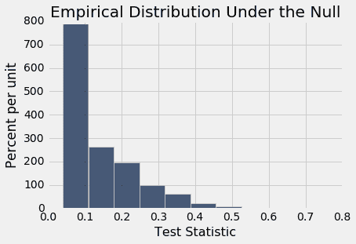

经验 P 值非常小（研究报告 P 值为 0.009，这与我们的计算一致），因此证据倾向于备选假设：潜在实验和控制分布是不同的。

这是实验导致差异的证据，因为随机化确保了没有影响结论的混淆变量。

如果实验没有被随机分配，我们的测试仍然会指出我们 31 位患者的实验和背痛结果之间的关联。但要小心：没有随机化，这种关联并不意味着，实验会导致背痛结果的改变。例如，如果患者自己选择是否进行实验，则可能疼痛更严重的患者更可能选择实验，并且甚至在没有药物治疗的情况下，更可能减轻疼痛。预先存在的疼痛将成为分析中的混淆因素。

### 效果的置信区间

正如我们在上一节中指出的那样，只是简单地得出结论，说治疗是有用的，还不够。我们还想知道它做了什么。

因此，不要对两个基本分布的假设进行是与否的测试，而是仅仅估计它们之间的差异。具体来说，我们查看所有 31 个对照结果的平均值减去所有 31 个实验结果的平均值。这是未知的参数，因为我们只有 16 个对照值和 15 个实验值。

在我们的样本中，平均值的差异是 -47.5%。对照组平均为 12.5%，而治疗组平均为 60%。差异的负面信号表明实验组效果更好。

```
group_means = bta.group('Group', np.mean)
group_means
```

| Group | Result mean |
| --- | --- |
| Control | 0.125 |
| Treatment | 0.6 |

```
group_means.column(1).item(0) - group_means.column(1).item(1)
-0.475
```

但这只是一个样本的结果；样本可能会有所不同。 因此，我们将使用`bootstrap`复制样本，并重新计算差异。 这正是我们在前一节所做的。

```
def bootstrap_ci_means(table, variable, classes, repetitions):

    """Bootstrap approximate 95% confidence interval
    for the difference between the means of the two classes
    in the population"""

    t = table.select(variable, classes)

    mean_diffs = make_array()
    for i in np.arange(repetitions):
        bootstrap_sample = t.sample()
        m_tbl = bootstrap_sample.group(classes, np.mean)
        new_stat = m_tbl.column(1).item(0) - m_tbl.column(1).item(1)
        mean_diffs = np.append(mean_diffs, new_stat)

    left = percentile(2.5, mean_diffs)
    right = percentile(97.5, mean_diffs)

    # Find the observed test statistic
    means_table = t.group(classes, np.mean) 
    obs_stat = means_table.column(1).item(0) - means_table.column(1).item(1)

    Table().with_column('Difference Between Means', mean_diffs).hist(bins=20)
    plots.plot(make_array(left, right), make_array(0, 0), color='yellow', lw=8)
    print('Observed difference between means:', obs_stat)
    print('Approximate 95% CI for the difference between means:')
    print(left, 'to', right)
bootstrap_ci_means(bta, 'Result', 'Group', 20000)
Observed difference between means: -0.475
Approximate 95% CI for the difference between means:
-0.759090909091 to -0.162393162393
```

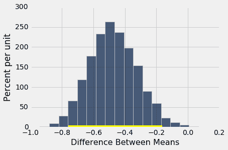

基本分布的均值之间的差异的约 95% 置信区间，范围是约 -80% 到 -20%。换句话说，实验组好转了 20% 到 80% 左右。

注意这个变化很大的估计。那是因为每个组的样本量只有 15 个左右。虽然这些作用于这些数值而没有进一步的假设，但结果并不十分精确。

### 元分析

虽然 RCT 确实真名了肉毒杆菌毒素 A 实验帮助了患者，但对 31 名患者进行的研究不足以确定治疗的有效性。这不仅仅是因为样本量小。我们在这一部分的结果对于研究中的 31 位患者是有效的，但我们对所有可能患者的总体真正感兴趣。如果 31 名患者是来自较大总体的随机样本，那么我们的置信区间对该总体是有效的。但他们不是随机样本。

2011 年，一组研究人员对实验的研究进行了元分析。也就是说，他们确定了所有被痛治疗的可用研究，并总结了整理后的结果。

有几项研究，但没有多少可以纳入科学合理的方式：“由于非随机性，不完整或未发表的数据，我们排除了 19 项研究的证据。只剩下三个随机对照试验，其中之一是我们在本节研究的。元分析给予它所有研究的最高评价（LBP 代表背痛）：“我们确定了三项研究，它们调查了 BoNT 治疗 LBP 的优点，但只有一项的偏差风险低，并且使用非特异性 LBP（N = 31）来评价患者”。

元分析得出的结论是：“有一些低质量的证据表明，BoNT 注射剂能改善疼痛，功能，或者两者都比注射生理盐水更好，而且质量很低的证据表明，它比针灸或类固醇注射更好。进一步的研究很可能会对效果评估和我们的信心产生重要影响，未来的试验应该对患者总体，实验方案和比较组进行标准化，争取更多的参与者，并包括长期结果，成本效益分析和临床相关性的发现”。

为了确定医疗有好处，需要很多精心的工作。了解如何分析随机对照试验是这项工作的重要组成部分。现在你们知道了如何实现，你们有条件帮助医疗和其他行业建立因果关系。