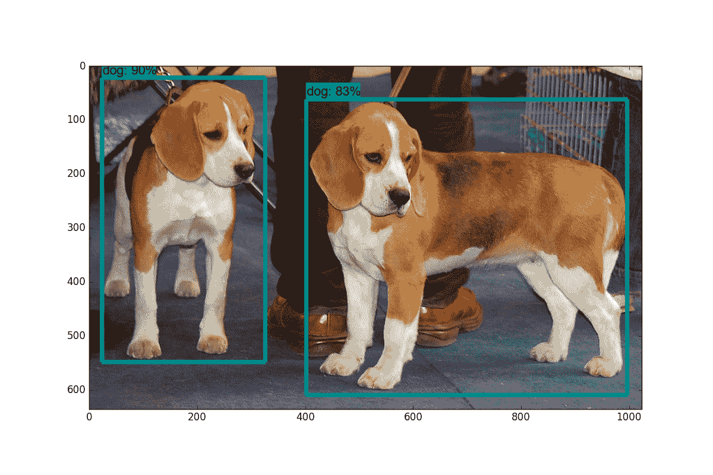
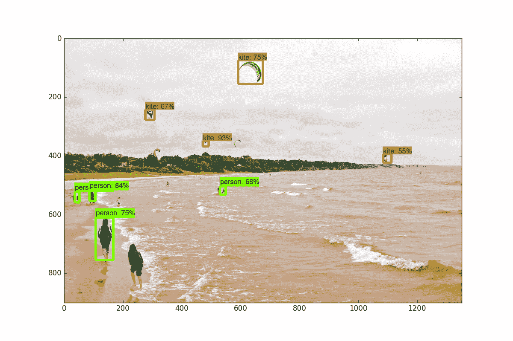
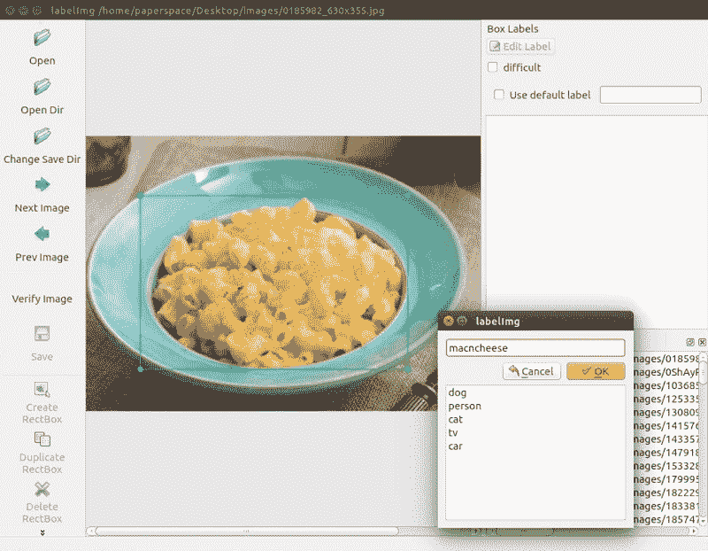
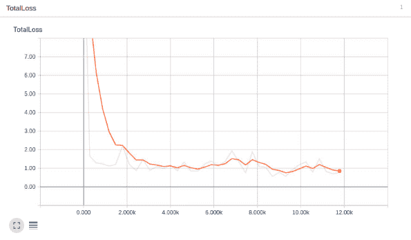
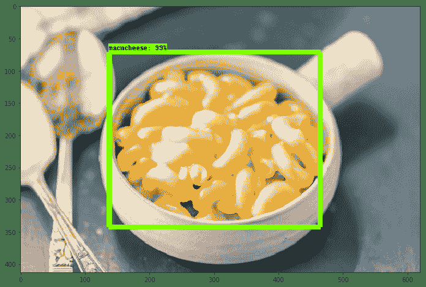
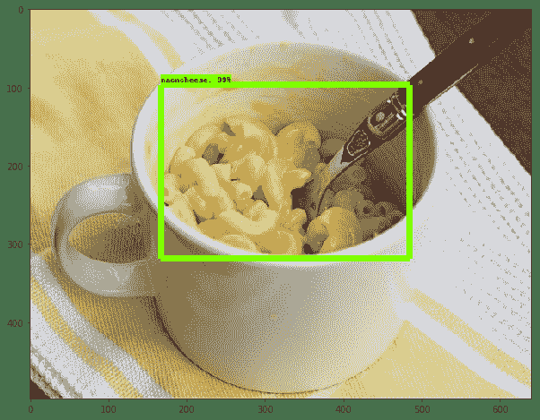
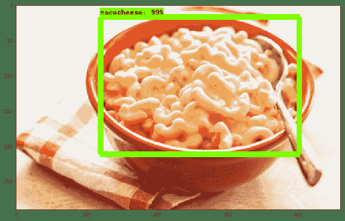

# TensorFlow 目标检测

> 原文：[TensorFlow Object Detection](https://pythonprogramming.net/introduction-use-tensorflow-object-detection-api-tutorial/)
> 
> 译者：[飞龙](https://github.com/)
> 
> 协议：[CC BY-NC-SA 4.0](http://creativecommons.org/licenses/by-nc-sa/4.0/)

## 一、引言

你好，欢迎阅读 TensorFlow 目标检测 API 迷你系列。 这个 API 可以用于检测图像和/或视频中的对象，带有使用边界框，使用可用的一些预先训练好的模型，或者你自己可以训练的模型（API 也变得更容易）。

首先，你要确保你有 TensorFlow 和所有的依赖。 对于 TensorFlow CPU，你可以执行`pip install tensorflow`，但是，当然，GPU 版本的 TensorFlow 在处理上要快得多，所以它是理想的。 如果你需要安装 TensorFlow GPU ：

安装 TensorFlow GPU 的链接：

[Ubuntu](https://pythonprogramming.net/how-to-cuda-gpu-tensorflow-deep-learning-tutorial/)
[Windows](https://www.youtube.com/watch?v=r7-WPbx8VuY)

如果你没有足够强大的 GPU 来运行 GPU 版本的 TensorFlow，则可以选择使用 PaperSpace。 使用该链接会给你 10 美元的起始折扣，10-20 小时的使用时间。

除此之外，其他的 Python 依赖包括：

```
pip install pillow
pip install lxml
pip install jupyter
pip install matplotlib
```

接下来，我们需要克隆 github。 我们可以使用`git`来完成，或者你可以将仓库下载到`.zip`：

`git clone https://github.com/tensorflow/models.git`或者点击`https://github.com/tensorflow/model`页面上绿色的“克隆或下载”按钮，下载`.zip`并解压。

一旦你有了模型目录（或`models-master`，如果你下载并解压`.zip`），在你的终端或`cmd.exe`中访问这个目录。 在 Ubuntu 和 Windows 下的步骤略有不同。

* * *

### Ubuntu：

```
protoc object_detection/protos/*.proto --python_out=.
```

并且…

```
export PYTHONPATH=$PYTHONPATH:`pwd`:`pwd`/slim
```

如果 Ubuntu 上的`protoc`命令出现错误，请使用`protoc --version`检查你运行的版本，如果它不是最新版本，你可能需要更新。 我写这个的时候，我们使用 3.4.0。 为了更新或获取`protoc`，请前往[`protoc`发布页面](https://github.com/google/protobuf/releases)。 下载 python 版本，解压，访问目录，然后执行：

```
sudo ./configure
sudo make check
sudo make install
```

之后，再次尝试`protoc`命令（再次确保你在模型目录中执行）。

* * *

### Windows

前往`protoc`发布页面并下载`protoc-3.4.0-win32.zip`，解压缩，然后在`bin`目录中找到`protoc.exe`。

如果你喜欢，你可以把它移到更合适的地方，或者把它放在这里。 我最终为我的程序文件生成`protoc`目录，并放在那里。

现在，从`models`（或`models-master`）目录中，可以使用`protoc`命令，如下所示：

```
"C:/Program Files/protoc/bin/protoc" object_detection/protos/*.proto --python_out=.
```

* * *

接下来，从`models/object_detection`目录中打开`terminal/cmd.exe`，然后用`jupyter notebook`打开 Jupyter 笔记本。 从这里选择`object_detection_tutorial.ipynb`。 从这里，你应该能在主菜单中运行单元格，并选择全部运行。

你应该得到以下结果：





在下一个教程中，我们将介绍，如何通过稍微修改此示例代码，来实时标注来自网络摄像头流的数据。

## 二、视频流的目标检测

欢迎阅读 TensorFlow 目标检测 API 教程的第二部分。 在本教程中，我们将介绍如何调整 API 的 github 仓库中的示例代码，来将对象检测应用到来自摄像头的视频流。

首先，我们将首先修改笔记本，将其转换为`.py`文件。 如果你想保存在笔记本中，那也没关系。 为了转换，你可以访问`file > save as > python file`。 一旦完成，你需要注释掉`get_ipython().magic('matplotlib inline')`这一行。

接下来，我们将引入 Python OpenCV 包装器：

如果你没有安装 OpenCV，你需要获取它。 说明请参阅 OpenCV 简介。

```
import cv2

cap = cv2.VideoCapture(0)
```

这将准备`cap`变量来访问你的摄像头。

接下来，你将下面的代码：

```
 for image_path in TEST_IMAGE_PATHS:
      image = Image.open(image_path)
      # the array based representation of the image will be used later in order to prepare the
      # result image with boxes and labels on it.
      image_np = load_image_into_numpy_array(image)
```

替换为：

```
 while True:
      ret, image_np = cap.read()
```

最后将这些东西：

```
 plt.figure(figsize=IMAGE_SIZE)
      plt.imshow(image_np)
      plt.show()
```

替换为：

```
 cv2.imshow('object detection', cv2.resize(image_np, (800,600)))
      if cv2.waitKey(25) & 0xFF == ord('q'):
        cv2.destroyAllWindows()
        break
```

这就好了。完整代码：

```
import numpy as np
import os
import six.moves.urllib as urllib
import sys
import tarfile
import tensorflow as tf
import zipfile

from collections import defaultdict
from io import StringIO
from matplotlib import pyplot as plt
from PIL import Image

import cv2
cap = cv2.VideoCapture(1)

# This is needed since the notebook is stored in the object_detection folder.
sys.path.append("..")

# ## Object detection imports
# Here are the imports from the object detection module.

# In[3]:

from utils import label_map_util

from utils import visualization_utils as vis_util

# # Model preparation 

# ## Variables
# 
# Any model exported using the `export_inference_graph.py` tool can be loaded here simply by changing `PATH_TO_CKPT` to point to a new .pb file. 
# 
# By default we use an "SSD with Mobilenet" model here. See the [detection model zoo](https://github.com/tensorflow/models/blob/master/object_detection/g3doc/detection_model_zoo.md) for a list of other models that can be run out-of-the-box with varying speeds and accuracies.

# In[4]:

# What model to download.
MODEL_NAME = 'ssd_mobilenet_v1_coco_11_06_2017'
MODEL_FILE = MODEL_NAME + '.tar.gz'
DOWNLOAD_BASE = 'http://download.tensorflow.org/models/object_detection/'

# Path to frozen detection graph. This is the actual model that is used for the object detection.
PATH_TO_CKPT = MODEL_NAME + '/frozen_inference_graph.pb'

# List of the strings that is used to add correct label for each box.
PATH_TO_LABELS = os.path.join('data', 'mscoco_label_map.pbtxt')

NUM_CLASSES = 90

# ## Download Model

# In[5]:

opener = urllib.request.URLopener()
opener.retrieve(DOWNLOAD_BASE + MODEL_FILE, MODEL_FILE)
tar_file = tarfile.open(MODEL_FILE)
for file in tar_file.getmembers():
  file_name = os.path.basename(file.name)
  if 'frozen_inference_graph.pb' in file_name:
    tar_file.extract(file, os.getcwd())

# ## Load a (frozen) Tensorflow model into memory.

# In[6]:

detection_graph = tf.Graph()
with detection_graph.as_default():
  od_graph_def = tf.GraphDef()
  with tf.gfile.GFile(PATH_TO_CKPT, 'rb') as fid:
    serialized_graph = fid.read()
    od_graph_def.ParseFromString(serialized_graph)
    tf.import_graph_def(od_graph_def, name='')

# ## Loading label map
# Label maps map indices to category names, so that when our convolution network predicts `5`, we know that this corresponds to `airplane`.  Here we use internal utility functions, but anything that returns a dictionary mapping integers to appropriate string labels would be fine

# In[7]:

label_map = label_map_util.load_labelmap(PATH_TO_LABELS)
categories = label_map_util.convert_label_map_to_categories(label_map, max_num_classes=NUM_CLASSES, use_display_name=True)
category_index = label_map_util.create_category_index(categories)

# ## Helper code

# In[8]:

def load_image_into_numpy_array(image):
  (im_width, im_height) = image.size
  return np.array(image.getdata()).reshape(
      (im_height, im_width, 3)).astype(np.uint8)

# # Detection

# In[9]:

# For the sake of simplicity we will use only 2 images:
# image1.jpg
# image2.jpg
# If you want to test the code with your images, just add path to the images to the TEST_IMAGE_PATHS.
PATH_TO_TEST_IMAGES_DIR = 'test_images'
TEST_IMAGE_PATHS = [ os.path.join(PATH_TO_TEST_IMAGES_DIR, 'image{}.jpg'.format(i)) for i in range(1, 3) ]

# Size, in inches, of the output images.
IMAGE_SIZE = (12, 8)

# In[10]:

with detection_graph.as_default():
  with tf.Session(graph=detection_graph) as sess:
    while True:
      ret, image_np = cap.read()
      # Expand dimensions since the model expects images to have shape: [1, None, None, 3]
      image_np_expanded = np.expand_dims(image_np, axis=0)
      image_tensor = detection_graph.get_tensor_by_name('image_tensor:0')
      # Each box represents a part of the image where a particular object was detected.
      boxes = detection_graph.get_tensor_by_name('detection_boxes:0')
      # Each score represent how level of confidence for each of the objects.
      # Score is shown on the result image, together with the class label.
      scores = detection_graph.get_tensor_by_name('detection_scores:0')
      classes = detection_graph.get_tensor_by_name('detection_classes:0')
      num_detections = detection_graph.get_tensor_by_name('num_detections:0')
      # Actual detection.
      (boxes, scores, classes, num_detections) = sess.run(
          [boxes, scores, classes, num_detections],
          feed_dict={image_tensor: image_np_expanded})
      # Visualization of the results of a detection.
      vis_util.visualize_boxes_and_labels_on_image_array(
          image_np,
          np.squeeze(boxes),
          np.squeeze(classes).astype(np.int32),
          np.squeeze(scores),
          category_index,
          use_normalized_coordinates=True,
          line_thickness=8)

      cv2.imshow('object detection', cv2.resize(image_np, (800,600)))
      if cv2.waitKey(25) & 0xFF == ord('q'):
        cv2.destroyAllWindows()
        break
```

我们可以清理更多代码，比如去掉`matplotlib`的导入，以及旧的图像数据，如果你喜欢的话，随意清理。

你应该有一个被标记的流媒体摄像头源。 一些可以测试的物体：自己，手机或者一瓶水。 所有这些应该有效。

在下一个教程中，我们将介绍如何添加我们自己的自定义对象来跟踪。

## 三、跟踪自定义对象

欢迎阅读 TensorFlow 目标检测 API 系列教程的第 3 部分。 在这部分以及随后的几部分中，我们将介绍如何使用此 API 跟踪和检测自己的自定义对象。 如果你观看视频，我正在使用 Paperspace。 如果你需要一个高端的 GPU，你可以使用他们的云桌面解决方案，这里有个推广链接能获得 10 美元的折扣，这足以完成这个迷你系列（训练时间约为 1 小时，GPU 为 0.40 美元/小时）

从使用预先建立的模型，到添加自定义对象，对于我的发现是个巨大跳跃，我找不到任何完整的一步一步的指导，所以希望我可以拯救你们于苦难。 一旦解决，训练任何你能想到的自定义对象（并为其创建数据）的能力，是一项了不起的技能。

好吧，简单介绍一下所需的步骤：

*   收集几百个包含你的对象的图像 - 最低限度是大约 100，理想情况下是 500+，但是，你有的图像越多，第二部就越乏味…
*   注释/标注你的图像，理想情况下使用程序。 我个人使用 LabelImg。 这个过程基本上是，在你图像的对象周围画框。 标注程序会自动创建一个描述图片中的对象的 XML 文件。
*   将这些数据分解成训练/测试样本
*   从这些分割生成 TF 记录
*   为所选模型设置`.config`文件（你可以从头自己开始训练，但是我们将使用迁移学习）
*   训练
*   从新的训练模型导出图形
*   实时检测自定义对象！
*   …
*   完成！

所以，在本教程中，我需要一个对象。 我想要一些有用的东西，但还没有完成。 显然，每个人都需要知道通心粉和奶酪的位置，所以让我们跟踪它！

我使用 Google Images，Bing 和 ImageNet 来收集一些通心粉和奶酪的图像。 一般来说，图片大小在`800x600`左右，不能太大也不能太小。

对于本教程，你可以跟踪任何你想要的东西，只需要 100 多张图片。 一旦你有图像，你需要标注它们。 为此，我将使用 LabelImg，你可以使用`git clone https://github.com/tzutalin/labelImg`来获取它，或者直接下载并解压`zip`。

安装说明在`labelimg github`上，但对于 Ubuntu 上的 Python3：

```
sudo apt-get install pyqt5-dev-tools

sudo pip3 install lxml

make qt5py3

python3 labelImg.py
```

运行这个时，你应该得到一个 GUI 窗口。 从这里，选择打开目录并选择你保存所有图像的目录。 现在，你可以开始使用创建`rectbox`按钮进行注释。 绘制你的框，添加名称，并点击确定。 保存，点击下一张图片，然后重复！ 你可以按`w`键来画框，并按`ctrl + s`来保存得更快。 不确定是否有下一张图片的快捷键。



一旦你标记了超过 100 张图片被，我们将把他们分成训练和测试组。 为此，只需将你的图像和注解 XML 文件的约 10% 复制到一个称为`test`的新目录，然后将其余的复制到一个叫做`train`的新目录。

一旦完成了所有这些，就可以开始下一个教程了，我们将介绍如何从这些数据创建所需的 TFRecord 文件。

另外，如果你想使用我的预制文件，你可以下载我的[已标注的通心粉和奶酪](https://pythonprogramming.net/static/downloads/machine-learning-data/object-detection-macaroni.zip)。

## 四、创建 TFRecord

欢迎阅读 TensorFlow 目标检测 API 系列教程的第 4 部分。在本教程的这一部分，我们将介绍如何创建 TFRecord 文件，我们需要它来训练对象检测模型。

到了这里，你应该有一个图像目录，里面有所有的图像，以及 2 个额外的目录：训练和测试。在测试目录内应该是你的图像的月 10% 的副本与他们的 XML 注释数据，然后训练目录应该有其余的副本。如果你没有，请转到上一个教程。

现在我们需要将这些 XML 文件转换为单个 CSV 文件，它们可以转换为 TFRecord 文件。为此，我将利用[`datitran`的 github](https://github.com/datitran/raccoon_dataset) 中的一些代码做一些小的改动。首先，我们要使用`xml_to_csv.py`。你既可以克隆他的整个目录，也可以抓取这些文件，我们将使用其中的两个。由于他的存储库已经改变了多次，我已经搞乱了，我注意到，我所使用的具体提交是：[这个](https://github.com/datitran/raccoon_dataset/commit/386a8f4f1064ea0fe90cfac8644e0dba48f0387b)。如果这两个脚本中的任何一个都不适合你，请尝试拉取和我相同的提交。绝对要尝试他的最新版本。例如，在我写这个的时候，他刚刚更新了图像中的多个盒标签，这显然是一个非常有用的改进。

在`xml_to_csv`脚本中，我将：

```
def main():
    image_path = os.path.join(os.getcwd(), 'annotations')
    xml_df = xml_to_csv(image_path)
    xml_df.to_csv('raccoon_labels.csv', index=None)
    print('Successfully converted xml to csv.')
```

修改为：

```
def main():
    for directory in ['train','test']:
        image_path = os.path.join(os.getcwd(), 'images/{}'.format(directory))
        xml_df = xml_to_csv(image_path)
        xml_df.to_csv('data/{}_labels.csv'.format(directory), index=None)
        print('Successfully converted xml to csv.')
```

这只是拆分训练/测试和命名文件的有用的东西。 继续并创建一个数据目录，然后运行它来创建这两个文件。 接下来，在主对象检测目录中创建一个训练目录。 到了这里，你应该有以下结构，它在我的桌面上：

```
Object-Detection
-data/ --test_labels.csv --train_labels.csv -images/ --test/ ---testingimages.jpg --train/ ---testingimages.jpg --...yourimages.jpg -training -xml_to_csv.py
```

现在，抓取`generate_tfrecord.py`。 你需要做的唯一修改在`class_text_to_int`函数中。 你需要改变你的具体类别。 在我们的例子中，我们只有一个类别。 如果你有很多类别，那么你需要继续构建这个`if`语句。

```
# TO-DO replace this with label map
def class_text_to_int(row_label):
    if row_label == 'macncheese':
        return 1
    else:
        None
```

从 TODO 来看，这个函数在将来可能会有一些变化，所以再一次使用你的直觉来修改最新版本，或者使用我正在使用的同一个提交。

接下来，为了使用它，我们需要在 github 克隆的模型目录内运行，或者可以更正式地安装对象检测 API。

我正在在一个新的机器上的做这个教程，来确保我不会错过任何步骤，所以我将完整配置对象的 API。 如果你已经克隆和配置，可以跳过最初的步骤，选择`setup.py`部分！

首先，我将仓库克隆到我的桌面上：

```
git clone https://github.com/tensorflow/models.git
```

之后，遵循以下安装指令：

```
sudo apt-get install protobuf-compiler python-pil python-lxml
sudo pip install jupyter
sudo pip install matplotlib
```

之后：

```
# From tensorflow/models/
protoc object_detection/protos/*.proto --python_out=.
```

如果 Ubuntu 上的`protoc`命令出现错误，请使用`protoc --version`检查你运行的版本，如果它不是最新版本，你可能需要更新。 我写这个的时候，我们使用 3.4.0。 为了更新或获取`protoc`，请前往`protoc`发布页面。 下载 python 版本，解压，访问目录，然后执行：

```
sudo ./configure
sudo make check
sudo make install
```

之后，再次尝试`protoc`命令（再次确保你在模型目录中执行）。

并且

```
# From tensorflow/models/
export PYTHONPATH=$PYTHONPATH:`pwd`:`pwd`/slim
```

最后，我们通过在`models`目录中执行以下步骤，来正式安装`object_dection`库：

```
sudo python3 setup.py install
```

现在我们可以运行`generate_tfrecord.py`脚本。 我们将运行两次，一次用于训练 TFRecord，一次用于测试 TFRecord。

```
python3 generate_tfrecord.py --csv_input=data/train_labels.csv --output_path=data/train.record

python3 generate_tfrecord.py --csv_input=data/test_labels.csv --output_path=data/test.record
```

现在，在你的数据目录中，你应该有`train.record`和`test.record`。

接下来，我们需要设置一个配置文件，然后训练一个新的模型，或者从一个预先训练好的模型的检查点开始，这将在下一个教程中介绍。

## 五、训练自定义对象检测器

欢迎阅读 TensorFlow 对象检测 API 系列教程的第 5 部分。在本教程的这一部分，我们将训练我们的对象检测模型，来检测我们的自定义对象。为此，我们需要匹配 TFRecords 的训练和测试数据的图像，然后我们需要配置模型，然后我们可以训练。对我们来说，这意味着我们需要设置一个配置文件。

在这里，我们有两个选择。我们可以使用预训练的模型，然后使用迁移学习来习得一个新的对象，或者我们可以从头开始习得新的对象。迁移学习的好处是训练可能更快，你需要的数据可能少得多。出于这个原因，我们将在这里执行迁移学习。

TensorFlow 有相当多的预训练模型，带有检查点文件和配置文件。如果你喜欢，可以自己完成所有这些工作，查看他们的配置作业文档。对象 API 还提供了一些示例配置供你选择。

我打算使用 mobilenet，使用下面的检查点和配置文件：

```
wget https://raw.githubusercontent.com/tensorflow/models/master/object_detection/samples/configs/ssd_mobilenet_v1_pets.config
wget http://download.tensorflow.org/models/object_detection/ssd_mobilenet_v1_coco_11_06_2017.tar.gz 
```

你可以查看一些其他检查点选项，来从这里起步。

将该配置放在训练目录中，并解压`models/object_detection`目录中的`ssd_mobilenet_v1`。

在配置文件中，你需要搜索所有`PATH_TO_BE_CONFIGURED`的位置并更改它们。 你可能还想要修改批量大小。 目前，我的配置文件中设置为 24。 其他模型可能有不同的批量。 如果出现内存错误，可以尝试减小批量以使模型适合你的 VRAM。 最后，还需要修改检查点名称/路径，将`num_classes`更改为 1，`num_examples`更改为 12，以及`label_map_path`改为`"training/object-detect.pbtxt"`。

这是一些编辑，所以这里是我的完整的配置文件：

```
# SSD with Mobilenet v1, configured for the mac-n-cheese dataset.
# Users should configure the fine_tune_checkpoint field in the train config as
# well as the label_map_path and input_path fields in the train_input_reader and
# eval_input_reader. Search for "${YOUR_GCS_BUCKET}" to find the fields that
# should be configured.

model {
  ssd {
    num_classes: 1
    box_coder {
      faster_rcnn_box_coder {
        y_scale: 10.0
        x_scale: 10.0
        height_scale: 5.0
        width_scale: 5.0
      }
    }
    matcher {
      argmax_matcher {
        matched_threshold: 0.5
        unmatched_threshold: 0.5
        ignore_thresholds: false
        negatives_lower_than_unmatched: true
        force_match_for_each_row: true
      }
    }
    similarity_calculator {
      iou_similarity {
      }
    }
    anchor_generator {
      ssd_anchor_generator {
        num_layers: 6
        min_scale: 0.2
        max_scale: 0.95
        aspect_ratios: 1.0
        aspect_ratios: 2.0
        aspect_ratios: 0.5
        aspect_ratios: 3.0
        aspect_ratios: 0.3333
      }
    }
    image_resizer {
      fixed_shape_resizer {
        height: 300
        width: 300
      }
    }
    box_predictor {
      convolutional_box_predictor {
        min_depth: 0
        max_depth: 0
        num_layers_before_predictor: 0
        use_dropout: false
        dropout_keep_probability: 0.8
        kernel_size: 1
        box_code_size: 4
        apply_sigmoid_to_scores: false
        conv_hyperparams {
          activation: RELU_6,
          regularizer {
            l2_regularizer {
              weight: 0.00004
            }
          }
          initializer {
            truncated_normal_initializer {
              stddev: 0.03
              mean: 0.0
            }
          }
          batch_norm {
            train: true,
            scale: true,
            center: true,
            decay: 0.9997,
            epsilon: 0.001,
          }
        }
      }
    }
    feature_extractor {
      type: 'ssd_mobilenet_v1'
      min_depth: 16
      depth_multiplier: 1.0
      conv_hyperparams {
        activation: RELU_6,
        regularizer {
          l2_regularizer {
            weight: 0.00004
          }
        }
        initializer {
          truncated_normal_initializer {
            stddev: 0.03
            mean: 0.0
          }
        }
        batch_norm {
          train: true,
          scale: true,
          center: true,
          decay: 0.9997,
          epsilon: 0.001,
        }
      }
    }
    loss {
      classification_loss {
        weighted_sigmoid {
          anchorwise_output: true
        }
      }
      localization_loss {
        weighted_smooth_l1 {
          anchorwise_output: true
        }
      }
      hard_example_miner {
        num_hard_examples: 3000
        iou_threshold: 0.99
        loss_type: CLASSIFICATION
        max_negatives_per_positive: 3
        min_negatives_per_image: 0
      }
      classification_weight: 1.0
      localization_weight: 1.0
    }
    normalize_loss_by_num_matches: true
    post_processing {
      batch_non_max_suppression {
        score_threshold: 1e-8
        iou_threshold: 0.6
        max_detections_per_class: 100
        max_total_detections: 100
      }
      score_converter: SIGMOID
    }
  }
}

train_config: {
  batch_size: 10
  optimizer {
    rms_prop_optimizer: {
      learning_rate: {
        exponential_decay_learning_rate {
          initial_learning_rate: 0.004
          decay_steps: 800720
          decay_factor: 0.95
        }
      }
      momentum_optimizer_value: 0.9
      decay: 0.9
      epsilon: 1.0
    }
  }
  fine_tune_checkpoint: "ssd_mobilenet_v1_coco_11_06_2017/model.ckpt"
  from_detection_checkpoint: true
  data_augmentation_options {
    random_horizontal_flip {
    }
  }
  data_augmentation_options {
    ssd_random_crop {
    }
  }
}

train_input_reader: {
  tf_record_input_reader {
    input_path: "data/train.record"
  }
  label_map_path: "data/object-detection.pbtxt"
}

eval_config: {
  num_examples: 40
}

eval_input_reader: {
  tf_record_input_reader {
    input_path: "data/test.record"
  }
  label_map_path: "training/object-detection.pbtxt"
  shuffle: false
  num_readers: 1
}
```

在训练目录里面，添加`object-detection.pbtxt`：

```
item {
  id: 1
  name: 'macncheese' }
```

而现在，见证奇迹时刻！ 在`models/object_detection`中：

```
python3 train.py --logtostderr --train_dir=training/ --pipeline_config_path=training/ssd_mobilenet_v1_pets.config
```

禁止错误，你应该看到如下输出：

```
INFO:tensorflow:global step 11788: loss = 0.6717 (0.398 sec/step)
INFO:tensorflow:global step 11789: loss = 0.5310 (0.436 sec/step)
INFO:tensorflow:global step 11790: loss = 0.6614 (0.405 sec/step)
INFO:tensorflow:global step 11791: loss = 0.7758 (0.460 sec/step)
INFO:tensorflow:global step 11792: loss = 0.7164 (0.378 sec/step)
INFO:tensorflow:global step 11793: loss = 0.8096 (0.393 sec/step)
```

你的步骤从1开始，损失会高一些。 根据你的 GPU 和你有多少训练数据，这个过程需要不同的时间。 像 1080ti 这样的东西，应该只需要一个小时左右。 如果你有很多训练数据，则可能需要更长的时间。 你想截取的损失平均约为 1（或更低）。 我不会停止训练，直到你确定在 2 以下。你可以通过 TensorBoard 检查模型如何训练。 你的`models/object_detection/training`目录中会出现新的事件文件，可以通过 TensorBoard 查看。

在`models/object_detection`中通过终端，这样启动 TensorBoard：

```
tensorboard --logdir='training'
```

这会运行在`127.0.0.1:6006`（在浏览器中访问）；

我的总损失图：



看起来不错，但它能检测通心粉和奶酪嘛？！

为了使用模型来检测事物，我们需要导出图形，所以在下一个教程中，我们将导出图形，然后测试模型。

## 六、测试自定义对象检测器

欢迎阅读 TensorFlow 对象检测 API 教程系列的第 6 部分。 在本教程的这一部分，我们将测试我们的模型，看看它是否符合我们的希望。 为此，我们需要导出推理图。

幸运的是，在`models/object_detection`目录中，有一个脚本可以帮助我们：`export_inference_graph.py`

为了运行它，你只需要传入你的检查点和你的流水线配置，然后是你想放置推理图的任何地方。 例如：

```
python3 export_inference_graph.py \
    --input_type image_tensor \
    --pipeline_config_path training/ssd_mobilenet_v1_pets.config \
    --trained_checkpoint_prefix training/model.ckpt-10856 \
    --output_directory mac_n_cheese_inference_graph
```

你的检查点文件应该在训练目录中。 只要找出最大步骤（破折号后面最大的那个），那就是你想要使用的那个。 接下来，确保`pipeline_config_path`设置为你选择的任何配置文件，然后最后选择输出目录的名称，我用`mac_n_cheese_inference_graph`。

在`models/object_detection`中运行上述命令。

如果你得到一个错误，没有名为`nets`的模块，那么你需要重新运行：

```
# From tensorflow/models/
export PYTHONPATH=$PYTHONPATH:`pwd`:`pwd`/slim
# switch back to object_detection after this and re run the above command
```

否则，你应该有一个新的目录，在我的情况下，我的是`mac_n_cheese_inference_graph`，里面，我有新的检查点数据，`saved_model`目录，最重要的是，`forzen_inference_graph.pb`文件。

现在，我们将使用示例笔记本，对其进行编辑，并查看我们的模型在某些测试图像上的工作情况。 我将一些`models/object_detecti../img/test images`图像复制到`models/object_detection/test_images`目录中，并将其更名为`image3.jpg`，`image4.jpg`…等。

启动 jupyter 笔记本并打开`object_detection_tutorial.ipynb`，让我们进行一些更改。 首先，前往“变量”部分，然后更改模型名称以及检查点和标签的路径：

```
# What model to download.
MODEL_NAME = 'mac_n_cheese_inference_graph'

# Path to frozen detection graph. This is the actual model that is used for the object detection.
PATH_TO_CKPT = MODEL_NAME + '/frozen_inference_graph.pb'

# List of the strings that is used to add correct label for each box.
PATH_TO_LABELS = os.path.join('training', 'object-detection.pbtxt')

NUM_CLASSES = 1
```

接下来，我们可以删除整个下载模型部分，因为我们不需要再下载了。

最后，在“检测”部分中，将`TEST_IMAGE_PATHS`变量更改为：

```
TEST_IMAGE_PATHS = [ os.path.join(PATH_TO_TEST_IMAGES_DIR, 'image{}.jpg'.format(i)) for i in range(3, 8) ] 
```

有了这个，你可以访问单元格菜单选项，然后“运行全部”。

以下是我的一些结果：







总的来说，我非常高兴看到它的效果有多棒，即使你有一个非常小的数据集，你仍然可以成功。使用迁移学习来训练一个模型只需要一个小时（在一个像样的 GPU 上）。 很酷！