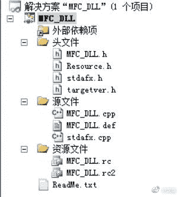
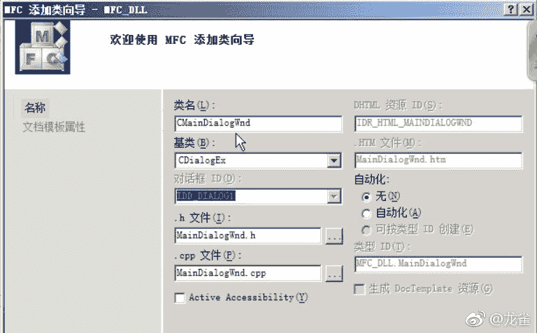

# 一、分析角色 HP/MP 地址

我们的目标是这个，热血江湖。我们要找出基本信息中，所有数据的地址。


我们要用到一款工具，CE。打开之后点击左上角打开进程，会弹出进程列表，我们需要选择游戏的进程。


我们可以点击下面的“窗口列表”，然后从打开的窗口中搜索，这样可能比较好找。


由于 HP 数值变动较快，我们把扫描类型改为“两者之间的数值”，在上面把数值设置为 352 和 370（视具体情况而定），然后点“首次扫描”。


左边就会出现结果。因为结果太多，我们不知道是哪个，需要进一步筛选。


我们把扫描类型改为“增加的数值”，点击“再次扫描”。这个很重要，因为再次扫描是在上一次的结果中搜索，可以缩小范围。游戏中一些值是不变的，可以过滤一些。


我们双击唯一的结果，它会在底部的列表中出现，双击描述可以修改名称。双击地址会弹出这样一个框。


我们可以看到，地址采用模块名称（基址）加偏移来描述。这是因为一些模块是共享库，加载时会改变基址。因为我们这是一个 EXE，不需要这个名称也可以。

接下来我们尝试寻找 MP（蓝的那个）的地址。我们不需要重新搜索。我们假设程序以`int`保存这些数值，而`int`在 windows x86/x64 上是四个字节。我们还假设这些东西是挨着存储的。所以我们将那个地址加四。


我们看到右边的 251 正好的游戏的 MP，说明我们找对了。

## 二、分析角色金钱基址

我们查看金币数量，是 173061：


这个数值不太可能有重的，所以我们直接搜索：


我们选上面那个，因为它和我们上节课的地址在一个段里面。

我们找到了金钱的地址。但这样一个一个找太麻烦了，有没有可能一次找到全部呢？

首先记下基本信息：


我们打开 OD 并用它附加游戏。


然后执行`dd 2f86170`，在左下角的窗口中，我们可以看到这个地址附近的数据。


我们双击第一行第一列，将第一列转换为偏移形式：


我们看到第二列是十六进制形式，需要将其转换为十进制。

| 地址 | 数值 | 属性 |
| --- | --- | --- |
| `(0x2f86170)+0x0` | 381 | HP |
| `0x4` | 252 | MP |
| `0x8` | 390 | 愤怒值 |
| `0xc` | 381 | 最大 HP |
| `0x10` | 252 | 最大 MP |
| `0x14` | 1000 | 最大愤怒值 |
| `0x18 QWORD` | 12185 | 经验值 |
| `0x20 QWORD` | 24782 | 下一级所需的经验值 |
| `0x28` | 10 | ？ |
| `0x2c` | 27138 | 历练 |
| `0x30` | 51 | 心 |
| `0x34` | 54 | 体 |
| `0x38` | 31 | 气 |
| `0x3c` | 91 | 魂 |
| `0x40` | 0 | ？ |
| `0x44` | 0 | ？ |

我们可以根据数值猜出绝大部分。但是 HP 之前还有个昵称，这里没有，可能我们需要向前找找。

我们点击右键，点击“文本->ASCII（32 字符）”：


在`-0x80`的地方找到了角色名称。我们切换为十六进制视图，然后把这个地方作为新的基址：


我们得到了一些新的东西：

| 地址 | 数值 | 属性 |
| --- | --- | --- |
| `(0x2f860f0)+0x0 STR` | - | 角色名称 |
| `0x30` | 11 | ？ |
| `0x34 BYTE` | 0x17 | 等级 |
| `0x35 BYTE` | 0x1 | 几转 |
| `0x36 STR` | - | 名声 |

并且之前那些地址需要加上`0x80`，这里就不再写一遍了。

我们回到 CE，可以点击右边的“手动加入地址”，保存它们。


## 三、分析角色气功加点

这次我们要分析角色的气功点数：


我们首先寻找第一个，因为其它气功很可能在第一个后面。

并且，我们不知道这个属性用几个字节来表示。但如果多于一个字节，那么`14`应该在它的最低字节。也就是说，无论怎么表示，我们都可以搜索一个字节`14`。

（实际上气功点数最大为 20，剩余点数最大为 100，不超出一个字节的最大值。就算它多于一个字节，高字节也用不上。）


搜索结果太多了，我们让它变化一下，给它加一点变成 15，然后再搜。


最上面的两个以`0x02f`开头，和上一节的其它数据在同一个段里面。那么到底哪个是呢？

我们用 OD 附加进程（其它很多软件都可以），查看具体的内存布局。首先是第一个`0x02f861e4`：


`0x02f861e4`是第一个气功点数，每隔`0x4`就有一个气功点数。`0x02f861e0`是剩余点数。所有点数都是一字节。

然后是第二个`0x02f888a0`：


这个地址中没有剩余点数，而且都是紧密挨着的。

下面我们验证一下，将第二个气功的点数加一。


这是第一个地址`0x02f861e0`：


我们看到第二个气功的点数变成了 2。

然后是第二个地址`0x02f888a0`：


也变了，说明两个地址都有效。我们选择第一个，因为它和我们上一节的基址近一些。我们减一下，得到第一个地址的偏移是`0xf0`。

下面我们总结一下信息：

| 地址 | 数值 | 属性 |
| --- | --- | --- |
| `(0x2f860f0)+0xf0 BYTE` | 2 | 气功剩余点数 |
| `0xf4 BYTE` | 15 | 第一个气功点数 |
| `0xf0+4*i BYTE` | - | 第`i`个气功点数 |

## 四、注入 DLL

一般来说，在同一个进程中读取数据比较方便。所以我们编写 DLL，将其注入同一个进程中。

打开 VS，新建项目，选择“MFC DLL”。创建项目完成后，我们的目录是这样：



接下来我们创建窗口，点击资源视图（左下角），然后右键添加资源对话框（Dialog）：


然后我们新建类`CMainDialogWnd`，使用 MFC 创建类向导：



然后打开“源文件->`MainDialogWnd.h`”，代码是这样。

```
class CMainDialogWnd: public CDialogEx
{
    DECLARE_DYNAMIC(CMainDialogWnd)

public:
    CMainDialogWnd(CWnd* pParent=NULL); //标准构造函数
    virtual ~CMainDialogWnd();

    //对话框数据
    enum { IDD = IDD_DIALOG1 }

protected:
    virtual void DoDataExchange(CDataExchange* pDX) //DDX/DDV 支持

    DECLARE_MESSAGE_MAP()
}
```

我们打开`MFC_DLL.cpp`，创建全局变量：

```
CMainDialogWnd *PMainDialog;
```

在`CMFC_DLLApp::InitInstance`中添加：

```
PMainDialog = new CMainDialogWnd;
PMainDialog->DoModal();
delete PMainDialog;
// 释放 DLL，以便反复注入
FreeLibraryAndExitThread(theApp.m_hInstance, 1);
```

但这样有个问题，这个窗口是模态的。窗口显示的时候会卡住游戏。我们可以将其放到子线程中。把上面的代码移到一个函数中：

```
DWORD WINAPI ShowDialog(LPARAM lpData) 
{
    PMainDialog = new CMainDialogWnd;
    PMainDialog->DoModal();
    delete PMainDialog;
    // 释放 DLL，以便反复注入
    FreeLibraryAndExitThread(theApp.m_hInstance, 1);

    return TRUE;
}
```

在`CMFC_DLLApp::InitInstance`中编写：

```
CreateThread(NULL, NULL, (LPTHREAD_START_ROUTINE)ShowDialog, NULL, NULL, NULL);
```

我们编译它，在`debug`目录下面得到`MFC_DLL.dll`。然后我们打开`CodeInEx`注入工具，点击左上角的按钮：


我们首先在上面的列表中选择要注入的进程，然后点击下面的“注入DLL”按钮，会弹出一个选择框。我们在里面选择刚才的 DLL。

之后我们发现我们的窗口打开了，并且游戏还有反应。

## 五、手动编写注入代码

上一节中，我们使用工具来注入 DLL。这一节我们尝试自己编程来实现。

首先新建 Win32 控制台项目，在“源文件”目录下创建`InjectDll.cpp`（名字不重要）。

我们首先要获取窗体类名，之后要拿它获取窗口句柄。为什么这样，是因为窗体类名是永远不变的，句柄可能每次启动都要变。我们打开`Spy++`：


句柄是`D3D Window`。我们在代码开头定义一个常量：

```
#define GameClassName "D3D Window"
```

我们还需要定义 DLL 的路径：

```
#define DllFullPath "path\\to\\your\\dll"
```

之后我们编写函数`InjectDll`：

```
bool InjectDll() 
{
    // 根据窗口类名获得句柄
    HWND hWnd = FindWindow(GameClassName, NULL);
    if(hWnd == NULL) 
        return false;

    DWORD pid = 0;
    // 根据窗口句柄获取 PID
    GetWindowThreadProcessId(hWnd, &pid);
    if(pid == 0)
        return false;

    // 根据 PID 获取进程句柄
    HANDLE hProcess = OpenProcess(PROCESS_ALL_ACCESS, FALSE, pid);
    if(hProcess == NULL)
        return false;

    // 在游戏内存中分配一片空间
    LPVOID address = VirtualAllocEx(hProcess, NULL, 256, MEM_COMMIT, PAGE_READWRITE);
    if(address == NULL)
        return false;

    // 写入 DLL 全路径名
    DWORD bytesWritten;
    WriteProcessMemory(hProcess, address, DllFullPath, strlen(DllFullPath) + 1, &bytesWritten);
    if(bytesWritten < strlen(DllFullPath))
        return false;

    // 在目标进程中启动线程
    // 加载动态链接库
    HANDLE hThread = CreateRemoteThread(hProcess, NULL, NULL, (LPTHREAD_START_ROUTINE)LoadLibraryA, address, NULL, NULL);

    // 等待
    WaitForSingleObject(hThread, 0xffffffff);

    // 回收
    CloseHandle(hThread);
    VirtualFreeEx(hProcess, address, 256, MEM_DECOMMIT);
    CloseHandle(hProcess);

    return true;
}
```

然后编写`main`：

```
int main() 
{
    // 注入 DLL 代码
    printf("注入 DLL\n");
    if(!InjectDll())
        printf("注入 DLL 失败\n");

    // 让控制台停住
    getchar();

    return 0;
}
```

编译运行之后，DLL 就被注入，我们也就能看到熟悉的窗口了。