# 六、相对路径

我们希望把 DLL 和这个程序放到一起，那么 DLL 路径就是程序所在路径加上 DLL 的名称。

将`DllFullPath`的定义注释掉，换成`DllName`：

```
#define DllName "mfc_dll.dll"
```

然后修改`InjectDll`的参数：

```
bool InjectDll(const char *dllFullPath)
```

所有`DllFullPath`都改成`dllFullPath`。

然后试一试`GetCurrentDirectory`函数：

```
int main()
{
    // 用于存放目录
    char dirName[256] = "";
    GetCurrentDirectory(sizeof(dirName), dirName);
    printf("%s\n", dirName);

    // 停住
    getchar();

    return 0;
}
```

这是运行结果：

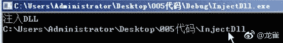

我们发现，这个程序是在项目目录的`debug`目录中（见窗口标题），但是取到了另一个目录。这是因为我们用调试模式启动程序，正常启动就好了。

现在我们拼接 DLL 全路径：

```
// 保存 DLL 全路径
char dllFullPath[256] = "";

strcpy_s(dllFullPath, sizeof(dllFullPath), dirName);

// 我们需要补上斜杠
strcat_s(dllFullPath, sizeof(dllFullPath), "\\");

strcat_s(dllFullPath, sizeof(dllFullPath), DllName);
```

之后我们调用`InjectDll`：

```
if(!InjectDll(dllFullPath))
    // ...
```

我们还需要清理项目目录，编写一个`bat`文件：

```
REM clear.bat
del *.sdf *.log *.user *.filters *.ipch *.aps /s
del *.exe *.dll /s
del *.suo /s /a h
del *.ilk *.pdb *.exp *.lib *.tlog *.manifest *.res *.lastbuildstate /s
del *.obj *.pch /s
pause
```

## 七、读取人物属性

打开第四节的 MFC 项目，添加一个按钮，把标题（`Caption`属性）改为“测试”。

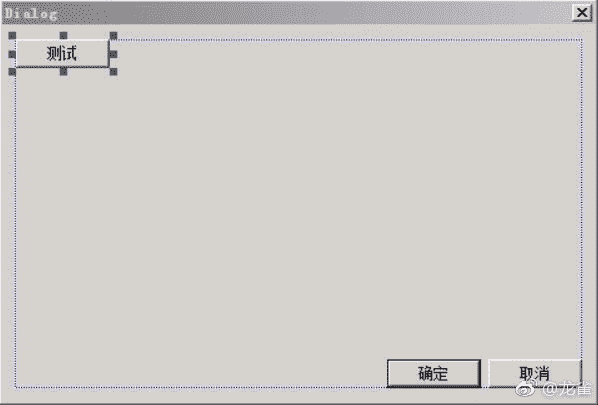

然后双击这个按钮，程序会自动创建回调：

```
void CMainDialogWnd::OnBnClickedButtonTest()
{
    // TODO:
}
```

我们在里面写一些东西，比如说调试信息：

```
TRACE("GameDebug:我的调试信息\r\n");
```

`TRACE`函数的输出使用工具才能看到。我们打开`DebugView`，点击“编辑->Filter/Highlight”：


在弹出的窗口中，我们在`Include`后面的编辑框中输出`GameDebug*`：

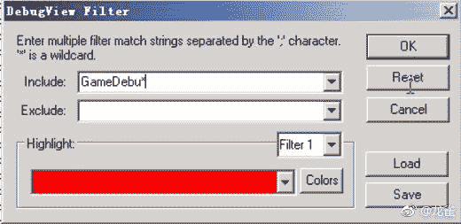

这样，我们就看不到不是我们发出的调试信息了。之后运行我们运行我们的程序，点击“测试”，就能看到调试信息：

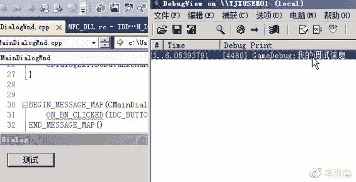

好，下面读取人物属性。在全局定义：

```
#define BaseRole 0x2f860f0
```

然后在回调中添加：

```
TRACE("GameDebug: 人物名=%s\r\n", BaseRole);
TRACE("GameDebug: 人物等级=%d\r\n", *(BYTE*)(BaseRole+0x34));
```

运行，点击按钮，我们可以看到属性信息：

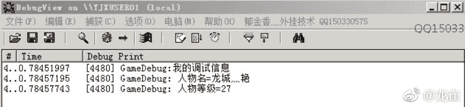

## 八、人物信息的封装

> 视频里面的方法太啰嗦，我这里提供一个比较好的方法。

我们需要一种简便的方式，一次性读取所有信息。

首先创建`RoleProperty.h`，定义基址：

```
#define RolePropertyBase 0x2f86170
```

然后定义结构体，参照之前的地址表格。

```
struct RoleProperty
{
    // 0x0 名称
    char name[10];

    char padding1[42];

    // 0x34 等级
    BYTE level;
    // 0x35 职业（几转）
    BYTE job;
    // 0x36 名声
    char honor[10];

    char padding2[64];

    // 0x80 HP
    DWORD hp;
    // 0x84 MP
    DWORD mp;
    // 0x88 愤怒值
    DWORD angry;
    // 0x8c 最大 HP
    DWORD maxHp;
    // 0x90 最大 MP
    DWORD maxMp;
    // 0x94 最大愤怒值
    DWORD maxAngry;
    // 0x98 经验值
    QWORD exp;
    // 0xa0 最大经验
    QWORD maxExp;

    DWORD padding3;

    // 0xac 历练
    DWORD liLian;
    // 0xb0 心
    DWORD xin;
    // 0xb4 体
    DWORD ti;
    // 0xb8 气
    DWORD qi;
    // 0xbc 魂
    DWORD hun;

    QWORD padding4;

    // 0xc8 攻击
    DWORD attack;
    // 0xcc 防御
    DWORD defense;
    // 0xd0 命中
    DWORD accuracy;
    // 0xd4 回避
    DWORD evasion;

    char padding5[12];

    // 0xe4 金钱
    QWORD money;
    // 0xec 负重
    WORD load;
    // 0xee 最大负重
    WORD maxLoad;
    // 0xf0 剩余气功点数
    BYTE restQiGong;
    char padding6[3];

    // 0xf4 32 个气功
    struct {
        BYTE qiGong;
        char padding[3];
    } qiGongList[32];

    void GetData();
}
```

我们需要让它的布局与内存中完全一致，然后可以批量读取。这个就简单了，在`RoleProperty.cpp`中定义：

```
RoleProperty prop;
prop = *(RoleProperty*)RolePropertyBase;
```

## 九、静态库的加载

上一节的代码写在名为`GameData`的不同目录里面。我们希望能在`MFC_DLL`中引用。如果直接引用，会提示找不到头文件。


我们需要在“配置属性->C/C++->常规”中，设置附加包含目录。由于在不同的项目中，我们设为`..\\GameData\`。

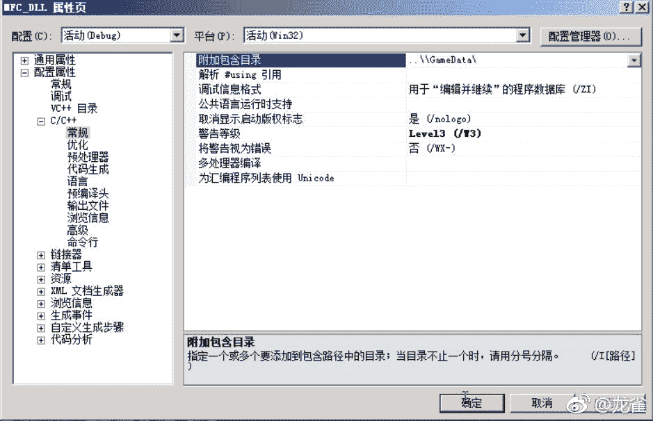

再次编译，又遇到了新的问题。

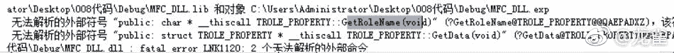

这个是由于静态库没有配置好。`GameData`项目会生成`GameData.lib`，在它自己的文件夹中。

我们在“配置属性->链接器->输入”中，将附加依赖项设为`GameData.lib`。

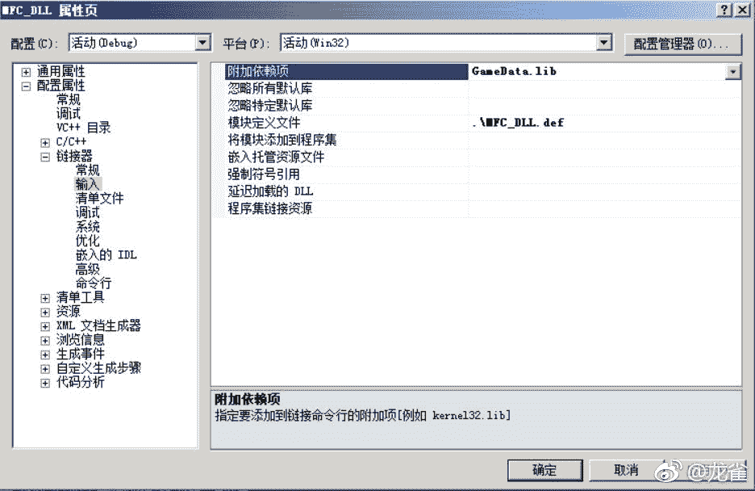

在“配置属性->链接器->常规”中，将附加库目录配置为`..\\lib\`。它表示项目目录中的`lib`。

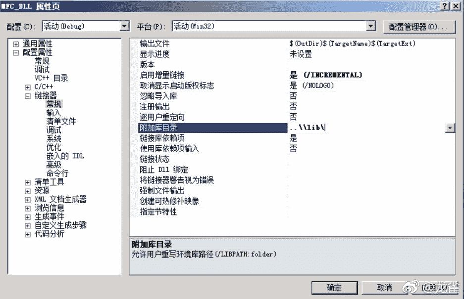

之后，打开`GameData`的属性页，在“配置属性->常规”中，将输出目录也改成这个。

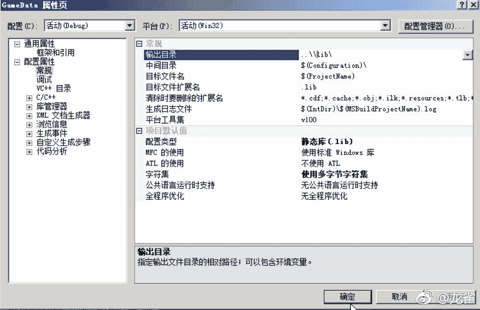

这个时候还是有冲突，对于所有项目，在“配置属性->C/C++->代码生成”中，将运行库设为“多线程调试”，就没冲突了。

然后，人物属性也不用一个一个输出了：

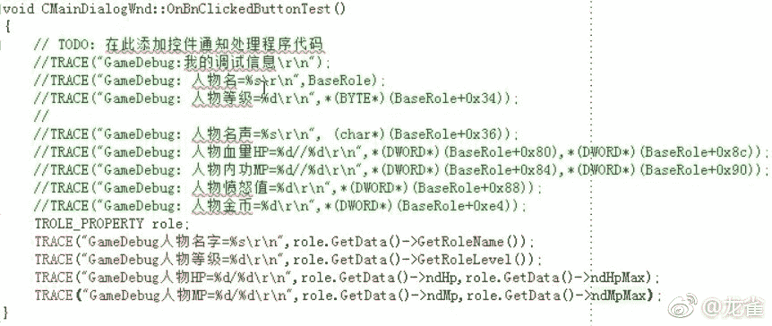

编译运行，之后点测试按钮，我们会看到：

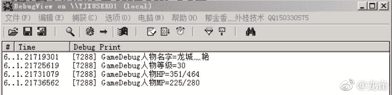

## 十、物品数量

我们随便找个物品，比如第一个，看到它的数量是 66，这是个比较容易的突破口。

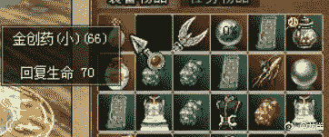

在 CE 里面扫描：

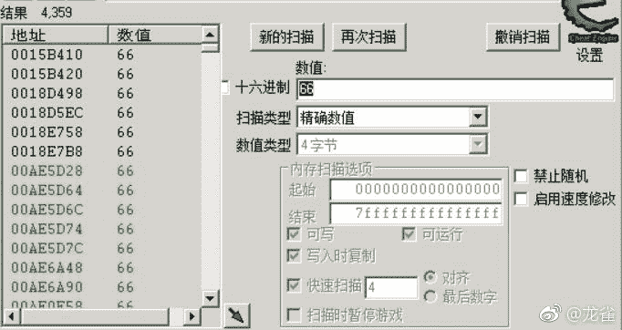

我们使用一个物品，变成了 65，再次扫描：

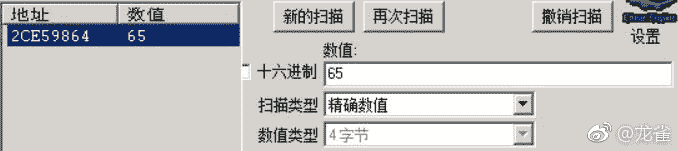

一下子我们就找到了。但是这只是物品数量的地址，我们还要找到整个物品的基址。可以假设物品的各个属性用结构体存放。我们在这个地址上右键，“找出是什么访问了这个地址”：

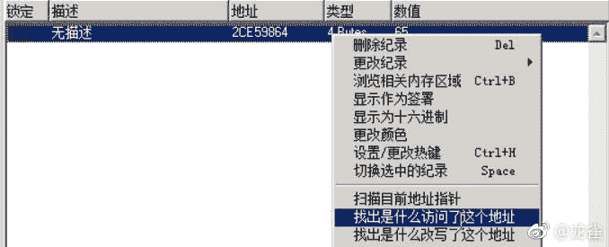

会弹出新的窗口，并且现在还是空的。我们将鼠标移到物品上面，再来看窗口：

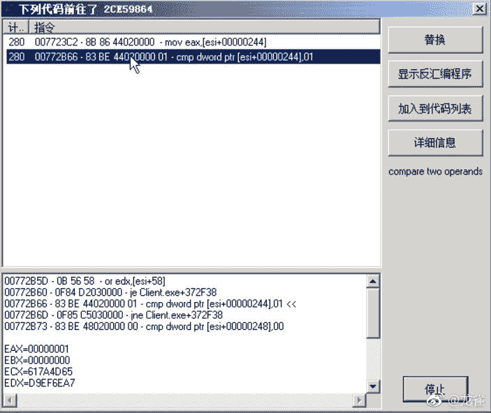

我们可以认为，ESI 的值`0x2ce59620`就是物品基址。

然后要找物品栏。可以假设，物品栏是物品指针的数组。所以需要再找找，是什么地方存放了这个地址：

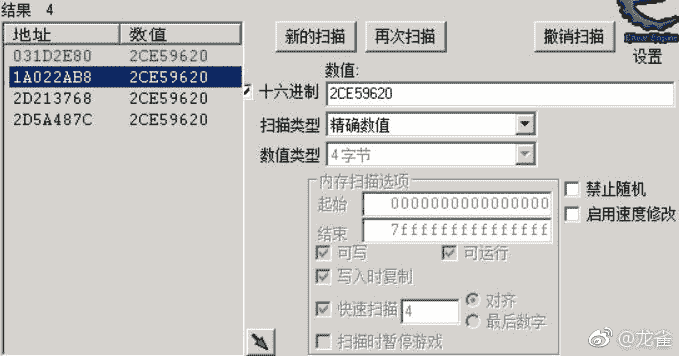

一共有四个结果。我们可以这样验证，把第一个物品移走。如果一个位置没有物品，那么数组里面的这个位置应该是`NULL`。

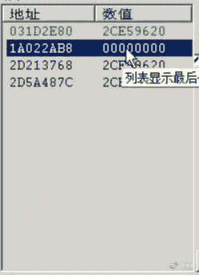

第二个地址`1a022ab8`变成了 0，所以它应该是物品栏那个位置的地址。

我们再来搜一下谁访问了这个地址：

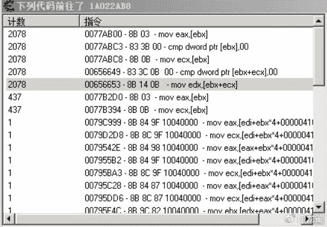

我们选那些计数为 1 的，因为为了访问物品栏的第 N 个位置，必须使用背包基址加上物品栏偏移加上指针大小乘物品位置。

我们选取第一个`0x0079c999`，在 OD 里转到这个地址：

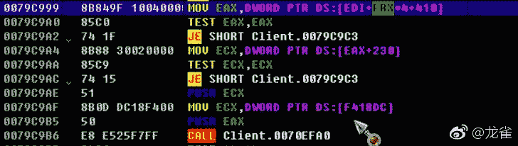

可以看到这个物品地址传给了 EAX，底下将这个物品的某个属性（不知道，因为没分析物品结构）传给了 ECX，在将这两个值传给底下的 CALL。这个 CALL 极有可能是物品使用 CALL。

我们在这个 CALL 上下断点，回到游戏里使用那个物品，就断下了，我们观察栈：


这是前两个参数无误。之后打开代码注入器，将用这两个参数调用这个 CALL：

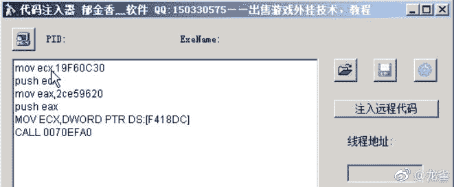

点两下之后发现游戏没有反应，说明这个 CALL 不是。

我们在转到第二个地方`0079d2d8`，找到它下面的一个 CALL：

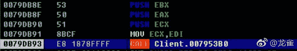

观察栈：

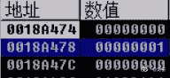

这个时候 ECX 是`106226a8`。我们在代码注入器里面编写代码：


运行，发现游戏中使用了这个物品。

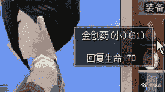