# 11 背包分析

上一节中我们发现，背包对象储存物品对象的指针，并且如果某一栏没有物品，那么那个位置就是`NULL`。我们可以以此快速寻找某个位置的地址。

比如说，我们先把第二个位置留空，在 CE 中搜索 0。搜索过程中，有些地址的数值会变化，所以多点几下“再次扫描”：

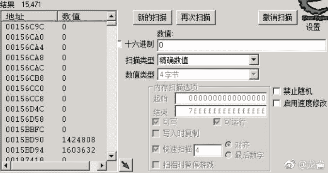

把第四个物品移到第二个，搜索比 0 大的数值：

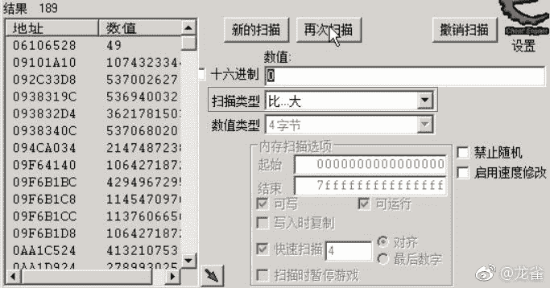

再把物品移动回去，搜索 0：

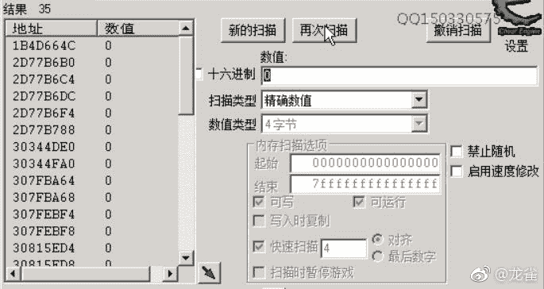

反复几次之后，就只剩一个结果了：

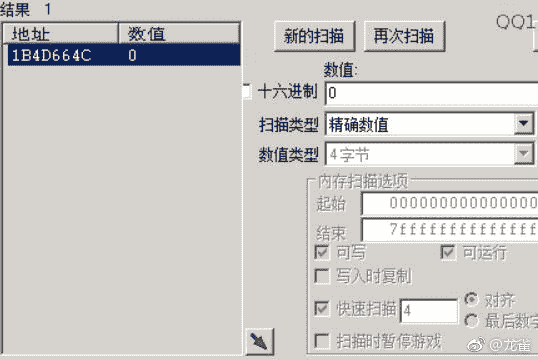

我们可以验证一下。这个数值加 4 就是第三个物品的位置，再 4 就是第四个物品的位置。我们将物品 2-4 添加到底下：

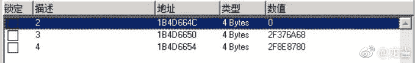

我们再次把第四个移到第二个，数值也会相应变化。

所以我们找对了地址。

下一步寻找背包基址，在任意一个地址上右键，“找出是什么访问了这个地址”。

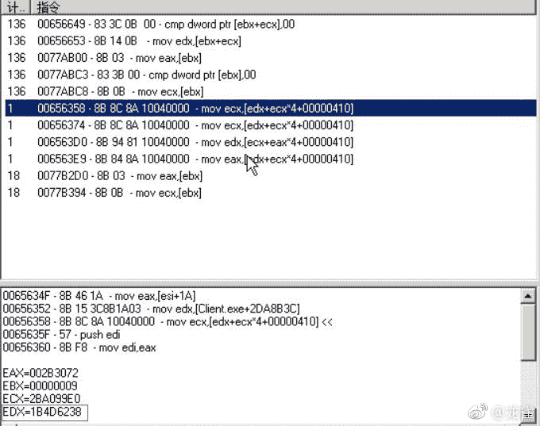

中间有几个指令，是`背包基址+物品栏偏移+物品序号*4`的形式，所以就是它们了。我们选取第一个`00656358`，背包基址应该是 EDX 的值`1b4d6238`。

这条指令上面的`31a8b3c`就是存放背包指针的地址。

然后我们挑选第三个物品`2f8eb250`，分析它的属性。切换为 ASCLL 视图：

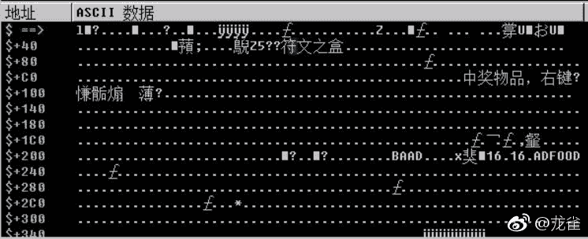

可以整理出一张表：

| 偏移 | 属性 |
| --- | --- |
| `0x5c` | 物品名称 |
| `0xf1` | 物品描述 |
| `0x244` | 数量 |

## 12 背包数据的封装

首先在`BaseGame.h`中定义背包基址的地址：

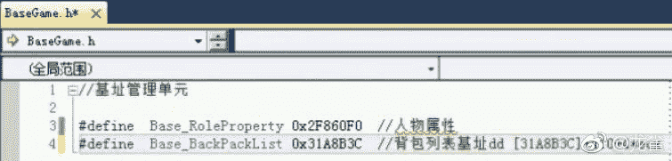

然后在`StructGame.h`中定义背包列表结构和物品结构：

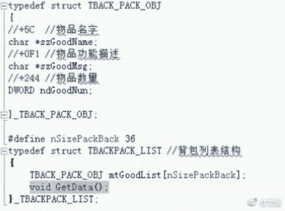

然后在`StructGame.cpp`中实现`GetData`。先定义偏移常量：

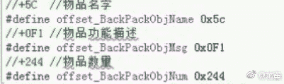

这是`GetData`的实现：

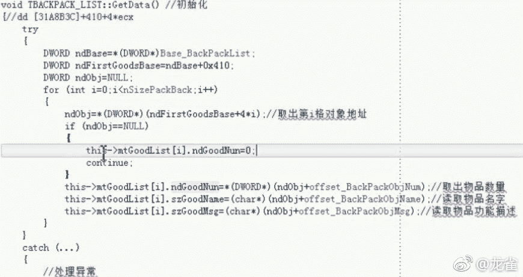

然后到`CMainDialogWnd.cpp`的按钮回调中，添加输出代码：

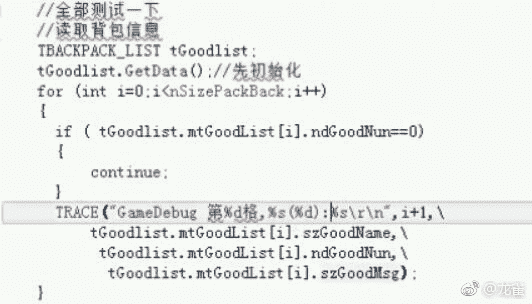

我们可以看到输出信息：

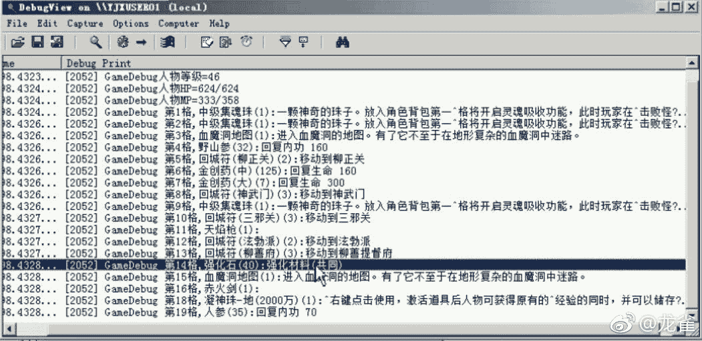

## 13 使用任意物品

这是第十节中的物品使用 CALL：

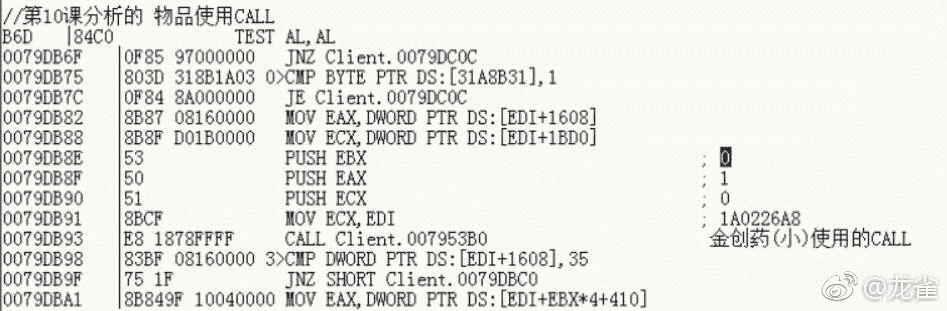

我们用 OD 附加游戏，在这个 CALL 上下断点：

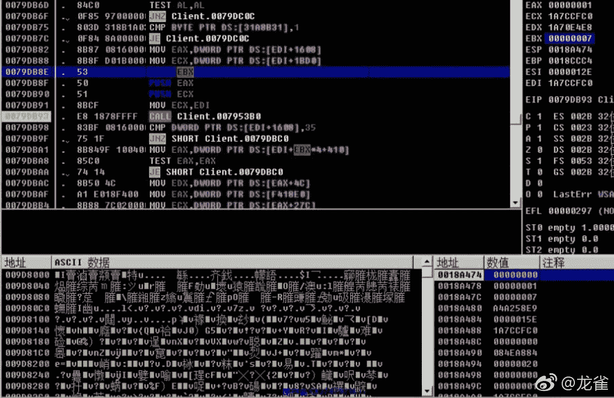

我们发现，第一个参数是 0，第二个参数是 1，这些没有变化。唯一变化的是第三个参数，经过试验，它是物品的下标（从 0 开始）。

ECX 是前面的 EDI，在之前的分析中，它是背包基址，但它是动态分配的，和之前相比也变化了。我们用 CE 看看哪个位置存放了这个地址：

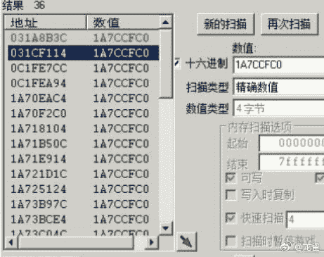

第一个结果就是我们第十一节中的那个地址。

编程的逻辑是这样的，我们遍历物品列表，找到金疮药的下标。然后再调用这个 CALL。

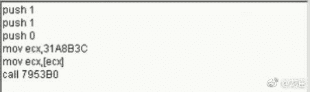

## 14 编程使用物品

首先定义物品使用 CALL 的地址：

在物品列表结构中定义方法`UseGoodForIndex`，它接受下标，使用指定下标处的物品：

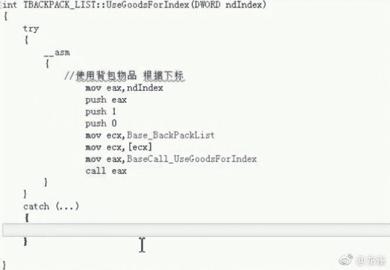

我们还需要定义一个方法，使用指定名称的物品，在此之前我们还需要一个方法`GetGoodIndexForName`，按照名称寻找物品，并返回下标：

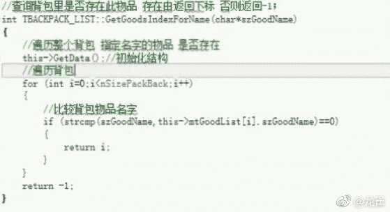

然后就可以定义方法`UseGoodForName`：

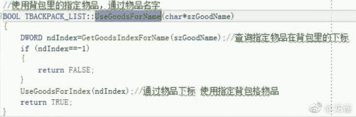

我们在回调中调用这个方法，然后判断结果：

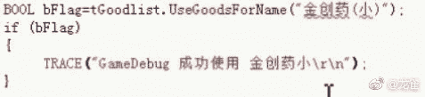

可以看到物品使用成功：

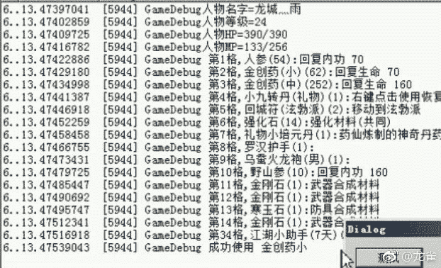

## 15 实现自己的`TRACE`

这一节中我们要实现自己的`TRACE`。这个函数有两个特点：

*   接受格式字符串和格式化参数，格式化参数是可变的。
*   调用 API`OutputDebugStringA`，这个函数不是变参的。

思路是，我们可以用`sprintf`将输出字符串格式化好，存到一个地方。然后用它调用`OutputDebugStringA`。

但是变参函数不能调用变参函数，我们需要使用它的非变参版本`vsprintf`，它接受缓存区地址，格式字符串和格式化参数的起始地址。这就像 Java 中，编译器把可变参数放进数组中，然后再传给函数。

我们还需要用到三个宏：

*   `va_list`实际上就是`char*`，没啥特别的。
*   `va_start(p, arg)`首先将`arg`的地址加上`arg`的大小赋给`p`。实际上将`p`指向`arg`的下一个位置。
*   `va_end(p)`清空`p`。

除此之外还需要给输出字符串添加前缀，以便在工具中过滤它，这可以通过`strcat_s`实现。

这是我们所实现的函数：

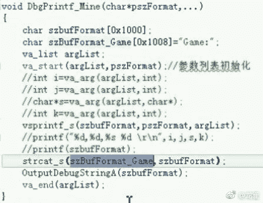