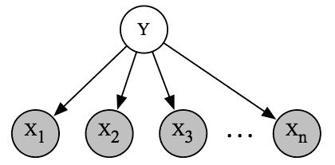
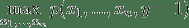

# 一、引言

> 原文：[Introduction](https://ermongroup.github.io/cs228-notes/preliminaries/introduction/)
> 
> 译者：[飞龙](https://github.com/wizardforcel)
> 
> 协议：[CC BY-NC-SA 4.0](http://creativecommons.org/licenses/by-nc-sa/4.0/)
> 
> 自豪地采用[谷歌翻译](https://translate.google.cn/)

概率图模型是机器学习的一个分支，它研究如何使用概率分布来描述世界，并对其进行有用的预测。

了解概率模型有多个理由。 首先，它是一个迷人的科学领域，有着美丽的理论，以惊人的方式将两种截然不同的数学分支联系起来：概率和图论。 概率模型也与哲学有着有趣的联系，尤其是因果关系问题。

同时，概率模型广泛用于整个机器学习和许多实际应用。 这些技术可以用来解决医学，语言处理，视觉等许多领域的问题。

这种优雅理论和强大应用的结合，使得图模型成为现代人工智能和计算机科学中最引人入胜的主题之一 [1]。

> [1] Judea Pearl 由于创立概率图模型领域，最近被授予 2011 年图灵奖（被认为是“计算机科学的诺贝尔奖”）。

## 概率模型

但究竟什么是概率模型？ 试图用数学来解决现实世界的问题时，以等式的形式定义世界的数学模型是很常见的。 也许最简单的模型将是这个形式的线性方程：

其中`y`是我们想要预测的结果变量，`x`是已知（给定）的影响结果的变量。 例如，`y`可以是房屋的价格，并且`x`是影响该价格的一系列因素，例如， 位置，卧室的数量，房子的年龄等。我们假设`y`是这个输入的线性函数（参数为`β`）。

通常，我们试图建模的真实世界非常复杂；尤其是它经常涉及大量的不确定性（例如，如果新的地铁站设在一定距离内，房屋的价格有一定的上升机会）。 因此，通过以概率分布的形式对世界建模，来处理这种不确定性是很自然的 [2]。

> [2] 对于为什么应该使用概率论而不是其它东西的哲学讨论，请参阅 [Dutch book 的概率论论述](http://plato.stanford.edu/entries/dutch-book/)。

考虑到这样一个模型，我们可以提出问题，诸如“房价在未来五年上涨的概率是多少”，或者“假定房子花费 10 万美元，它有三间卧室的概率是多少？” 模型的概率方面非常重要，因为：

*   通常，我们无法完美预测未来。 我们通常对世界没有足够的了解，世界本身也是随机的。
*   我们需要评估我们预测的置信度；通常，预测单一的值是不够的，我们需要某个系统，来输出它对世界上发生的事情的信念。

在本课程中，我们将学习推理不确定性的原理性方法，并使用概率论和图论两种思想来推导出用于此任务的高效机器学习算法。 我们将为许多有趣的问题找到答案，例如：

*   计算复杂性和概率模型丰富性之间如何权衡？
*   给定固定数据集和算力，推断未来事实的最佳模型是什么？
*   如何将先验知识与观察到的证据以原理性方式结合起来进行预测？
*   我们如何严格分析 A 是不是 B 的原因，还是相反？

另外，我们还会看到很多将概率技术应用于各种问题的例子，如疾病预测，图像理解，语言分析等。

## 概率模型的困难

为了首先了解我们面临的挑战，请考虑概率模型的简单应用：垃圾邮件分类。

假设我们拥有垃圾邮件和非垃圾邮件中的邮件中的单词出现模型  。每个二元变量`xi`编码了电子邮件中是否存在第`i`个英语单词；二元变量`y`表示电子邮件是否是垃圾邮件。为了划分新的电子邮件，我们可以看看概率 。

我们刚刚定义的函数`pθ`的“大小”是什么？我们的模型为输入`y, x1, ..., xn`的每个组合定义了`[0,1]`中的概率；指定所有这些概率要求我们写出交错的`2^(n + 1)`个不同的值，每个值赋给`n + 1`个二元变量。由于`n`是英语词汇量，因此从计算（我们如何存储这个大列表？）和统计（我们如何从有限数据中有效估计参数？）的观点来看，这显然是不切实际的。更一般地说，我们的例子说明了本课程将要处理的主要挑战之一：概率本质上是指数级大小的对象；我们可以操纵它们的唯一方法，是简化其结构的假设。

我们将在这个过程中做出的主要简化假设，是变量之间的条件独立性。 例如，假设在给定 Y 的情况下英文单词都是条件独立的。换句话说，假设一条消息是垃圾邮件，看到两个单词的概率是独立的。 这显然是过于简单化了，因为“pills”和“buy”这两个词的概率显然是相关的；然而，对于大多数词汇（例如“penguin”和“muffin”），概率确实是独立的，我们的假设不会显着降低模型的准确性。

我们将这种独立性的选择称为朴素贝叶斯假设。 考虑到这个假设，我们可以将模型概率写成因子的乘积：

每个因子`p(xi|y)`可以用少量参数（精确来说是 2 个自由度，4 个参数）完全描述。 整个分布由`O(n)`个参数来参数化，我们可以从数据中轻易估计并做出预测。

## 使用图来描述概率

我们的独立性假设可以方便地以图的形式表示。

> 
> 
> 朴素贝叶斯垃圾邮件分类模型的图表示。 我们可以将有向图解释为，数据生成方式的一个故事：首先，随机选择垃圾邮件/非垃圾邮件标签；那么`n`个可能的英语单词的一个子集被独立和随机采样。

这种表示具有容易理解的直接优点。 它可以解释为给我们讲了一个故事：通过首先随机选择电子邮件是否是垃圾邮件（用`y`表示），然后逐个采样单词，来生成电子邮件。 相反，如果我们有关于如何生成数据集的故事，我们可以自然地将其表示为带有相关概率分布的图。

更重要的是，我们希望向模型提交各种查询（例如，如果我看到单词“pill”，那么垃圾邮件的概率是多少？）回答这些问题需要特定的算法，它使用图论定义最自然。 我们还将使用图论来分析学习算法的速度，并量化不同学习任务的计算复杂度（例如 NPH）。

我们想要得到的关键点是，概率分布和图之间存在紧密联系，在整个课程中将利用图来定义，学习和处理概率模型。

## 课程概述

我们对图模型的讨论将分为三个主要部分：表示（如何指定模型），推理（如何向模型询问问题）和学习（如何使模型拟合实际数据）。 这三个主题也将紧密联系在一起：为了得到有效的推理和学习算法，模型需要充分表现；此外，习得模型需要推理作为子过程。 因此，最好总是牢记三项任务，而不是单独关注它们 [3]。

> [3] 更详细的概述请参阅 Neal Parikh 撰写的[这篇文章](https://docs.google.com/file/d/0B_hicYJxvbiOc1ViZTRxbnhSU1cza1VhOFlhRlRuQQ/edit)；这部分讲义是基于它的。

### 表示

概率分布建模了一些现实世界的现象，我们如何表达它？ 这不是一个微不足道的问题：我们已经看到，一个朴素模型，它使用`n`个可能的词对垃圾邮件进行分类，通常需要我们指定`O(2n)`个参数。 我们将通过用于构建易处理模型的一般技术，来解决这个难题。 这些秘籍将大量使用图论; 概率使用图来描述，它的属性（例如连通性，树宽度）将揭示模型的概率和算法特征（例如独立性，学习复杂度）。

### 推断

给定一个概率模型，我们如何获得世界的相关问题的答案？ 这些问题通常会归约为，查询某些感兴趣事件的边缘或条件概率。 更具体地说，我们通常有兴趣向系统询问两种类型的问题：

边缘推理：在我们总结所有其他东西后，我们模型中给定变量的概率是多少？

一个示例查询是，确定随机房屋拥有三间以上卧室的概率。

最大后验（MAP）推断要求最可能的变量赋值。 例如，我们可能尝试确定最可能的垃圾邮件信息，来解决问题。

通常我们的查询将涉及证据（如上面的 MAP 示例），在这种情况下，我们将修改一部分变量的赋值。

事实证明，推断是一项非常具有挑战性的任务。 对于很多感兴趣的概率来说，回答这些问题将是 NPH 的。 关键是，推断是否易于处理，取决于描述该概率的图的结构！ 如果问题棘手，我们仍然可以通过近似推理方法获得有用的答案。 有趣的是，这部分课程中描述的算法，将主要基于 20 世纪中期统计物理学界所做的工作。

### 学习

我们最后的关键任务是使模型拟合数据集，这可能是大量垃圾邮件的带标记样本。 通过查看数据，我们可以推断出有用的规律（例如，在垃圾邮件中更频繁地找到哪些词），然后我们可以使用这些规律来预测未来。 然而，我们将看到，学习和推理也以更微妙的方式，固有地联系在一起，因为推理将成为我们在学习算法中反复调用的关键子过程。 此外，学习的主题将与计算学习理论领域具有重要联系，它处理一些问题，例如有限数据的推广和过拟合，以及贝叶斯统计，（除其他事情外）它告诉我们如何以原则性方式，合并先验知识和观察到的证据。