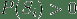
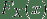
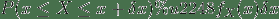
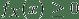
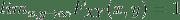
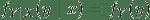

# 二、概率复习

> 原文：[Probability review](https://ermongroup.github.io/cs228-notes/preliminaries/probabilityreview/)
> 
> 译者：[飞龙](https://github.com/wizardforcel)
> 
> 协议：[CC BY-NC-SA 4.0](http://creativecommons.org/licenses/by-nc-sa/4.0/)
> 
> 自豪地采用[谷歌翻译](https://translate.google.cn/)

我们在这里复习概率的概念，所有复习材料都来自 [CS229 概率讲义](http://cs229.stanford.edu/section/cs229-prob.pdf)。

## 1\. 概率的基本元素

为了定义集合上的概率，我们需要一些基本元素，

样本空间`Ω`：随机实验所有结果的集合。 在这里，每个结果`ω ∈ Ω`可以看作实验结束时真实世界状态的完整描述。

事件集合（或事件空间）`F`：一个集合，其元素`A ∈ F`（称为事件）是`Ω`的子集（即`A ⊆ Ω`是实验可能结果的集合）

概率测度：满足以下属性的函数`P: F → R`：

*   对于所有`A ∈ F`，`P(A) ≥ 0`，
*   如果`A1, A2, ...`是不相交事件（也就是`i ≠ j`时`Ai ∩ Aj = ∅`），。
*   `P(Ω) = 1`。

这三个属性被称为概率公理。

例如：考虑抛掷六面骰子的事件。 样本空间是`Ω = {1,2,3,4,5,6}`。 我们可以在这个样本空间上定义不同的事件空间。 例如，最简单的事件空间是平凡事件空间`F = {∅, Ω}`。 另一个事件空间是`Ω`的所有子集的集合。 对于第一个事件空间，满足上述要求的唯一概率测度由`P(∅) = 0`，`P(Ω) = 1`给出。 对于第二个事件空间，一个有效的概率测度是将事件空间中每个集合的概率分配为`i/6`，其中`i`是该集合中元素的数量；例如，`P({1,2,3,4}) = 4/6`，`P({1,2,3}) = 3/6`。

性质：

如果`A ⊆ B`，`P(A) ≤ P(B)`。

。

。

。

全概率公式：如果  是一系列不相交时间，并且 ，那么 。

### 1.1 条件概率

设`B`是概率非零的事件。 在`B`条件下任何事件`A`的概率定义为：

换句话说，`P(A|B)`是观察到事件`B`发生后，事件`A`的概率测度。

### 1.2 链式法则

设  为事件，：

要注意对于`k = 2`个事件，这就是条件概率的定义：

一般来说，它是通过多次应用条件独立性定义而得到的，如下例所示：

### 1.3 独立

当且仅当`P(A ∩ B)=P(A)P(B)`（或与之等价，`P(A|B)=P(A)`）时，两个事件才称为独立。 因此，独立性相当于说，`B`的观察对`A`的概率没有任何影响。

## 2\. 随机变量

考虑投掷 10 个硬币的实验，并且我们想知道硬币的正面次数。 这里，样本空间`Ω`的元素是正面和反面的长度为 10 的序列。 例如，我们可能有`ω0=⟨H,H,T,H,T,H,H,T,T,T⟩ ∈ Ω`。 但是，在实践中，我们通常不关心获得正面和反面的任何特定序列的可能性。 相反，我们通常关心结果的实值函数，比如 10 次掷骰中出现的正面数量，或者最长连续反面的长度。 这些函数在一些技术条件下被称为随机变量。

更正式来说，随机变量`X`是函数`X： Ω → R`。 通常，我们将使用大写字母`X(ω)`或更简单的`X`（隐含了随机结果`ω`的依赖）来表示随机变量。 我们将使用小写字母`x`表示随机变量的值。

例如：在我们的上述实验中，假设`X(ω)`是投掷序列`ω`中出现的正面数量。 由于只抛了 1 0个硬币，`X(ω)`只能取有限数量的值，所以它被称为离散随机变量。 这里，与随机变量`X`相关的集合，取某个特定值`k`的概率为`P(X=k):=P({ω:X(ω)=k})`。

例如：假设`X(ω)`是一个随机变量，表示放射性粒子衰变所需的时间。 在这种情况下，`X(ω)`具有无限多的可能值，所以它被称为连续随机变量。 我们将`X`取两个常实数`a`和`b`（其中`a<b`）之间的值的概率，表示为为`P(a≤X≤b):=P({ω:a≤X(ω)≤b})`。

### 2.1 累积分布函数

为了说明处理随机变量时使用的概率测度，指定替代函数（CDF，PDF 和 PMF）通常很方便，概率测度从中控制实验 [?]。 在本节和接下来的两节中，我们依次描述这些类型的函数。 累积分布函数（CDF）是一个函数 ，它将概率测度指定为：

通过使用这个函数，可以计算任何事件的概率。

性质：

### 2.2 概率质量函数

当随机变量`X`取可能值的有限集合（即`X`是离散随机变量）时，表示随机变量相关的概率测度的更简单方法是，直接指定随机变量可以取的每个值的概率。 特别来说，概率质量函数（PMF）是函数 ，使得 。

在离散随机变量的情况下，我们使用符号`Val(X)`来表示随机变量`X`可以取的可能值集合。 例如，如果`X(ω)`是一个随机变量，表示十次硬币投掷中的正面数量，则`Val(X)={0,1,2,...,10}`。

性质：

### 2.3 概率密度函数

对于一些连续的随机变量，累积分布函数 在任何地方都是可微的。 在这些情况下，我们将概率密度函数或 PDF 定义为 CDF 的导数，即，

这里注意，连续随机变量的 PDF 可能并不总是存在（即，如果  不在任何都可微）。

根据微分的性质，对于非常小的`δx`，

CDF 和 PDF（当它们存在时）都可用于计算不同事件的概率。 但是应该强调的是，在任何给定点`x`处 PDF 的值不是该事件的概率，即 。 例如， 可以取大于 1 的值（但是  在 R 的任何子集上的积分最大为 1）。

性质：

### 2.4 期望

假设`X`是离散随机变量，PMF 为 ，并且`g: R→R`是任意函数。 在这种情况下，`g(X)`可以看做一个随机变量，我们将`g(X)`的期望定义为：

如果`X`是连续随机变量，PDF 为  的，那么`g(X)`的期望值定义为，

直观地说，`g(X)`的期望可以认为是`g(x)`可以取的不同值的“加权平均值”，其中权重是  或 。 作为上述的一个特例，注意随机变量本身的期望`E[X]`是通过使`g(x) = x`找到的；这也被称为随机变量`X`的均值。

性质：

对于任何常数`a ∈ R`，`E[a]=a`。

对于任何常数`a ∈ R`，`E[af(X)]=aE[f(X)]`。

（期望的线性关系）`E[f(X)+g(X)]=E[f(X)]+E[g(X)]`。

对于离散随机变量`X`，`E[1{X=k}]=P(X=k)`。

### 2.5 方差

随机变量`X`的方差是随机变量`X`的分布在其平均值附近集中程度的度量。 形式上，随机变量`X`的方差定义为 。

使用前一节中的性质，我们可以得出一个替代表达式：

其中第二个等式遵循期望的线性关系，以及`E[X]`实际上对于外部期望来说是常数。

性质：

对于任何常数`a ∈ R`，`Var[a]=0`。

对于任何常数`a ∈ R`，。

示例：计算均匀随机变量`X`的均值和方差，其中 PDF 为 ，其余为 0。

示例：假设某个子集`A ⊆ Ω`满足`g(x) = 1 {x∈A}`。`E[g(X)]`是多少？

离散情况：

连续情况：

### 2.6 一些常见的随机变量

离散随机变量

`X~Bernoulli(p)`（其中`0≤p≤1`）：如果正面概率为`p`的硬币出现正面，则为 1，否则为 0。

`X~Binomial(n, p)`（其中`0≤p≤1`）：正面概率为`p`的硬币`n`次独立投掷的正面数量。

`X~Geometric(p)`（其中`p>0`）：概率为`p`的硬币直到出现一次正面的投掷次数。

`X~Poisson(λ)`（其中`λ>0`）：用于建模罕见事件频率的，非负整数上的概率分布。

连续变量

`X~Uniform(a, b)`（其中`a<b`）：实线上`a`和`b`之间每个值都有相等的概率密度。

`X~Exponential(λ)`（其中`λ>0`）：非负实数上的衰减概率密度。

`X~Normal(μ, σ^2)`：也叫高斯分布。

## 3\. 两个随机变量

到目前为止，我们已经考虑了单个随机变量。 然而，在很多情况下，我们在随机实验过程中有兴趣知道的数量可能不止一个。 例如，在掷硬币十次的实验中，我们可能会关心`X(ω)=`出现的正面数量，以及`Y(ω)=`最长的连续正面长度。 在本节中，我们考虑两个随机变量的设定。

### 3.1 联合和边缘分布

假设我们有两个随机变量`X`和`Y`。处理这两个随机变量的一种方法是，分别考虑它们中的每一个。 如果我们这样做，我们只需要  和 。 但是如果我们想知道，在随机实验的结果中，`X`和`Y`可以同时取的值，我们需要一个更复杂的结构，称为`X`和`Y`的联合累积分布函数，定义为：

可以看出，通过了解联合累积分布函数，可以计算涉及`X`和`Y`的任何事件的概率。

联合 CDF  和各变量的分布函数  和  的关系是：

这里，我们将  和  称为  的边缘累积分布函数。

性质：

### 3.2 联合和边缘概率质量函数

如果`X`和`Y`是离散随机变量，那么联合概率质量函数  定义为：

这里，对于所有`x`和`y`，，并且 。

两个变量的联合 PMF 与每个变量的概率质量函数分别是什么关系？ 事实证明：

 也是类似。 在这种情况下，我们将  称为`X`的边缘概率质量函数。在统计中，通过将另一个变量求和来形成一个变量的边缘分布的过程，通常称为“边缘化”。

### 3.3 联合和边缘概率密度函数

让`X`和`Y`为两个连续随机变量，联合分布函数为  。在  对`x`和`y`随处可微的情况下，我们可以定义联合概率密度函数：

和一维情况类似，，而是：

请注意，概率密度函数  的值始终是非负的，但可能会大于 1。它仍然必须满足：

类似于离散情况，我们将：

定义为`X`的边缘概率密度函数（或边缘密度）， 也类似。

### 3.4 条件分布

条件分布试图回答这个问题，当我们知道`X`必须是某个值`x`时，`Y`的概率分布是什么？ 在离散情况下，给定`Y`的`X`的条件概率质量函数较简单：

其中 。

在连续的情况下，情况在技术上更复杂一点，因为连续随机变量`X`取特定值`x`的概率等于零。 忽略这个技术问题，我们简单通过类比离散情况，来定义给定`X = x`的`Y`的条件概率密度：

其中 。

### 3.5 链式法则

我们之前为事件得出的链式法则可以应用于随机变量，如下所示：

### 3.6 贝叶斯法则

贝叶斯法则是一个有用的公式，当试图推导一个变量在另一个变量的条件下的条件概率表达式时经常出现。

在离散随机变量`X`和`Y`的情况下，

如果随机变量`X`和`Y`是连续的：

### 3.7 独立

如果对于`x`和`y`的所有值，，两个随机变量`X`和`Y`独立，与之等价：

对于离散随机变量，对于所有 ，，。

对于离散随机变量，对于所有 ，当  时有 。

对于连续随机变量，对于所有 ，。

对于连续随机变量，对于所有 ，当  时有 。

非正式来说，如果“知道”一个变量的值对另一个变量的条件概率分布不会产生任何影响，那么两个随机变量`X`和`Y`是独立的，也就是说，您通过只知道`f(x)`和`f(y)`，知道偶对`(X,Y)`的所有信息。 下面的引理使这个观察正式化了：

引理3.1。如果`X`和`Y`是独立的，那么对于任何子集`A`，`B`：

通过使用上述引理可以证明，如果`X`与`Y`无关，那么`X`的任何函数都与`Y`的任何函数无关。

### 3.8 期望和协方差

假设我们有两个离散随机变量`X`和`Y`，`g: R2→R`是这两个随机变量的函数。 那么`g`的期望值按以下方式定义，

对于连续随机变量`X`和`Y`，类似的表达式为：

我们可以用期望的概念，来研究两个随机变量之间的关系。 特别是，两个随机变量`X`和`Y`的协方差定义为：

使用类似于方差的推导，我们可以将其重写为：

在这里，表明两种协方差形式相等的关键步骤在第三个等式中，其中我们使用了这个事实，`E[X]`和`E[Y]`实际上是可以从期望中提取的常量。 当`Cov[X，Y] = 0`时，我们说`X`和`Y`是不相关的。

性质：

（期望的线性关系）

如果`X`和`Y`独立，`Cov[X,Y]=0`。

如果`X`和`Y`独立，。