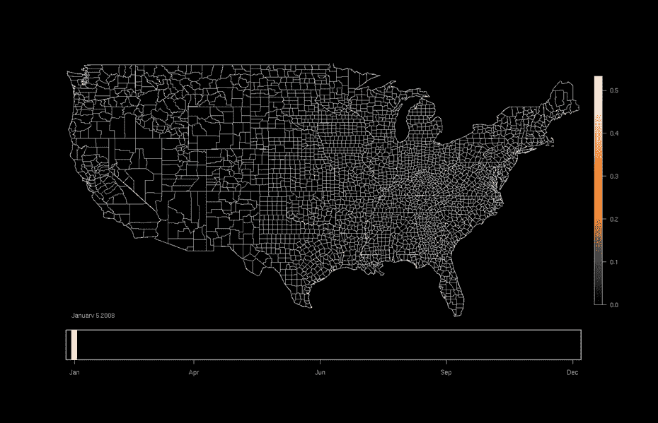
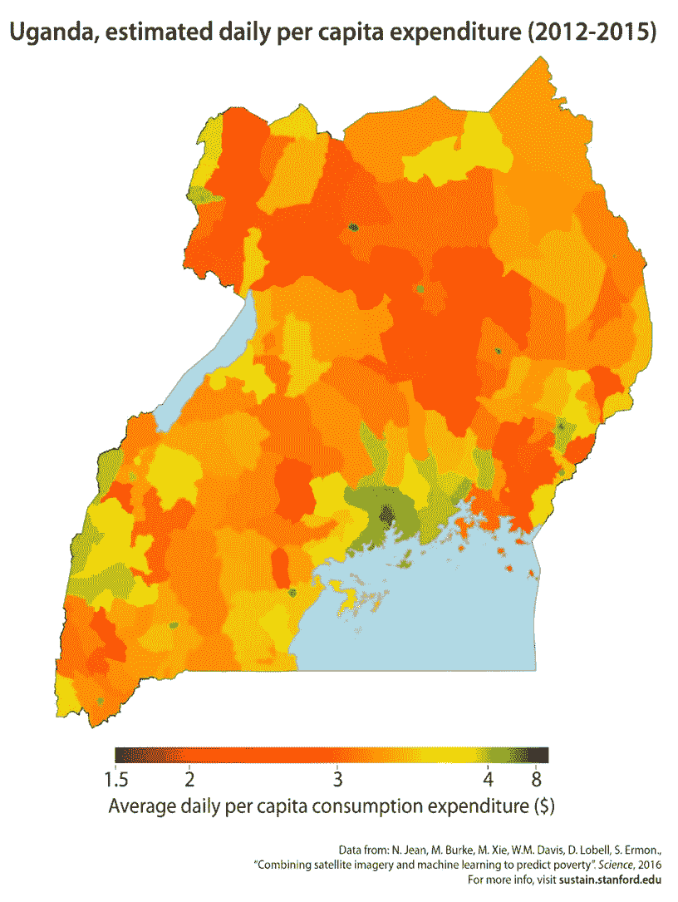

# 三、实际应用

> 原文：[Real-world applications](https://ermongroup.github.io/cs228-notes/preliminaries/applications/)
> 
> 译者：[飞龙](https://github.com/wizardforcel)
> 
> 协议：[CC BY-NC-SA 4.0](http://creativecommons.org/licenses/by-nc-sa/4.0/)
> 
> 自豪地采用[谷歌翻译](https://translate.google.cn/)

概率图模型有许多不同的实际应用。 我们总结了概率图形模型的下列应用，这些只是他们许多实际应用的一些例子。

## 图像的概率模型

考虑图像（像素矩阵）上的分布`P(x)`，将较高概率分配给看起来真实的图像，将较低概率分配给其他东西。 给定这样的模型，我们可以解决大量有趣的任务。

### 图像生成

[Radford 等人](https://arxiv.org/abs/1710.10196) 训练了一个概率模型`P(x)`，将高概率分配给看起来像卧室的图像（基于一些训练数据）：

训练数据

如果我们取样`x∼P(x)`，我们可以生成新的卧室图像。

生成的数据

与之相似，我们可以从人脸或者其它物体习得模型：

请注意，图像不完美，可能需要改进；然而，采样生成的图像与人们的预期非常相似。

### 填充

使用相同的`P(x)`，我们也可以“填充图像的其余部分”。 例如，给定`P(x)`和现有图像的补丁（例如一张照片），我们可以从`P(图像|补丁)`中采样，并生成补全图像的不同可能方式：

请注意捕捉不确定性的概率模型的重要性：可能有多种方法来完成图像！

### 图像去噪

同样，如果图像受到噪声（例如，旧照片）的破坏，我们可以尝试根据我们的图像外观的概率模型来恢复它：

## 语言模型

了解概率分布也可以帮助我们模拟自然语言的表达。 在这种情况下，我们想要在单词或字符`x`的序列上构造一个概率分布`P(x)`，它将高概率赋予适当的（英语）句子。这种分布可以通过使用维基百科的文章来收集。

### 生成

我们可以从模型中采样，并生成新的类似于维基百科的文章，如下面的文章 [1]。

> [1] 来自 [RNN 的无法解释的有效性](http://karpathy.github.io/2015/05/21/rnn-effectiveness/)。
> 
> Naturalism and decision for the majority of Arab countries’ capitalide was grounded by the Irish language by [[John Clair]], [[An Imperial Japanese Revolt]], associated with Guangzham’s sovereignty. His generals were the powerful ruler of the Portugal in the [[Protestant Immineners]], which could be said to be directly in Cantonese Communication, which followed a ceremony and set inspired prison, training. The emperor travelled back to [[Antioch, Perth, October 25|21]] to note, the Kingdom of Costa Rica, unsuccessful fashioned the [[Thrales]], [[Cynth’s Dajoard]], known in western [[Scotland]], near Italy to the conquest of India with the conflict. Copyright was the succession of independence in the slop of Syrian influence that was a famous German movement based on a more popular servicious, non-doctrinal and sexual power post. Many governments recognize the military housing of the [[Civil Liberalization and Infantry Resolution 265 National Party in Hungary]], that is sympathetic to be to the [[Punjab Resolution]] (PJS)[[http://www.humah.yahoo.com/guardian](http://www.humah.yahoo.com/guardian). cfm/7754800786d17551963s89.htm Official economics Adjoint for the Nazism, Montgomery was swear to advance to the resources for those Socialism’s rule, was starting to signing a major tripad of aid exile.]]

### 翻译

假设我们已经收集了中英文转录的段落训练集。 我们可以建立一个概率模型`P(y | x)`来产生一个英文句子，以相应的中文句子`x`为条件；这是机器翻译的一个实例。

## 音频模型

我们也可以将概率图形模型用于音频应用。 假设我们在音频信号上构建一个概率分布`P(x)`，它将高概率分配给听起来像人类语音的音频。

### 上采样或超分辨率

根据音频信号的低分辨率版本，我们可以尝试提高其分辨率。

[音频信号的超级分辨率演示](https://kuleshov.github.io/audio-super-res/)

### 语音合成

正如我们在图像处理中所做的那样，我们也可以对模型采样并生成（合成）语音信号。

[语音合成演示](https://deepmind.com/blog/wavenet-generative-model-raw-audio/)

### 语音识别

给定语音信号和语言（文本）的（联合）模型，我们可以尝试从音频信号中推断说出的单词。

## 当今科学上的应用

### 纠错码

在非理论世界中，概率模型经常被用来为通信信道（例如以太网或 Wifi）建模。 即如果你通过频道发送消息，由于噪音的原因，你可能会在另一端获得不同的内容。 基于图模型的纠错码和技术可用于检测和纠正通信错误。

### 计算生物

图形模型也广泛用于计算生物学。 例如，给定 DNA 序列随着时间推移而发展的模型，可以从给定的一组物种的 DNA 序列中重建系统发生树。

### 生态学

图模型用于研究在空间和时间上演变的现象，捕捉空间和时间依赖性。 例如，它们可以用来研究鸟类迁徙。

### 经济

图模型可以用来模拟利率量的空间分布（例如，基于资产或支出的财富度量）。

最后两个应用程序称为时空模型。 它们依赖于跨越时间和空间收集的数据。