# 四、贝叶斯网络

> 原文：[Bayesian networks](https://ermongroup.github.io/cs228-notes/representation/directed/)
> 
> 译者：[飞龙](https://github.com/wizardforcel)
> 
> 协议：[CC BY-NC-SA 4.0](http://creativecommons.org/licenses/by-nc-sa/4.0/)
> 
> 自豪地采用[谷歌翻译](https://translate.google.cn/)

我们从表示的话题开始：我们如何选择概率分布来为世界的一些有趣方面建模？ 建立一个好的模型并不容易：我们在介绍中看到，垃圾邮件分类的朴素模型需要我们指定一些参数，这些参数对于英文单词数量是指数级的！

在本章中，我们将了解避免这类复杂事物的一种方法。 我们将要：

*   学习有效和通用的技术，仅使用少数参数来参数化概率分布。
*   了解如何通过有向无环图（DAG）来优雅地描述所得模型。
*   研究 DAG 结构与所描述的分布的模型假设之间的联系；这不仅会使这些模型假设更加明确，而且还会帮助我们设计更有效的推理算法。

我们将在这里看到的模型称为贝叶斯网络。 在下一章中，我们还会看到第二种方法，它涉及无向图，也称为马尔可夫随机场。

## 概率建模与贝叶斯网络

有向图模型（也称为贝叶斯网络）是一系列概率分布，它们允许紧凑的参数化，可以使用有向图来自然描述。

这个参数化背后的总体思路非常简单。

回想一下，通过链式法则，我们可以将任意概率`p`写为：

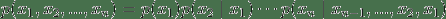

紧凑贝叶斯网络是一种分布，右侧的每个因子仅依赖于少量的祖先变量 ：

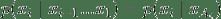

例如，在一个有五个变量的模型中，我们可以选择用 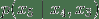 来近似因子 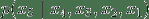。 在这种情况下，我们写作 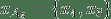。

当变量是离散的时候（我们会认为问题通常会是这种情况），我们可以将因子 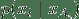 看作概率表，其中行对应于  的赋值，并且列对应于  的值；条目包含实际概率 。 如果每个变量取`d`个值并且最多有`k`个祖先，那么整个表将包含最多`O(dk + 1)`个条目。 由于每个变量都有一个表，因此只用`O(ndk + 1)`个参数（与朴素方法的`O(dn)`相比），就可以简洁地描述整个概率分布。

### 图表示

这种形式的分布可以自然地表示为有向无环图，其中顶点对应于变量`xi`并且边表明了依赖关系。 特别是，我们将每个节点的父母设置为  的祖先 。

作为一个例子，考虑考试中的学生成绩`g`的模型; 成绩取决于几个因素：考试的难度`d`，学生的智力`i`，他的 SAT 分数`s`; 它也会影响教授课程的教授的推荐信的质量`l`。 每个变量都是二元的，除了`g`，它取 3 个可能的值。

> 
> 
> 描述考试中学生表现的贝叶斯网络模型。 分布可以表示为条件概率分布的乘积，由表指定。 这些分布的形式由图中的边描述。

5 个变量的联合概率分布自然因式分解如下：

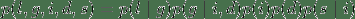

这个分布的图表示是一个 DAG，它可视化地规定随机变量如何相互依赖。 图清楚地表明信件取决于年级，而它又取决于学生的智力和考试的难度。

解释有向图的另一种方式是根据数据如何生成的故事。 在上面的例子中，为了确定推荐信的质量，我们可以首先抽取一个智力水平和一个考试难度；然后，根据这些参数抽取学生的成绩；最后，推荐信是基于该成绩生成的。

在之前的垃圾邮件分类示例中，我们隐式假设电子邮件根据两步过程来生成：首先，我们选择垃圾邮件/非垃圾邮件标签`y`；然后我们独立地抽取每个词是否存在，并以该标签为条件。

### 形式定义

形式上，贝叶斯网络是一个有向图`G =(V, E)`：

每个节点`i∈V`都是随机变量 。
一个节点有一个条件概率分布（CPD），规定  以父值为条件的概率。

因此，贝叶斯网络定义了概率分布`p`。 相反，我们说如果概率`p`可以分解为因式乘积，由`G`所规定，那么它可以在 DAG `G`上因式分解。

不难看出，由贝叶斯网络表示的概率将是有效的：显然，它将是非负的，并且可以使用归纳论证（以及使用 CPD 是有效概率的事实）来证明，所有变量赋值的和将为一。 相反，我们也可以通过反例说明，当`G`包含环时，其相关概率可能不会为一。

## 贝叶斯网络的依赖

总而言之，贝叶斯网络表示概率分布，它们可以通过更小的，局部条件概率分布（每个变量一个）来产生。 通过以这种形式表达概率，我们向模型中引入了一些假设，即某些变量是独立的。

这就产生了一个问题：通过使用模型贝叶斯网络，以及由`G`描述的给定结构，我们做了哪些独立性假设？ 这个问题很重要，有两个原因：我们应该确切地知道我们正在做什么模型假设（以及它们是否正确）；此外，这些信息将有助于我们稍后设计更高效的推理算法。

让我们使用符号`I(p)`来表示对于联合分布`p`成立的，所有条件独立性的集合。 例如，如果`p(x,y)=p(x)p(y)`，那么我们说`x⊥y∈I(p)`。

### 由有向图描述的独立性

结果表明，贝叶斯网络`p`非常优雅地描述了`I(p)`中的许多独立性；通过查看三种类型的结构，可以从图中恢复这些独立性。

为了简单起见，我们首先看看具有三个节点`A, B, C`的贝叶斯网络`G`。在这种情况下，`G`基本上只有三种可能的结构，每种结构产生不同的独立性假设。 感兴趣的读者可以使用一些代数来轻松证明这些结果。

> 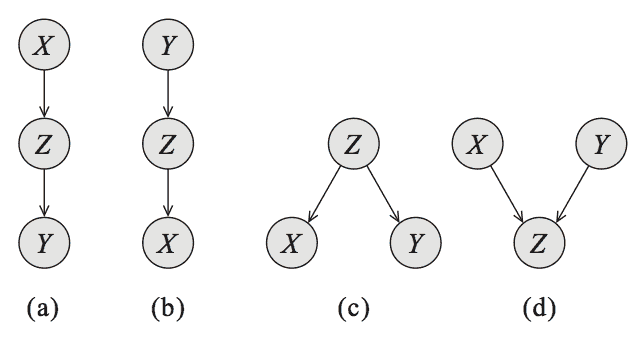
> 
> 三个变量上的贝叶斯网络，编码了不同类型的依赖关系：级联（a，b），公共父级（c）和 V 结构（d）。

*   公共父级：如果`G`的形式是`A←B→C`，并且观察到了`B`，则`A⊥C|B`。 但是，如果`B`未被观察到，则 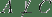。 直观地说，这源于一个事实，`B`包含决定`A`和`C`结果的所有信息；一旦观察到，没有其他因素影响这些变量的结果。
*   级联：如果`G`等于`A→B→C`，并且再次观察到了`B`，则再次`A⊥C|B`。 但是，如果`B`未被观察到，则 。 这里的直觉是，`B`再次拥有决定`C`的结果的所有信息; 因此，`A`取什么样的值并不重要。
*   V 结构（也称为 Explaining Away）：如果`G`是`A→C←B`，则知道`C`就结合了`A`和`B`。换句话说，如果`C`未被观察，则`A⊥B`，但如果观察到了`C`，。

最后一种情况需要额外的解释。假设`C`是一个布尔变量，表明我们的草坪在早上是否潮湿；`A`和`B`对潮湿有两种解释：下雨（用`A`表示）或喷水器打开（用`B`表示）。如果我们知道草地是湿的（`C`为真）并且喷水器没有打开（`B`是假的），那么`A`为真的概率必须是 1，因为这是唯一可能的解释。因此，`A`和`B`并不是独立的。

这些结构清楚地描述了由三变量贝叶斯网络编码的独立性。我们可以通过在任何更大的图上递归地应用它们，来将它们扩展到通用网络。这产生了一种被称为 D-分离的概念（其中`d`代表有向）。

我们说，如果变量`Q`和`W`没有由活动路径连接，观察到变量`O`时，`Q`和`W`是 D-分离的。如果对于路径上的每三个连续的变量`X, Y, Z`，满足下列条件之一，贝叶斯网络结构`G`中的无向路径被称为在观察变量`O`条件下活动的：

*   `X←Y←Z`，`Y`未被观测，`Y∉O`
*   `X→Y→Z`，`Y`未被观测，`Y∉O`
*   `X←Y→Z`，`Y`未被观测，`Y∉O`
*   `X→Y←Z`，`Y`或任何后继被观测

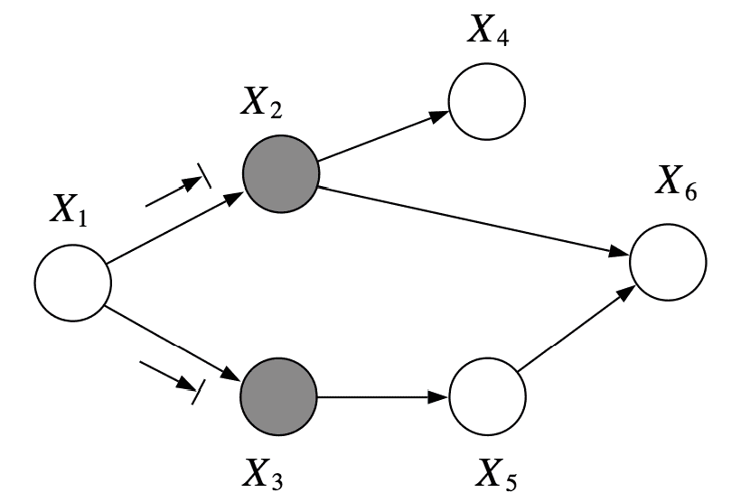

例如，在上面的图中，`X1`和`X6`在`X2, X3`条件下是 D-分离的。

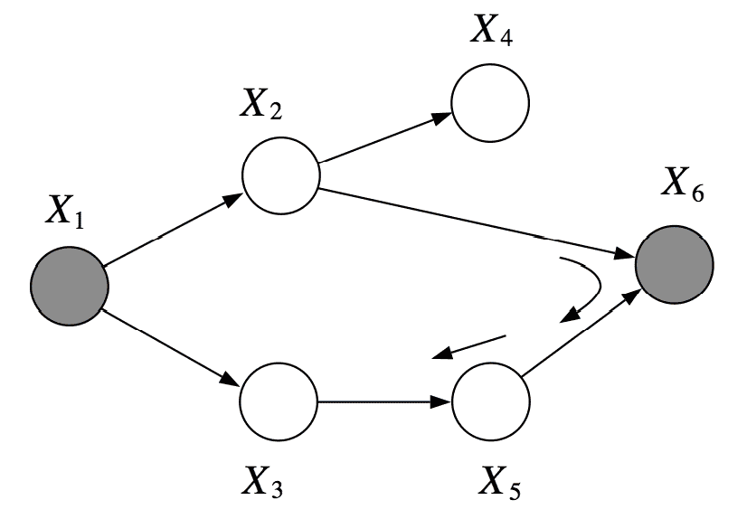

但是，`X2, X3`在`X1, X6`条件下不是 D-分离的，因为我们可以找到活动路径`(X2, X6, X5, X3)`。

之前有个 CS228 学生创建了一个[交互式网络模拟](http://pgmlearning.herokuapp.com/dSepApp)来测试 D-分离。 随意使用它，如果是这样，请通过 Web 应用程序上的反馈按钮提交任何反馈或错误。

D-分离的概念很有用，因为它让我们描述了我们模型中很大一部分依赖关系。 令`I(G)={(X⊥Y|Z)}`，其中`X, Y`是条件`Z`下的 D-分离，它是`G`中 D-分离变量的集合。

事实 [1]：如果`p`在`G`上隐式分解，那么`I(G)⊆I(p)`。这里，我们说`G`是`p`的 I-map（独立性映射）。

> [1] 我们不会正式证明它，但直觉是，如果`X, Y`和`Y, Z`是相互依赖的，那么`X, Z`也是如此。 因此，我们可以根据上面概述的本地依赖性结构，查看相邻节点并传播依赖关系。

换句话说，用`G`编码的所有独立性都是合理的：`G`中的 D-分离的变量，在`p`中是真正独立的。 然而，相反的情况并非如此：分布可能在`G`上因式分解，但具有在`G`中未捕获的独立性。

在某种程度上，这几乎是一个无意义的陈述。 如果`p(x,y)=p(x)p(y)`，那么这个分布仍然在图`y→x`上因式分解，因为我们总是可以使用 CPD `​p(x|y)`，把它写成`p(x,y)=p(x|y)p(y)`，其中`x`的概率实际上并不随`y`变化。 但是，我们可以通过简单地删除不必要的边来构造一个图，匹配`p`的结构。

## 有向图的表现力

这引发了我们最后的也许是最重要的问题：有向图可以表示任何分布`p`的所有独立性吗？ 更正式地说，给定一个分布`p`，我们是否可以构造一个图`G`，使得`I(G)=I(p)`？

首先，请注意，构造`G`使得`I(G)⊆I(p)`非常容易。 因为`I(G)=∅`，全连通的 DAG `G`是任何分布的 I-map。

> 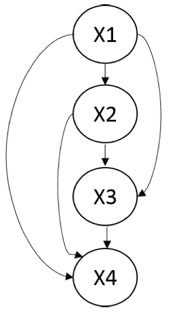
> 
> 四个变量的全连通贝叶斯网络。这个模型中没有独立性，并且它是任何分布的 I-map。

一个更有意思的问题是，我们能找到`p`的最小 I-map `G`，也就是一个 I-map，从`G`中移除单个边将导致它不再是一个 I-map。这很简单：我们可以从一个完全连接的`G`开始，并删除边，直到`G`不再是 I-map。一种方法是遵循图的自然拓扑排序，并删除节点祖先，直到不再可能这样；我们将在进行结构学习时回顾这种修剪方法。

然而，我们真正感兴趣的是，确定概率`p`是否拥有完美的映射`G`，其中`I(p)=I(G)`。不幸的是，答案是否定的。例如，考虑三个变量`X, Y, Z`的以下分布`p`：我们从伯努利分布中抽样`X,Y~Ber(0.5)`，并且我们让`Z = X xor Y`（我们称之为 noisy-xor 示例） 。我们可以使用一些代数来检查，`{X⊥Y，Z⊥Y，X⊥Z}∈I(p)`，但`Z⊥{Y,X}∉I(p)`。因此，`X→Z←Y`是`p`的一个 I-map，但我们讨论的三节点图结构都没有完美描述`I(p)`，因此这种分布没有完美的映射。

一个相关的问题是，当存在完美的映射时，它是否是唯一的。 同样，情况并非如此，因为`X→Y`和`X←Y`编码了相同的独立性，但形成不同的图。 更一般地说，如果两个贝叶斯网络`G1`，`G2`编码相同的依赖性`I(G1)=I(G2)`，它们就是 I-等价的。

两个贝叶斯网络什么时候是 I-等价的？ 为了回答这个问题，让我们回到三个变量的简单例子。 我们说下面的每个图都有相同的骨架，这意味着如果我们放弃箭头的方向性，每种情况下我们会获得相同的无向图。

> 三个变量上的贝叶斯网络

级联结构（a，b）显然是对称的，箭头的方向性并不重要。 实际上，（a，b，c）编码了完全相同的依赖关系。 只要我们不将它们变成 V 结构（d），我们就可以改变箭头的方向。 然而，当我们有 V 结构时，我们不能改变任何箭头：结构（d）是唯一描述依赖关系  的图。 这些例子提供了 I-等价性的下列一般结果的直觉。

事实：如果`G, G′`具有相同的骨架和相同的 V 结构，则`I(G)=I(G′)`。

同样，直观理解为什么这是真的，这很容易。 如果变量之间的 D-分离相同，则两个图是 I-等价的。 我们可以翻转任何边的方向，除非它形成一个 V 结构，并且图的 D-连通性将保持不变。 我们提请读者阅读 Koller 和 Friedman 的教科书来获得充分的证据。