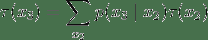

# 六、变量消除

> 原文：[Variable elimination](https://ermongroup.github.io/cs228-notes/inference/ve/)
> 
> 译者：[飞龙](https://github.com/wizardforcel)
> 
> 协议：[CC BY-NC-SA 4.0](http://creativecommons.org/licenses/by-nc-sa/4.0/)
> 
> 自豪地采用[谷歌翻译](https://translate.google.cn/)

接下来，我们将注意力转向图模型中的推断问题。 给定概率模型（如贝叶斯网络或 MRF），我们有兴趣使用它来回答有用的问题，例如确定给定电子邮件是垃圾邮件的概率。 更正式地说，我们将关注两类问题：

边缘推断：在我们总结其他所有东西（例如垃圾邮件与非垃圾邮件的概率）之后，我们模型中给定变量的概率是多少？

最大后验（MAP）推断：模型中变量最可能的赋值是什么（可能以证据为条件）。

事实证明，推断是一项具有挑战性的任务。 对于很多感兴趣的概率来说，回答这些问题将是非常难的。 至关重要的是，推断是否易于处理，将取决于描述该概率的图的结构。 如果问题棘手，我们仍然可以通过近似推断方法获得有用的答案。

本章涵盖了第一个确切的推断算法，即变量消除。 我们将在后面的章节中讨论近似推理。

## 示例

首先考虑边缘推断的问题。 假设为了简单起见，我们有链式贝叶斯网络，即这种形式的概率：

我们有兴趣计算边际概率`p(xn)`。 我们将在本章的其余部分假定`xi`是离散变量，每个变量都有`d`个可能的值 [1]：

> [1] 变量消除背后的原理也可以扩展到许多连续分布（例如高斯），但我们在这里不会讨论这些扩展。

最朴素的方法就是将  的`d^(n-1)`个赋值相加。

但是，通过利用概率分布的分解，我们可以做得更好。 我们可以用一种方式将和式重写，将某些变量“推入”乘积的更深位置。

我们通过首先将内部项求和，从`x1`开始并以`xn-1`结尾。 更具体地说，我们首先通过求和`x1`来计算中间因子 。 这需要`O(d^2)`的时间，因为我们必须累加`x1`的每个赋值来求`x2`。 得到的因子`τ(x2)`可以被看作是一个值表（尽管不一定是概率），`x2`的每个赋值是一个条目（就像因子`p(x1)`可以表示为一个表），然后我们可以使用`τ`重写边际概率为：

请注意，这与初始表达式形式相同，不同之处在于我们正在求和的变量较少 [2]。因此，我们可以计算另一个因子 ，并重复这个过程，直到我们只剩下`xn`。 由于每个步骤需要`O(d^2)`的时间，并且我们执行`O(n)`个步骤，所以推断现在需要`O(nd^2)`的时间，这比我们的初始`O(d^n)`解决方案好得多。

> [2] 这种技术是动态规划的一个特例，它是一种通用的算法设计方法，我们将较大的问题分解为一系列较小的问题。

另外，每次我们都要消除一个变量，它给出了算法的名字。

## 消除变量

建立了一些直觉之后，使用一个特例，我们现在以最一般的形式介绍变量消除算法。

### 因子

我们将假设我们有一个图模型，它是因子的乘积：

回想一下，我们可以将一个因子视为一个多维表格，将一个值赋给一组变量`xc`的每个赋值。 在贝叶斯网络的情况下，这些因子对应条件概率分布; 然而，这个定义也使得我们的算法同样适用于马尔科夫随机场。 在后一种情况下，这些因子编码了一个非正态分布；为了计算边缘值，我们首先计算分布函数（也使用变量消除），然后我们使用非标准化分布计算边缘值，最后我们用分区常数除以结果，以构建有效的边缘概率。

### 因子运算

变量消除算法重复执行两个因子运算：乘法和边缘化。 在我们的链式示例中，我们一直隐式执行这些操作。

因子的乘法运算，将两个因子`ϕ1, ϕ2`的乘积`ϕ3:=ϕ1×ϕ2`定义为：

`ϕ3`的范围定义为`ϕ1, ϕ2`范围内变量的并集; 同样， 表示`ϕi`范围内的变量赋值，通过将`xc`限制在该范围定义。 例如，我们定义`ϕ3(a,b,c):=ϕ1(a,b)×ϕ2(b,c)`。

接下来，边缘化操作从一个因子中“局部”消除了一组变量。 如果我们在两组变量`X, Y`上有一个因子`ϕ(X,Y)`，则边际化`Y`产生一个新的因子

其中求和对变量`Y`的所有联合赋值进行运算。

> 
> 
> 这里我们对因子`ϕ(A,B,C)`边缘化变量`B`。

我们用`τ`来表示边缘化因子。 即使`ϕ`是 CPD，重要的是要明白这个因子并不符合概率分布。

### 顺序

最后，变量消除算法需要变量上的顺序，根据它来“消除”变量。 在我们的链式示例中，我们采用了 DAG 所暗示的顺序。 需要注意的是：

*   不同的顺序会显着延长变量消除算法的运行时间。
*   找到最好的顺序是 NP 难的。

我们稍后再回到这些复杂情况，但现在假设顺序是固定的。

### 变量消除算法

我们现在准备好正式定义变量消除（VE）算法。 本质上，我们按照`O`的顺序遍历变量，并按照该顺序消除它们。 直观地说，这相当于选择一个总和，并将其“推入”因子的成绩中，尽可能远，就像我们在链式示例中所做的那样。

更正式地说，对于每个变量`Xi`（按照`O`来排序），

*   将包含`Xi`的所有因子`Φi`相乘
*   边缘化`Xi`以获得新的因子`τ`
*   将`Φi`中的因子替换为`τ`

一名之前的 CS228 学生创建了交互式网络模拟，用于可视化变量消除算法。 随意使用它，如果用了，请通过 Web 应用程序上的反馈按钮提交任何反馈或错误。

### 示例

让我们尝试理解，这些步骤在我们的链式示例中对应什么。 在那种情况下，所选顺序是`x1, x2, ..., xn-1`。 从`x1`开始，我们收集了所有涉及`x1`的因子，分别是`p(x1)`和`p(x2 | x1)`。 然后我们用它们构造一个新的因子 。 这可以看作是 VE 算法步骤 2 和 3 的结果：首先我们形成一个大因子`σ(x2,x1)=p(x2|x1)p(x1)`；然后我们从该因子中消除`x1`来产生`τ`。 然后，我们对`x2`重复相同的过程，除了因子现在是`p(x3|x2),τ(x2)`。

对于一个稍微复杂的例子，回想一下我们之前介绍的学生成绩的图模型。

> 
> 
> 一次考试中的学生成绩`g`的贝叶斯网络模型。除了`g`之外，我们还建模了学生成绩的几个层面，例如考试的难度`d`，学生的智力`i`，他的 SAT 分数`s`; 它也会影响教授课程的教授的推荐信的质量`l`。 每个变量都是二元的，除了`g`，它取 3 个可能的值。

由模型规定的概率是这种形式：

假设我们正在计算`p(l)`并且按照图中的拓扑序消除变量。 首先，我们消除`d`，这相当于创建一个新因子 。 接下来，我们消除`i`并产生一个因子 ；之后我们消除`s`产生 ，以此类推。 请注意，这些操作相当于汇总了因式化的概率分布，像这样：

请注意，这个例子每步最多需要计算`d^3`个操作，因为每个因子最多三个变量，并且每个步骤中将一个变量求和（在此示例中的维度`d`是 2 或 3）。

## 证据简介

一个密切相关且同样重要的问题是，计算这种形式的条件概率：

其中`P(X, Y, E)`是概率分布，它在查询变量`Y`，观察到的证据变量`E`，和未观察到的变量`X`上。

通过在`P(Y,E=e)`上执行一次变量消除，然后再在`P(E=e)`上执行一次，我们可以计算这个概率。

为了计算`P(Y,E=e)`，我们简单地取每个因子`ϕ(X′,Y′,E′)`，它们的范围在变量`E′⊆E`上，所以也可以在`E`中找到，并且我们使它们的值由`e`指定。 然后我们对`X`进行标准变量消除以获得仅含有`Y`的因子。

## 变量消除的运行时间

重要的是要理解，变量消除的运行时间在很大程度上取决于图的结构。

在前面的例子中，假设我们首先消除了`g`。 那么，我们不得不将因子`p(g|i,d),ϕ(l|g)`变换成 3 个变量的大因子`τ(d,i,l)`，这需要`O(d^4)`的时间来计算。 如果我们有因子`S→G`，那么我们也必须消除`p(g|s)`，产生`O(d^5)`时间的巨大因子`τ(d,i,l,s)`。 然后，从这个因子中消除任何变量，将需要几乎一样多的工作，就像我们以原始分布开始那样，因为所有变量都是耦合的。

显然，有些顺序比其他顺序更有效率。 实际上，变量消除的运行时间将等于`O(md^M)`，其中`M`是消除过程中任何因子的最大值，`m`是变量的数量。

### 选择变量消除顺序

不幸的是，选择 VE 的最佳顺序是 NP 难问题。 但是，在实践中，我们可能会采取以下启发式方法：

*   最小邻居：选择依赖变量最少的变量。
*   最小权重：选择变量来最小化其依赖变量基数的乘积。
*   最小填充：选择节点来最小化要添加到图形中的因子数量。

实际上，这些方法在许多有趣的设定中，通常会产生相当好的性能。