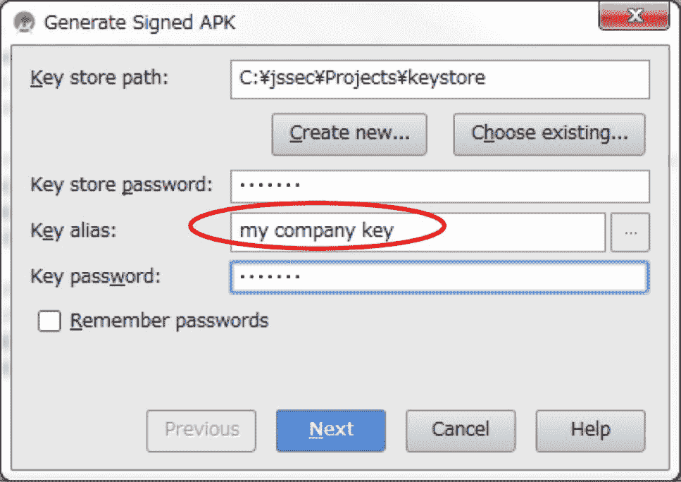

### 4.1.1 创建/使用活动 示例代码

> 原书：[Android Application Secure Design/Secure Coding Guidebook](http://www.jssec.org/dl/android_securecoding_en.pdf)
> 
> 译者：[飞龙](https://github.com/wizardforcel)
> 
> 协议：[CC BY-NC-SA 4.0](http://creativecommons.org/licenses/by-nc-sa/4.0/)

使用活动的风险和对策取决于活动的使用方式。 在本节中，我们根据活动的使用情况，对 4 种活动进行了分类。 你可以通过下面的图表来找出，你应该创建哪种类型的活动。 由于安全编程最佳实践根据活动的使用方式而有所不同，因此我们也将解释活动的实现。

表 4-1 活动类型的定义

| 类型 | 定义 |
| --- | --- |
| 私有 | 不能由其他应用加载，所以是最安全的活动 |
| 公共 | 应该由很多未指定的应用使用的活动 |
| 伙伴 | 只能由可信的伙伴公司开发的应用使用的活动 |
| 内部 | 只能由其他内部应用使用的活动 |


#### 4.1.1.1 创建/使用私有活动

私有活动是其他应用程序无法启动的活动，因此它是最安全的活动。

当使用仅在应用程序中使用的活动（私有活动）时，只要你对类使用显示意图，那么你不必担心将它意外发送到任何其他应用程序。 但是，第三方应用程序可能会读取用于启动活动的意图。 因此，如果你将敏感信息放入用于启动活动的意图中，有必要采取对策，来确保它不会被恶意第三方读取。

下面展示了如何创建私有活动的示例代码。

要点（创建活动）：

1) 不要指定`taskAffinity`。

2) 不要指定`launchMode`。

3) 将导出属性明确设置为`false`。

4) 仔细和安全地处理收到的意图，即使意图从相同的应用发送。

5) 敏感信息可以发送，因为它发送和接收所有同一应用中的信息。

AndroidManifest.xml

```
<?xml version="1.0" encoding="utf-8"?>
<manifest xmlns:android="http://schemas.android.com/apk/res/android"
    package="org.jssec.android.activity.privateactivity" >

    <application
        android:allowBackup="false"
        android:icon="@drawable/ic_launcher"
        android:label="@string/app_name" >

        <!-- Private activity -->
        <!-- *** POINT 1 *** Do not specify taskAffinity -->
        <!-- *** POINT 2 *** Do not specify launchMode -->
        <!-- *** POINT 3 *** Explicitly set the exported attribute to false. -->
        <activity
            android:name=".PrivateActivity"
            android:label="@string/app_name"
            android:exported="false" />

        <!-- Public activity launched by launcher -->
        <activity
            android:name=".PrivateUserActivity"
            android:label="@string/app_name"
            android:exported="true" >
            <intent-filter>
                <action android:name="android.intent.action.MAIN" />
                <category android:name="android.intent.category.LAUNCHER" />
            </intent-filter>
        </activity>
    </application>
</manifest>
```

PrivateActivity.java

```
package org.jssec.android.activity.privateactivity;

import android.app.Activity;
import android.content.Intent;
import android.os.Bundle;
import android.view.View;
import android.widget.Toast;

public class PrivateActivity extends Activity {

    @Override
    public void onCreate(Bundle savedInstanceState) {
        super.onCreate(savedInstanceState);
        setContentView(R.layout.private_activity);
        // *** POINT 4 *** Handle the received Intent carefully and securely, even though the Intent was sent from the same application.
        // Omitted, since this is a sample. Please refer to "3.2 Handling Input Data Carefully and Securely."
        String param = getIntent().getStringExtra("PARAM");
        Toast.makeText(this, String.format("Received param: ￥"%s￥"", param), Toast.LENGTH_LONG).show();
    }

    public void onReturnResultClick(View view) {
        // *** POINT 5 *** Sensitive information can be sent since it is sending and receiving all within the same application.
        Intent intent = new Intent();
        intent.putExtra("RESULT", "Sensitive Info");
        setResult(RESULT_OK, intent);
        finish();
    }
}
```

下面展示如何使用私有活动的示例代码。

要点（使用活动）；

6) 不要为意图设置`FLAG_ACTIVITY_NEW_TASK`标志来启动活动。

7) 使用显式意图，以及用于调用相同应用中的活动的特定的类。

8) 由于目标活动位于同一个应用中，因此只能通过`putExtra()`发送敏感信息 [1]。

> 警告：如果不遵守第 1, 2 和 6 点，第三方可能会读到意图。 更多详细信息，请参阅第 4.1.2.2 和 4.1.2.3 节。

9) 即使数据来自同一应用中的活动，也要小心并安全地处理收到的结果数据。

PrivateUserActivity.java

```
package org.jssec.android.activity.privateactivity;

import android.app.Activity;
import android.content.Intent;
import android.os.Bundle;
import android.view.View;
import android.widget.Toast;

public class PrivateUserActivity extends Activity {

    private static final int REQUEST_CODE = 1;

    @Override
    public void onCreate(Bundle savedInstanceState) {
        super.onCreate(savedInstanceState);
        setContentView(R.layout.user_activity);
    }

    public void onUseActivityClick(View view) {
        // *** POINT 6 *** Do not set the FLAG_ACTIVITY_NEW_TASK flag for intents to start an activity.
        // *** POINT 7 *** Use the explicit Intents with the class specified to call an activity in the same application.
        Intent intent = new Intent(this, PrivateActivity.class);
        // *** POINT 8 *** Sensitive information can be sent only by putExtra() since the destination activity is in the same application.
        intent.putExtra("PARAM", "Sensitive Info");
        startActivityForResult(intent, REQUEST_CODE);
    }

    @Override
    public void onActivityResult(int requestCode, int resultCode, Intent data) {
        super.onActivityResult(requestCode, resultCode, data);
        if (resultCode != RESULT_OK) return;
        switch (requestCode) {
            case REQUEST_CODE:
                String result = data.getStringExtra("RESULT");
                // *** POINT 9 *** Handle the received data carefully and securely,
                // even though the data comes from an activity within the same application.
                // Omitted, since this is a sample. Please refer to "3.2 Handling Input Data Carefully and Securely."
                Toast.makeText(this, String.format("Received result: ￥"%s￥"", result), Toast.LENGTH_LONG).show();
                break;
        }
    }
}
```

#### 4.1.1.2 创建/使用公共活动

公共活动是应该由大量未指定的应用程序使用的活动。 有必要注意的是，公共活动可能收到恶意软件发送的意图。 另外，使用公共活动时，有必要注意恶意软件也可以接收或阅读发送给他们的意图。

要点（创建活动）：

1) 将导出属性显式设置为`true`。

2) 小心并安全地处理接收到的意图。

3) 返回结果时，请勿包含敏感信息。

下面展示了创建公共活动的示例代码。

AndroidManifest.xml

```
<?xml version="1.0" encoding="utf-8"?>
    <manifest xmlns:android="http://schemas.android.com/apk/res/android"
    package="org.jssec.android.activity.publicactivity" >

    <application
        android:allowBackup="false"
        android:icon="@drawable/ic_launcher"
        android:label="@string/app_name" >

        <!-- Public Activity -->
        <!-- *** POINT 1 *** Explicitly set the exported attribute to true. -->
        <activity
            android:name=".PublicActivity"
            android:label="@string/app_name"
            android:exported="true">

            <!-- Define intent filter to receive an implicit intent for a specified action -->
            <intent-filter>
                <action android:name="org.jssec.android.activity.MY_ACTION" />
                <category android:name="android.intent.category.DEFAULT" />
            </intent-filter>
        </activity>
    </application>
</manifest>
```

PublicActivity.java

```
package org.jssec.android.activity.publicactivity;

import android.app.Activity;
import android.content.Intent;
import android.os.Bundle;
import android.view.View;
import android.widget.Toast;

public class PublicActivity extends Activity {

    @Override
    public void onCreate(Bundle savedInstanceState) {
        super.onCreate(savedInstanceState);
        setContentView(R.layout.main);
        // *** POINT 2 *** Handle the received intent carefully and securely.
        // Since this is a public activity, it is possible that the sending application may be malware.
        // Omitted, since this is a sample. Please refer to "3.2 Handling Input Data Carefully and Securely."
        String param = getIntent().getStringExtra("PARAM");
        Toast.makeText(this, String.format("Received param: ¥"%s¥"", param), Toast.LENGTH_LONG).show();
    }

    public void onReturnResultClick(View view) {
        // *** POINT 3 *** When returning a result, do not include sensitive information.
        // Since this is a public activity, it is possible that the receiving application may be malware.
        // If there is no problem if the data gets received by malware, then it can be returned as a result.
        Intent intent = new Intent();
        intent.putExtra("RESULT", "Not Sensitive Info");
        setResult(RESULT_OK, intent);
        finish();
    }
}
```

接下来，这里是公共活动用户端的示例代码。

要点（使用活动）：

4) 不要发送敏感信息。

5) 收到结果时，请仔细并安全地处理数据。

PublicUserActivity.java

```
package org.jssec.android.activity.publicuser;
import android.app.Activity;
import android.content.ActivityNotFoundException;
import android.content.Intent;
import android.os.Bundle;
import android.view.View;
import android.widget.Toast;
public class PublicUserActivity extends Activity {

    private static final int REQUEST_CODE = 1;

    @Override
    public void onCreate(Bundle savedInstanceState) {
        super.onCreate(savedInstanceState);
        setContentView(R.layout.main);
    }

    public void onUseActivityClick(View view) {
        try {
            // *** POINT 4 *** Do not send sensitive information.
            Intent intent = new Intent("org.jssec.android.activity.MY_ACTION");
            intent.putExtra("PARAM", "Not Sensitive Info");
            startActivityForResult(intent, REQUEST_CODE);
        } catch (ActivityNotFoundException e) {
            Toast.makeText(this, "Target activity not found.", Toast.LENGTH_LONG).show();
        }
    }

    @Override
    public void onActivityResult(int requestCode, int resultCode, Intent data) {
        super.onActivityResult(requestCode, resultCode, data);
        // *** POINT 5 *** When receiving a result, handle the data carefully and securely.
        // Omitted, since this is a sample. Please refer to "3.2 Handling Input Data Carefully and Securely."
        if (resultCode != RESULT_OK) return;
        switch (requestCode) {
            case REQUEST_CODE:
                String result = data.getStringExtra("RESULT");
                Toast.makeText(this, String.format("Received result: ¥"%s¥"", result), Toast.LENGTH_LONG).show();
                break;
        }
    }
}
```#### 4.1.1.3 创建/使用伙伴活动

伙伴活动是只能由特定应用程序使用的活动。 它们在想要安全共享信息和功能的伙伴公司之间使用。 

第三方应用程序可能会读取用于启动活动的意图。 因此，如果你将敏感信息放入用于启动活动的意图中，有必要采取对策来确保其无法被恶意第三方读取。

创建伙伴活动的示例代码如下所示。

要点（创建活动）：

1) 不要指定`taskAffinity`。

2) 不要指定`launchMode`。

3) 不要定义意图过滤器，并将导出属性明确设置为`true`。

4) 通过预定义白名单验证请求应用程序的证书。

5) 尽管意图是从伙伴应用程序发送的，仔细和安全地处理接收到的意图。

6) 只返回公开给伙伴应用的信息。

请参阅“4.1.3.2 验证和请求应用”，了解如何通过白名单验证应用。 此外，请参阅“5.2.1.3 如何验证应用证书的哈希”，了解如何验证白名单中指定目标应用的证书哈希。

AndroidManifest.xml

<div class="se-preview-section-delimiter"></div>

```xml
<?xml version="1.0" encoding="utf-8"?>
<LinearLayout xmlns:android="http://schemas.android.com/apk/res/android"
    android:layout_width="fill_parent"
    android:layout_height="fill_parent"
    android:orientation="vertical"
    android:padding="5dp" >
    <TextView
        android:layout_width="fill_parent"
        android:layout_height="wrap_content"
        android:layout_marginTop="20dp"
        android:text="@string/description" />
    <Button
        android:layout_width="fill_parent"
        android:layout_height="wrap_content"
        android:layout_marginTop="20dp"
        android:onClick="onReturnResultClick"
        android:text="@string/return_result" />
</LinearLayout>
```

PartnerActivity.java

```
package org.jssec.android.activity.partneractivity;

import org.jssec.android.shared.PkgCertWhitelists;
import org.jssec.android.shared.Utils;
import android.app.Activity;
import android.content.Context;
import android.content.Intent;
import android.os.Bundle;
import android.view.View;
import android.widget.Toast;

public class PartnerActivity extends Activity {

    // *** POINT 4 *** Verify the requesting application's certificate through a predefined whitelist.
    private static PkgCertWhitelists sWhitelists = null;

    private static void buildWhitelists(Context context) {
        boolean isdebug = Utils.isDebuggable(context);
        sWhitelists = new PkgCertWhitelists();
        // Register certificate hash value of partner application org.jssec.android.activity.partneruser
            .sWhitelists.add("org.jssec.android.activity.partneruser", isdebug ?
            // Certificate hash value of "androiddebugkey" in the debug.keystore.
            "0EFB7236 328348A9 89718BAD DF57F544 D5CCB4AE B9DB34BC 1E29DD26 F77C8255" :
            // Certificate hash value of "partner key" in the keystore.
            "1F039BB5 7861C27A 3916C778 8E78CE00 690B3974 3EB8259F E2627B8D 4C0EC35A");
            // Register the other partner applications in the same way.
    }

    private static boolean checkPartner(Context context, String pkgname) {
        if (sWhitelists == null) buildWhitelists(context);
        return sWhitelists.test(context, pkgname);
    }

    @Override
    public void onCreate(Bundle savedInstanceState) {
        super.onCreate(savedInstanceState);
        setContentView(R.layout.main);

        // *** POINT 4 *** Verify the requesting application's certificate through a predefined whitelist.
        if (!checkPartner(this, getCallingActivity().getPackageName())) {
            Toast.makeText(this,
                "Requesting application is not a partner application.",
                Toast.LENGTH_LONG).show();
            finish();
            return;
        }
        // *** POINT 5 *** Handle the received intent carefully and securely, even though the intent was sent from a partner application.
        // Omitted, since this is a sample. Refer to "3.2 Handling Input Data Carefully and Securely."
        Toast.makeText(this, "Accessed by Partner App", Toast.LENGTH_LONG).show();
    }

    public void onReturnResultClick(View view) {
        // *** POINT 6 *** Only return Information that is granted to be disclosed to a partner application.
        Intent intent = new Intent();
        intent.putExtra("RESULT", "Information for partner applications");
        setResult(RESULT_OK, intent);
        finish();
    }
}
```

PkgCertWhitelists.java

```
package org.jssec.android.shared;

import java.util.HashMap;
import java.util.Map;
import android.content.Context;

public class PkgCertWhitelists {

    private Map<String, String> mWhitelists = new HashMap<String, String>();

    public boolean add(String pkgname, String sha256) {
        if (pkgname == null) return false;
        if (sha256 == null) return false;
        sha256 = sha256.replaceAll(" ", "");
        if (sha256.length() != 64) return false; // SHA-256 -> 32 bytes -> 64 chars
        sha256 = sha256.toUpperCase();
        if (sha256.replaceAll("[0-9A-F]+", "").length() != 0) return false; // found non hex char
        mWhitelists.put(pkgname, sha256);
        return true;
    }

    public boolean test(Context ctx, String pkgname) {
        // Get the correct hash value which corresponds to pkgname.
        String correctHash = mWhitelists.get(pkgname);
        // Compare the actual hash value of pkgname with the correct hash value.
        return PkgCert.test(ctx, pkgname, correctHash);
    }
}
```

PkgCert.java

```
package org.jssec.android.shared;

import java.security.MessageDigest;
import java.security.NoSuchAlgorithmException;
import android.content.Context;
import android.content.pm.PackageInfo;
import android.content.pm.PackageManager;
import android.content.pm.PackageManager.NameNotFoundException;
import android.content.pm.Signature;

public class PkgCert {

    public static boolean test(Context ctx, String pkgname, String correctHash) {
        if (correctHash == null) return false;
        correctHash = correctHash.replaceAll(" ", "");
        return correctHash.equals(hash(ctx, pkgname));
    }

    public static String hash(Context ctx, String pkgname) {
        if (pkgname == null) return null;
        try {
            PackageManager pm = ctx.getPackageManager();
            PackageInfo pkginfo = pm.getPackageInfo(pkgname, PackageManager.GET_SIGNATURES);
            if (pkginfo.signatures.length != 1) return null; // Will not handle multiple signatures.
            Signature sig = pkginfo.signatures[0];
            byte[] cert = sig.toByteArray();
            byte[] sha256 = computeSha256(cert);
            return byte2hex(sha256);
        } catch (NameNotFoundException e) {
            return null;
        }
    }

    private static byte[] computeSha256(byte[] data) {
        try {
            return MessageDigest.getInstance("SHA-256").digest(data);
        } catch (NoSuchAlgorithmException e) {
            return null;
        }
    }

    private static String byte2hex(byte[] data) {
        if (data == null) return null;
        final StringBuilder hexadecimal = new StringBuilder();
        for (final byte b : data) {
            hexadecimal.append(String.format("%02X", b));
        }
        return hexadecimal.toString();
    }
}
```

使用伙伴活动的示例代码如下：

7) 验证目标应用的证书是否已在白名单中注册。

8) 不要为启动活动的意图设置`FLAG_ACTIVITY_NEW_TASK`标志。

9) 仅通过`putExtra()`发送公开给伙伴活动的信息。

10) 使用显示意图调用伙伴活动。

11) 使用`startActivityForResult()`来调用伙伴活动。

12) 即使数据来自伙伴应用程序，也要小心并安全地处理收到的结果数据。

请参阅“4.1.3.2 验证请求应用”了解如何通过白名单验证应用程序。 另请参阅“5.2.1.3 如何验证应用证书的哈希”，了解如何验证白名单中指定目标应用的证书哈希。

AndroidManifest.xml

```
<?xml version="1.0" encoding="utf-8"?>
    <manifest xmlns:android="http://schemas.android.com/apk/res/android"
    package="org.jssec.android.activity.partneruser" >

    <application
        android:allowBackup="false"
        android:icon="@drawable/ic_launcher"
        android:label="@string/app_name" >

        <activity
            android:name="org.jssec.android.activity.partneruser.PartnerUserActivity"
            android:label="@string/app_name"
            android:exported="true" >
            <intent-filter>
                <action android:name="android.intent.action.MAIN" />
                <category android:name="android.intent.category.LAUNCHER" />
            </intent-filter>
        </activity>
    </application>
</manifest>
```

PartnerUserActivity.java

```
package org.jssec.android.activity.partneruser;

import org.jssec.android.shared.PkgCertWhitelists;
import org.jssec.android.shared.Utils;
import android.app.Activity;
import android.content.ActivityNotFoundException;
import android.content.Context;
import android.content.Intent;
import android.os.Bundle;
import android.view.View;
import android.widget.Toast;

public class PartnerUserActivity extends Activity {

    // *** POINT 7 *** Verify if the certificate of a target application has been registered in a whitelist.
    private static PkgCertWhitelists sWhitelists = null;

    private static void buildWhitelists(Context context) {
        boolean isdebug = Utils.isDebuggable(context);
        sWhitelists = new PkgCertWhitelists();
        // Register the certificate hash value of partner application org.jssec.android.activity.partner
        activity
            .sWhitelists.add("org.jssec.android.activity.partneractivity", isdebug ?
            // The certificate hash value of "androiddebugkey" is in debug.keystore.
            "0EFB7236 328348A9 89718BAD DF57F544 D5CCB4AE B9DB34BC 1E29DD26 F77C8255" :
            // The certificate hash value of "my company key" is in the keystore.
            "D397D343 A5CBC10F 4EDDEB7C A10062DE 5690984F 1FB9E88B D7B3A7C2 42E142CA");
            // Register the other partner applications in the same way.
    }

    private static boolean checkPartner(Context context, String pkgname) {
        if (sWhitelists == null) buildWhitelists(context);
        return sWhitelists.test(context, pkgname);
    }

    private static final int REQUEST_CODE = 1;
    // Information related the target partner activity
    private static final String TARGET_PACKAGE = "org.jssec.android.activity.partneractivity";
    private static final String TARGET_ACTIVITY = "org.jssec.android.activity.partneractivity.PartnerActivity";

    @Override
    public void onCreate(Bundle savedInstanceState) {
        super.onCreate(savedInstanceState);
        setContentView(R.layout.main);
    }

    public void onUseActivityClick(View view) {
        // *** POINT 7 *** Verify if the certificate of the target application has been registered in the own white list.
        if (!checkPartner(this, TARGET_PACKAGE)) {
            Toast.makeText(this, "Target application is not a partner application.", Toast.LENGTH_LONG).show();
            return;
        }
        try {
            // *** POINT 8 *** Do not set the FLAG_ACTIVITY_NEW_TASK flag for the intent that start an activity.
            Intent intent = new Intent();
            // *** POINT 9 *** Only send information that is granted to be disclosed to a Partner Activity only by putExtra().
            intent.putExtra("PARAM", "Info for Partner Apps");
            // *** POINT 10 *** Use explicit intent to call a Partner Activity.
            intent.setClassName(TARGET_PACKAGE, TARGET_ACTIVITY);
            // *** POINT 11 *** Use startActivityForResult() to call a Partner Activity.
            startActivityForResult(intent, REQUEST_CODE);
        }
        catch (ActivityNotFoundException e) {
            Toast.makeText(this, "Target activity not found.", Toast.LENGTH_LONG).show();
        }
    }

    @Override
    public void onActivityResult(int requestCode, int resultCode, Intent data) {
        super.onActivityResult(requestCode, resultCode, data);
        if (resultCode != RESULT_OK) return;
        switch (requestCode) {
            case REQUEST_CODE:
                String result = data.getStringExtra("RESULT");
                // *** POINT 12 *** Handle the received data carefully and securely,
                // even though the data comes from a partner application.
                // Omitted, since this is a sample. Please refer to "3.2 Handling Input Data Carefully and Securely."
                Toast.makeText(this,
                    String.format("Received result: ¥"%s¥"", result), Toast.LENGTH_LONG).show();
                break;
        }
    }
}
```

PkgCertWhitelists.java

```
package org.jssec.android.shared;

import java.util.HashMap;
import java.util.Map;
import android.content.Context;

public class PkgCertWhitelists {
    private Map<String, String> mWhitelists = new HashMap<String, String>();

    public boolean add(String pkgname, String sha256) {
        if (pkgname == null) return false;
        if (sha256 == null) return false;
        sha256 = sha256.replaceAll(" ", "");
        if (sha256.length() != 64) return false; // SHA-256 -> 32 bytes -> 64 chars
        sha256 = sha256.toUpperCase();
        if (sha256.replaceAll("[0-9A-F]+", "").length() != 0) return false; // found non hex char
        mWhitelists.put(pkgname, sha256);
        return true;
    }

    public boolean test(Context ctx, String pkgname) {
        // Get the correct hash value which corresponds to pkgname.
        String correctHash = mWhitelists.get(pkgname);
        // Compare the actual hash value of pkgname with the correct hash value.
        return PkgCert.test(ctx, pkgname, correctHash);
    }
}
```

PkgCert.java

```
package org.jssec.android.shared;

import java.security.MessageDigest;
import java.security.NoSuchAlgorithmException;
import android.content.Context;
import android.content.pm.PackageInfo;
import android.content.pm.PackageManager;
import android.content.pm.PackageManager.NameNotFoundException;
import android.content.pm.Signature;

public class PkgCert {
        public static boolean test(Context ctx, String pkgname, String correctHash) {
        if (correctHash == null) return false;
        correctHash = correctHash.replaceAll(" ", "");
        return correctHash.equals(hash(ctx, pkgname));
    }

    public static String hash(Context ctx, String pkgname) {
        if (pkgname == null) return null;
        try {
            PackageManager pm = ctx.getPackageManager();
            PackageInfo pkginfo = pm.getPackageInfo(pkgname, PackageManager.GET_SIGNATURES);
            if (pkginfo.signatures.length != 1) return null; // Will not handle multiple signatures.
            Signature sig = pkginfo.signatures[0];
            byte[] cert = sig.toByteArray();
            byte[] sha256 = computeSha256(cert);
            return byte2hex(sha256);
        } catch (NameNotFoundException e) {
            return null;
        }
    }

    private static byte[] computeSha256(byte[] data) {
        try {
            return MessageDigest.getInstance("SHA-256").digest(data);
        } catch (NoSuchAlgorithmException e) {
            return null;
        }
    }

    private static String byte2hex(byte[] data) {
        if (data == null) return null;
        final StringBuilder hexadecimal = new StringBuilder();
        for (final byte b : data) {
            hexadecimal.append(String.format("%02X", b));
        }
        return hexadecimal.toString();
    }
}
```

#### 4.1.1.4 创建/使用内部活动

内部活动是禁止其他内部应用以外的应用使用的活动。 它们用于内部开发的应用，以便安全地共享信息和功能。

第三方应用可能会读取用于启动活动的意图。 因此，如果你将敏感信息放入用于启动活动的意图中，有必要采取对策来确保它不会被恶意第三方读取。

下面展示了创建内部活动的示例代码。

要点（创建活动）：

1) 定义内部签名权限。

2) 不要指定`taskAffinity`。

3) 不要指定`launchMode`。

4) 需要内部签名权限。

5) 不要定义意图过滤器，并将导出属性显式设为`true`。

6) 确认内部签名权限是由内部应用的。

7) 尽管意图是从内部应用发送的，仔细和安全地处理接收到的意图。

8) 由于请求的应用是内部的，因此可以返回敏感信息。

9) 导出 APK 时，请使用与目标应用相同的开发人员密钥对 APK 进行签名。

AndroidManifest.xml

```
 <?xml version="1.0" encoding="utf-8"?>
<manifest xmlns:android="http://schemas.android.com/apk/res/android"
    package="org.jssec.android.activity.inhouseactivity" >

    <!-- *** POINT 1 *** Define an in-house signature permission -->
    <permission
    android:name="org.jssec.android.activity.inhouseactivity.MY_PERMISSION"
    android:protectionLevel="signature" />

    <application
        android:allowBackup="false"
        android:icon="@drawable/ic_launcher"
        android:label="@string/app_name" >

        <!-- In-house Activity -->
        <!-- *** POINT 2 *** Do not specify taskAffinity -->
        <!-- *** POINT 3 *** Do not specify launchMode -->
        <!-- *** POINT 4 *** Require the in-house signature permission -->
        <!-- *** POINT 5 *** Do not define the intent filter and explicitly set the exported attribute to
        true -->
        <activity
            android:name="org.jssec.android.activity.inhouseactivity.InhouseActivity"
            android:exported="true"
            android:permission="org.jssec.android.activity.inhouseactivity.MY_PERMISSION" />
    </application>
</manifest>
```

InhouseActivity.java

```
package org.jssec.android.activity.inhouseactivity;

import org.jssec.android.shared.SigPerm;
import org.jssec.android.shared.Utils;
import android.app.Activity;
import android.content.Context;
import android.content.Intent;
import android.os.Bundle;
import android.view.View;
import android.widget.Toast;

public class InhouseActivity extends Activity {

    // In-house Signature Permission
    private static final String MY_PERMISSION = "org.jssec.android.activity.inhouseactivity.MY_PERMISSION";
    // In-house certificate hash value
    private static String sMyCertHash = null;

    private static String myCertHash(Context context) {
        if (sMyCertHash == null) {
            if (Utils.isDebuggable(context)) {
                // Certificate hash value of "androiddebugkey" in the debug.keystore.
                sMyCertHash = "0EFB7236 328348A9 89718BAD DF57F544 D5CCB4AE B9DB34BC 1E29DD26 F77C8255";
            } else {
                // Certificate hash value of "my company key" in the keystore.
                sMyCertHash = "D397D343 A5CBC10F 4EDDEB7C A10062DE 5690984F 1FB9E88B D7B3A7C2 42E142CA";
            }
        }
        return sMyCertHash;
    }

    @Override
    public void onCreate(Bundle savedInstanceState) {
        super.onCreate(savedInstanceState);
        setContentView(R.layout.main);
        // *** POINT 6 *** Verify that the in-house signature permission is defined by an in-house application.
        if (!SigPerm.test(this, MY_PERMISSION, myCertHash(this))) {
            Toast.makeText(this, "The in-house signature permission is not declared by in-house application.",
            Toast.LENGTH_LONG).show();
            finish();
            return;
        }
        // *** POINT 7 *** Handle the received intent carefully and securely, even though the intent was sent from an in-house application.
        // Omitted, since this is a sample. Please refer to "3.2 Handling Input Data Carefully and Securely."
        String param = getIntent().getStringExtra("PARAM");
        Toast.makeText(this, String.format("Received param: ¥"%s¥"", param), Toast.LENGTH_LONG).show();
    }

    public void onReturnResultClick(View view) {
        // *** POINT 8 *** Sensitive information can be returned since the requesting application is inhouse.
        Intent intent = new Intent();
        intent.putExtra("RESULT", "Sensitive Info");
        setResult(RESULT_OK, intent);
        finish();
    }
}
```

SigPerm.java

```
package org.jssec.android.shared;

import android.content.Context;
import android.content.pm.PackageManager;
import android.content.pm.PackageManager.NameNotFoundException;
import android.content.pm.PermissionInfo;

public class SigPerm {

    public static boolean test(Context ctx, String sigPermName, String correctHash) {
        if (correctHash == null) return false;
        correctHash = correctHash.replaceAll(" ", "");
        return correctHash.equals(hash(ctx, sigPermName));
    }

    public static String hash(Context ctx, String sigPermName) {
        if (sigPermName == null) return null;
        try {
            // Get the package name of the application which declares a permission named sigPermName.
            PackageManager pm = ctx.getPackageManager();
            PermissionInfo pi;
            pi = pm.getPermissionInfo(sigPermName, PackageManager.GET_META_DATA);
            String pkgname = pi.packageName;
            // Fail if the permission named sigPermName is not a Signature Permission
            if (pi.protectionLevel != PermissionInfo.PROTECTION_SIGNATURE) return null;
            // Return the certificate hash value of the application which declares a permission named sigPermName.
            return PkgCert.hash(ctx, pkgname);
        } catch (NameNotFoundException e) {
            return null;
        }
    }
}
```

PkgCert.java

```
package org.jssec.android.shared;

import java.security.MessageDigest;
import java.security.NoSuchAlgorithmException;
import android.content.Context;
import android.content.pm.PackageInfo;
import android.content.pm.PackageManager;
import android.content.pm.PackageManager.NameNotFoundException;
import android.content.pm.Signature;

public class PkgCert {
    public static boolean test(Context ctx, String pkgname, String correctHash) {
        if (correctHash == null) return false;
        correctHash = correctHash.replaceAll(" ", "");
        return correctHash.equals(hash(ctx, pkgname));
    }

    public static String hash(Context ctx, String pkgname) {
        if (pkgname == null) return null;
        try {
            PackageManager pm = ctx.getPackageManager();
            PackageInfo pkginfo = pm.getPackageInfo(pkgname, PackageManager.GET_SIGNATURES);
            if (pkginfo.signatures.length != 1) return null; // Will not handle multiple signatures.
            Signature sig = pkginfo.signatures[0];
            byte[] cert = sig.toByteArray();
            byte[] sha256 = computeSha256(cert);
            return byte2hex(sha256);
        } catch (NameNotFoundException e) {
            return null;
        }
    }

    private static byte[] computeSha256(byte[] data) {
        try {
            return MessageDigest.getInstance("SHA-256").digest(data);
        } catch (NoSuchAlgorithmException e) {
            return null;
        }
    }

    private static String byte2hex(byte[] data) {
        if (data == null) return null;
        final StringBuilder hexadecimal = new StringBuilder();
        for (final byte b : data) {
            hexadecimal.append(String.format("%02X", b));
        }
        return hexadecimal.toString();
    }
}
```

要点 9：导出 APK 时，请使用与目标应用相同的开发人员密钥对 APK 进行签名。



使用内部活动的代码如下：

要点（使用活动）：

10) 声明你要使用内部签名权限。

11) 确认内部签名权限是由内部应用定义的。

12) 验证目标应用是否使用内部证书签名。

13) 由于目标应用是内部的，所以敏感信息只能由`putExtra()`发送。

14) 使用显式意图调用内部活动。

15) 即使数据来自内部应用，也要小心并安全地处理接收到的数据。

16) 导出 APK 时，请使用与目标应用相同的开发人员密钥对 APK 进行签名。

AndroidManifest.xml

```
<?xml version="1.0" encoding="utf-8"?>
<manifest xmlns:android="http://schemas.android.com/apk/res/android"
    package="org.jssec.android.activity.inhouseuser" >

    <!-- *** POINT 10 *** Declare to use the in-house signature permission -->
    <uses-permission
    android:name="org.jssec.android.activity.inhouseactivity.MY_PERMISSION" />

    <application
        android:allowBackup="false"
        android:icon="@drawable/ic_launcher"
        android:label="@string/app_name" >

        <activity
            android:name="org.jssec.android.activity.inhouseuser.InhouseUserActivity"
            android:label="@string/app_name"
            android:exported="true" >
            <intent-filter>
                <action android:name="android.intent.action.MAIN" />
                <category android:name="android.intent.category.LAUNCHER" />
            </intent-filter>
        </activity>
    </application>
</manifest>
```

InhouseUserActivity.java

```
package org.jssec.android.activity.inhouseuser;

import org.jssec.android.shared.PkgCert;
import org.jssec.android.shared.SigPerm;
import org.jssec.android.shared.Utils;
import android.app.Activity;
import android.content.ActivityNotFoundException;
import android.content.Context;
import android.content.Intent;
import android.os.Bundle;
import android.view.View;
import android.widget.Toast;

public class InhouseUserActivity extends Activity {

    // Target Activity information
    private static final String TARGET_PACKAGE = "org.jssec.android.activity.inhouseactivity";
    private static final String TARGET_ACTIVITY = "org.jssec.android.activity.inhouseactivity.InhouseActivity";
    // In-house Signature Permission
    private static final String MY_PERMISSION = "org.jssec.android.activity.inhouseactivity.MY_PERMISSION";
    // In-house certificate hash value
    private static String sMyCertHash = null;

    private static String myCertHash(Context context) {
        if (sMyCertHash == null) {
            if (Utils.isDebuggable(context)) {
                // Certificate hash value of "androiddebugkey" in the debug.keystore.
                sMyCertHash = "0EFB7236 328348A9 89718BAD DF57F544 D5CCB4AE B9DB34BC 1E29DD26 F77C8255";
            } else {
                // Certificate hash value of "my company key" in the keystore.
                sMyCertHash = "D397D343 A5CBC10F 4EDDEB7C A10062DE 5690984F 1FB9E88B D7B3A7C2 42E142CA";
            }
        }
        return sMyCertHash;
    }

    private static final int REQUEST_CODE = 1;

    @Override
    public void onCreate(Bundle savedInstanceState) {
        super.onCreate(savedInstanceState);
        setContentView(R.layout.main);
    }

    public void onUseActivityClick(View view) {
        // *** POINT 11 *** Verify that the in-house signature permission is defined by an in-house application.
        if (!SigPerm.test(this, MY_PERMISSION, myCertHash(this))) {
            Toast.makeText(this, "The in-house signature permission is not declared by in-house application.",
            Toast.LENGTH_LONG).show();
            return;
        }
        // ** POINT 12 *** Verify that the destination application is signed with the in-house certificate.
        if (!PkgCert.test(this, TARGET_PACKAGE, myCertHash(this))) {
            Toast.makeText(this, "Target application is not an in-house application.", Toast.LENGTH_LONG).show();
            return;
        }
        try {
            Intent intent = new Intent();
            // *** POINT 13 *** Sensitive information can be sent only by putExtra() since the destination application is in-house.
            intent.putExtra("PARAM", "Sensitive Info");

            // *** POINT 14 *** Use explicit intents to call an In-house Activity.
            intent.setClassName(TARGET_PACKAGE, TARGET_ACTIVITY);
            startActivityForResult(intent, REQUEST_CODE);
        } catch (ActivityNotFoundException e) {
            Toast.makeText(this, "Target activity not found.", Toast.LENGTH_LONG).show();
        }
    }

    @Override
    public void onActivityResult(int requestCode, int resultCode, Intent data) {
        super.onActivityResult(requestCode, resultCode, data);
        if (resultCode != RESULT_OK) return;
        switch (requestCode) {
            case REQUEST_CODE:
                String result = data.getStringExtra("RESULT");
                // *** POINT 15 *** Handle the received data carefully and securely,
                // even though the data came from an in-house application.
                // Omitted, since this is a sample. Please refer to "3.2 Handling Input Data Carefully and Securely."
                Toast.makeText(this, String.format("Received result: ¥"%s¥"", result), Toast.LENGTH_LONG).show();
                break;
        }
    }
}
```

SigPerm.java

```
package org.jssec.android.shared;

import android.content.Context;
import android.content.pm.PackageManager;
import android.content.pm.PackageManager.NameNotFoundException;
import android.content.pm.PermissionInfo;

public class SigPerm {

    public static boolean test(Context ctx, String sigPermName, String correctHash) {
        if (correctHash == null) return false;
        correctHash = correctHash.replaceAll(" ", "");
        return correctHash.equals(hash(ctx, sigPermName));
    }

    public static String hash(Context ctx, String sigPermName) {
        if (sigPermName == null) return null;
        try {
            // Get the package name of the application which declares a permission named sigPermName.
            PackageManager pm = ctx.getPackageManager();
            PermissionInfo pi;
            pi = pm.getPermissionInfo(sigPermName, PackageManager.GET_META_DATA);
            String pkgname = pi.packageName;
            // Fail if the permission named sigPermName is not a Signature Permission
            if (pi.protectionLevel != PermissionInfo.PROTECTION_SIGNATURE) return null;
            // Return the certificate hash value of the application which declares a permission named sigPermName.
            return PkgCert.hash(ctx, pkgname);
        } catch (NameNotFoundException e) {
            return null;
        }
    }
}
```

PkgCert.java

```
package org.jssec.android.shared;

import java.security.MessageDigest;
import java.security.NoSuchAlgorithmException;
import android.content.Context;
import android.content.pm.PackageInfo;
import android.content.pm.PackageManager;
import android.content.pm.PackageManager.NameNotFoundException;
import android.content.pm.Signature;

public class PkgCert {

    public static boolean test(Context ctx, String pkgname, String correctHash) {
        if (correctHash == null) return false;
        correctHash = correctHash.replaceAll(" ", "");
        return correctHash.equals(hash(ctx, pkgname));
    }

    public static String hash(Context ctx, String pkgname) {
        if (pkgname == null) return null;
        try {
            PackageManager pm = ctx.getPackageManager();
            PackageInfo pkginfo = pm.getPackageInfo(pkgname, PackageManager.GET_SIGNATURES);
            if (pkginfo.signatures.length != 1) return null; // Will not handle multiple signatures.
            Signature sig = pkginfo.signatures[0];
            byte[] cert = sig.toByteArray();
            byte[] sha256 = computeSha256(cert);
            return byte2hex(sha256);
        } catch (NameNotFoundException e) {
            return null;
        }
    }

    private static byte[] computeSha256(byte[] data) {
        try {
            return MessageDigest.getInstance("SHA-256").digest(data);
        } catch (NoSuchAlgorithmException e) {
            return null;
        }
    }

    private static String byte2hex(byte[] data) {
        if (data == null) return null;
        final StringBuilder hexadecimal = new StringBuilder();
        for (final byte b : data) {
            hexadecimal.append(String.format("%02X", b));
        }
        return hexadecimal.toString();
    }
}
```

要点 16：导出 APK 时，请使用与目标应用相同的开发人员密钥对 APK 进行签名。

