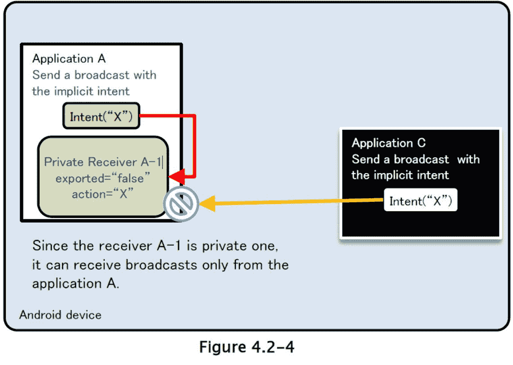

### 4.2.3 创建/使用广播接收器 高级话题

> 原书：[Android Application Secure Design/Secure Coding Guidebook](http://www.jssec.org/dl/android_securecoding_en.pdf)
> 
> 译者：[飞龙](https://github.com/wizardforcel)
> 
> 协议：[CC BY-NC-SA 4.0](http://creativecommons.org/licenses/by-nc-sa/4.0/)

#### 4.2.3.1 结合导出属性和意图过滤器设置（用于接收器）

表 4.2-3 展示了实现接收器时，导出设置和意图过滤器元素的允许的组合。 下面介绍为什么原则上禁止使用带有意图过滤器定义的`exported ="false"`。

表 4.2-3 可用与否，导出属性和意图过滤器元素的组合

| 导出属性的值 |  |  |
| --- | --- | --- |
|  | True | False |
| 意图过滤器已定义 | OK | 不使用 |
| 意图过滤器未定义 | OK | OK |

未指定接收器的导出属性时，接收器是否为公共的，取决于该接收器的意图过滤器的存在与否 [6]。但是，在本手册中，禁止将导出的属性设置为不确定的。 通常，如前所述，最好避免依赖任何给定 API 的默认行为的实现；此外，如果存在明确的方法（如导出属性）来启用重要的安全相关设置，那么使用这些方法总是一个好主意。

> [6] 如果意图过滤器已定义，接收器是公共的，否则是私有的。更多信息请参考 [https://developer.android.com/guide/topics/manifest/receiver-element.html#exported](https://developer.android.com/guide/topics/manifest/receiver-element.html#exported)。

即使在相同的应用中将广播发送到私有接收器，其他应用中的公共接收器也可能会意外调用。 这就是为什么禁止指定带有意图过滤器定义的`exported ="false"`。 以下两张图展示了意外调用的发生情况。

图 4.2-4 是一个正常行为的例子，隐式意图只能在同一个应用中调用私有接收器（应用 A）。 意图过滤器（在图中，`action ="X"`）仅在应用 A 中定义，所以这是预期的行为。



图 4.2-5 是个例子，应用 B 和应用 A 中都定义了意图过滤器（见图中的`action ="X"`）的。首先，当另一个应用（应用 C）通过 隐式意图发送广播，它们不被私有接收器（A-1）接收。 所以不会有任何安全问题。 （请参阅图中的橙色箭头标记。）从安全角度来看，问题是应用 A 对同一应用中的私有接收器的调用。 当应用 A 广播隐式意图时，不仅是相同应用中的私有接收器，而且具有相同意图过滤器定义的公共接收器（B-1）也可以接收意图。 （图中的红色箭头标记）。 在这种情况下，敏感信息可能会从应用 A 发送到 B。当应用 B 是恶意软件时，会导致敏感信息的泄漏。 当发送有序广播时，它可能会收到意外的结果信息。

然而，当广播接收器仅接收由系统发送的广播意图时，应使用带有意图过滤器定义的`exported="false"`。 其他组合不应使用。 这是基于这样一个事实，即系统发送的广播意图可以通过`exported="false"`来接收。 如果其他应用发送的意图的`ACTION`与系统发送的广播意图相同，则可能会通过接收它而导致意外行为。 但是，这可以通过指定`exported="false"`来防止。

#### 4.2.3.2 接收器在启动应用之前不会被注册

请务必注意，在`AndroidManifest.xml`中定义的静态广播接收器，在安装后不会自动启用 [7]。应用只有在第一次启动后才能接收广播；因此，安装后无法使用接收的广播作为启动操作的触发器。 但是，如果在发送广播时设置了`Intent.FLAG_INCLUDE_STOPPED_PACKAGES`标志，则即使是尚未第一次启动的应用也会收到该广播。

> [7] 在 3.0 之前的版本中，接收器可以通过安装 App 自动启动。

#### 4.2.3.3 私有广播接收器可以接收由相同 UID 发送的广播

应用

相同的 UID 可以提供给几个应用。 即使它是私有广播接收器，也可以接收从 UID 相同的应用发送的广播。 但是，这不会是一个安全问题。 由于可以确保 UID 相同的应用具有用于签署 APK 的一致的开发人员密钥。 这意味着私有广播接收器收到的广播，只是从内部应用发送的广播。

#### 4.2.3.4 广播的类型和特性

根据是否有序以及是否粘滞的组合，广播有四种类型。 要发送的广播类型基于广播发送方法而确定。 请注意，粘性广播在 Android 5.0（API Level 21）中已弃用。

| 类型 | 发送方法 | 是否有序 | 是否粘性 |
| --- | --- | --- | --- |
| 普通 | `sendBroadcast()` | 否 | 否 |
| 有序 | `sendOrderedBroadcast()` | 是 | 否 |
| 粘性 | `sendStickyBroadcast()` | 否 | 是 |
| 粘性有序 | `sendStickyOrderedBroadcast()` | 是 | 是 |

每个广播类型的特性描述如下：

| 类型 | 特性 |
| --- | --- |
| 普通 | 普通广播发送到可接收的广播接收器时消失。 广播由多个广播接收器同时接收。 这与有序广播有所不同。 广播被允许由特定的广播接收机接收。 |
| 有序 | 有序广播的特点是，可接收的广播接收器依次接收广播。 优先级较高的广播接收器较早收到。 当广播被传送到所有广播接收器或广播接收器调用`abortBroadcast()`，广播将消失。 广播被允许由声明了特定权限的广播接收器接收。 另外，广播接收器发送的结果信息，可以由发送者使用有序广播接收。 SMS 接收通知的广播（`SMS_RECEIVED`）是有序广播的代表性示例。 |
| 粘性 | 粘性广播不会消失并保留在系统中，然后调用`registerReceiver()`的应用可以稍后接收粘性广播。 由于粘性广播与其他广播不同，它不会自动消失。 因此，当不需要粘性广播时，需要显式调用`removeStickyBroadcast()`来删除粘滞广播。 此外，带有特定权限的受限的广播接收器无法接收广播。 电池状态变化通知的广播（`ACTION_BATTERY_CHANGED`）是粘性广播的代表性示例。 |
| 粘性有序 | 这是具有有序和粘性特征的广播。 与粘性广播相同，它不能仅仅允许带有特定权限的广播接收器接收广播。 |

从广播特性行为的角度来看，上表反过来排列在下面的表中。

| 广播的特征行为 | 普通 | 有序 | 粘性 | 粘性有序 |
| --- | --- | --- | --- | --- |
| 由权限限制的广播接收器可以接收广播 | OK | OK | - | - |
| 从广播接收器获得过程结果 | - | OK | - | OK |
| 使广播接收器按顺序处理广播 | - | OK | - | OK |
| 稍后收到已经发送的广播 | - | - | OK | OK |

#### 4.2.3.5 广播信息可能输出到`LogCat`

发送/接收的广播基本上不会输出到`LogCat`。 然而，缺少权限导致接收/发送方的错误时，将输出错误日志。 由广播发送的意图信息包含在错误日志中，因此在发生错误之后，需要注意，发送广播时，意图的信息显示在`LogCat`中。

发送方的缺少权限的错误：

```
W/ActivityManager(266): Permission Denial: broadcasting Intent { act=org.jssec.android.broadcastreceive
r.creating.action.MY_ACTION } from org.jssec.android.broadcast.sending (pid=4685, uid=10058) requires o
rg.jssec.android.permission.MY_PERMISSION due to receiver org.jssec.android.broadcastreceiver.creating/
org.jssec.android.broadcastreceiver.creating.CreatingType3Receiver
```

接收方的缺少权限的错误：

```
W/ActivityManager(275): Permission Denial: receiving Intent { act=org.jssec.android.broadcastreceiver.c
reating.action.MY_ACTION } to org.jssec.android.broadcastreceiver.creating requires org.jssec.android.p
ermission.MY_PERMISSION due to sender org.jssec.android.broadcast.sending (uid 10158)
```

#### 4.2.3.6 在主屏幕放置应用的快捷方式时，需要注意的东西

在下面的内容中，我们讨论了创建快捷方式时的一些需要注意的东西，它们用于从主屏幕启动应用，或者用于创建 URL 快捷方式，例如 Web 浏览器中的书签。 作为一个例子，我们考虑如下所示的实现。

在主屏幕放置应用的快捷方式：

```
Intent targetIntent = new Intent(this, TargetActivity.class);

// Intent to request shortcut creation

Intent intent = new Intent("com.android.launcher.action.INSTALL_SHORTCUT");
// Specify an Intent to be launched when the shortcut is tapped
intent.putExtra(Intent.EXTRA_SHORTCUT_INTENT, targetIntent);
Parcelable icon = Intent.ShortcutIconResource.fromContext(context, iconResource);
intent.putExtra(Intent.EXTRA_SHORTCUT_ICON_RESOURCE, icon);
intent.putExtra(Intent.EXTRA_SHORTCUT_NAME, title);
intent.putExtra("duplicate", false);

// Use Broadcast to send the system our request for shortcut creation
context.sendBroadcast(intent);
```

在由上面的代码片段发送的广播中，接收器是主屏幕应用，并且很难识别包名; 我们必须谨慎记住，这是一个向公共接收器传递的隐式意图。 因此，此片段发送的广播，可以被任何任意应用接收，包括恶意软件；因此，在意图中包含敏感信息可能会造成信息泄漏的风险。 特别重要的是要注意，在创建基于 URL 的快捷方式时，秘密信息可能包含在 URL 本身中。

作为对策，有必要遵循“4.2.1.2 公共广播接收器 - 接收/发送广播”中列出的要点，并确保传输的意图不包含敏感信息。