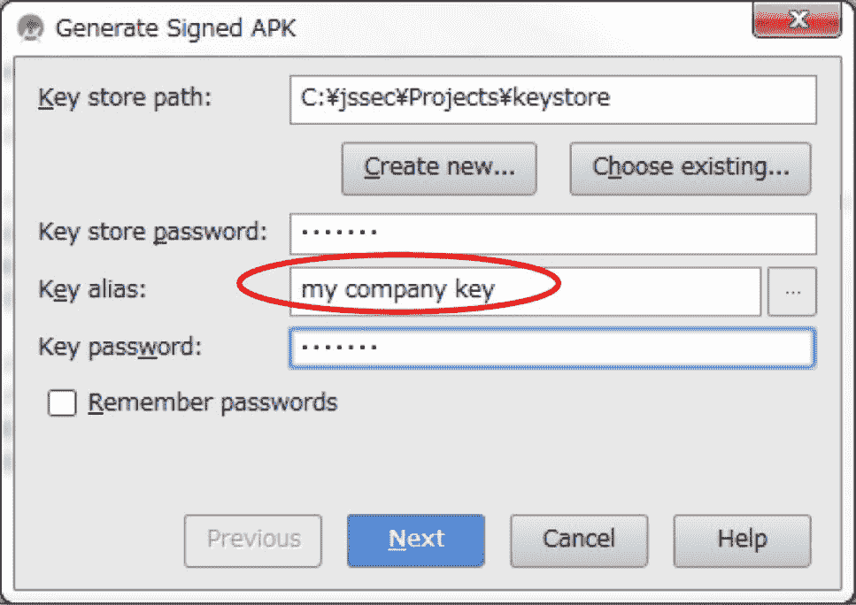

### 4.3.1 创建/使用内容供应器 示例代码

> 原书：[Android Application Secure Design/Secure Coding Guidebook](http://www.jssec.org/dl/android_securecoding_en.pdf)
> 
> 译者：[飞龙](https://github.com/wizardforcel)
> 
> 协议：[CC BY-NC-SA 4.0](http://creativecommons.org/licenses/by-nc-sa/4.0/)

使用内容供应器的风险和对策取决于内容供应器的使用方式。 在本节中，我们根据内容供应器的使用方式，对 5 种类型的内容供应器进行了分类。 您可以通过下面显示的图表，找出您应该创建哪种类型的内容供应器。

表 4.3-1 内容供应器类型定义

| 类型 | 定义 |
| --- | --- |
| 私有 | 不能由其他应用使用的内容供应器，所以是最安全的 |
| 公共 | 应该由未指定的大量应用使用的内容供应器 |
| 伙伴 | 只能由可信的伙伴公司开发的特定应用使用的内容供应器 |
| 内容 | 只能由其它内部应用使用的内容供应器 |
| 临时 | 基本上是私有内容供应器，但允许特定应用访问特定 URI |


#### 4.3.1.1 创建/使用私有内容供应器

私有内容供应器是只由单一应用使用的内容提供者，它是最安全的内容供应器 [8]。

下面展示了如何实现私有内容供应器的示例代码。

要点（创建内容供应器）：

1) 将导出属性显式设置为`false`。

2) 即使数据来自相同应用，也应该小心并安全地处理收到的请求数据。

3) 可以发送敏感信息，因为它在同一应用内发送和接收所有信息。

AndroidManifest.xml

```
<?xml version="1.0" encoding="utf-8"?>
<manifest xmlns:android="http://schemas.android.com/apk/res/android"
    package="org.jssec.android.provider.privateprovider">

    <application
        android:icon="@drawable/ic_launcher"
        android:label="@string/app_name" >
        <activity
            android:name=".PrivateUserActivity"
            android:label="@string/app_name"
            android:exported="true" >
            <intent-filter>
                <action android:name="android.intent.action.MAIN" />
                <category android:name="android.intent.category.LAUNCHER" />
            </intent-filter>
        </activity>

        <!-- *** POINT 1 *** Explicitly set the exported attribute to false. -->
        <provider
        android:name=".PrivateProvider"
        android:authorities="org.jssec.android.provider.privateprovider"
        android:exported="false" />
    </application>
</manifest>
```

PrivateProvider.java

```
package org.jssec.android.provider.privateprovider;

import android.content.ContentProvider;
import android.content.ContentUris;
import android.content.ContentValues;
import android.content.UriMatcher;
import android.database.Cursor;
import android.database.MatrixCursor;
import android.net.Uri;

public class PrivateProvider extends ContentProvider {

    public static final String AUTHORITY = "org.jssec.android.provider.privateprovider";
    public static final String CONTENT_TYPE = "vnd.android.cursor.dir/vnd.org.jssec.contenttype";
    public static final String CONTENT_ITEM_TYPE = "vnd.android.cursor.item/vnd.org.jssec.contenttype";
    // Expose the interface that the Content Provider provides.

    public interface Download {
        public static final String PATH = "downloads";
        public static final Uri CONTENT_URI = Uri.parse("content://" + AUTHORITY + "/" + PATH);
    }

    public interface Address {
        public static final String PATH = "addresses";
        public static final Uri CONTENT_URI = Uri.parse("content://" + AUTHORITY + "/" + PATH);
    }

    // UriMatcher
    private static final int DOWNLOADS_CODE = 1;
    private static final int DOWNLOADS_ID_CODE = 2;
    private static final int ADDRESSES_CODE = 3;
    private static final int ADDRESSES_ID_CODE = 4;
    private static UriMatcher sUriMatcher;

    static {
        sUriMatcher = new UriMatcher(UriMatcher.NO_MATCH);
        sUriMatcher.addURI(AUTHORITY, Download.PATH, DOWNLOADS_CODE);
        sUriMatcher.addURI(AUTHORITY, Download.PATH + "/#", DOWNLOADS_ID_CODE);
        sUriMatcher.addURI(AUTHORITY, Address.PATH, ADDRESSES_CODE);
        sUriMatcher.addURI(AUTHORITY, Address.PATH + "/#", ADDRESSES_ID_CODE);
    }

    // Since this is a sample program,
    // query method returns the following fixed result always without using database.
    private static MatrixCursor sAddressCursor = new MatrixCursor(new String[] { "_id", "city" });

    static {
        sAddressCursor.addRow(new String[] { "1", "New York" });
        sAddressCursor.addRow(new String[] { "2", "Longon" });
        sAddressCursor.addRow(new String[] { "3", "Paris" });
    }

    private static MatrixCursor sDownloadCursor = new MatrixCursor(new String[] { "_id", "path" });

    static {
        sDownloadCursor.addRow(new String[] { "1", "/sdcard/downloads/sample.jpg" });
        sDownloadCursor.addRow(new String[] { "2", "/sdcard/downloads/sample.txt" });
    }

    @Override
    public boolean onCreate() {
        return true;
    }

    @Override
    public String getType(Uri uri) {
        // *** POINT 2 *** Handle the received request data carefully and securely,
        // even though the data comes from the same application.
        // Here, whether uri is within expectations or not, is verified by UriMatcher#match() and switch case.
        // Checking for other parameters are omitted here, due to sample.
        // Please refer to "3.2 Handle Input Data Carefully and Securely."
        // *** POINT 3 *** Sensitive information can be sent since it is sending and receiving all within the same application.
        // However, the result of getType rarely has the sensitive meaning.
        switch (sUriMatcher.match(uri)) {
            case DOWNLOADS_CODE:
            case ADDRESSES_CODE:
                return CONTENT_TYPE;
            case DOWNLOADS_ID_CODE:
            case ADDRESSES_ID_CODE:
                return CONTENT_ITEM_TYPE;
            default:
                throw new IllegalArgumentException("Invalid URI:" + uri);
        }
    }

    @Override
    public Cursor query(Uri uri, String[] projection, String selection,
        String[] selectionArgs, String sortOrder) {
        // *** POINT 2 *** Handle the received request data carefully and securely,
        // even though the data comes from the same application.
        // Here, whether uri is within expectations or not, is verified by UriMatcher#match() and switch case.
        // Checking for other parameters are omitted here, due to sample.
        // Please refer to "3.2 Handle Input Data Carefully and Securely."
        // *** POINT 3 *** Sensitive information can be sent since it is sending and receiving all within the same application.
        // It depends on application whether the query result has sensitive meaning or not.
        switch (sUriMatcher.match(uri)) {
            case DOWNLOADS_CODE:
            case DOWNLOADS_ID_CODE:
                return sDownloadCursor;
            case ADDRESSES_CODE:
            case ADDRESSES_ID_CODE:
                return sAddressCursor;
            default:
                throw new IllegalArgumentException("Invalid URI:" + uri);
        }
    }

    @Override
    public Uri insert(Uri uri, ContentValues values) {
        // *** POINT 2 *** Handle the received request data carefully and securely,
        // even though the data comes from the same application.
        // Here, whether uri is within expectations or not, is verified by UriMatcher#match() and switch case.
        // Checking for other parameters are omitted here, due to sample.
        // Please refer to "3.2 Handle Input Data Carefully and Securely."
        // *** POINT 3 *** Sensitive information can be sent since it is sending and receiving all within the same application.
        // It depends on application whether the issued ID has sensitive meaning or not.
        switch (sUriMatcher.match(uri)) {
            case DOWNLOADS_CODE:
                return ContentUris.withAppendedId(Download.CONTENT_URI, 3);
            case ADDRESSES_CODE:
                return ContentUris.withAppendedId(Address.CONTENT_URI, 4);
            default:
                throw new IllegalArgumentException("Invalid URI:" + uri);
        }
    }

    @Override
    public int update(Uri uri, ContentValues values, String selection,
        String[] selectionArgs) {
        // *** POINT 2 *** Handle the received request data carefully and securely,
        // even though the data comes from the same application.
        // Here, whether uri is within expectations or not, is verified by UriMatcher#match() and switch case.
        // Checking for other parameters are omitted here, due to sample.
        // Please refer to "3.2 Handle Input Data Carefully and Securely."
        // *** POINT 3 *** Sensitive information can be sent since it is sending and receiving all within the same application.
        // It depends on application whether the number of updated records has sensitive meaning or not.
        switch (sUriMatcher.match(uri)) {
            case DOWNLOADS_CODE:
                return 5; // Return number of updated records
            case DOWNLOADS_ID_CODE:
                return 1;
            case ADDRESSES_CODE:
                return 15;
            case ADDRESSES_ID_CODE:
                return 1;
            default:
                throw new IllegalArgumentException("Invalid URI:" + uri);
        }
    }

    @Override
    public int delete(Uri uri, String selection, String[] selectionArgs) {
        // *** POINT 2 *** Handle the received request data carefully and securely,
        // even though the data comes from the same application.
        // Here, whether uri is within expectations or not, is verified by UriMatcher#match() and switch case.
        // Checking for other parameters are omitted here, due to sample.
        // Please refer to "3.2 Handle Input Data Carefully and Securely."
        // *** POINT 3 *** Sensitive information can be sent since it is sending and receiving all within the same application.
        // It depends on application whether the number of deleted records has sensitive meaning or not.
        switch (sUriMatcher.match(uri)) {
            case DOWNLOADS_CODE:
                return 10; // Return number of deleted records
            case DOWNLOADS_ID_CODE:
                return 1;
            case ADDRESSES_CODE:
                return 20;
            case ADDRESSES_ID_CODE:
                return 1;
            default:
                throw new IllegalArgumentException("Invalid URI:" + uri);
        }
    }

}
```

下面是活动的示例，它使用私有内容供应器。

要点（使用内容供应器）：

4) 敏感信息可以发送，因为目标供应器在相同应用中。

5) 小心和安全地处理收到的结果数据，即使数据来自相同应用。

PrivateUserActivity.java

```
package org.jssec.android.provider.privateprovider;

import android.app.Activity;
import android.database.Cursor;
import android.net.Uri;
import android.os.Bundle;
import android.view.View;
import android.widget.TextView;

public class PrivateUserActivity extends Activity {

    public void onQueryClick(View view) {
        logLine("[Query]");
        Cursor cursor = null;
        try {
            // *** POINT 4 *** Sensitive information can be sent since the destination provider is in the same application.
            cursor = getContentResolver().query(
                PrivateProvider.Download.CONTENT_URI, null, null, null, null);
            // *** POINT 5 *** Handle received result data carefully and securely,
            // even though the data comes from the same application.
            // Omitted, since this is a sample. Please refer to "3.2 Handling Input Data Carefully and Securely."
            if (cursor == null) {
                logLine(" null cursor");
            } else {
                boolean moved = cursor.moveToFirst();
                while (moved) {
                    logLine(String.format(" %d, %s", cursor.getInt(0), cursor.getString(1)));
                    moved = cursor.moveToNext();
                }
            }
        }
        finally {
            if (cursor != null) cursor.close();
        }
    }

    public void onInsertClick(View view) {
        logLine("[Insert]");
        // *** POINT 4 *** Sensitive information can be sent since the destination provider is in the same application.
        Uri uri = getContentResolver().insert(PrivateProvider.Download.CONTENT_URI, null);
        // *** POINT 5 *** Handle received result data carefully and securely,
        // even though the data comes from the same application.
        // Omitted, since this is a sample. Please refer to "3.2 Handling Input Data Carefully and Securely."
        logLine(" uri:" + uri);
    }

    public void onUpdateClick(View view) {
    logLine("[Update]");
        // *** POINT 4 *** Sensitive information can be sent since the destination provider is in the same application.
        int count = getContentResolver().update(PrivateProvider.Download.CONTENT_URI, null, null, null);
        // *** POINT 5 *** Handle received result data carefully and securely,
        // even though the data comes from the same application.
        // Omitted, since this is a sample. Please refer to "3.2 Handling Input Data Carefully and Securely."
        logLine(String.format(" %s records updated", count));
    }

    public void onDeleteClick(View view) {
    logLine("[Delete]");
        // *** POINT 4 *** Sensitive information can be sent since the destination provider is in the same application.
        int count = getContentResolver().delete(
        PrivateProvider.Download.CONTENT_URI, null, null);
        // *** POINT 5 *** Handle received result data carefully and securely,
        // even though the data comes from the same application.
        // Omitted, since this is a sample. Please refer to "3.2 Handling Input Data Carefully and Securely."
        logLine(String.format(" %s records deleted", count));
    }

    private TextView mLogView;

    @Override
    public void onCreate(Bundle savedInstanceState) {
        super.onCreate(savedInstanceState);
        setContentView(R.layout.main);
        mLogView = (TextView)findViewById(R.id.logview);
    }

    private void logLine(String line) {
        mLogView.append(line);
        mLogView.append("¥n");
    }
}
```

#### 4.3.1.2 创建/使用公共内容供应器

公共内容供应器是应该由未指定的大量应用使用的内容供应器。 需要注意的是，由于它不指定客户端，它可能会受到恶意软件的攻击和篡改。 例如，可以通过`select()`获取保存的数据，可以通过`update()`更改数据，或者可以通过`insert()`/ `delete()`插入/删除假数据。

另外，在使用 Android OS 未提供的自定义公共内容供应器时，需要注意的是，恶意软件可能会接收到请求参数，伪装成自定义公共内容供应器，并且也可能发送攻击数据。 Android OS 提供的联系人和 MediaStore 也是公共内容提供商，但恶意软件不能伪装成它们。

实现公共内容供应器的样例代码展示在下面：

要点（创建内容供应器）：

1) 将导出的属性显式设置为`true`。

2) 仔细安全地处理收到的请求数据。

3) 返回结果时，请勿包含敏感信息。

AndroidManifest.xml

```
<?xml version="1.0" encoding="utf-8"?>
<manifest xmlns:android="http://schemas.android.com/apk/res/android"
    package="org.jssec.android.provider.publicprovider">

    <application
        android:icon="@drawable/ic_launcher"
        android:label="@string/app_name" >

        <!-- *** POINT 1 *** Explicitly set the exported attribute to true. -->
        <provider
        android:name=".PublicProvider"
        android:authorities="org.jssec.android.provider.publicprovider"
        android:exported="true" />
    </application>
</manifest>
```

PublicProvider.java

```
package org.jssec.android.provider.publicprovider;

import android.content.ContentProvider;
import android.content.ContentUris;
import android.content.ContentValues;
import android.content.UriMatcher;
import android.database.Cursor;
import android.database.MatrixCursor;
import android.net.Uri;

public class PublicProvider extends ContentProvider {

    public static final String AUTHORITY = "org.jssec.android.provider.publicprovider";
    public static final String CONTENT_TYPE = "vnd.android.cursor.dir/vnd.org.jssec.contenttype";
    public static final String CONTENT_ITEM_TYPE = "vnd.android.cursor.item/vnd.org.jssec.contenttype";
    // Expose the interface that the Content Provider provides.

    public interface Download {
        public static final String PATH = "downloads";
        public static final Uri CONTENT_URI = Uri.parse("content://" + AUTHORITY + "/" + PATH);
    }

    public interface Address {
        public static final String PATH = "addresses";
        public static final Uri CONTENT_URI = Uri.parse("content://" + AUTHORITY + "/" + PATH);
    }

    // UriMatcher
    private static final int DOWNLOADS_CODE = 1;
    private static final int DOWNLOADS_ID_CODE = 2;
    private static final int ADDRESSES_CODE = 3;
    private static final int ADDRESSES_ID_CODE = 4;
    private static UriMatcher sUriMatcher;

    static {
        sUriMatcher = new UriMatcher(UriMatcher.NO_MATCH);
        sUriMatcher.addURI(AUTHORITY, Download.PATH, DOWNLOADS_CODE);
        sUriMatcher.addURI(AUTHORITY, Download.PATH + "/#", DOWNLOADS_ID_CODE);
        sUriMatcher.addURI(AUTHORITY, Address.PATH, ADDRESSES_CODE);
        sUriMatcher.addURI(AUTHORITY, Address.PATH + "/#", ADDRESSES_ID_CODE);
    }

    // Since this is a sample program,
    // query method returns the following fixed result always without using database.
    private static MatrixCursor sAddressCursor = new MatrixCursor(new String[] { "_id", "city" });

    static {
        sAddressCursor.addRow(new String[] { "1", "New York" });
        sAddressCursor.addRow(new String[] { "2", "London" });
        sAddressCursor.addRow(new String[] { "3", "Paris" });
    }

    private static MatrixCursor sDownloadCursor = new MatrixCursor(new String[] { "_id", "path" });

    static {
        sDownloadCursor.addRow(new String[] { "1", "/sdcard/downloads/sample.jpg" });
        sDownloadCursor.addRow(new String[] { "2", "/sdcard/downloads/sample.txt" });
    }

    @Override
    public boolean onCreate() {
        return true;
    }

    @Override
    public String getType(Uri uri) {
        switch (sUriMatcher.match(uri)) {
            case DOWNLOADS_CODE:
            case ADDRESSES_CODE:
                return CONTENT_TYPE;
            case DOWNLOADS_ID_CODE:
            case ADDRESSES_ID_CODE:
                return CONTENT_ITEM_TYPE;
            default:
                throw new IllegalArgumentException("Invalid URI:" + uri);
        }
    }

    @Override
    public Cursor query(Uri uri, String[] projection, String selection,
    String[] selectionArgs, String sortOrder) {
        // *** POINT 2 *** Handle the received request data carefully and securely.
        // Here, whether uri is within expectations or not, is verified by UriMatcher#match() and switch case.
        // Checking for other parameters are omitted here, due to sample.
        // Refer to "3.2 Handle Input Data Carefully and Securely."
        // *** POINT 3 *** When returning a result, do not include sensitive information.
        // It depends on application whether the query result has sensitive meaning or not.
        // If no problem when the information is taken by malware, it can be returned as result.
        switch (sUriMatcher.match(uri)) {
            case DOWNLOADS_CODE:
            case DOWNLOADS_ID_CODE:
                return sDownloadCursor;
            case ADDRESSES_CODE:
            case ADDRESSES_ID_CODE:
                return sAddressCursor;
            default:
                throw new IllegalArgumentException("Invalid URI:" + uri);
        }
    }

    @Override
    public Uri insert(Uri uri, ContentValues values) {
        // *** POINT 2 *** Handle the received request data carefully and securely.
        // Here, whether uri is within expectations or not, is verified by UriMatcher#match() and switch case.
        // Checking for other parameters are omitted here, due to sample.
        // Refer to "3.2 Handle Input Data Carefully and Securely."
        // *** POINT 3 *** When returning a result, do not include sensitive information.
        // It depends on application whether the issued ID has sensitive meaning or not.
        // If no problem when the information is taken by malware, it can be returned as result.
        switch (sUriMatcher.match(uri)) {
            case DOWNLOADS_CODE:
                return ContentUris.withAppendedId(Download.CONTENT_URI, 3);
            case ADDRESSES_CODE:
                return ContentUris.withAppendedId(Address.CONTENT_URI, 4);
            default:
                throw new IllegalArgumentException("Invalid URI:" + uri);
        }
    }

    @Override
    public int update(Uri uri, ContentValues values, String selection,
        String[] selectionArgs) {
        // *** POINT 2 *** Handle the received request data carefully and securely.
        // Here, whether uri is within expectations or not, is verified by UriMatcher#match() and switch case.
        // Checking for other parameters are omitted here, due to sample.
        // Refer to "3.2 Handle Input Data Carefully and Securely."
        // *** POINT 3 *** When returning a result, do not include sensitive information.
        // It depends on application whether the number of updated records has sensitive meaning or not.
        // If no problem when the information is taken by malware, it can be returned as result.
        switch (sUriMatcher.match(uri)) {
            case DOWNLOADS_CODE:
                return 5; // Return number of updated records
            case DOWNLOADS_ID_CODE:
                return 1;
            case ADDRESSES_CODE:
                return 15;
            case ADDRESSES_ID_CODE:
                return 1;
            default:
                throw new IllegalArgumentException("Invalid URI:" + uri);
        }
    }

    @Override
    public int delete(Uri uri, String selection, String[] selectionArgs) {
        // *** POINT 2 *** Handle the received request data carefully and securely.
        // Here, whether uri is within expectations or not, is verified by UriMatcher#match() and switch case.
        // Checking for other parameters are omitted here, due to sample.
        // Refer to "3.2 Handle Input Data Carefully and Securely."
        // *** POINT 3 *** When returning a result, do not include sensitive information.
        // It depends on application whether the number of deleted records has sensitive meaning or not.
        // If no problem when the information is taken by malware, it can be returned as result.
        switch (sUriMatcher.match(uri)) {
            case DOWNLOADS_CODE:
                return 10; // Return number of deleted records
            case DOWNLOADS_ID_CODE:
                return 1;
            case ADDRESSES_CODE:
                return 20;
            case ADDRESSES_ID_CODE:
                return 1;
            default:
                throw new IllegalArgumentException("Invalid URI:" + uri);
        }
    }
}
```

下面是使用公共内容供应器的活动示例。

要点（使用内容供应器）：

4) 不要发送敏感信息

5) 收到结果时，小心和安全地处理结果数据

PublicUserActivity.java

```
package org.jssec.android.provider.publicuser;

import android.app.Activity;
import android.content.ContentValues;
import android.content.pm.ProviderInfo;
import android.database.Cursor;
import android.net.Uri;
import android.os.Bundle;
import android.view.View;
import android.widget.TextView;

public class PublicUserActivity extends Activity {

    // Target Content Provider Information
    private static final String AUTHORITY = "org.jssec.android.provider.publicprovider";

    private interface Address {
        public static final String PATH = "addresses";
        public static final Uri CONTENT_URI = Uri.parse("content://" + AUTHORITY + "/" + PATH);
    }

    public void onQueryClick(View view) {
        logLine("[Query]");
        if (!providerExists(Address.CONTENT_URI)) {
            logLine(" Content Provider doesn't exist.");
            return;
        }
        Cursor cursor = null;
        try {
            // *** POINT 4 *** Do not send sensitive information.
            // since the target Content Provider may be malware.
            // If no problem when the information is taken by malware, it can be included in the request.
            cursor = getContentResolver().query(Address.CONTENT_URI, null, null, null, null);
            // *** POINT 5 *** When receiving a result, handle the result data carefully and securely.
            // Omitted, since this is a sample. Please refer to "3.2 Handling Input Data Carefully and Securely."
            if (cursor == null) {
                logLine(" null cursor");
            } else {
                boolean moved = cursor.moveToFirst();
                while (moved) {
                    logLine(String.format(" %d, %s", cursor.getInt(0), cursor.getString(1)));
                    moved = cursor.moveToNext();
                }
            }
        }
        finally {
            if (cursor != null) cursor.close();
        }
    }

    public void onInsertClick(View view) {
    logLine("[Insert]");
        if (!providerExists(Address.CONTENT_URI)) {
            logLine(" Content Provider doesn't exist.");
            return;
        }
        // *** POINT 4 *** Do not send sensitive information.
        // since the target Content Provider may be malware.
        // If no problem when the information is taken by malware, it can be included in the request.
        ContentValues values = new ContentValues();
        values.put("city", "Tokyo");
        Uri uri = getContentResolver().insert(Address.CONTENT_URI, values);
        // *** POINT 5 *** When receiving a result, handle the result data carefully and securely.
        // Omitted, since this is a sample. Please refer to "3.2 Handling Input Data Carefully and Securely."
        logLine(" uri:" + uri);
    }

    public void onUpdateClick(View view) {
    logLine("[Update]");
        if (!providerExists(Address.CONTENT_URI)) {
            logLine(" Content Provider doesn't exist.");
            return;
        }
        // *** POINT 4 *** Do not send sensitive information.
        // since the target Content Provider may be malware.
        // If no problem when the information is taken by malware, it can be included in the request.
        ContentValues values = new ContentValues();
        values.put("city", "Tokyo");
        String where = "_id = ?";
        String[] args = { "4" };
        int count = getContentResolver().update(Address.CONTENT_URI, values, where, args);
        // *** POINT 5 *** When receiving a result, handle the result data carefully and securely.
        // Omitted, since this is a sample. Please refer to "3.2 Handling Input Data Carefully and Securely."
        logLine(String.format(" %s records updated", count));
    }

    public void onDeleteClick(View view) {
    logLine("[Delete]");
        if (!providerExists(Address.CONTENT_URI)) {
            logLine(" Content Provider doesn't exist.");
            return;
        }
        // *** POINT 4 *** Do not send sensitive information.
        // since the target Content Provider may be malware.
        // If no problem when the information is taken by malware, it can be included in the request.
        int count = getContentResolver().delete(Address.CONTENT_URI, null, null);
        // *** POINT 5 *** When receiving a result, handle the result data carefully and securely.
        // Omitted, since this is a sample. Please refer to "3.2 Handling Input Data Carefully and Securely."
        logLine(String.format(" %s records deleted", count));
    }

    private boolean providerExists(Uri uri) {
        ProviderInfo pi = getPackageManager().resolveContentProvider(uri.getAuthority(), 0);
        return (pi != null);
    }

    private TextView mLogView;

    @Override
    public void onCreate(Bundle savedInstanceState) {
        super.onCreate(savedInstanceState);
        setContentView(R.layout.main);
        mLogView = (TextView)findViewById(R.id.logview);
    }

    private void logLine(String line) {
        mLogView.append(line);
        mLogView.append("¥n");
    }
}
```

#### 4.3.1.3 创建/使用伙伴内容供应器

合作伙伴内容供应器只能由特定应用使用。 该系统由伙伴公司的应用和内部应用组成，用于保护在伙伴应用和内部应用之间处理的信息和功能。

下面显示了用于实现伙伴内容供应器的示例代码。

要点（创建内容供应器）：

1) 将导出属性显式设置为`true`。

2) 验证请求应用的证书是否已在自己的白名单中注册。

3) 即使数据来自伙伴应用，也要小心并安全地处理收到的请求数据。

4) 可以返回开放给伙伴应用的信息。

AndroidManifest.xml

```
<?xml version="1.0" encoding="utf-8"?>
<manifest xmlns:android="http://schemas.android.com/apk/res/android"
    package="org.jssec.android.provider.partnerprovider">
    <application
        android:icon="@drawable/ic_launcher"
        android:label="@string/app_name" >
        <!-- *** POINT 1 *** Explicitly set the exported attribute to true. -->
        <provider
        android:name=".PartnerProvider"
        android:authorities="org.jssec.android.provider.partnerprovider"
        android:exported="true" />
    </application>
</manifest>
```

PartnerProvider.java

```
package org.jssec.android.provider.partnerprovider;

import java.util.List;
import org.jssec.android.shared.PkgCertWhitelists;
import org.jssec.android.shared.Utils;
import android.app.ActivityManager;
import android.app.ActivityManager.RunningAppProcessInfo;
import android.content.ContentProvider;
import android.content.ContentUris;
import android.content.ContentValues;
import android.content.Context;
import android.content.UriMatcher;
import android.database.Cursor;
import android.database.MatrixCursor;
import android.net.Uri;
import android.os.Binder;
import android.os.Build;

public class PartnerProvider extends ContentProvider {

    public static final String AUTHORITY = "org.jssec.android.provider.partnerprovider";
    public static final String CONTENT_TYPE = "vnd.android.cursor.dir/vnd.org.jssec.contenttype";
    public static final String CONTENT_ITEM_TYPE = "vnd.android.cursor.item/vnd.org.jssec.contenttype";
    // Expose the interface that the Content Provider provides.

    public interface Download {
        public static final String PATH = "downloads";
        public static final Uri CONTENT_URI = Uri.parse("content://" + AUTHORITY + "/" + PATH);
    }

    public interface Address {
    public static final String PATH = "addresses";
    public static final Uri CONTENT_URI = Uri.parse("content://" + AUTHORITY + "/" + PATH);
    }
    // UriMatcher
    private static final int DOWNLOADS_CODE = 1;
    private static final int DOWNLOADS_ID_CODE = 2;
    private static final int ADDRESSES_CODE = 3;
    private static final int ADDRESSES_ID_CODE = 4;
    private static UriMatcher sUriMatcher;

    static {
        sUriMatcher = new UriMatcher(UriMatcher.NO_MATCH);
        sUriMatcher.addURI(AUTHORITY, Download.PATH, DOWNLOADS_CODE);
        sUriMatcher.addURI(AUTHORITY, Download.PATH + "/#", DOWNLOADS_ID_CODE);
        sUriMatcher.addURI(AUTHORITY, Address.PATH, ADDRESSES_CODE);
        sUriMatcher.addURI(AUTHORITY, Address.PATH + "/#", ADDRESSES_ID_CODE);
    }

    // Since this is a sample program,
    // query method returns the following fixed result always without using database.
    private static MatrixCursor sAddressCursor = new MatrixCursor(new String[] { "_id", "city" });

    static {
        sAddressCursor.addRow(new String[] { "1", "New York" });
        sAddressCursor.addRow(new String[] { "2", "London" });
        sAddressCursor.addRow(new String[] { "3", "Paris" });
    }

    private static MatrixCursor sDownloadCursor = new MatrixCursor(new String[] { "_id", "path" });

    static {
        sDownloadCursor.addRow(new String[] { "1", "/sdcard/downloads/sample.jpg" });
        sDownloadCursor.addRow(new String[] { "2", "/sdcard/downloads/sample.txt" });
    }

    // *** POINT 2 *** Verify if the certificate of a requesting application has been registered in the
    own white list.
    private static PkgCertWhitelists sWhitelists = null;

    private static void buildWhitelists(Context context) {
        boolean isdebug = Utils.isDebuggable(context);
        sWhitelists = new PkgCertWhitelists();
        // Register certificate hash value of partner application org.jssec.android.provider.partneruser.
            sWhitelists.add("org.jssec.android.provider.partneruser", isdebug ?
            // Certificate hash value of "androiddebugkey" in the debug.keystore.
            "0EFB7236 328348A9 89718BAD DF57F544 D5CCB4AE B9DB34BC 1E29DD26 F77C8255" :
            // Certificate hash value of "partner key" in the keystore.
            "1F039BB5 7861C27A 3916C778 8E78CE00 690B3974 3EB8259F E2627B8D 4C0EC35A");
            // Register following other partner applications in the same way.
    }

    private static boolean checkPartner(Context context, String pkgname) {
        if (sWhitelists == null) buildWhitelists(context);
        return sWhitelists.test(context, pkgname);
    }

    // Get the package name of the calling application.
    private String getCallingPackage(Context context) {
        String pkgname;
        if (Build.VERSION.SDK_INT >= Build.VERSION_CODES.KITKAT) {
            pkgname = super.getCallingPackage();
        } else {
            pkgname = null;
            ActivityManager am = (ActivityManager) context.getSystemService(Context.ACTIVITY_SERVICE);
            List<RunningAppProcessInfo> procList = am.getRunningAppProcesses();
            int callingPid = Binder.getCallingPid();
            if (procList != null) {
                for (RunningAppProcessInfo proc : procList) {
                    if (proc.pid == callingPid) {
                        pkgname = proc.pkgList[proc.pkgList.length - 1];
                        break;
                    }
                }
            }
        }
        return pkgname;
    }

    @Override
    public boolean onCreate() {
        return true;
    }

    @Override
    public String getType(Uri uri) {
        switch (sUriMatcher.match(uri)) {
            case DOWNLOADS_CODE:
            case ADDRESSES_CODE:
                return CONTENT_TYPE;
            case DOWNLOADS_ID_CODE:
            case ADDRESSES_ID_CODE:
                return CONTENT_ITEM_TYPE;
            default:
                throw new IllegalArgumentException("Invalid URI:" + uri);
        }
    }

    @Override
    public Cursor query(Uri uri, String[] projection, String selection,
        String[] selectionArgs, String sortOrder) {
        // *** POINT 2 *** Verify if the certificate of a requesting application has been registered in the own white list.
        if (!checkPartner(getContext(), getCallingPackage(getContext()))) {
            throw new SecurityException("Calling application is not a partner application.");
        }
        // *** POINT 3 *** Handle the received request data carefully and securely,
        // even though the data comes from a partner application.
        // Here, whether uri is within expectations or not, is verified by UriMatcher#match() and switch case.
        // Checking for other parameters are omitted here, due to sample.
        // Refer to "3.2 Handle Input Data Carefully and Securely."
        // *** POINT 4 *** Information that is granted to disclose to partner applications can be returned.
        // It depends on application whether the query result can be disclosed or not.
        switch (sUriMatcher.match(uri)) {
            case DOWNLOADS_CODE:
            case DOWNLOADS_ID_CODE:
                return sDownloadCursor;
            case ADDRESSES_CODE:
            case ADDRESSES_ID_CODE:
                return sAddressCursor;
            default:
                throw new IllegalArgumentException("Invalid URI:" + uri);
        }
    }

    @Override
    public Uri insert(Uri uri, ContentValues values) {
        // *** POINT 2 *** Verify if the certificate of a requesting application has been registered in the own white list.
        if (!checkPartner(getContext(), getCallingPackage(getContext()))) {
            throw new SecurityException("Calling application is not a partner application.");
        }
        // *** POINT 3 *** Handle the received request data carefully and securely,
        // even though the data comes from a partner application.
        // Here, whether uri is within expectations or not, is verified by UriMatcher#match() and switch case.
        // Checking for other parameters are omitted here, due to sample.
        // Refer to "3.2 Handle Input Data Carefully and Securely."
        // *** POINT 4 *** Information that is granted to disclose to partner applications can be returned.
        // It depends on application whether the issued ID has sensitive meaning or not.
        switch (sUriMatcher.match(uri)) {
            case DOWNLOADS_CODE:
                return ContentUris.withAppendedId(Download.CONTENT_URI, 3);
            case ADDRESSES_CODE:
                return ContentUris.withAppendedId(Address.CONTENT_URI, 4);
            default:
                throw new IllegalArgumentException("Invalid URI:" + uri);
        }
    }

    @Override
    public int update(Uri uri, ContentValues values, String selection,
        String[] selectionArgs) {
        // *** POINT 2 *** Verify if the certificate of a requesting application has been registered in the own white list.
        if (!checkPartner(getContext(), getCallingPackage(getContext()))) {
            throw new SecurityException("Calling application is not a partner application.");
        }
        // *** POINT 3 *** Handle the received request data carefully and securely,
        // even though the data comes from a partner application.
        // Here, whether uri is within expectations or not, is verified by UriMatcher#match() and switch case.
        // Checking for other parameters are omitted here, due to sample.
        // Refer to "3.2 Handle Input Data Carefully and Securely."
        // *** POINT 4 *** Information that is granted to disclose to partner applications can be returned.
        // It depends on application whether the number of updated records has sensitive meaning or not.
        switch (sUriMatcher.match(uri)) {
            case DOWNLOADS_CODE:
                return 5; // Return number of updated records
            case DOWNLOADS_ID_CODE:
                return 1;
            case ADDRESSES_CODE:
                return 15;
            case ADDRESSES_ID_CODE:
                return 1;
            default:
                throw new IllegalArgumentException("Invalid URI:" + uri);
        }
    }

    @Override
    public int delete(Uri uri, String selection, String[] selectionArgs) {
        // *** POINT 2 *** Verify if the certificate of a requesting application has been registered in the own white list.
        if (!checkPartner(getContext(), getCallingPackage(getContext()))) {
            throw new SecurityException("Calling application is not a partner application.");
        }
        // *** POINT 3 *** Handle the received request data carefully and securely,
        // even though the data comes from a partner application.
        // Here, whether uri is within expectations or not, is verified by UriMatcher#match() and switch case.
        // Checking for other parameters are omitted here, due to sample.
        // Refer to "3.2 Handle Input Data Carefully and Securely."
        // *** POINT 4 *** Information that is granted to disclose to partner applications can be returned.
        // It depends on application whether the number of deleted records has sensitive meaning or not.
        switch (sUriMatcher.match(uri)) {
            case DOWNLOADS_CODE:
                return 10; // Return number of deleted records
            case DOWNLOADS_ID_CODE:
                return 1;
            case ADDRESSES_CODE:
                return 20;
            case ADDRESSES_ID_CODE:
                return 1;
            default:
                throw new IllegalArgumentException("Invalid URI:" + uri);
        }
    }
}
```

下面是使用伙伴内容供应器的活动示例：

要点（使用内容供应器）：

5) 验证目标应用的证书是否已在自己的白名单中注册。

6) 可以发送开放给伙伴应用的信息。

7) 即使数据来自伙伴应用，也要小心并安全地处理收到的结果数据。

PartnerActivity.java

```
package org.jssec.android.provider.partneruser;

import org.jssec.android.shared.PkgCertWhitelists;
import org.jssec.android.shared.Utils;
import android.app.Activity;
import android.content.ContentValues;
import android.content.Context;
import android.content.pm.ProviderInfo;
import android.database.Cursor;
import android.net.Uri;
import android.os.Bundle;
import android.view.View;
import android.widget.TextView;

public class PartnerUserActivity extends Activity {

    // Target Content Provider Information
    private static final String AUTHORITY = "org.jssec.android.provider.partnerprovider";

    private interface Address {
        public static final String PATH = "addresses";
        public static final Uri CONTENT_URI = Uri.parse("content://" + AUTHORITY + "/" + PATH);
    }

    // *** POINT 4 *** Verify if the certificate of the target application has been registered in the own white list.
    private static PkgCertWhitelists sWhitelists = null;

    private static void buildWhitelists(Context context) {
        boolean isdebug = Utils.isDebuggable(context);
        sWhitelists = new PkgCertWhitelists();
        // Register certificate hash value of partner application org.jssec.android.provider.partnerprovider.
        sWhitelists.add("org.jssec.android.provider.partnerprovider", isdebug ?
            // Certificate hash value of "androiddebugkey" in the debug.keystore.
            "0EFB7236 328348A9 89718BAD DF57F544 D5CCB4AE B9DB34BC 1E29DD26 F77C8255" :
            // Certificate hash value of "partner key" in the keystore.
            "D397D343 A5CBC10F 4EDDEB7C A10062DE 5690984F 1FB9E88B D7B3A7C2 42E142CA");
            // Register following other partner applications in the same way.
    }

    private static boolean checkPartner(Context context, String pkgname) {
        if (sWhitelists == null) buildWhitelists(context);
        return sWhitelists.test(context, pkgname);
    }

    // Get package name of target content provider.
    private String providerPkgname(Uri uri) {
        String pkgname = null;
        ProviderInfo pi = getPackageManager().resolveContentProvider(uri.getAuthority(), 0);
        if (pi != null) pkgname = pi.packageName;
        return pkgname;
    }

    public void onQueryClick(View view) {
        logLine("[Query]");
        // *** POINT 4 *** Verify if the certificate of the target application has been registered in the own white list.
        if (!checkPartner(this, providerPkgname(Address.CONTENT_URI))) {
            logLine(" The target content provider is not served by partner applications.");
            return;
        }
        Cursor cursor = null;
        try {
            // *** POINT 5 *** Information that is granted to disclose to partner applications can be sent.
            cursor = getContentResolver().query(Address.CONTENT_URI, null, null, null, null);
            // *** POINT 6 *** Handle the received result data carefully and securely,
            // even though the data comes from a partner application.
            // Omitted, since this is a sample. Please refer to "3.2 Handling Input Data Carefully and Securely."
            if (cursor == null) {
                logLine(" null cursor");
            } else {
                boolean moved = cursor.moveToFirst();
                while (moved) {
                    logLine(String.format(" %d, %s", cursor.getInt(0), cursor.getString(1)));
                    moved = cursor.moveToNext();
                }
            }
        }
        finally {
            if (cursor != null) cursor.close();
        }
    }

    public void onInsertClick(View view) {
        logLine("[Insert]");
        // *** POINT 4 *** Verify if the certificate of the target application has been registered in the own white list.
        if (!checkPartner(this, providerPkgname(Address.CONTENT_URI))) {
            logLine(" The target content provider is not served by partner applications.");
            return;
        }
        // *** POINT 5 *** Information that is granted to disclose to partner applications can be sent.
        ContentValues values = new ContentValues();
        values.put("city", "Tokyo");
        Uri uri = getContentResolver().insert(Address.CONTENT_URI, values);
        // *** POINT 6 *** Handle the received result data carefully and securely,
        // even though the data comes from a partner application.
        // Omitted, since this is a sample. Please refer to "3.2 Handling Input Data Carefully and Securely."
        logLine(" uri:" + uri);
    }

    public void onUpdateClick(View view) {
        logLine("[Update]");
        // *** POINT 4 *** Verify if the certificate of the target application has been registered in the own white list.
        if (!checkPartner(this, providerPkgname(Address.CONTENT_URI))) {
            logLine(" The target content provider is not served by partner applications.");
            return;
        }
        // *** POINT 5 *** Information that is granted to disclose to partner applications can be sent.
        ContentValues values = new ContentValues();
        values.put("city", "Tokyo");
        String where = "_id = ?";
        String[] args = { "4" };
        int count = getContentResolver().update(Address.CONTENT_URI, values, where, args);
        // *** POINT 6 *** Handle the received result data carefully and securely,
        // even though the data comes from a partner application.
        // Omitted, since this is a sample. Please refer to "3.2 Handling Input Data Carefully and Securely."
        logLine(String.format(" %s records updated", count));
    }

    public void onDeleteClick(View view) {
        logLine("[Delete]");
        // *** POINT 4 *** Verify if the certificate of the target application has been registered in the own white list.
        if (!checkPartner(this, providerPkgname(Address.CONTENT_URI))) {
            logLine(" The target content provider is not served by partner applications.");
            return;
        }
        // *** POINT 5 *** Information that is granted to disclose to partner applications can be sent.
        int count = getContentResolver().delete(Address.CONTENT_URI, null, null);
        // *** POINT 6 *** Handle the received result data carefully and securely,
        // even though the data comes from a partner application.
        // Omitted, since this is a sample. Please refer to "3.2 Handling Input Data Carefully and Securely."
        logLine(String.format(" %s records deleted", count));
    }

    private TextView mLogView;

    @Override
    public void onCreate(Bundle savedInstanceState) {
        super.onCreate(savedInstanceState);
        setContentView(R.layout.main);
        mLogView = (TextView)findViewById(R.id.logview);
    }

    private void logLine(String line) {
        mLogView.append(line);
        mLogView.append("¥n");
    }
}
```

PkgCertWhitelists.java

```
package org.jssec.android.shared;

import java.util.HashMap;
import java.util.Map;
import android.content.Context;

public class PkgCertWhitelists {

    private Map<String, String> mWhitelists = new HashMap<String, String>();

    public boolean add(String pkgname, String sha256) {
        if (pkgname == null) return false;
        if (sha256 == null) return false;
        sha256 = sha256.replaceAll(" ", "");
        if (sha256.length() != 64) return false; // SHA-256 -> 32 bytes -> 64 chars
        sha256 = sha256.toUpperCase();
        if (sha256.replaceAll("[0-9A-F]+", "").length() != 0) return false; // found non hex char
        mWhitelists.put(pkgname, sha256);
        return true;
    }

    public boolean test(Context ctx, String pkgname) {
        // Get the correct hash value which corresponds to pkgname.
        String correctHash = mWhitelists.get(pkgname);
        // Compare the actual hash value of pkgname with the correct hash value.
        return PkgCert.test(ctx, pkgname, correctHash);
    }
}
```

PkgCert.java

```
package org.jssec.android.shared;

import java.security.MessageDigest;
import java.security.NoSuchAlgorithmException;
import android.content.Context;
import android.content.pm.PackageInfo;
import android.content.pm.PackageManager;
import android.content.pm.PackageManager.NameNotFoundException;
import android.content.pm.Signature;

public class PkgCert {

    public static boolean test(Context ctx, String pkgname, String correctHash) {
        if (correctHash == null) return false;
        correctHash = correctHash.replaceAll(" ", "");
        return correctHash.equals(hash(ctx, pkgname));
    }

    public static String hash(Context ctx, String pkgname) {
        if (pkgname == null) return null;
        try {
            PackageManager pm = ctx.getPackageManager();
            PackageInfo pkginfo = pm.getPackageInfo(pkgname, PackageManager.GET_SIGNATURES);
            if (pkginfo.signatures.length != 1) return null; // Will not handle multiple signatures.
            Signature sig = pkginfo.signatures[0];
            byte[] cert = sig.toByteArray();
            byte[] sha256 = computeSha256(cert);
            return byte2hex(sha256);
        } catch (NameNotFoundException e) {
            return null;
        }
    }

    private static byte[] computeSha256(byte[] data) {
        try {
            return MessageDigest.getInstance("SHA-256").digest(data);
        } catch (NoSuchAlgorithmException e) {
            return null;
        }
    }

    private static String byte2hex(byte[] data) {
        if (data == null) return null;
        final StringBuilder hexadecimal = new StringBuilder();
        for (final byte b : data) {
            hexadecimal.append(String.format("%02X", b));
        }
        return hexadecimal.toString();
    }
}
```

#### 4.3.1.4 创建/使用内部内容供应器

内部内容供应器禁止除内部应用以外的应用使用。

下面展示了如何实现内部内容供应器的示例代码。

要点（创建内容供应器）：

1) 定义内部签名权限。

2) 需要内部签名权限。

3) 将导出属性显式设置为`true`。

4) 验证内部签名权限是否由内部应用定义。

5) 验证参数的安全性，即使这是来自内部应用的请求。

6) 由于请求应用是内部的，因此可以返回敏感信息。

7) 导出 APK 时，请使用与请求应用相同的开发者密钥对 APK 进行签名。

AndroidManifest.xml

```
<?xml version="1.0" encoding="utf-8"?>
<manifest xmlns:android="http://schemas.android.com/apk/res/android"
    package="org.jssec.android.provider.inhouseprovider">
    <!-- *** POINT 1 *** Define an in-house signature permission -->
    <permission
    android:name="org.jssec.android.provider.inhouseprovider.MY_PERMISSION"
    android:protectionLevel="signature" />
    <application
        android:icon="@drawable/ic_launcher"
        android:label="@string/app_name" >
        <!-- *** POINT 2 *** Require the in-house signature permission -->
        <!-- *** POINT 3 *** Explicitly set the exported attribute to true. -->
        <provider
        android:name=".InhouseProvider"
        android:authorities="org.jssec.android.provider.inhouseprovider"
        android:permission="org.jssec.android.provider.inhouseprovider.MY_PERMISSION"
        android:exported="true" />
    </application>
</manifest>
```

InhouseProvider.java

```
package org.jssec.android.provider.inhouseprovider;

import org.jssec.android.shared.SigPerm;
import org.jssec.android.shared.Utils;
import android.content.ContentProvider;
import android.content.ContentUris;
import android.content.ContentValues;
import android.content.Context;
import android.content.UriMatcher;
import android.database.Cursor;
import android.database.MatrixCursor;
import android.net.Uri;

public class InhouseProvider extends ContentProvider {

    public static final String AUTHORITY = "org.jssec.android.provider.inhouseprovider";
    public static final String CONTENT_TYPE = "vnd.android.cursor.dir/vnd.org.jssec.contenttype";
    public static final String CONTENT_ITEM_TYPE = "vnd.android.cursor.item/vnd.org.jssec.contenttype";
    // Expose the interface that the Content Provider provides.

    public interface Download {
        public static final String PATH = "downloads";
        public static final Uri CONTENT_URI = Uri.parse("content://" + AUTHORITY + "/" + PATH);
    }

    public interface Address {
        public static final String PATH = "addresses";
        public static final Uri CONTENT_URI = Uri.parse("content://" + AUTHORITY + "/" + PATH);
    }

    // UriMatcher
    private static final int DOWNLOADS_CODE = 1;
    private static final int DOWNLOADS_ID_CODE = 2;
    private static final int ADDRESSES_CODE = 3;
    private static final int ADDRESSES_ID_CODE = 4;
    private static UriMatcher sUriMatcher;

    static {
        sUriMatcher = new UriMatcher(UriMatcher.NO_MATCH);
        sUriMatcher.addURI(AUTHORITY, Download.PATH, DOWNLOADS_CODE);
        sUriMatcher.addURI(AUTHORITY, Download.PATH + "/#", DOWNLOADS_ID_CODE);
        sUriMatcher.addURI(AUTHORITY, Address.PATH, ADDRESSES_CODE);
        sUriMatcher.addURI(AUTHORITY, Address.PATH + "/#", ADDRESSES_ID_CODE);
    }

    // Since this is a sample program,
    // query method returns the following fixed result always without using database.
    private static MatrixCursor sAddressCursor = new MatrixCursor(new String[] { "_id", "city" });

    static {
        sAddressCursor.addRow(new String[] { "1", "New York" });
        sAddressCursor.addRow(new String[] { "2", "London" });
        sAddressCursor.addRow(new String[] { "3", "Paris" });
    }

    private static MatrixCursor sDownloadCursor = new MatrixCursor(new String[] { "_id", "path" });

    static {
        sDownloadCursor.addRow(new String[] { "1", "/sdcard/downloads/sample.jpg" });
        sDownloadCursor.addRow(new String[] { "2", "/sdcard/downloads/sample.txt" });
    }

    // In-house Signature Permission
    private static final String MY_PERMISSION = "org.jssec.android.provider.inhouseprovider.MY_PERMISSION";
    // In-house certificate hash value
    private static String sMyCertHash = null;

    private static String myCertHash(Context context) {
        if (sMyCertHash == null) {
            if (Utils.isDebuggable(context)) {
                // Certificate hash value of "androiddebugkey" in the debug.keystore.
                sMyCertHash = "0EFB7236 328348A9 89718BAD DF57F544 D5CCB4AE B9DB34BC 1E29DD26 F77C8255";
            } else {
                // Certificate hash value of "my company key" in the keystore.
                sMyCertHash = "D397D343 A5CBC10F 4EDDEB7C A10062DE 5690984F 1FB9E88B D7B3A7C2 42E142CA";
            }
        }
        return sMyCertHash;
    }

    @Override
    public boolean onCreate() {
        return true;
    }

    @Override
    public String getType(Uri uri) {
        switch (sUriMatcher.match(uri)) {
            case DOWNLOADS_CODE:
            case ADDRESSES_CODE:
                return CONTENT_TYPE;
            case DOWNLOADS_ID_CODE:
            case ADDRESSES_ID_CODE:
                return CONTENT_ITEM_TYPE;
            default:
                throw new IllegalArgumentException("Invalid URI:" + uri);
        }
    }

    @Override
    public Cursor query(Uri uri, String[] projection, String selection,
        String[] selectionArgs, String sortOrder) {
        // *** POINT 4 *** Verify if the in-house signature permission is defined by an in-house application.
        if (!SigPerm.test(getContext(), MY_PERMISSION, myCertHash(getContext()))) {
            throw new SecurityException("The in-house signature permission is not declared by in-house application.");
        }
        // *** POINT 5 *** Handle the received request data carefully and securely,
        // even though the data came from an in-house application.
        // Here, whether uri is within expectations or not, is verified by UriMatcher#match() and switch case.
        // Checking for other parameters are omitted here, due to sample.
        // Refer to "3.2 Handle Input Data Carefully and Securely."
        // *** POINT 6 *** Sensitive information can be returned since the requesting application is inhouse.
        // It depends on application whether the query result has sensitive meaning or not.
        switch (sUriMatcher.match(uri)) {
            case DOWNLOADS_CODE:
            case DOWNLOADS_ID_CODE:
                return sDownloadCursor;
            case ADDRESSES_CODE:
            case ADDRESSES_ID_CODE:
                return sAddressCursor;
            default:
                throw new IllegalArgumentException("Invalid URI:" + uri);
        }
    }

    @Override
    public Uri insert(Uri uri, ContentValues values) {
        // *** POINT 4 *** Verify if the in-house signature permission is defined by an in-house application.
        if (!SigPerm.test(getContext(), MY_PERMISSION, myCertHash(getContext()))) {
            throw new SecurityException("The in-house signature permission is not declared by in-house application.");
        }
        // *** POINT 5 *** Handle the received request data carefully and securely,
        // even though the data came from an in-house application.
        // Here, whether uri is within expectations or not, is verified by UriMatcher#match() and switch case.
        // Checking for other parameters are omitted here, due to sample.
        // Refer to "3.2 Handle Input Data Carefully and Securely."
        // *** POINT 6 *** Sensitive information can be returned since the requesting application is inhouse.
        // It depends on application whether the issued ID has sensitive meaning or not.
        switch (sUriMatcher.match(uri)) {
            case DOWNLOADS_CODE:
                return ContentUris.withAppendedId(Download.CONTENT_URI, 3);
            case ADDRESSES_CODE:
                return ContentUris.withAppendedId(Address.CONTENT_URI, 4);
            default:
                throw new IllegalArgumentException("Invalid URI:" + uri);
        }
    }

    @Override
    public int update(Uri uri, ContentValues values, String selection,
        String[] selectionArgs) {
        // *** POINT 4 *** Verify if the in-house signature permission is defined by an in-house application.
        if (!SigPerm.test(getContext(), MY_PERMISSION, myCertHash(getContext()))) {
            throw new SecurityException("The in-house signature permission is not declared by in-house application.");
        }
        // *** POINT 5 *** Handle the received request data carefully and securely,
        // even though the data came from an in-house application.
        // Here, whether uri is within expectations or not, is verified by UriMatcher#match() and switch case.
        // Checking for other parameters are omitted here, due to sample.
        // Refer to "3.2 Handle Input Data Carefully and Securely."
        // *** POINT 6 *** Sensitive information can be returned since the requesting application is inhouse.
        // It depends on application whether the number of updated records has sensitive meaning or not.
        switch (sUriMatcher.match(uri)) {
            case DOWNLOADS_CODE:
                return 5; // Return number of updated records
            case DOWNLOADS_ID_CODE:
                return 1;
            case ADDRESSES_CODE:
                return 15;
            case ADDRESSES_ID_CODE:
                return 1;
            default:
                throw new IllegalArgumentException("Invalid URI:" + uri);
        }
    }

    @Override
    public int delete(Uri uri, String selection, String[] selectionArgs) {
        // *** POINT 4 *** Verify if the in-house signature permission is defined by an in-house application.
        if (!SigPerm.test(getContext(), MY_PERMISSION, myCertHash(getContext()))) {
            throw new SecurityException("The in-house signature permission is not declared by in-house application.");
        }
        // *** POINT 5 *** Handle the received request data carefully and securely,
        // even though the data came from an in-house application.
        // Here, whether uri is within expectations or not, is verified by UriMatcher#match() and switch case.
        // Checking for other parameters are omitted here, due to sample.
        // Refer to "3.2 Handle Input Data Carefully and Securely."
        // *** POINT 6 *** Sensitive information can be returned since the requesting application is inhouse.
        // It depends on application whether the number of deleted records has sensitive meaning or not.
        switch (sUriMatcher.match(uri)) {
            case DOWNLOADS_CODE:
                return 10; // Return number of deleted records
            case DOWNLOADS_ID_CODE:
                return 1;
            case ADDRESSES_CODE:
                return 20;
            case ADDRESSES_ID_CODE:
                return 1;
            default:
                throw new IllegalArgumentException("Invalid URI:" + uri);
        }
    }
}
```

SigPerm.java

```
package org.jssec.android.shared;

import android.content.Context;
import android.content.pm.PackageManager;
import android.content.pm.PackageManager.NameNotFoundException;
import android.content.pm.PermissionInfo;

public class SigPerm {

    public static boolean test(Context ctx, String sigPermName, String correctHash) {
        if (correctHash == null) return false;
        correctHash = correctHash.replaceAll(" ", "");
        return correctHash.equals(hash(ctx, sigPermName));
    }

    public static String hash(Context ctx, String sigPermName) {
        if (sigPermName == null) return null;
        try {
            // Get the package name of the application which declares a permission named sigPermName.
            PackageManager pm = ctx.getPackageManager();
            PermissionInfo pi;
            pi = pm.getPermissionInfo(sigPermName, PackageManager.GET_META_DATA);
            String pkgname = pi.packageName;
            // Fail if the permission named sigPermName is not a Signature Permission
            if (pi.protectionLevel != PermissionInfo.PROTECTION_SIGNATURE) return null;
            // Return the certificate hash value of the application which declares a permission named sigPermName.
            return PkgCert.hash(ctx, pkgname);
        } catch (NameNotFoundException e) {
            return null;
        }
    }
}
```

PkgCert.java

```
package org.jssec.android.shared;

import java.security.MessageDigest;
import java.security.NoSuchAlgorithmException;
import android.content.Context;
import android.content.pm.PackageInfo;
import android.content.pm.PackageManager;
import android.content.pm.PackageManager.NameNotFoundException;
import android.content.pm.Signature;

public class PkgCert {

    public static boolean test(Context ctx, String pkgname, String correctHash) {
        if (correctHash == null) return false;
        correctHash = correctHash.replaceAll(" ", "");
        return correctHash.equals(hash(ctx, pkgname));
    }

    public static String hash(Context ctx, String pkgname) {
        if (pkgname == null) return null;
        try {
            PackageManager pm = ctx.getPackageManager();
            PackageInfo pkginfo = pm.getPackageInfo(pkgname, PackageManager.GET_SIGNATURES);
            if (pkginfo.signatures.length != 1) return null; // Will not handle multiple signatures.
            Signature sig = pkginfo.signatures[0];
            byte[] cert = sig.toByteArray();
            byte[] sha256 = computeSha256(cert);
            return byte2hex(sha256);
        } catch (NameNotFoundException e) {
            return null;
        }
    }

    private static byte[] computeSha256(byte[] data) {
        try {
            return MessageDigest.getInstance("SHA-256").digest(data);
        } catch (NoSuchAlgorithmException e) {
            return null;
        }
    }
    private static String byte2hex(byte[] data) {
        if (data == null) return null;
        final StringBuilder hexadecimal = new StringBuilder();
        for (final byte b : data) {
            hexadecimal.append(String.format("%02X", b));
        }
        return hexadecimal.toString();
    }
}
```

要点 7：导出 APK 时，请使用与请求应用相同的开发者密钥对 APK 进行签名。



下面是使用内部内容供应器的活动示例。

要点（使用内容个供应器）：

8) 声明使用内部签名权限。

9) 验证内部签名权限是否由内部应用定义。

10) 验证目标应用是否使用内部证书签名。

11) 由于目标应用是内部应用，因此可以发送敏感信息。

12) 即使数据来自内部应用，也要小心并安全地处理收到的结果数据。

13) 导出 APK 时，请使用与目标应用相同的开发人员密钥对 APK 进行签名。

AndroidManifest.xml

```
<?xml version="1.0" encoding="utf-8"?>
<manifest xmlns:android="http://schemas.android.com/apk/res/android"
    package="org.jssec.android.provider.inhouseuser">
    <!-- *** POINT 8 *** Declare to use the in-house signature permission. -->
    <uses-permission
    android:name="org.jssec.android.provider.inhouseprovider.MY_PERMISSION" />
    <application
        android:icon="@drawable/ic_launcher"
        android:label="@string/app_name" >
        <activity
            android:name=".InhouseUserActivity"
            android:label="@string/app_name"
            android:exported="true" >
            <intent-filter>
                <action android:name="android.intent.action.MAIN" />
                <category android:name="android.intent.category.LAUNCHER" />
            </intent-filter>
        </activity>
    </application>
</manifest>
```

InhouseUserActivity.java

```
package org.jssec.android.provider.inhouseuser;

import org.jssec.android.shared.PkgCert;
import org.jssec.android.shared.SigPerm;
import org.jssec.android.shared.Utils;
import android.app.Activity;
import android.content.ContentValues;
import android.content.Context;
import android.content.pm.PackageManager;
import android.content.pm.ProviderInfo;
import android.database.Cursor;
import android.net.Uri;
import android.os.Bundle;
import android.view.View;
import android.widget.TextView;

public class InhouseUserActivity extends Activity {

    // Target Content Provider Information
    private static final String AUTHORITY = "org.jssec.android.provider.inhouseprovider";

    private interface Address {
        public static final String PATH = "addresses";
        public static final Uri CONTENT_URI = Uri.parse("content://" + AUTHORITY + "/" + PATH);
    }

    // In-house Signature Permission
    private static final String MY_PERMISSION = "org.jssec.android.provider.inhouseprovider.MY_PERMISSION";
    // In-house certificate hash value
    private static String sMyCertHash = null;

    private static String myCertHash(Context context) {
        if (sMyCertHash == null) {
            if (Utils.isDebuggable(context)) {
                // Certificate hash value of "androiddebugkey" in the debug.keystore.
                sMyCertHash = "0EFB7236 328348A9 89718BAD DF57F544 D5CCB4AE B9DB34BC 1E29DD26 F77C8255";
            } else {
                // Certificate hash value of "my company key" in the keystore.
                sMyCertHash = "D397D343 A5CBC10F 4EDDEB7C A10062DE 5690984F 1FB9E88B D7B3A7C2 42E142CA";
            }
        }
        return sMyCertHash;
    }

    // Get package name of target content provider.
    private static String providerPkgname(Context context, Uri uri) {
        String pkgname = null;
        PackageManager pm = context.getPackageManager();
        ProviderInfo pi = pm.resolveContentProvider(uri.getAuthority(), 0);
        if (pi != null) pkgname = pi.packageName;
        return pkgname;
    }

    public void onQueryClick(View view) {
        logLine("[Query]");
        // *** POINT 9 *** Verify if the in-house signature permission is defined by an in-house application.
        if (!SigPerm.test(this, MY_PERMISSION, myCertHash(this))) {
            logLine(" The in-house signature permission is not declared by in-house application.");
            return;
        }
        // *** POINT 10 *** Verify if the destination application is signed with the in-house certificate.
        String pkgname = providerPkgname(this, Address.CONTENT_URI);
        if (!PkgCert.test(this, pkgname, myCertHash(this))) {
            logLine(" The target content provider is not served by in-house applications.");
            return;
        }
        Cursor cursor = null;
        try {
            // *** POINT 11 *** Sensitive information can be sent since the destination application is in-house one.
            cursor = getContentResolver().query(Address.CONTENT_URI, null, null, null, null);
            // *** POINT 12 *** Handle the received result data carefully and securely,
            // even though the data comes from an in-house application.
            // Omitted, since this is a sample. Please refer to "3.2 Handling Input Data Carefully and Securely."
                if (cursor == null) {
            logLine(" null cursor");
            } else {
                boolean moved = cursor.moveToFirst();
                while (moved) {
                    logLine(String.format(" %d, %s", cursor.getInt(0), cursor.getString(1)));
                    moved = cursor.moveToNext();
                }
            }
        } finally {
            if (cursor != null) cursor.close();
        }
    }

    public void onInsertClick(View view) {
        logLine("[Insert]");
        // *** POINT 9 *** Verify if the in-house signature permission is defined by an in-house application.
        String correctHash = myCertHash(this);
        if (!SigPerm.test(this, MY_PERMISSION, correctHash)) {
            logLine(" The in-house signature permission is not declared by in-house application.");
            return;
        }
        // *** POINT 10 *** Verify if the destination application is signed with the in-house certificate.
        String pkgname = providerPkgname(this, Address.CONTENT_URI);
        if (!PkgCert.test(this, pkgname, correctHash)) {
            logLine(" The target content provider is not served by in-house applications.");
            return;
        }
        // *** POINT 11 *** Sensitive information can be sent since the destination application is in-house one.
        ContentValues values = new ContentValues();
        values.put("city", "Tokyo");
        Uri uri = getContentResolver().insert(Address.CONTENT_URI, values);
        // *** POINT 12 *** Handle the received result data carefully and securely,
        // even though the data comes from an in-house application.
        // Omitted, since this is a sample. Please refer to "3.2 Handling Input Data Carefully and Securely."
        logLine(" uri:" + uri);
    }

    public void onUpdateClick(View view) {
        logLine("[Update]");
        // *** POINT 9 *** Verify if the in-house signature permission is defined by an in-house application.
        String correctHash = myCertHash(this);
        if (!SigPerm.test(this, MY_PERMISSION, correctHash)) {
            logLine(" The in-house signature permission is not declared by in-house application.");
            return;
        }
        // *** POINT 10 *** Verify if the destination application is signed with the in-house certificate.
        String pkgname = providerPkgname(this, Address.CONTENT_URI);
        if (!PkgCert.test(this, pkgname, correctHash)) {
            logLine(" The target content provider is not served by in-house applications.");
            return;
        }
        // *** POINT 11 *** Sensitive information can be sent since the destination application is in-house one.
        ContentValues values = new ContentValues();
        values.put("city", "Tokyo");
        String where = "_id = ?";
        String[] args = { "4" };
        int count = getContentResolver().update(Address.CONTENT_URI, values, where, args);
        // *** POINT 12 *** Handle the received result data carefully and securely,
        // even though the data comes from an in-house application.
        // Omitted, since this is a sample. Please refer to "3.2 Handling Input Data Carefully and Securely."
        logLine(String.format(" %s records updated", count));
    }

    public void onDeleteClick(View view) {
        logLine("[Delete]");
        // *** POINT 9 *** Verify if the in-house signature permission is defined by an in-house application.
        String correctHash = myCertHash(this);
        if (!SigPerm.test(this, MY_PERMISSION, correctHash)) {
            logLine(" The target content provider is not served by in-house applications.");
            return;
        }
        // *** POINT 10 *** Verify if the destination application is signed with the in-house certificat
        e.
        String pkgname = providerPkgname(this, Address.CONTENT_URI);
        if (!PkgCert.test(this, pkgname, correctHash)) {
            logLine(" The target content provider is not served by in-house applications.");
            return;
        }
        // *** POINT 11 *** Sensitive information can be sent since the destination application is in-ho
        use one.
        int count = getContentResolver().delete(Address.CONTENT_URI, null, null);
        // *** POINT 12 *** Handle the received result data carefully and securely,
        // even though the data comes from an in-house application.
        // Omitted, since this is a sample. Please refer to "3.2 Handling Input Data Carefully and Securely."
        logLine(String.format(" %s records deleted", count));
    }

    private TextView mLogView;

    @Override
    public void onCreate(Bundle savedInstanceState) {
        super.onCreate(savedInstanceState);
        setContentView(R.layout.main);
        mLogView = (TextView)findViewById(R.id.logview);
    }

    private void logLine(String line) {
        mLogView.append(line);
        mLogView.append("¥n");
    }
}
```

SigPerm.java

```
package org.jssec.android.shared;

import android.content.Context;
import android.content.pm.PackageManager;
import android.content.pm.PackageManager.NameNotFoundException;
import android.content.pm.PermissionInfo;

public class SigPerm {

    public static boolean test(Context ctx, String sigPermName, String correctHash) {
        if (correctHash == null) return false;
        correctHash = correctHash.replaceAll(" ", "");
        return correctHash.equals(hash(ctx, sigPermName));
    }

    public static String hash(Context ctx, String sigPermName) {
        if (sigPermName == null) return null;
        try {
            // Get the package name of the application which declares a permission named sigPermName.
            PackageManager pm = ctx.getPackageManager();
            PermissionInfo pi;
            pi = pm.getPermissionInfo(sigPermName, PackageManager.GET_META_DATA);
            String pkgname = pi.packageName;
            // Fail if the permission named sigPermName is not a Signature Permission
            if (pi.protectionLevel != PermissionInfo.PROTECTION_SIGNATURE) return null;
            // Return the certificate hash value of the application which declares a permission named sigPermName.
            return PkgCert.hash(ctx, pkgname);
        } catch (NameNotFoundException e) {
            return null;
        }
    }
}
```

PkgCert.java

```
package org.jssec.android.shared;

import java.security.MessageDigest;
import java.security.NoSuchAlgorithmException;
import android.content.Context;
import android.content.pm.PackageInfo;
import android.content.pm.PackageManager;
import android.content.pm.PackageManager.NameNotFoundException;
import android.content.pm.Signature;

public class PkgCert {

    public static boolean test(Context ctx, String pkgname, String correctHash) {
        if (correctHash == null) return false;
        correctHash = correctHash.replaceAll(" ", "");
        return correctHash.equals(hash(ctx, pkgname));
    }

    public static String hash(Context ctx, String pkgname) {
        if (pkgname == null) return null;
        try {
            PackageManager pm = ctx.getPackageManager();
            PackageInfo pkginfo = pm.getPackageInfo(pkgname, PackageManager.GET_SIGNATURES);
            if (pkginfo.signatures.length != 1) return null; // Will not handle multiple signatures.
            Signature sig = pkginfo.signatures[0];
            byte[] cert = sig.toByteArray();
            byte[] sha256 = computeSha256(cert);
            return byte2hex(sha256);
        } catch (NameNotFoundException e) {
            return null;
        }
    }

    private static byte[] computeSha256(byte[] data) {
        try {
            return MessageDigest.getInstance("SHA-256").digest(data);
        } catch (NoSuchAlgorithmException e) {
            return null;
        }
    }

    private static String byte2hex(byte[] data) {
        if (data == null) return null;
        final StringBuilder hexadecimal = new StringBuilder();
        for (final byte b : data) {
            hexadecimal.append(String.format("%02X", b));
        }
        return hexadecimal.toString();
    }
}
```

要点 13：导出 APK 时，请使用与请求应用相同的开发者密钥对 APK 进行签名。


#### 4.3.1.5 创建/使用临时内容供应器

临时内容供应器基本上是一个私有内容供应器，但它允许特定的应用访问特定的 URI。通过向目标应用发送一个指定了特殊标志的意图，即可为这些应用提供临时访问权限。内容供应器方的应用可以将访问权限主动授予其他应用，并且还可以将访问权限被动授予索要临时访问权限的应用。

下面展示了实现临时内容供应器的示例代码。

要点（创建内容供应器）：

1) 将导出属性显式设置为`false`。

2) 使用`grant-uri-permission`指定路径来临时授予访问权。

3) 即使数据来自临时访问应用，也应该消息并安全地处理收到的请求数据。

4) 可以返回公开给临时访问应用的信息。

5) 为意图指定 URI 来授予临时访问权。

6) 为意图指定访问权限来授予临时访问权。

7) 将显式意图发送给应用来授予临时访问权。

8) 将意图返回给请求临时访问权的应用。

AndroidManifest.xml

```
<?xml version="1.0" encoding="utf-8"?>
<manifest xmlns:android="http://schemas.android.com/apk/res/android"
    package="org.jssec.android.provider.temporaryprovider">
    <application
        android:icon="@drawable/ic_launcher"
        android:label="@string/app_name" >
        <activity
            android:name=".TemporaryActiveGrantActivity"
            android:label="@string/app_name"
            android:exported="true" >
            <intent-filter>
                <action android:name="android.intent.action.MAIN" />
                <category android:name="android.intent.category.LAUNCHER" />
            </intent-filter>
        </activity>
        <!-- Temporary Content Provider -->
        <!-- *** POINT 1 *** Explicitly set the exported attribute to false. -->
        <provider
            android:name=".TemporaryProvider"
            android:authorities="org.jssec.android.provider.temporaryprovider"
            android:exported="false" >
            <!-- *** POINT 2 *** Specify the path to grant access temporarily with the grant-uri-permissi
            on. -->
            <grant-uri-permission android:path="/addresses" />
        </provider>
        <activity
        android:name=".TemporaryPassiveGrantActivity"
        android:label="@string/app_name"
        android:exported="true" />
    </application>
</manifest>
```

TemporaryProvider.java

```
package org.jssec.android.provider.temporaryprovider;

import android.content.ContentProvider;
import android.content.ContentUris;
import android.content.ContentValues;
import android.content.UriMatcher;
import android.database.Cursor;
import android.database.MatrixCursor;
import android.net.Uri;

public class TemporaryProvider extends ContentProvider {

    public static final String AUTHORITIY = "org.jssec.android.provider.temporaryprovider";
    public static final String CONTENT_TYPE = "vnd.android.cursor.dir/vnd.org.jssec.contenttype";
    public static final String CONTENT_ITEM_TYPE = "vnd.android.cursor.item/vnd.org.jssec.contenttype";
    // Expose the interface that the Content Provider provides.

    public interface Download {
        public static final String PATH = "downloads";
        public static final Uri CONTENT_URI = Uri.parse("content://" + AUTHORITIY + "/" + PATH);
    }

    public interface Address {
        public static final String PATH = "addresses";
        public static final Uri CONTENT_URI = Uri.parse("content://" + AUTHORITIY + "/" + PATH);
    }

    // UriMatcher
    private static final int DOWNLOADS_CODE = 1;
    private static final int DOWNLOADS_ID_CODE = 2;
    private static final int ADDRESSES_CODE = 3;
    private static final int ADDRESSES_ID_CODE = 4;
    private static UriMatcher sUriMatcher;

    static {
        sUriMatcher = new UriMatcher(UriMatcher.NO_MATCH);
        sUriMatcher.addURI(AUTHORITIY, Download.PATH, DOWNLOADS_CODE);
        sUriMatcher.addURI(AUTHORITIY, Download.PATH + "/#", DOWNLOADS_ID_CODE);
        sUriMatcher.addURI(AUTHORITIY, Address.PATH, ADDRESSES_CODE);
        sUriMatcher.addURI(AUTHORITIY, Address.PATH + "/#", ADDRESSES_ID_CODE);
    }

    // Since this is a sample program,
    // query method returns the following fixed result always without using database.
    private static MatrixCursor sAddressCursor = new MatrixCursor(new String[] { "_id", "city" });

    static {
        sAddressCursor.addRow(new String[] { "1", "New York" });
        sAddressCursor.addRow(new String[] { "2", "London" });
        sAddressCursor.addRow(new String[] { "3", "Paris" });
    }

    private static MatrixCursor sDownloadCursor = new MatrixCursor(new String[] { "_id", "path" });

    static {
        sDownloadCursor.addRow(new String[] { "1", "/sdcard/downloads/sample.jpg" });
        sDownloadCursor.addRow(new String[] { "2", "/sdcard/downloads/sample.txt" });
    }

    @Override
    public boolean onCreate() {
        return true;
    }

    @Override
    public String getType(Uri uri) {
        switch (sUriMatcher.match(uri)) {
            case DOWNLOADS_CODE:
            case ADDRESSES_CODE:
                return CONTENT_TYPE;
            case DOWNLOADS_ID_CODE:
            case ADDRESSES_ID_CODE:
                return CONTENT_ITEM_TYPE;
            default:
                throw new IllegalArgumentException("Invalid URI:" + uri);
        }
    }

    @Override
    public Cursor query(Uri uri, String[] projection, String selection,
        String[] selectionArgs, String sortOrder) {
        // *** POINT 3 *** Handle the received request data carefully and securely,
        // even though the data comes from the application granted access temporarily.
        // Here, whether uri is within expectations or not, is verified by UriMatcher#match() and switch case.
        // Checking for other parameters are omitted here, due to sample.
        // Please refer to "3.2 Handle Input Data Carefully and Securely."
        // *** POINT 4 *** Information that is granted to disclose to the temporary access applications can be returned.
        // It depends on application whether the query result can be disclosed or not.
        switch (sUriMatcher.match(uri)) {
            case DOWNLOADS_CODE:
            case DOWNLOADS_ID_CODE:
                return sDownloadCursor;
            case ADDRESSES_CODE:
            case ADDRESSES_ID_CODE:
                return sAddressCursor;
            default:
                throw new IllegalArgumentException("Invalid URI:" + uri);
        }
    }

    @Override
    public Uri insert(Uri uri, ContentValues values) {
        // *** POINT 3 *** Handle the received request data carefully and securely,
        // even though the data comes from the application granted access temporarily.
        // Here, whether uri is within expectations or not, is verified by UriMatcher#match() and switch case.
        // Checking for other parameters are omitted here, due to sample.
        // Please refer to "3.2 Handle Input Data Carefully and Securely."
        // *** POINT 4 *** Information that is granted to disclose to the temporary access applications c
        an be returned.
        // It depends on application whether the issued ID has sensitive meaning or not.
        switch (sUriMatcher.match(uri)) {
            case DOWNLOADS_CODE:
                return ContentUris.withAppendedId(Download.CONTENT_URI, 3);
            case ADDRESSES_CODE:
                return ContentUris.withAppendedId(Address.CONTENT_URI, 4);
            default:
                throw new IllegalArgumentException("Invalid URI:" + uri);
        }
    }

    @Override
    public int update(Uri uri, ContentValues values, String selection,
        String[] selectionArgs) {
        // *** POINT 3 *** Handle the received request data carefully and securely,
        // even though the data comes from the application granted access temporarily.
        // Here, whether uri is within expectations or not, is verified by UriMatcher#match() and switch case.
        // Checking for other parameters are omitted here, due to sample.
        // Please refer to "3.2 Handle Input Data Carefully and Securely."
        // *** POINT 4 *** Information that is granted to disclose to the temporary access applications can be returned.
        // It depends on application whether the number of updated records has sensitive meaning or not.
        switch (sUriMatcher.match(uri)) {
            case DOWNLOADS_CODE:
                return 5; // Return number of updated records
            case DOWNLOADS_ID_CODE:
                return 1;
            case ADDRESSES_CODE:
                return 15;
            case ADDRESSES_ID_CODE:
                return 1;
            default:
                throw new IllegalArgumentException("Invalid URI:" + uri);
        }
    }

    @Override
    public int delete(Uri uri, String selection, String[] selectionArgs) {
        // *** POINT 3 *** Handle the received request data carefully and securely,
        // even though the data comes from the application granted access temporarily.
        // Here, whether uri is within expectations or not, is verified by UriMatcher#match() and switch case.
        // Checking for other parameters are omitted here, due to sample.
        // Please refer to "3.2 Handle Input Data Carefully and Securely."
        // *** POINT 4 *** Information that is granted to disclose to the temporary access applications can be returned.
        // It depends on application whether the number of deleted records has sensitive meaning or not.
        switch (sUriMatcher.match(uri)) {
            case DOWNLOADS_CODE:
                return 10; // Return number of deleted records
            case DOWNLOADS_ID_CODE:
                return 1;
            case ADDRESSES_CODE:
                return 20;
            case ADDRESSES_ID_CODE:
                return 1;
            default:
                throw new IllegalArgumentException("Invalid URI:" + uri);
        }
    }
}
```

TemporaryActiveGrantActivity.java

```
package org.jssec.android.provider.temporaryprovider;

import android.app.Activity;
import android.content.ActivityNotFoundException;
import android.content.Intent;
import android.os.Bundle;
import android.view.View;
import android.widget.Toast;

public class TemporaryActiveGrantActivity extends Activity {

    // User Activity Information
    private static final String TARGET_PACKAGE = "org.jssec.android.provider.temporaryuser";
    private static final String TARGET_ACTIVITY = "org.jssec.android.provider.temporaryuser.TemporaryUserActivity";

    @Override
    protected void onCreate(Bundle savedInstanceState) {
        super.onCreate(savedInstanceState);
        setContentView(R.layout.active_grant);
    }

    // In the case that Content Provider application grants access permission to other application actively.
    public void onSendClick(View view) {
        try {
            Intent intent = new Intent();
            // *** POINT 5 *** Specify URI for the intent to grant temporary access.
            intent.setData(TemporaryProvider.Address.CONTENT_URI);
            // *** POINT 6 *** Specify access rights for the intent to grant temporary access.
            intent.setFlags(Intent.FLAG_GRANT_READ_URI_PERMISSION);
            // *** POINT 7 *** Send the explicit intent to an application to grant temporary access.
            intent.setClassName(TARGET_PACKAGE, TARGET_ACTIVITY);
            startActivity(intent);
        } catch (ActivityNotFoundException e) {
            Toast.makeText(this, "User Activity not found.", Toast.LENGTH_LONG).show();
        }
    }
}
```

TemporaryPassiveGrantActivity.java

```
package org.jssec.android.provider.temporaryprovider;

import android.app.Activity;
import android.content.Intent;
import android.os.Bundle;
import android.view.View;

public class TemporaryPassiveGrantActivity extends Activity {

    @Override
    protected void onCreate(Bundle savedInstanceState) {
        super.onCreate(savedInstanceState);
        setContentView(R.layout.passive_grant);
    }

    // In the case that Content Provider application passively grants access permission
    // to the application that requested Content Provider access.
    public void onGrantClick(View view) {
        Intent intent = new Intent();
        // *** POINT 5 *** Specify URI for the intent to grant temporary access.
        intent.setData(TemporaryProvider.Address.CONTENT_URI);
        // *** POINT 6 *** Specify access rights for the intent to grant temporary access.
        intent.setFlags(Intent.FLAG_GRANT_READ_URI_PERMISSION);
        // *** POINT 8 *** Return the intent to the application that requests temporary access.
        setResult(Activity.RESULT_OK, intent);
        finish();
    }

    public void onCloseClick(View view) {
        finish();
    }
}
```

下面是临时内容供应器的示例。

要点（使用内容供应器）：

9) 不要发送敏感信息。

10) 收到结果时，小心并安全地处理结果数据。

TemporaryUserActivity.java

```
package org.jssec.android.provider.temporaryuser;

import android.app.Activity;
import android.content.ActivityNotFoundException;
import android.content.Intent;
import android.content.pm.ProviderInfo;
import android.database.Cursor;
import android.net.Uri;
import android.os.Bundle;
import android.view.View;
import android.widget.TextView;

public class TemporaryUserActivity extends Activity {

    // Information of the Content Provider's Activity to request temporary content provider access.
    private static final String TARGET_PACKAGE = "org.jssec.android.provider.temporaryprovider";
    private static final String TARGET_ACTIVITY = "org.jssec.android.provider.temporaryprovider.TemporaryPassiveGrantActivity";
    // Target Content Provider Information
    private static final String AUTHORITY = "org.jssec.android.provider.temporaryprovider";

    private interface Address {
        public static final String PATH = "addresses";
        public static final Uri CONTENT_URI = Uri.parse("content://" + AUTHORITY + "/" + PATH);
    }

    private static final int REQUEST_CODE = 1;

    public void onQueryClick(View view) {
        logLine("[Query]");
        Cursor cursor = null;
        try {
            if (!providerExists(Address.CONTENT_URI)) {
                logLine(" Content Provider doesn't exist.");
                return;
            }
            // *** POINT 9 *** Do not send sensitive information.
            // If no problem when the information is taken by malware, it can be included in the request.
            cursor = getContentResolver().query(Address.CONTENT_URI, null, null, null, null);
            // *** POINT 10 *** When receiving a result, handle the result data carefully and securely.
            // Omitted, since this is a sample. Please refer to "3.2 Handling Input Data Carefully and Securely."
            if (cursor == null) {
                logLine(" null cursor");
            } else {
                boolean moved = cursor.moveToFirst();
                while (moved) {
                    logLine(String.format(" %d, %s", cursor.getInt(0), cursor.getString(1)));
                    moved = cursor.moveToNext();
                }
            }
        } catch (SecurityException ex) {
            logLine(" Exception:" + ex.getMessage());
        }
        finally {
            if (cursor != null) cursor.close();
        }
    }

    // In the case that this application requests temporary access to the Content Provider
    // and the Content Provider passively grants temporary access permission to this application.
    public void onGrantRequestClick(View view) {
        Intent intent = new Intent();
        intent.setClassName(TARGET_PACKAGE, TARGET_ACTIVITY);
        try {
            startActivityForResult(intent, REQUEST_CODE);
        } catch (ActivityNotFoundException e) {
            logLine("Content Provider's Activity not found.");
        }
    }

    private boolean providerExists(Uri uri) {
        ProviderInfo pi = getPackageManager().resolveContentProvider(uri.getAuthority(), 0);
        return (pi != null);
    }

    private TextView mLogView;

    // In the case that the Content Provider application grants temporary access
    // to this application actively.
    @Override
    public void onCreate(Bundle savedInstanceState) {
        super.onCreate(savedInstanceState);
        setContentView(R.layout.main);
        mLogView = (TextView)findViewById(R.id.logview);
    }

    private void logLine(String line) {
        mLogView.append(line);
        mLogView.append("¥n");
    }
}
```