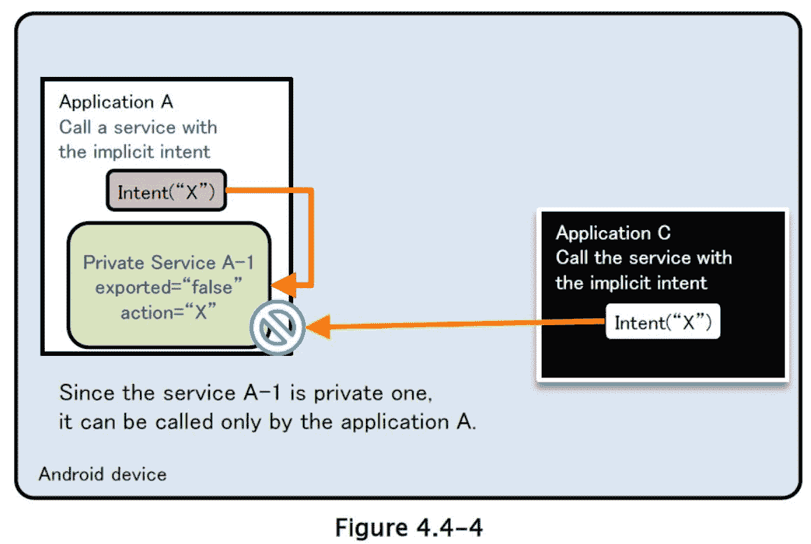
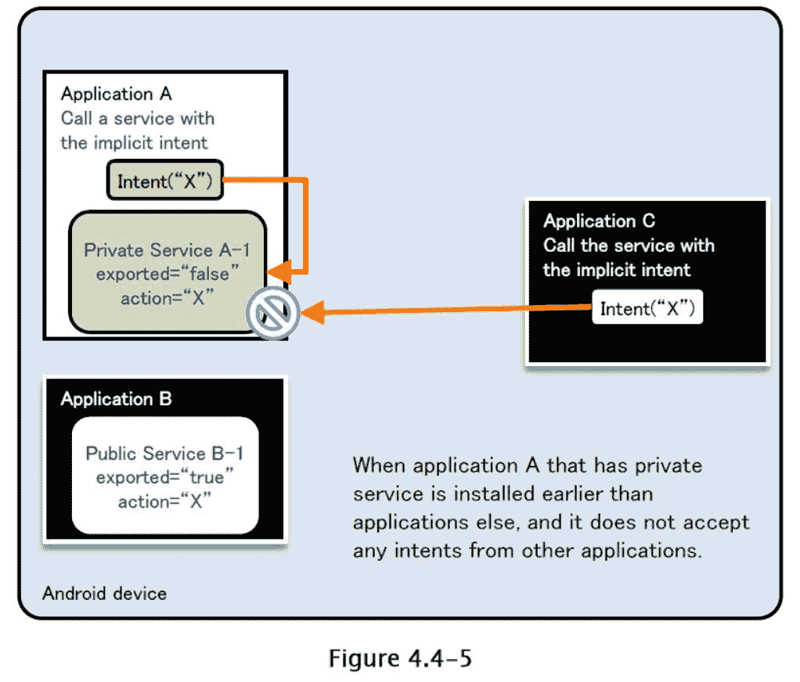
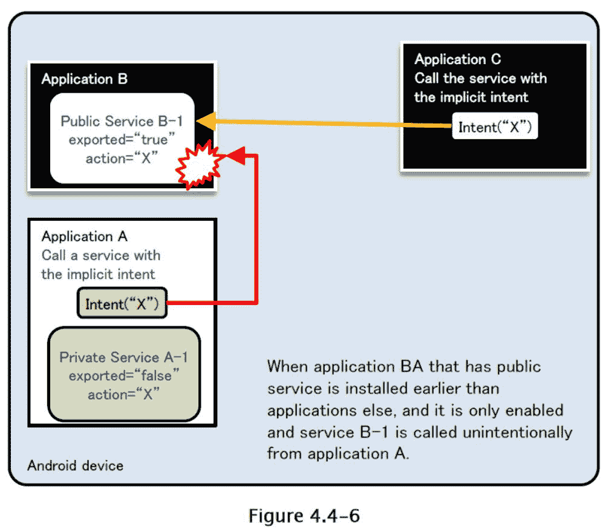

### 安卓应用安全指南 4.4.3 创建/使用服务高级话题

> 原书：[Android Application Secure Design/Secure Coding Guidebook](http://www.jssec.org/dl/android_securecoding_en.pdf)
> 
> 译者：[飞龙](https://github.com/wizardforcel)
> 
> 协议：[CC BY-NC-SA 4.0](http://creativecommons.org/licenses/by-nc-sa/4.0/)

#### 4.4.3.1 导出属性和意图过滤器设置的组合（在服务情况下）

我们已经本指南中解释了如何在实现四种服务类型：私有服务，公共服务，伙伴服务和内部服务。 下表中定义了每种导出属性类型的许可设置，以及`intent-filter`元素的各种组合，它们`AndroidManifest.xml`文件中定义。 请验证导出属性和`intent-filter`元素与你尝试创建的服务的兼容性。

表 4.4-3

| 导出属性的值 |  |  |
| --- | --- | --- |
|  | True | False |
| 意图过滤器已定义 | 公共 | （不使用） |
| 意图过滤器未定义 | 公共，伙伴，内部 | 私有 |

如果服务中的导出属性是未指定的，服务是否公开由是否定义了意图过滤器决定 [9]；但是，在本指南中，禁止将服务的导出属性设置为未指定。 通常，如前所述，最好避免依赖任何给定 API 的默认行为的实现; 此外，如果存在显式方法来配置重要的安全相关设置，例如导出属性，那么使用这些方法总是一个好主意。

> [9] 如果定义了任何意图过滤器，服务是公开的，否则是私有的。更多信息请见 [https://developer.android.com/guide/topics/manifest/service-element.html#exported](https://developer.android.com/guide/topics/manifest/service-element.html#exported)。

不应该使用未定义的意图过滤器和导出属性`false`的原因是，Android 的行为存在漏洞，并且由于意图过滤器的工作原理，可能会意外调用其他应用的服务。

具体而言，Android 的行为如下，因此在设计应用时需要仔细考虑。

*   当多个服务定义了相同的意图过滤器内容时，更早安装的应用中的服务是优先的。
*   如果使用显式意图，则优先的服务将被自动选择并由 OS 调用。

以下三张图描述了一个系统，由于 Android 行为而发生意外调用的。 图 4.4-4 是一个正常行为的例子，私有服务（应用 A）只能由同一个应用通过隐式意图调用。 因为只有应用 A 定义了意图过滤器（图中的`action ="X"`），所以它的行为正常。 这是正常的行为。

图 4.4-5 和图 4.4-6 展示了一个情景，其中应用 B 和应用 A 中定义了相同的意图过滤器（`action ="X"`）。

图 4.4-5 展示了应用按`A -> B`的顺序安装。在这种情况下，当应用 C 发送隐式意图时，私有服务（A-1）调用失败。 另一方面，由于应用 A 可以通过隐式意图，按照预期成功调用应用内的私有服务，因此在安全性（恶意软件的对策）方面不会有任何问题。

图 4.4-6 展示了一个场景，应用以`B->A`的顺序安装。 就安全性而言，这里存在一个问题，应用 A 尝试通过发送隐式意图来，调用应用中的私有服务，但实际上调用了之前安装的应用 B 中的公共活动（B-1）。 由于这个漏洞，敏感信息可能会从应用 A 发送到应用 B。 如果应用 B 是恶意软件，它会导致敏感信息的泄漏。

如上所示，使用意图过滤器向私有服务发送隐式意图，可能会导致意外行为，因此最好避免此设置。

#### 4.4.3.2 如何实现服务

由于实现服务的方法是多种多样的，应该按安全类型进行选择，它由示例代码分类，本文对各个特性进行了简要说明。 它大致分为使用`startService`和使用`bindService`的情况。 还可以创建在`startService`和`bindService`中都可以使用的服务。 应该调查以下项目来确定服务的实现方法。

*   是否将服务公开给其他应用（服务的公开）
*   是否在运行中交换数据（相互发送/接收数据）
*   是否控制服务（启动或完成）
*   是否作为另一个进程执行（进程间通信）
*   是否并行执行多个进程（并行进程）

表 4.4-3 显示了每个条目的实现方法类别和可行性。 “NG”代表不可能的情况，或者需要另一个框架的情况，它与所提供的函数不同。

表 4.4-4 服务的实现方法分类

| 类别 | 服务公开 | 相互发送/接收数据 | 控制服务 | 进程间通信 | 并行进程 |
| --- | --- | --- | --- | --- | --- |
| `startService`类型 | OK | NG | OK | OK | NG |
| `IntentService`类型 | OK | NG | NG | OK | NG |
| 本地绑定类型 | NG | OK | OK | NG | NG |
| `Messenger`绑定类型 | OK | OK | OK | OK | NG |
| AIDL 绑定类型 | OK | OK | OK | OK | OK |

`startService`类型

这是最基本的服务。 它继承了`Service`类，并通过`onStartCommand`执行过程。

在用户方，服务由意图指定，并通过`startService`调用。 由于结果等数据无法直接返回给源意图，因此应与其他方法（如广播）结合使用。 具体示例请参考“4.4.1.1 创建/使用私有服务”。

安全性检查应该由`onStartCommand`完成，但不能用于伙伴服务，因为无法获取来源的软件包名称。

`IntentService`类型

`IntentService`是通过继承`Service`创建的类。 调用方法与`startService`类型相同。 以下是与标准服务（`startService`类型）相比较的特征。

*   意图的处理由`onHandleIntent`完成（不使用`onStartCommand`）。
*   由另一个线程执行。
*   过程将排队。

由于过程是由另一个线程执行的，因此调用会立即返回，并且面向意图的过程由队列系统顺序执行。 每个意图并不是并行处理的，但根据产品的要求，它也可以作为选项来选择，来简化实现。由于结果等数据不能返回给源意图，因此应该与其他方法（如广播）结合使用。 具体实例请参考“4.4.1.2 创建/使用公共服务”。

安全性检查应该由`onHandleIntent`来完成，但不能用于伙伴服务，因为无法获取来源的包名称。

本地绑定类型

这是一种实现本地服务的方法，它仅工作在与应用相同的过程中。 将类定义为从`Binder`类派生的类，并准备将`Service`中实现的特性（方法）提供给调用方。

在用户方，服务由意图指定并使用`bindService`调用。 这是绑定服务的所有方法中最简单的实现，但它的用途有限，因为它不能被其他进程启动，并且服务也不能公开。 具体实现示例，请参阅示例代码中包含的项目“`PrivateServiceLocalBind`服务”。

从安全角度来看，只能实现私有服务。

`Messenger`绑定类型

这是一种方法，通过使用`Messenger`系统来实现与服务的链接。

由于`Messenger`可以提供为来自服务用户方的`Message`目标，因此可以相对容易地实现数据交换。 另外，由于过程要进行排队，因此它具有“线程安全”的特性。每个过程不可能并行，但根据产品的要求，它也可以作为选项来选择，来简化实现。 在用户端，服务由意图指定，通过`bindService`调用，具体实现示例请参见“4.4.1.4 创建/使用内部服务”。

安全检查需要在`onBind`或`Message Handler`中进行，但不能 用于伙伴服务，因为无法获取来源的包名称。

AIDL 绑定类型

这是一种方法，通过使用 AIDL 系统实现与服务的链接。 接口通过 AIDL 定义，并将服务拥有的特性提供为方法。 另外，回调也可以通过在用户端实现由 AIDL 定义的接口来实现，多线程调用是可能的，但有必要在服务端明确实现互斥。

用户端可以通过指定意图并使用`bindService`来调用服务。 具体实现示例请参考“4.4.1.3 创建/使用伙伴服务”。

安全性检查必须在`onBind`中为内部服务执行，以及由 AIDL 为伙伴服务定义的接口的每种方法执行。

这可以用于本指南中描述的所有安全类型的服务。