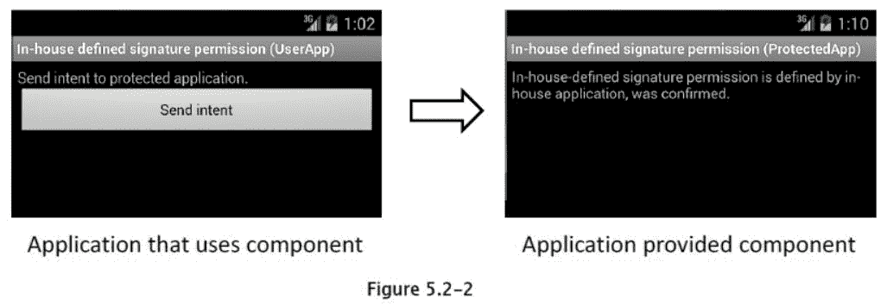
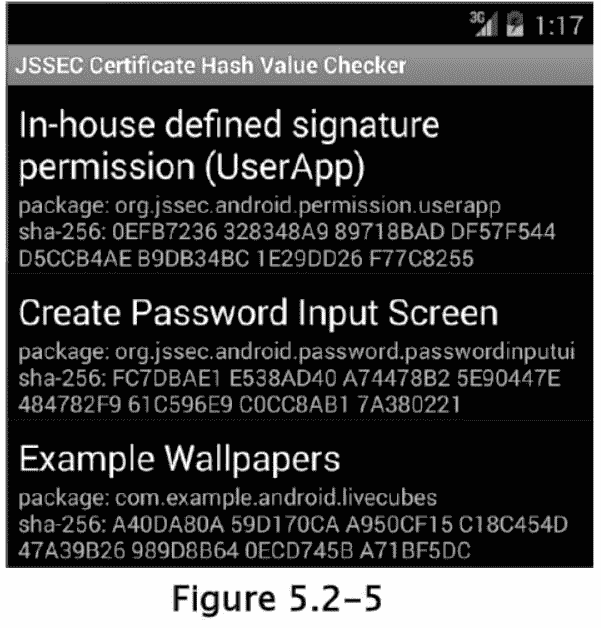

### 5.2.1 权限和保护级别 示例代码

> 原书：[Android Application Secure Design/Secure Coding Guidebook](http://www.jssec.org/dl/android_securecoding_en.pdf)
> 
> 译者：[飞龙](https://github.com/wizardforcel)
> 
> 协议：[CC BY-NC-SA 4.0](http://creativecommons.org/licenses/by-nc-sa/4.0/)

#### 5.2.1.1 如何使用 Android OS 的系统权限

Android 操作系统有一个称为“权限”的安全机制，可以保护其用户的资产（如联系人和 GPS 功能）免受恶意软件的侵害。 当应用请求访问受 Android OS 保护的信息或功能时，应用需要显式声明权限才能访问它们。 安装应用，它申请需要用户同意的权限时，会出现以下确认界面 [23]。

> [23] 在 Android 6.0（API Level 23）及更高版本中，安装应用时不会发生用户的权限授予或拒绝，而是在应用请求权限时在运行时发生。 更多详细信息，请参见“5.2.1.4 在 Android 6.0 及更高版本中使用危险权限的方法”和“5.2.3.6 Android 6.0 和更高版本中的权限模型规范的修改”部分。


从该确认界面中，用户能够知道，应用试图访问哪些类型的特征或信息。 如果应用试图访问明显不需要的功能或信息，那么该应用很可能是恶意软件。 因此，为了使你的应用不被怀疑是恶意软件，因此需要尽量减少使用权限声明。

要点：

1.  使用`uses-permission`声明应用中使用的权限。
2.  不要用`uses-permission`声明任何不必要的权限。

AndroidManifest.xml

```
<?xml version="1.0" encoding="utf-8"?>
<manifest xmlns:android="http://schemas.android.com/apk/res/android"
    package="org.jssec.android.permission.usespermission" >
    <!-- *** POINT 1 *** Declare a permission used in an application with uses-permission -->
    <!-- Permission to access Internet -->
    <uses-permission android:name="android.permission.INTERNET"/>
    <!-- *** POINT 2 *** Do not declare any unnecessary permissions with uses-permission -->
    <!-- If declaring to use Permission that is unnecessary for application behaviors, it gives users a
    sense of distrust. -->
    <application
        android:allowBackup="false"
        android:icon="@drawable/ic_launcher"
        android:label="@string/app_name" >
        <activity
            android:name=".MainActivity"
            android:label="@string/app_name"
            android:exported="true" >
            <intent-filter>
                <action android:name="android.intent.action.MAIN" />
                <category android:name="android.intent.category.LAUNCHER" />
            </intent-filter>
        </activity>
    </application>
</manifest>
```

#### 5.2.1.2 如何使用内部定义的权限在内部应用之间通信

除了由 Android OS 定义的系统权限之外，应用还可以定义自己的权限。 如果使用内部定义的权限（内部定义的签名权限更准确），则可以构建只允许内部应用之间进行通信的机制。 通过提供基于多个内部应用之间的，应用间通信的复合功能，应用变得更具吸引力，你的企业可以通过将其作为系列销售获得更多利润。 这是使用内部定义的签名权限的情况。

示例应用“内部定义的签名权限（UserApp）”使用`Context.startActivity()`方法启动示例应用“内部定义的签名权限（ProtectedApp）”。 两个应用都需要使用相同的开发人员密钥进行签名。如果用于签名的密钥不同，则`UserApp`不会向`ProtectedApp`发送意图，并且`ProtectedApp`不处理从`UserApp`收到的意图。 此外，它还可以防止恶意软件使用安装顺序相关的事项，绕过你自己的签名权限，如高级话题部分中所述。



要点：提供组件的应用

1) 使用`protectionLevel="signature"`定义权限。

2) 对于组件，使用其权限属性强制规定权限。

3) 如果组件是活动，则必须没有定义意图过滤器。

4) 在运行时，验证签名权限是否由程序代码本身定义。

5) 导出 APK 时，请使用与使用该组件的应用相同的开发人员密钥对 APK 进行签名。

AndroidManifest.xml

```
<?xml version="1.0" encoding="utf-8"?>
<manifest xmlns:android="http://schemas.android.com/apk/res/android"
    package="org.jssec.android.permission.protectedapp" >
    <!-- *** POINT 1 *** Define a permission with protectionLevel="signature" -->
    <permission
        android:name="org.jssec.android.permission.protectedapp.MY_PERMISSION"
        android:protectionLevel="signature" />
    <application
        android:allowBackup="false"
        android:icon="@drawable/ic_launcher"
        android:label="@string/app_name" >
        <!-- *** POINT 2 *** For a component, enforce the permission with its permission attribute -->
        <activity
            android:name=".ProtectedActivity"
            android:exported="true"
            android:label="@string/app_name"
            android:permission="org.jssec.android.permission.protectedapp.MY_PERMISSION" >
            <!-- *** POINT 3 *** If the component is an activity, you must define no intent-filter -->
        </activity>
    </application>
</manifest>
```

ProtectedActivity.java

```
package org.jssec.android.permission.protectedapp;

import org.jssec.android.shared.SigPerm;
import org.jssec.android.shared.Utils;
import android.app.Activity;
import android.content.Context;
import android.os.Bundle;
import android.widget.TextView;

public class ProtectedActivity extends Activity {

    // In-house Signature Permission
    private static final String MY_PERMISSION = "org.jssec.android.permission.protectedapp.MY_PERMISSION";
    // Hash value of in-house certificate
    private static String sMyCertHash = null;

    private static String myCertHash(Context context) {
        if (sMyCertHash == null) {
            if (Utils.isDebuggable(context)) {
                // Certificate hash value of "androiddebugkey" of debug.keystore
                sMyCertHash = "0EFB7236 328348A9 89718BAD DF57F544 D5CCB4AE B9DB34BC 1E29DD26 F77C8255";
            } else {
                // Certificate hash value of "my company key" of keystore
                sMyCertHash = "D397D343 A5CBC10F 4EDDEB7C A10062DE 5690984F 1FB9E88B D7B3A7C2 42E142CA";
            }
        }
        return sMyCertHash;
    }

    private TextView mMessageView;

    @Override
    public void onCreate(Bundle savedInstanceState) {
        super.onCreate(savedInstanceState);
        setContentView(R.layout.main);
        mMessageView = (TextView) findViewById(R.id.messageView);
        // *** POINT 4 *** At run time, verify if the signature permission is defined by itself on the program code
        if (!SigPerm.test(this, MY_PERMISSION, myCertHash(this))) {
            mMessageView.setText("In-house defined signature permission is not defined by in-house application.");
            return;
        }
        // *** POINT 4 *** Continue processing only when the certificate matches
        mMessageView.setText("In-house-defined signature permission is defined by in-house application,
        was confirmed.");
    }
}
```

SigPerm.java

```
package org.jssec.android.shared;

import android.content.Context;
import android.content.pm.PackageManager;
import android.content.pm.PackageManager.NameNotFoundException;
import android.content.pm.PermissionInfo;

public class SigPerm {

    public static boolean test(Context ctx, String sigPermName, String correctHash) {
        if (correctHash == null) return false;
        correctHash = correctHash.replaceAll(" ", "");
        return correctHash.equals(hash(ctx, sigPermName));
    }

    public static String hash(Context ctx, String sigPermName) {
        if (sigPermName == null) return null;
        try {
            // Get the package name of the application which declares a permission named sigPermName.
            PackageManager pm = ctx.getPackageManager();
            PermissionInfo pi;
            pi = pm.getPermissionInfo(sigPermName, PackageManager.GET_META_DATA);
            String pkgname = pi.packageName;
            // Fail if the permission named sigPermName is not a Signature Permission
            if (pi.protectionLevel != PermissionInfo.PROTECTION_SIGNATURE) return null;
            // Return the certificate hash value of the application which declares a permission named sigPermName.
            return PkgCert.hash(ctx, pkgname);
        } catch (NameNotFoundException e) {
            return null;
        }
    }
}
```

PkgCert.java

```
package org.jssec.android.shared;

import java.security.MessageDigest;
import java.security.NoSuchAlgorithmException;
import android.content.Context;
import android.content.pm.PackageInfo;
import android.content.pm.PackageManager;
import android.content.pm.PackageManager.NameNotFoundException;
import android.content.pm.Signature;

public class PkgCert {

    public static boolean test(Context ctx, String pkgname, String correctHash) {
        if (correctHash == null) return false;
        correctHash = correctHash.replaceAll(" ", "");
        return correctHash.equals(hash(ctx, pkgname));
    }

    public static String hash(Context ctx, String pkgname) {
        if (pkgname == null) return null;
        try {
            PackageManager pm = ctx.getPackageManager();
            PackageInfo pkginfo = pm.getPackageInfo(pkgname, PackageManager.GET_SIGNATURES);
            if (pkginfo.signatures.length != 1) return null; // Will not handle multiple signatures.
            Signature sig = pkginfo.signatures[0];
            byte[] cert = sig.toByteArray();
            byte[] sha256 = computeSha256(cert);
            return byte2hex(sha256);
        } catch (NameNotFoundException e) {
            return null;
        }
    }

    private static byte[] computeSha256(byte[] data) {
        try {
            return MessageDigest.getInstance("SHA-256").digest(data);
        } catch (NoSuchAlgorithmException e) {
            return null;
        }
    }

    private static String byte2hex(byte[] data) {
        if (data == null) return null;
        final StringBuilder hexadecimal = new StringBuilder();
        for (final byte b : data) {
            hexadecimal.append(String.format("%02X", b));
        }
        return hexadecimal.toString();
    }
}
```

要点 5：导出 APK 时，请使用与使用该组件的应用相同的开发人员密钥对 APK 进行签名。


要点：使用组件的应用

6) 禁止定义应用使用的相同签名权限。

7) 使用权限标签声明内部权限。

8) 验证内部签名权限，是否由提供组件的应用定义。

9) 验证目标应用是否是内部应用。

10) 当目标组件是一个活动时，使用显式意图。

11) 导出 APK 时，请使用与使用该组件的应用相同的开发人员密钥对 APK 进行签名。

AndroidManifest.xml

```
<?xml version="1.0" encoding="utf-8"?>
<manifest xmlns:android="http://schemas.android.com/apk/res/android"
    package="org.jssec.android.permission.userapp" >
    <!-- *** POINT 6 *** The same signature permission that the application uses must not be defined -->
    <!-- *** POINT 7 *** Declare the in-house permission with uses-permission tag -->
    <uses-permission
    android:name="org.jssec.android.permission.protectedapp.MY_PERMISSION" />
    <application
        android:allowBackup="false"
        android:icon="@drawable/ic_launcher"
        android:label="@string/app_name" >
        <activity
        android:name=".UserActivity"
            android:label="@string/app_name"
            android:exported="true" >
            <intent-filter>
                <action android:name="android.intent.action.MAIN" />
                <category android:name="android.intent.category.LAUNCHER" />
            </intent-filter>
        </activity>
    </application>
</manifest>
```

UserActivity.java

```
package org.jssec.android.permission.userapp;

import org.jssec.android.shared.PkgCert;
import org.jssec.android.shared.SigPerm;
import org.jssec.android.shared.Utils;
import android.app.Activity;
import android.content.Context;
import android.content.Intent;
import android.os.Bundle;
import android.view.View;
import android.widget.Toast;

public class UserActivity extends Activity {

    // Requested (Destination) application's Activity information
    private static final String TARGET_PACKAGE = "org.jssec.android.permission.protectedapp";
    private static final String TARGET_ACTIVITY = "org.jssec.android.permission.protectedapp.ProtectedActivity";
    // In-house Signature Permission
    private static final String MY_PERMISSION = "org.jssec.android.permission.protectedapp.MY_PERMISSION";
    // Hash value of in-house certificate
    private static String sMyCertHash = null;

    private static String myCertHash(Context context) {
        if (sMyCertHash == null) {
            if (Utils.isDebuggable(context)) {
                // Certificate hash value of "androiddebugkey" of debug.keystore.
                sMyCertHash = "0EFB7236 328348A9 89718BAD DF57F544 D5CCB4AE B9DB34BC 1E29DD26 F77C8255";
            } else {
                // Certificate hash value of "my company key" of keystore.
                sMyCertHash = "D397D343 A5CBC10F 4EDDEB7C A10062DE 5690984F 1FB9E88B D7B3A7C2 42E142CA";
            }
        }
        return sMyCertHash;
    }

    @Override
    public void onCreate(Bundle savedInstanceState) {
        super.onCreate(savedInstanceState);
        setContentView(R.layout.main);
    }

    public void onSendButtonClicked(View view) {
        // *** POINT 8 *** Verify if the in-house signature permission is defined by the application that provides the component on the program code.
        if (!SigPerm.test(this, MY_PERMISSION, myCertHash(this))) {
            Toast.makeText(this, "In-house-defined signature permission is not defined by In house application.", Toast.LENGTH_LONG).show();
            return;
        }
        // *** POINT 9 *** Verify if the destination application is an in-house application.
        if (!PkgCert.test(this, TARGET_PACKAGE, myCertHash(this))) {
            Toast.makeText(this, "Requested (Destination) application is not in-house application.", Toast.LENGTH_LONG).show();
            return;
        }
        // *** POINT 10 *** Use an explicit intent when the destination component is an activity.
        try {
            Intent intent = new Intent();
            intent.setClassName(TARGET_PACKAGE, TARGET_ACTIVITY);
            startActivity(intent);
        } catch(Exception e) {
            Toast.makeText(this,
            String.format("Exception occurs:%s", e.getMessage()), Toast.LENGTH_LONG).show();
        }
    }
}
```

PkgCertWhitelists.java

```
package org.jssec.android.shared;

import java.util.HashMap;
import java.util.Map;
import android.content.Context;

public class PkgCertWhitelists {

    private Map<String, String> mWhitelists = new HashMap<String, String>();

    public boolean add(String pkgname, String sha256) {
        if (pkgname == null) return false;
        if (sha256 == null) return false;
        sha256 = sha256.replaceAll(" ", "");
        if (sha256.length() != 64) return false; // SHA-256 -> 32 bytes -> 64 chars
        sha256 = sha256.toUpperCase();
        if (sha256.replaceAll("[0-9A-F]+", "").length() != 0) return false; // found non hex char
        mWhitelists.put(pkgname, sha256);
        return true;
    }

    public boolean test(Context ctx, String pkgname) {
        // Get the correct hash value which corresponds to pkgname.
        String correctHash = mWhitelists.get(pkgname);
        // Compare the actual hash value of pkgname with the correct hash value.
        return PkgCert.test(ctx, pkgname, correctHash);
    }
}
```

PkgCert.java

```
package org.jssec.android.shared;

import java.security.MessageDigest;
import java.security.NoSuchAlgorithmException;
import android.content.Context;
import android.content.pm.PackageInfo;
import android.content.pm.PackageManager;
import android.content.pm.PackageManager.NameNotFoundException;
import android.content.pm.Signature;

public class PkgCert {

    public static boolean test(Context ctx, String pkgname, String correctHash) {
        if (correctHash == null) return false;
        correctHash = correctHash.replaceAll(" ", "");
        return correctHash.equals(hash(ctx, pkgname));
    }

    public static String hash(Context ctx, String pkgname) {
        if (pkgname == null) return null;
        try {
            PackageManager pm = ctx.getPackageManager();
            PackageInfo pkginfo = pm.getPackageInfo(pkgname, PackageManager.GET_SIGNATURES);
            if (pkginfo.signatures.length != 1) return null; // Will not handle multiple signatures.
            Signature sig = pkginfo.signatures[0];
            byte[] cert = sig.toByteArray();
            byte[] sha256 = computeSha256(cert);
            return byte2hex(sha256);
        } catch (NameNotFoundException e) {
            return null;
        }
    }

    private static byte[] computeSha256(byte[] data) {
        try {
            return MessageDigest.getInstance("SHA-256").digest(data);
        } catch (NoSuchAlgorithmException e) {
            return null;
        }
    }

    private static String byte2hex(byte[] data) {
        if (data == null) return null;
        final StringBuilder hexadecimal = new StringBuilder();
        for (final byte b : data) {
            hexadecimal.append(String.format("%02X", b));
        }
        return hexadecimal.toString();
    }
}
```

要点 11：导出 APK 时，请使用与使用该组件的应用相同的开发人员密钥对 APK 进行签名。


#### 5.2.1.3 如何验证应用证书的散列值

我们将说明，如何验证应用证书的散列值，他们在本指南中不同位置出现。 严格来说，散列值意味着“用于签署 APK 的开发人员密钥的公钥证书的 SHA256 散列值”。

如何使用 Keytool 进行验证

使用与 JDK 捆绑在一起的名为 keytool 的程序，你可以获取开发人员密钥的公钥证书的散列值（也称为证书指纹）。 由于散列算法的不同，存在各种散列方法，例如 MD5，SHA1 和 SHA256。 但是，考虑到加密字节长度的安全强度，本指南推荐使用 SHA256。 不幸的是， Android SDK 中使用的， JDK6 绑定的 keytool 不支持 SHA256 来计算哈希值。 因此，有必要使用 JDK7 绑定的 keytool。

通过 keytool 输出 Android 调试证书内容的示例

```
> keytool -list -v -keystore < keystore file > -storepass < password >
Type of keystore: JKS
Keystore provider: SUN
One entry is included in a keystore
Other name: androiddebugkey
Date of creation: 2012/01/11
Entry type: PrivateKeyEntry
Length of certificate chain: 1
Certificate[1]:
Owner: CN=Android Debug, O=Android, C=US
Issuer: CN=Android Debug, O=Android, C=US
Serial number: 4f0cef98
Start date of validity period: Wed Jan 11 11:10:32 JST 2012 End date: Fri Jan 03 11:10:32 JST 2042
Certificate fingerprint:
MD5: 9E:89:53:18:06:B2:E3:AC:B4:24:CD:6A:56:BF:1E:A1
SHA1: A8:1E:5D:E5:68:24:FD:F6:F1:ED:2F:C3:6E:0F:09:A3:07:F8:5C:0C
SHA256: FB:75:E9:B9:2E:9E:6B:4D:AB:3F:94:B2:EC:A1:F0:33:09:74:D8:7A:CF:42:58:22:A2:56:85:1B:0F
:85:C6:35
Signatrue algorithm name: SHA1withRSA
Version: 3
*******************************************
*******************************************
```

如何使用 JSSEC 证书散列值检查器进行验证

在不安装JDK7的情况下，你可以使用 JSSEC 证书散列值检查器，轻松验证证书散列值。



这是一个 Android 应用，显示安装在设备中的，应用的证书哈希值列表。 在上图中，`sha-256`右侧显示的 64 个字符的十六进制字符串是证书哈希值。 本指南附带的示例代码文件夹`JSSEC CertHash Checker`是一组源代码。 如果你愿意，你可以编译代码并使用它。

#### 5.2.1.4 Android 6.0 及更高版本中使用危险权限的方法

Android 6.0（API Level 23）结合了修改后的规范，与应用实现相关 - 特别是应用被授予权限的时间。

在 Android 5.1（API 级别 22）和更早版本的权限模型下（请参阅“5.2.3.6 Android 6.0 和更高版本中的权限模型规范修改”一节），安装时授予应用申请的所有权限 。 但是，在 Android 6.0 及更高版本中，应用开发人员必须以这样的方式实现应用，即对于危险权限，应用在适当的时候请求权限。 当应用请求权限时，Android OS 会向用户显示如下所示的确认窗口，请求用户决定，是否授予相关权限。 如果用户允许使用权限，则应用可以执行任何需要该权限的操作。


该规范还修改了权限授予的单位。 以前，所有权限都是同时授予的；在 Android 6.0（API Level 23）及更高版本中，权限是单独授予的（按权限组）。 结合这种修改，用户现在可以看到每个权限的单独确认窗口，允许用户在授予权限或拒绝权限时，作出更灵活的决定。 应用开发人员必须重新审视其应用的规格和设计，并充分考虑到权限被拒绝的可能性。

Android 6.0 及更高版本中的权限模型的详细信息，请参见“5.2.3.6 Android 6.0 和更高版本中的权限模型规范修改”部分。

要点：

1) 应用声明他们将使用的权限

2) 不要声明不必要的权限

3) 检查是否应用被授予了权限

4) 请求权限（打开一个对话框来向用户请求权限）

5) 对拒绝使用权限的情况实现适当的行为

AndroidManifest.xml

```
<?xml version="1.0" encoding="utf-8"?>
<manifest xmlns:android="http://schemas.android.com/apk/res/android"
    package="org.jssec.android.permission.permissionrequestingpermissionatruntime" >
    <!-- *** POINT 1 *** Apps declare the Permissions they will use -->
    <!-- Permission to read information on contacts (Protection Level: dangerous) -->
    <uses-permission android:name="android.permission.READ_CONTACTS" />
    <!-- *** POINT 2 *** Do not declare the use of unnecessary Permissions -->
    <application
        android:allowBackup="true"
        android:icon="@mipmap/ic_launcher"
        android:label="@string/app_name"
        android:supportsRtl="true"
        android:theme="@style/AppTheme" >
        <activity
            android:name=".MainActivity"
            android:exported="true">
            <intent-filter>
            <action android:name="android.intent.action.MAIN" />
                <category android:name="android.intent.category.LAUNCHER" />
            </intent-filter>
        </activity>
        <activity
            android:name=".ContactListActivity"
            android:exported="false">
        </activity>
    </application>
</manifest>
```

MainActivity.java

```
package org.jssec.android.permission.permissionrequestingpermissionatruntime;

import android.Manifest;
import android.content.Intent;
import android.content.pm.PackageManager;
import android.os.Bundle;
import android.support.v4.app.ActivityCompat;
import android.support.v4.content.ContextCompat;
import android.support.v7.app.AppCompatActivity;
import android.view.View;
import android.widget.Button;
import android.widget.Toast;

public class MainActivity extends AppCompatActivity implements View.OnClickListener {

    private static final int REQUEST_CODE_READ_CONTACTS = 0;

    @Override
    protected void onCreate(Bundle savedInstanceState) {
        super.onCreate(savedInstanceState);
        setContentView(R.layout.activity_main);
        Button button = (Button)findViewById(R.id.button);
        button.setOnClickListener(this);
    }

    @Override
    public void onClick(View v) {
        readContacts();
    }

    private void readContacts() {
        // *** POINT 3 *** Check whether or not Permissions have been granted to the app
        if (ContextCompat.checkSelfPermission(getApplicationContext(), Manifest.permission.READ_CONTACTS) != PackageManager.PERMISSION_GRANTED) {
            // Permission was not granted
            // *** POINT 4 *** Request Permissions (open a dialog to request permission from users)
            ActivityCompat.requestPermissions(this, new String[]{Manifest.permission.READ_CONTACTS}, REQUEST_CODE_READ_CONTACTS);
        } else {
            // Permission was previously granted
            showContactList();
        }
    }

    // A callback method that receives the result of the user's selection
    @Override
    public void onRequestPermissionsResult(int requestCode, String[] permissions, int[] grantResults) {
        switch (requestCode) {
            case REQUEST_CODE_READ_CONTACTS:
                if (grantResults.length > 0 && grantResults[0] == PackageManager.PERMISSION_GRANTED) {
                    // Permissions were granted; we may execute operations that use contact information
                    showContactList();
                } else {
                    // Because the Permission was denied, we may not execute operations that use contact information
                    // *** POINT 5 *** Implement appropriate behavior for cases in which the use of a Permission is refused
                    Toast.makeText(this, String.format("Use of contact is not allowed."), Toast.LENGTH_LONG).show();
                }
            return;
        }
    }

    // Show contact list
    private void showContactList() {
        // Launch ContactListActivity
        Intent intent = new Intent();
        intent.setClass(getApplicationContext(), ContactListActivity.class);
        startActivity(intent);
    }
}
```