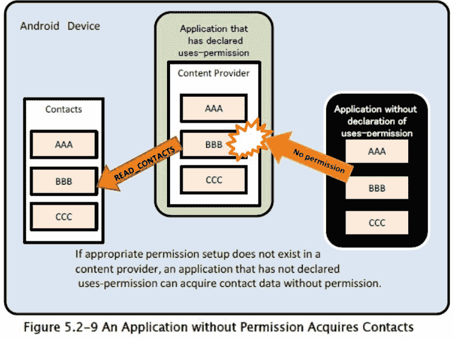

### 5.2.3 权限和保护级别 高级话题

> 原书：[Android Application Secure Design/Secure Coding Guidebook](http://www.jssec.org/dl/android_securecoding_en.pdf)
> 
> 译者：[飞龙](https://github.com/wizardforcel)
> 
> 协议：[CC BY-NC-SA 4.0](http://creativecommons.org/licenses/by-nc-sa/4.0/)

#### 5.2.3.1 绕过自定义签名许可的 Android 操作系统特性及其对策

自定义签名权限是一种权限，实现使用相同开发人员密钥签名的应用之间的应用间通信。 由于开发人员密钥是私钥，不能公开，因此只有在内部应用互相通信的情况下，才有权使用签名权限进行保护。

首先，我们将描述在 Android 的开发者指南（[http://developer.android.com/guide/topics/security/security.html](http://developer.android.com/guide/topics/security/security.html)）中解释的自定义签名权限的基本用法。 但是，后面将解释，存在绕过许可方面的问题。 因此，本指南中描述的对策是必要的。

以下是自定义签名权限的基本用法。

在提供方应用的`AndroidManifest.xml`中定义内部签名权限。（权限定义）

例如：`<permission android:name="xxx" android:protectionLevel="signature" />`

在提供方应用的`AndroidManifest.xml`中，使用要保护的组件的权限属性强制执行权限。 （执行权限）

例如：`<activity android:permission="xxx" ... >...</activity>`

在每个用户方应用的`AndroidManifest.xml`中，使用`uses-permission`标签声明内部定义的签名权限，来访问要保护的组件。 （使用权限声明）

例如：`<uses-permission android:name="xxx" />`

使用相同的开发人员密钥，对所有互相通信的应用的 APK 进行签名。

实际上，如果满足以下条件，这种方法会存在漏洞，可以绕过签名权限。

为了便于说明，我们将受自定义签名权限保护的应用称为`ProtectedApp`，并且`AttackerApp`是已由不同于`ProtectedApp`的开发人员密钥签名的应用。 绕过签名权限的漏洞意味着，即使`AttackerApp`的签名不匹配，也有可能访问`ProtectedApp`的组件。

条件 1：

`AttackerApp`也定义了正常权限，与`ProtectedApp`所定义的签名权限名称相同（严格来说，签名权限也是可以接受的）。

例如：`<permission android:name=" xxx" android:protectionLevel="normal" />`

条件 2：

`AttackerApp`使用`uses-permission`声明了自定义的正常权限。

例如：`<uses-permission android:name="xxx" />`

条件 3：

`AttackerApp`安装在`ProtectedApp`之前。


满足条件 1 和条件 2 所需的权限名称，很容易从 APK `AndroidManifest.xml`文件中取出，被攻击者知道。 攻击者也可以用一定的努力满足条件 3（例如欺骗用户）。

如果只采用基本用法，就有自定义签名权限的绕过风险，需要采取防范此类漏洞的对策。 具体而言，你可以通过使用“5.2.2.4 验证内部定义的签名权限是否由内部应用定义”中描述的方法来发现如何解决上述问题。

#### 5.2.3.2 用户伪造的`AndroidManifest.xml`

我们已经谈到，自定义权限的保护级别可能会被改变。 为了防止由于这种情况导致的故障，需要在 Java 的源代码一侧实施某些对策。 从`AndroidManifest.xml`伪造的角度来看，我们将讨论在源代码方面要采取的对策。 我们将演示一个可以检测伪造的简单安装案例。 但请注意，对于出于犯罪目的而伪造的专业黑客来说，这些对策效果甚微。

这部分内容关于应用伪造和恶意用户。 尽管这本来不属于指导手册的范围，但由于这与权限有关，并且这种伪造的工具作为 Android 应用公开提供，所以我们决定将其称为“针对业余黑客的简单对策”。

必须记住的是，可以从市场安装的应用，是可以在没有 root 权限的情况下，被伪造的应用。原因是应用可以重建和签署`AndroidManifest.xml`文件。通过使用这些应用，任何人都可以删除已安装应用的任何权限。

举个例子，似乎有些情况下重建的 APK 具有不同的签名，`AndroidManifest.xml`发生改变，并删除了`INTERNET`权限，来使应用中附加的广告模块失效。有些用户称赞这些类型的工具，因为任何个人信息没有被泄漏到任何地方。由于这些附加在应用中的广告停止运作，此类行为会对依靠广告收入的开发者造成金钱损失。而且相信大多数用户没有任何反感。

在下面的代码中，我们展示了一个实现的实例，一个使用`uses-permission`声明了`INTERNET`权限的应用，验证`INTERNET`权限是否在运行时在`AndroidManifest.xml`文件中描述。

```
public class CheckPermissionActivity extends Activity {

    @Override
    public void onCreate(Bundle savedInstanceState) {
        super.onCreate(savedInstanceState);
        setContentView(R.layout.main);
        // Acquire Permission defined in AndroidManifest.xml
        List<String> list = getDefinedPermissionList();
        // Detect falsification
        if( checkPermissions(list) ){
            // OK
            Log.d("dbg", "OK.");
        }else{
            Log.d("dbg", "manifest file is stale.");
            finish();
        }
    }

    /**
    * Acquire Permission through list that was defined in AndroidManifest.xml
    * @return
    */
    private List<String> getDefinedPermissionList(){
        List<String> list = new ArrayList<String>();
        list.add("android.permission.INTERNET");
        return list;
    }

    /**
    * Verify that Permission has not been changed Permission
    * @param permissionList
    * @return
    */
    private boolean checkPermissions(List<String> permissionList){
        try {
            PackageInfo packageInfo = getPackageManager().getPackageInfo(
            getPackageName(), PackageManager.GET_PERMISSIONS);
            String[] permissionArray = packageInfo.requestedPermissions;
            if (permissionArray != null) {
                for (String permission : permissionArray) {
                    if(! permissionList.remove(permission)){
                        // Unintended Permission has been added
                        return false;
                    }
                }
            }
            if(permissionList.size() == 0){
                // OK
                return true;
            }
        } catch (NameNotFoundException e) { }
        return false;
    }
}
```

#### 5.2.3.3 APK 伪造的检测

我们在“5.2.3.2 用户伪造的`AndroidManifest.xml`”中，解释了用户对权限的伪造检测。但是，应用伪造并不仅限于权限，在许多其他情况下，应用在没有任何源代码更改的情况下被占用。例如，只是通过将资源替换为自己的应用，他们将其他开发人员的应用（伪造）分发到市场中，就好像它们是自己的应用一样。在这里，我们将展示一个更通用的方法，来检测 APK 文件的伪造。

为了伪造 APK，需要将 APK 文件解码为文件夹和文件，修改其内容，然后将其重建为新的 APK 文件。由于伪造者没有原始开发者的密钥，他必须用他自己的钥匙签署新的 APK 文件。由于 APK 的伪造不可避免地会产生签名（证书）的变化，因此可以通过比较 APK 中的证书，和源代码中嵌入的开发人员证书，在运行时检测 APK 是否被伪造。

以下是示例代码。另外，如果使用这个实现示例，专业黑客将能够轻松绕过伪造检测。请注意这是一个简单的实现示例，请将此示例代码应用于你的应用。

要点：

1.  在开始主要操作之前，验证应用的证书是否属于开发人员。

SignatureCheckActivity.java

```
package org.jssec.android.permission.signcheckactivity;

import org.jssec.android.shared.PkgCert;
import org.jssec.android.shared.Utils;
import android.app.Activity;
import android.content.Context;
import android.os.Bundle;
import android.widget.Toast;

public class SignatureCheckActivity extends Activity {

    // Self signed certificate hash value
    private static String sMyCertHash = null;

    private static String myCertHash(Context context) {
        if (sMyCertHash == null) {
            if (Utils.isDebuggable(context)) {
                // Certificate hash value of "androiddebugkey" of debug.
                sMyCertHash = "0EFB7236 328348A9 89718BAD DF57F544 D5CCB4AE B9DB34BC 1E29DD26 F77C8255";
            } else {
                // Certificate hash value of "my company key" of keystore
                sMyCertHash = "D397D343 A5CBC10F 4EDDEB7C A10062DE 5690984F 1FB9E88B D7B3A7C2 42E142CA";
            }
        }
        return sMyCertHash;
    }

    @Override
    public void onCreate(Bundle savedInstanceState) {
        super.onCreate(savedInstanceState);
        setContentView(R.layout.main);
        // *** POINT 1 *** Verify that an application's certificate belongs to the developer before major processing is started
        if (!PkgCert.test(this, this.getPackageName(), myCertHash(this))) {
            Toast.makeText(this, "Self-sign match NG", Toast.LENGTH_LONG).show();
            finish();
            return;
        }
        Toast.makeText(this, "Self-sign match OK", Toast.LENGTH_LONG).show();
    }
}
```

PkgCert.java

```
package org.jssec.android.shared;

import java.security.MessageDigest;
import java.security.NoSuchAlgorithmException;
import android.content.Context;
import android.content.pm.PackageInfo;
import android.content.pm.PackageManager;
import android.content.pm.PackageManager.NameNotFoundException;
import android.content.pm.Signature;

public class PkgCert {

    public static boolean test(Context ctx, String pkgname, String correctHash) {
        if (correctHash == null) return false;
        correctHash = correctHash.replaceAll(" ", "");
        return correctHash.equals(hash(ctx, pkgname));
    }

    public static String hash(Context ctx, String pkgname) {
        if (pkgname == null) return null;
        try {
            PackageManager pm = ctx.getPackageManager();
            PackageInfo pkginfo = pm.getPackageInfo(pkgname, PackageManager.GET_SIGNATURES);
            if (pkginfo.signatures.length != 1) return null; // Will not handle multiple signatures.
            Signature sig = pkginfo.signatures[0];
            byte[] cert = sig.toByteArray();
            byte[] sha256 = computeSha256(cert);
            return byte2hex(sha256);
        } catch (NameNotFoundException e) {
            return null;
        }
    }

    private static byte[] computeSha256(byte[] data) {
        try {
            return MessageDigest.getInstance("SHA-256").digest(data);
        } catch (NoSuchAlgorithmException e) {
            return null;
        }
    }

    private static String byte2hex(byte[] data) {
        if (data == null) return null;
        final StringBuilder hexadecimal = new StringBuilder();
        for (final byte b : data) {
            hexadecimal.append(String.format("%02X", b));
        }
        return hexadecimal.toString();
    }
}
```

#### 5.2.3.4 权限重委托问题

访问联系人或 GPS，它们带有受 Android OS 保护的信息和功能时，应用必须声明使用权限。当所需的权限被授予时，权限被委托给应用，应用将能够访问受权限保护的信息和功能。

根据程序的设计方式，被授予权限的应用可以获取受权限保护的数据。此外，应用可以向另一个应用提供受保护数据，而不必强制确保相同的权限，这无异于，没有权限的应用可以访问受权限保护的数据。这实际上是重新授权，称为权限重新授权问题。因此，只有 Android 的权限机制的规范，才能够管理从来自用程序的，保护数据的直接访问的权限。

图 5.2-9 展示了一个具体的例子。 中心的应用表明，已声明`android.permission.READ_CONTACTS`的应用使用它来读取联系人，然后将它们存储到其自己的数据库中。 当已经存储的信息通过内容供应器，提供给另一个应用，而没有任何限制时，就会发生重新授权问题。



作为一个类似的例子，声明了`android.permission.CALL_PHONE`的应用，使用它从另一个应用接收电话号码（可能是用户输入的），它未声明相同权限。如果该号码在未经用户验证的情况下被呼叫，那么也存在重新授权问题。

在某些情况下，通过权限获得的，几乎完整的信息或功能资产，需要由其他应用二次提供。在这些情况下，供应方应用必须要求相同权限，才能保持原始的保护级别。此外，在仅以间接方式提供信息和功能资产的一部分的情况下，根据信息或功能资产的一部分的损害程度，需要适当保护。由“4.1.1.1 创建/使用私有活动”或“4.1.1.4 创建/使用私有活动”，我们可以使用类似于前者的保护措施，验证用户的同意，并设置目标应用的活动限制，以及其他。

这种重新授权问题不仅限于 Android 权限。对于 Android 应用，应用从不同的应用，网络和存储介质中获取必要的信息/功能，这是常见的。在很多情况下，访问它们需要一些权限和限制。例如，如果提供者来源的 Android 应用，则它是权限；如果它是网络，那么它是登录机制；如果它是存储介质，则会存在访问限制。因此，在仔细考虑后，需要对应用实现这些措施，因为信息/功能不是以与用户意图相反的方式使用的。以间接方式将获得的信息/功能提供给另一应用，或转移到网络或存储介质时，这一点尤其重要。根据需要，你必须强制确保权限或限制使用权限，如 Android 权限。询问用户的同意是解决方案的一部分。

在以下代码中，我们演示了一个情况，使用`READ_CONTACTS`权限，从联系人数据库中获取列表的应用，对信息的目标强制确保相同的`READ_CONTACTS`权限。

要点：

强制确保提供者的相同权限。

AndroidManifest.xml

```
<?xml version="1.0" encofing="utf-8"?>
<manifest xmlns:android="http://schemas.android.com/apk/res/android"
    package="org.jssec.android.permission.transferpermission"
    android:versionCode="1"
    android:versionName="1.0" >
    <uses-sdk
    android:minSdkVersion="8" />
    <uses-permission android:name="android.permission.READ_CONTACTS"/>
    <application
        android:icon="@drawable/ic_launcher"
        android:label="@string/app_name"
        android:theme="@style/AppTheme" >
        <activity
        android:name=".TransferPermissionActivity"
        android:label="@string/title_activity_transfer_permission" >
        <intent-filter>
        <action android:name="android.intent.action.MAIN" />
        <category android:name="android.intent.category.LAUNCHER" />
        </intent-filter>
        </activity>
        <provider
            android:name=".TransferPermissionContentProvider"
            <!-- *** Point1 *** Enforce the same permission that the provider does. -->
            android:authorities="org.jssec.android.permission.transferpermission"
            android:enabled="true"
            android:exported="true"
            android:readPermission="android.permission.READ_CONTACTS" >
        </provider>
    </application>
</manifest>
```

当一个应用确保多个权限时，上述方法不会解决它。 通过使用源代码中的`Context#checkCallingPermission()`或`PackageManager#checkPermission()`，它验证调用者应用是否在清单中，使用`uses-permission`声明了所有权限。

在活动中：

```
public void onCreate(Bundle savedInstanceState) {
    [...]

    if (checkCallingPermission("android.permission.READ_CONTACTS") == PackageManager.PERMISSION_GRANTED
        && checkCallingPermission("android.permission.WRITE_CONTACTS") == PackageManager.PERMISSION_GRANTED) {
        // Processing during the time when an invoker is correctly declaring to use
        return;
    }
    finish();
}
```

#### 5.2.3.5 自定义权限的签名检查机制（Android 5.0 及以上）

在 Android 5.0（API Level 21）及更高版本中，如果满足以下条件，则无法安装定义其自定义权限的应用。

1.  在设备上已经安装了另一个应用，用相同名称定义了自定义权限。
2.  应用使用不同的密钥签名

当具有受保护函数（组件）的应用，和使用该函数的应用，定义了具有相同名称的自定义权限，并且使用相同密钥签名时，上述机制将防止安装定义了自定义权限的其他公司的应用同名。 但是，如“5.2.2.3 你自己的签名权限必须仅在提供方应用中定义（必需）”中所述，该机制对于检查自定义权限是否由你自己的公司定义是行不通的，因为权限 如果多个应用定义相同的权限，在你自己不知道的情况下，可能通过卸载应用来使其失效。

总而言之，在 Android 5.0（API Level 21）和更高版本中，当你的应用定义你自己的签名权限时，你还需要遵守两个规则：“5.2.2.3 你自己的签名权限只能在提供方应用上定义（必需） “和”5.2.2.4 验证内部定义的签名权限是否由内部应用定义（必需）“。

#### 5.2.3.6 Android 版本 6.0 和更高版本中对权限模型规范的修改

Android 6.0（API Level 23）引入了权限模型的修改规范，这些规范影响了应用的设计和规范。 在本节中，我们将概述 Android 6.0 及更高版本中的权限模型。

权限授予和拒绝的时机

如果应用声明使用需要用户确认的权限（危险权限）【请参见“5.2.2.1 Android 系统危险权限必须仅用于保护用户资产（必需）”一节】，Android 5.1（API 级别 22）和更早的版本，要求在安装应用时显示这些权限的列表，并且用户必须授予所有权限才能继续安装。 此时，应用声明的所有权限（包括危险权限以外的权限）均已授予该应用；一旦这些权限被授予应用，它们就会一直有效，直到应用从终端上卸载。

但是，在 Android 6.0 及更高版本的规范中，应用执行时会授予权限。 在安装应用时不会发生权限授予和用户的权限确认。 当应用执行需要危险权限的过程时，需要检查是否已将这些权限提前授予应用；如果没有，则必须在 Android 操作系统中显示确认窗口，来请求用户的同意 [25]。如果用户从确认窗口授予权限，则将权限授予应用。 但是，用户授予应用的权限（危险权限）可以随时通过设置菜单撤销（图 5.2-10）。 出于这个原因，必须实现适当的过程，来确保应用不会产生不规则的行为，即使在因为未授予权限，而无法访问所需的信息或功能的情况下。

> [25] 由于正常权限和签名权限是由 Android OS 自动授予的，因此不需要获取用户对这些权限的确认。


权限授予和拒绝的单位

根据与之相关的功能和信息类型，可以将多个权限组合在一起称为权限组。 例如，读取日历信息所需的权限`android.permission.READ_CALENDAR`以及写入日历信息所需的权限`android.permission.WRITE_CALENDAR`都关联权限组`android.permission-group.CALENDAR`。

在 Android 6.0 及更高版本的新权限模型中，权限的授予和撤销可以使用权限组统一执行。 因此，当一个应用在运行时请求`android.permission.READ_CALENDAR`并且用户同意该请求时，Android OS 的行为就像`android.permission.READ_CALENDAR`和`android.permission.WRITE_CALENDAR`都已被授权一样。 如果随后请求`android.permission.WRITE_CALENDAR`权限，则操作系统不会向用户显示对话框，而是直接授予权限。

权限组分类的更多信息，请参阅开发人员参考（[http://developer.android.com/intl/ja/guide/topics/security/permissions.html#perm-groups](http://developer.android.com/intl/ja/guide/topics/security/permissions.html#perm-groups)）。

修改后的规范的影响范围

应用在运行时需要权限请求的情况，仅限于终端运行 Android 6.0 或更高版本，并且应用的`targetSDKVersion`为 23 或更高的情况。 如果终端运行的是 Android 5.1 或更低版本，或者应用的`targetSDKVersion`为 22 或更低，则安装时会完全请求和授予权限，这与传统情况相同。 但是，如果终端运行的是 Android 6.0 或更高版本，则即使应用的`targetSDKVersion`低于 23，用户在安装时授予的权限也可能随时被用户撤销。 这会造成应用意外终止的可能性。 开发人员必须遵守修改后的规范，或将应用的`maxSDKVersion`设置为 22 或更低版本，来确保该应用不能安装在运行 Android 6.0（API Level 23）或更高版本（表 5.2-1）的终端上。

表.2-1

| Android OS 终端版本 | 应用的`targetSDKVersion` | 应用被授予权限的时机 | 用户是否能控制权限 |
| --- | --- | --- | --- |
| 

> = 6.0

 | 

> = 23

 | 执行时 | 是 |
| 

> = 6.0

 | < 23 | 安装时 | 是（需要快速响应） |
| <= 5.1 | 

> = 23

 | 安装时 | 否 |
| <= 5.1 | < 23 | 安装时 | 否 |

但是，应该注意，`maxSdkVersion`的影响是有限的。 当`maxSdkVersion`的值设置为 22 或更低时，Android 6.0（API Level 23）和更高版本的设备，不再被列为 Google Play 中目标应用的可安装设备。 另一方面，由于未在 Google Play 以外的市场中检查`maxSdkVersion`的值，因此可能会在 Android 6.0（API Level 23）或更高版本中安装目标应用。 由于`maxSdkVersion`的效果有限，Google 不建议使用`maxSdkVersion`，因此建议开发人员立即遵守修改后的规范。

在 Android 6.0 及更高版本中，以下网络通信权限的保护级别从危险更改为正常。 因此，即使应用声明使用这些权限，也不需要获得用户的显式统一，因此修改后的规范在此情况下不会产生影响。

*   `android.permission.BLUETOOTH`
*   `android.permission.BLUETOOTH_ADMIN`
*   `android.permission.CHANGE_WIFI_MULTICAST_STATE`
*   `android.permission.CHANGE_WIFI_STATE`
*   `android.permission.CHANGE_WIMAX_STATE`
*   `android.permission.DISABLE_KEYGUARD`
*   `android.permission.INTERNET`
*   `android.permission.NFC`