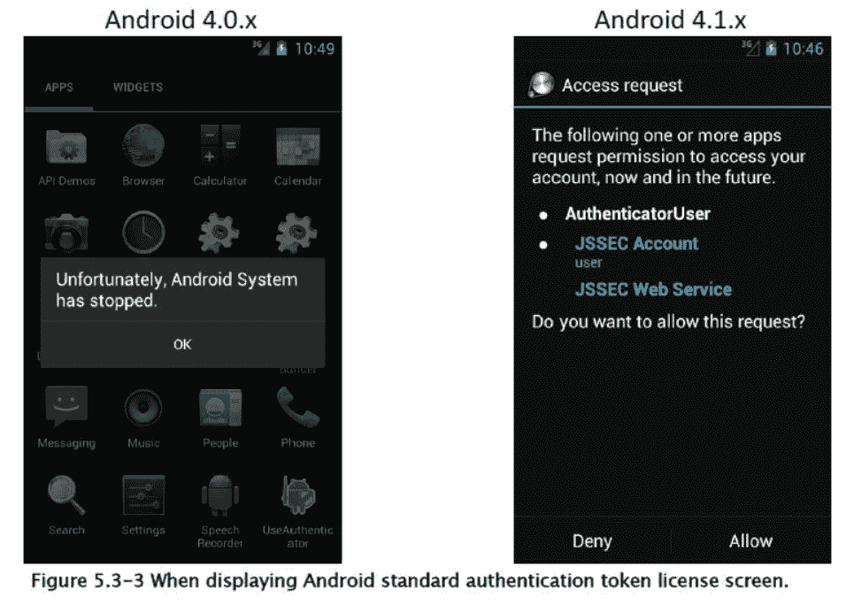

### 5.3.3 将内部账户添加到账户管理器 高级话题

> 原书：[Android Application Secure Design/Secure Coding Guidebook](http://www.jssec.org/dl/android_securecoding_en.pdf)
> 
> 译者：[飞龙](https://github.com/wizardforcel)
> 
> 协议：[CC BY-NC-SA 4.0](http://creativecommons.org/licenses/by-nc-sa/4.0/)

#### 5.3.3.1 账户管理和权限的使用

要使用`AccountManager`类的每种方法，都需要在应用的`AndroidManifest.xml`中分别声明使用相应的权限。 表 5.3-1 显示了权限和方法的对应关系。

表 5.3-1 账户管理器的函数以及权限

| 账户管理器提供的函数 |  |
| --- | --- |
| 权限 | 方法 |
| `AUTHENTICATE_ACCOUNTS`（只有由认证器的相同密钥签名的软件包才可以使用。） | `getPassword()` |
|  | `getUserData()` |
|  | `addAccountExplicitly()` |
|  | `peekAuthToken()` |
|  | `setAuthToken()` |
|  | `setPassword()` |
|  | `setUserData()` |
|  | `renameAccount()` |
| `GET_ACCOUNTS` | `getAccounts()` |
|  | `getAccountsByType()` |
|  | `getAccountsByTypeAndFeatures()` |
|  | `addOnAccountsUpdatedListener()` |
|  | `hasFeatures()` |
| `MANAGE_ACCOUNTS` | `getAuthTokenByFeatures()` |
|  | `addAccount()` |
|  | `removeAccount()` |
|  | `clearPassword()` |
|  | `updateCredentials()` |
|  | `editProperties()` |
|  | `confirmCredentials()` |
| `USE_CREDENTIALS` | `getAuthToken()` |
|  | `blockingGetAuthToken()` |
| `MANAGE_ACCOUNTS`或`USE_CREDENTIALS` | `invalidateAuthToken()` |

在使用需要`AUTHENTICATE_ACCOUNTS`权限的方法组的情况下，存在软件包的签名密钥以及权限相关的限制。 具体来说，提供认证器的包的签名密钥，和使用方法的应用的包的签名密钥应该是相同的。 因此，在分发使用方法组的应用时，除了认证器之外，必须使用`AUTHENTICATE_ACCOUNTS`权限，并且应使用认证器的相同密钥进行签名。

在 Android Studio 的开发阶段，由于固定的调试密钥库可能会被某些 Android Studio 项目共享，开发人员可能只考虑权限而不考虑签名，来实现和测试帐户管理器。 特别是，对于对每个应用使用不同签名密钥的开发人员来说，因为这种限制，在选择用于应用的密钥时要非常小心。 此外，由于`AccountManager`获得的数据包含敏感信息，因此需要小心处理，来减少泄漏或未授权使用的风险。

#### 5.3.3.2 在 Android 4.0.x 中，用户应用和认证器应用的签名密钥不同时发生的异常

认证令牌获取功能是由开发者密钥签发的用户应用所需的，它不同于认证器应用的签名密钥。通过显示 认证令牌许可证屏幕（`GrantCredentialsPermissionActivity`），`AccountManager`验证用户是否授予认证令牌的使用权。但是 Android 4.0.x 的 Android 框架中存在一个错误，只要`AccountManager`打开此屏幕，就会发生异常并且应用被强制关闭 。 （图5.3-3）。 错误的详细信息，请参阅 [https://code.google.com/p/android/issues/detail?id=23421](https://code.google.com/p/android/issues/detail?id=23421)。 这个 bug 在 Android 4.1.x 及更高版本中无法找到。

